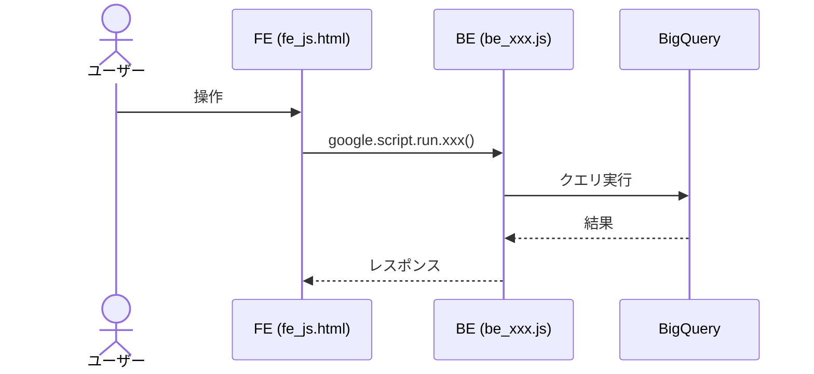

# PR 作業まとめドキュメント生成

現在の作業ブランチで行った変更内容を、PRレビュー用のドキュメントとしてまとめてください。

## 手順

1. **ブランチ情報の取得**
   - `git rev-parse --abbrev-ref HEAD` で現在のブランチ名を取得する
   - ブランチ名から MYP チケット番号を抽出する（例: `feature/MYP-3709-implement-logout` → `MYP-3709`）

2. **差分の取得**
   - `git diff develop...HEAD --stat` で変更ファイル一覧を取得する
   - `git diff develop...HEAD` で全差分を取得する
   - `git log develop..HEAD --oneline` でコミット一覧を取得する

3. **PR 情報の取得**（利用可能な場合）
   - GitHub PR のタイトル・説明を確認する

4. **変更内容の分析**
   - 差分を読み解き、各ファイルの変更意図・変更種別（追加/変更/削除）を把握する
   - 設計方針や重要な判断事項を抽出する

5. **ドキュメントの生成**
   - 以下のフォーマットに従って `docs/pr_work_logs/PR_作業まとめ_{チケット番号}.md` に出力する

## 出力フォーマット

```markdown
# PR 作業まとめ: {チケット番号} {PRタイトル or 作業内容の要約}

## 概要

{この PR で何を実装・修正したかを 2〜4 行で簡潔に記述}

## 対象ブランチ

`{ブランチ名}` → `develop`

---

## 変更ファイル一覧

| ファイル | 変更種別 | 変更内容 |
|----------|---------|---------|
| `src/xxx.js` | 追加/変更/削除 | {そのファイルで何を変えたかを 1 行で} |

---

## 設計方針

{重要な設計判断や方針があれば記述。Before/After 比較表や図を使って分かりやすく}

---

## 全体フロー図

{変更内容に応じて、以下のような Mermaid 図を作成する}

### 処理フロー（flowchart）

- 新しい処理フローがある場合、ユーザー操作→FE→BE→BQ の流れを flowchart TD で図示
- 条件分岐や並列処理がある場合は分岐ノードを使って表現する

### シーケンス図（sequenceDiagram）

- FE/BE/BQ/外部サービス間のやり取りがある場合、sequenceDiagram で時系列の処理フローを図示
- 正常系と異常系（alt/else）を明示する
- Note を使って重要な処理ポイントを補足する

{例:}


{変更が単純な場合（CSS修正のみ、文言変更のみ等）はこのセクションを省略してよい}

---

## 変更詳細

{ファイルごとの変更詳細。関数の追加・修正内容、パラメータ、ロジックの変更点などを記述}
{コードスニペットは最小限にし、変更の意図が伝わるレベルで}

---

## コーディングルール準拠

| ルール | 対応 |
|--------|------|
| `var` 禁止 → `const` / `let` 使用 | ✅ or ❌ |
| 内部関数は末尾 `_` | ✅ or ❌ |
| `function` キーワードで定義 | ✅ or ❌ |

---

## 影響範囲

- **機能影響**: {既存機能への影響の有無と内容}
- **パフォーマンス影響**: {パフォーマンスへの影響があれば記述}
```

## 注意事項

- 日本語で記述すること
- コーディングルールは `docs/CODING_RULES.md` を参照して判定すること
- 変更詳細では、レビュアーが差分を理解しやすいように「なぜその変更をしたか」を意識して書くこと
- **Mermaid 図は積極的に使うこと**: 処理フローには `flowchart TD`、FE/BE/BQ間の通信には `sequenceDiagram` を使う。既存の PR 作業まとめドキュメント（`docs/pr_work_logs/` 配下）のスタイルを参考にする
- 状態遷移がある場合は ASCII アートやテーブルで Before/After を対比すること
- コードブロックを大量に貼り付けるのではなく、変更のポイントを要約すること
