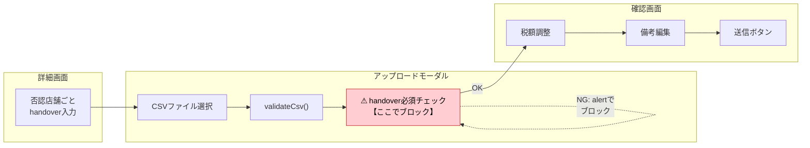
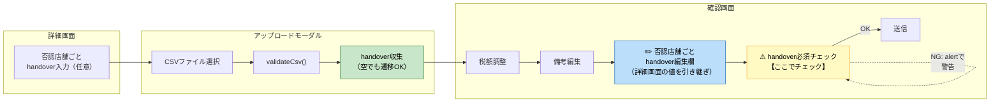
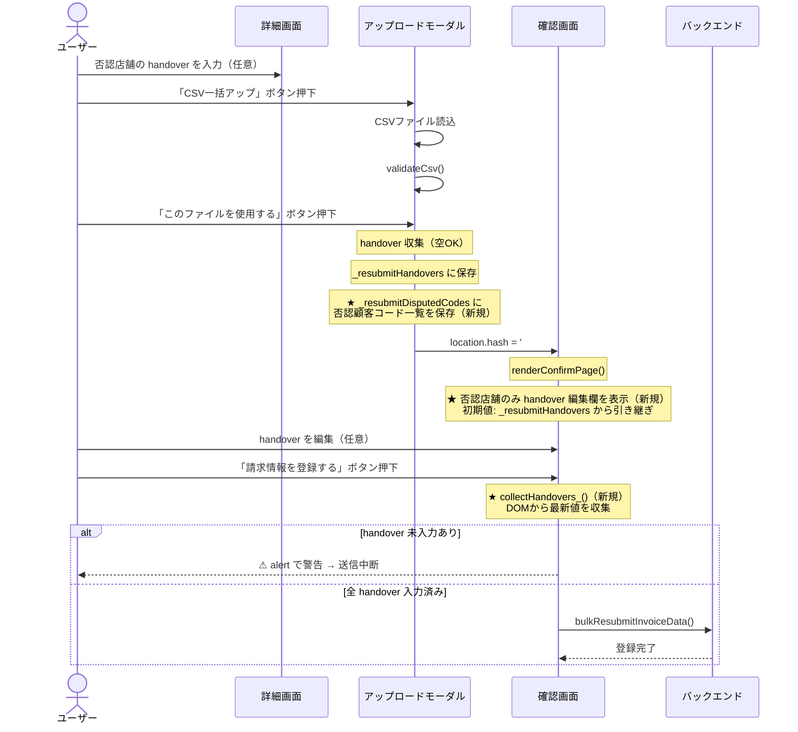
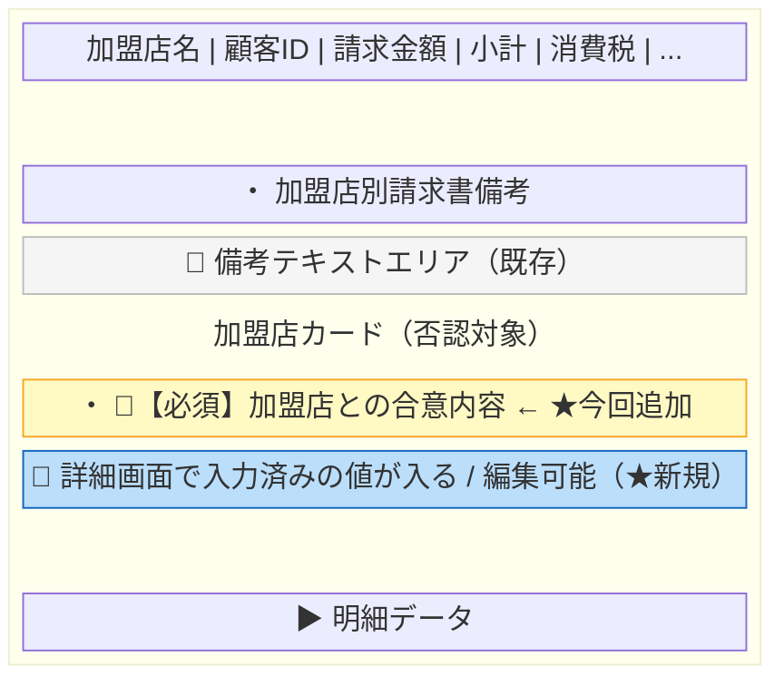
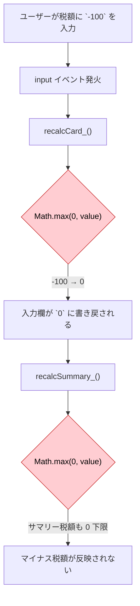
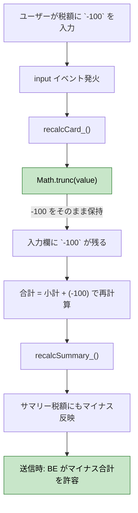

# MYP-3782: 詳細画面からのCSV確認画面でのみ必須項目入力に修正

## 概要

詳細画面（否認レコードあり）からの **CSV一括アップロード** において、  
「加盟店との合意内容（handover）」の必須チェックを  
**アップロード段階（モーダル）→ 確認画面（送信前）** に移動する。

加えて、確認画面上で handover を**編集可能**にし、詳細画面で入力した値を引き継ぐ。

---

## 対象フロー

**一括CSV再アップロード（否認レコードの再請求）** のみ。  
個別CSV再アップロード・変更なし再請求・通常アップロードは変更なし。

---

## 現状のフロー



### 問題点

- handover が未入力だと「このファイルを使用する」ボタンが alert でブロックされ、確認画面に遷移できない
- handover 入力欄はモーダル外（詳細画面本体）にあるため、ユーザーはモーダルを閉じて入力し直す必要がある

---

## 変更後のフロー



---

## データフロー



---

## 変更箇所一覧

### 対象ファイル: `src/fe_js.html`

| # | 変更種別 | 場所 | 内容 |
|---|---------|------|------|
| 1 | **変数追加** | モジュール変数宣言部（`_resubmitHandovers` の近く） | `let _resubmitDisputedCodes = [];` を追加 |
| 2 | **削除** | `btnConfirm` ハンドラ内 `_isBulk` 分岐 | handover 必須チェック（`missingHandoverCodes.length > 0` の `alert` + `return`）を削除 |
| 3 | **追加** | 同上（handover 収集ロジックの後） | 全否認顧客コードを `_resubmitDisputedCodes` に保存するコードを追加 |
| 4 | **追加** | `renderConfirmPage()` 内、`remarksDiv` 生成後 | `_isResubmitConfirm` かつ `_resubmitDisputedCodes` に含まれる加盟店のみ handover 編集欄（`<textarea>`）を追加 |
| 5 | **追加** | `collectRemarks_()` の近く | `collectHandovers_()` 関数を新設 |
| 6 | **変更** | `btnFinalSubmit` ハンドラ内 `_isResubmitConfirm` 分岐 | `const handovers = _resubmitHandovers` → `const handovers = collectHandovers_()` に変更し、必須チェックを追加 |

---

## 変更詳細

### 1. モジュール変数の追加

```javascript
// 既存
let _resubmitHandovers = {};

// ★追加
let _resubmitDisputedCodes = [];   // 否認対象の顧客コード一覧
```

### 2 & 3. `btnConfirm` ハンドラの変更

```javascript
// ── 変更前 ──

// 否認行の handover を収集 & 必須チェック
const handovers_ = {};
const missingHandoverCodes = [];
document.querySelectorAll('.backoffice-remark__handover-input[data-customer-code]').forEach(function (el) {
  const cc = el.dataset.customerCode || '';
  if (!cc) return;
  const val = (el.value || '').trim();
  if (val) {
    handovers_[cc] = val;
  } else {
    missingHandoverCodes.push(cc);
  }
});
if (missingHandoverCodes.length > 0) {
  alert('⚠ 否認された加盟店（顧客コード: ' + missingHandoverCodes.join(', ') + '）の〈加盟店との合意内容〉が未入力です。一括再送信の前にすべて記入してください。');
  return;
}
```

```javascript
// ── 変更後 ──

// 否認行の handover を収集（空でも確認画面へ遷移OK）
const handovers_ = {};
const disputedCodes_ = [];
document.querySelectorAll('.backoffice-remark__handover-input[data-customer-code]').forEach(function (el) {
  const cc = el.dataset.customerCode || '';
  if (!cc) return;
  disputedCodes_.push(cc);
  const val = (el.value || '').trim();
  if (val) {
    handovers_[cc] = val;
  }
});

// ★ 必須チェックを削除し、否認コード一覧を保存
_resubmitDisputedCodes = disputedCodes_;
```

### 4. 確認画面に handover 編集欄を追加

`renderConfirmPage()` 内、`remarksDiv` の直後に追加：

```javascript
// ★ 再送信モード: 否認店舗の handover 入力欄を追加
if (_isResubmitConfirm && _resubmitDisputedCodes.indexOf(customerCode) !== -1) {
  var handoverDiv = document.createElement('div');
  handoverDiv.className = 'store-accordion__handover';
  handoverDiv.innerHTML =
    '<label class="remarks-label">' +
      '・ <span style="color:#c62828;font-weight:bold;">【必須】</span>加盟店との合意内容' +
    '</label>' +
    '<textarea class="confirm-handover-input" data-customer-code="' + escapeHtml(customerCode) + '"' +
      ' placeholder="【必須】否認に対する加盟店との合意事項と変更された内容を記載ください。"' +
      ' rows="2"></textarea>';
  // 詳細画面で入力済みの値を引き継ぎ
  var ta = handoverDiv.querySelector('textarea');
  if (ta && _resubmitHandovers[customerCode]) {
    ta.value = _resubmitHandovers[customerCode];
  }
  body.appendChild(handoverDiv);
}
```

#### 確認画面での表示イメージ



### 5. `collectHandovers_()` 関数の新設

```javascript
/**
 * 確認画面上の handover テキストエリアから値を収集する。
 * @return {Object.<string, string>}  { customerCode: handoverText }
 */
function collectHandovers_() {
  var handovers = {};
  document.querySelectorAll('.confirm-handover-input[data-customer-code]').forEach(function (ta) {
    handovers[ta.dataset.customerCode] = ta.value || '';
  });
  return handovers;
}
```

### 6. 送信ハンドラの変更

```javascript
// ── 変更前 ──
const handovers = _resubmitHandovers;
```

```javascript
// ── 変更後 ──
// 確認画面の handover 入力欄から最新値を取得
const handovers = collectHandovers_();

// 否認店舗の handover 必須チェック
const missingCodes = _resubmitDisputedCodes.filter(function (cc) {
  return !handovers[cc] || !handovers[cc].trim();
});
if (missingCodes.length > 0) {
  alert('⚠ 否認された加盟店（顧客コード: ' + missingCodes.join(', ') + '）の〈加盟店との合意内容〉が未入力です。すべて記入してから送信してください。');
  resetSubmitLoading();
  hideLoadingOverlay();
  return;
}
```

---

## 変更しない箇所

| 箇所 | 理由 |
|------|------|
| `validateCsv()` の CSV 列必須チェック | CSV データ品質の担保として維持 |
| 個別CSV再アップロード（モーダル内完結） | 確認画面を経由しないフローのため、モーダル内の必須チェックを維持 |
| 変更なし再請求の handover 必須チェック | 確認画面を経由しないフローのため維持 |
| バックエンド BQ バリデーション | 安全弁として維持 |
| 改行処理 | CSV は `stripQuotedNewlines()` で対応済み。textarea 入力の改行は BQ にそのまま登録（許容） |

---

# 追加修正: 税額入力のマイナス値許容

## 概要

確認画面の加盟店ごとの税額入力（10%税額 / 8%税額）で、現在 `-`（マイナス）を入力すると即座に `0` に置き換えられる。  
**翌月調整**などのビジネスパターンで合計値がマイナスになるケースがあるため、税額のマイナス入力を許容する。

---

## 現状の問題



### 負値ガードの現状

| レイヤー | 対象 | 負値ガード | 影響 |
|---------|------|-----------|------|
| `recalcCard_()` | tax8 / tax10 | `Math.max(0, ...)` | ❌ 入力値が0に書き戻される |
| `recalcSummary_()` | totalTax8 / totalTax10 | `Math.max(0, ...)` | ❌ サマリー税額も0下限 |
| `recalcCard_()` | subtotal / total | なし | ⭕ マイナス表示可 |
| `recalcSummary_()` | totalExTax / totalInTax 等 | なし | ⭕ マイナス表示可 |
| バックエンド送信バリデーション | 全合計項目 | `v < 0` で拒否 | ❌ マイナス送信でエラー |

---

## 変更後のフロー



---

## 変更箇所一覧

| # | ファイル | 場所 | 変更内容 |
|---|---------|------|---------|
| A-1 | `src/fe_js.html` | `recalcCard_()` | `Math.max(0, Math.trunc(...))` → `Math.trunc(...)` に変更 |
| A-2 | `src/fe_js.html` | `recalcSummary_()` | 同上 |
| A-3 | `src/fe_js.html` | `recalcPreview_()` (詳細モーダル) | 同上（個別CSV再アップロードのプレビューも同様に対応） |
| A-4 | `src/be_invoice.js` | 送信バリデーション | `v < 0` チェックを削除し、マイナス値を許容 |

---

## 変更詳細

### A-1. `recalcCard_()` の変更

```javascript
// ── 変更前 ──
const newTax8  = Math.max(0, Math.trunc(Number(tax8Input.value)  || 0));
const newTax10 = Math.max(0, Math.trunc(Number(tax10Input.value) || 0));
```

```javascript
// ── 変更後 ──
const newTax8  = Math.trunc(Number(tax8Input.value)  || 0);
const newTax10 = Math.trunc(Number(tax10Input.value) || 0);
```

### A-2. `recalcSummary_()` の変更

```javascript
// ── 変更前 ──
totalTax8  += Math.max(0, Math.trunc(Number(t8El  ? t8El.value  : 0) || 0));
totalTax10 += Math.max(0, Math.trunc(Number(t10El ? t10El.value : 0) || 0));
```

```javascript
// ── 変更後 ──
totalTax8  += Math.trunc(Number(t8El  ? t8El.value  : 0) || 0);
totalTax10 += Math.trunc(Number(t10El ? t10El.value : 0) || 0);
```

### A-3. `recalcPreview_()` の変更

```javascript
// ── 変更前 ──
const newTax10 = Math.max(0, Math.trunc(Number(tax10Input.value) || 0));
const newTax8  = Math.max(0, Math.trunc(Number(tax8Input.value)  || 0));
```

```javascript
// ── 変更後 ──
const newTax10 = Math.trunc(Number(tax10Input.value) || 0);
const newTax8  = Math.trunc(Number(tax8Input.value)  || 0);
```

### A-4. バックエンド送信バリデーションの変更

```javascript
// ── 変更前 ──
// 卸合計値の数値検証（有限・非負・整数）
['totalAmount','subtotalAmount','taxAmount','exTax8','tax8','exTax10','tax10','feeAmount','paymentAmount']
  .forEach(function(f) {
    const v = Number(wt[f] || 0);
    if (!Number.isFinite(v) || v < 0) {
      throw new Error('処理中にエラーが発生しました。...');
    }
  });
```

```javascript
// ── 変更後 ──
// 卸合計値の数値検証（有限・整数）
['totalAmount','subtotalAmount','taxAmount','exTax8','tax8','exTax10','tax10','feeAmount','paymentAmount']
  .forEach(function(f) {
    const v = Number(wt[f] || 0);
    if (!Number.isFinite(v)) {
      throw new Error('処理中にエラーが発生しました。...');
    }
  });
```

> ※ 加盟店合計値（merchantTotals）の同様の `v < 0` チェックも同時に削除する。

---

## テスト観点

### handover 必須チェック移動

| # | テストケース | 期待結果 |
|---|------------|---------|
| 1 | 否認レコードの一括CSV再アップロードで、handover 未入力のまま「このファイルを使用する」を押す | ブロックされずに確認画面に遷移する |
| 2 | 確認画面で否認店舗の handover 欄に詳細画面の入力値が表示されている | 入力済みの値が引き継がれている |
| 3 | 確認画面で handover を編集できる | textarea が編集可能 |
| 4 | 確認画面で handover 未入力のまま「請求情報を登録する」を押す | alert で警告が表示され、送信されない |
| 5 | 確認画面で全否認店舗の handover を入力して送信する | 正常に `bulkResubmitInvoiceData` が実行される |
| 6 | 通常の新規アップロードフロー | 影響なし（handover 欄は表示されない） |
| 7 | 個別CSV再アップロード（モーダル） | 既存の必須チェックが維持されている |
| 8 | 変更なし再請求 | 既存の必須チェックが維持されている |

### 税額マイナス許容

| # | テストケース | 期待結果 |
|---|------------|---------|
| 9 | CSVの税額元値が `-100` の場合、確認画面の税額入力欄に `-100` が表示される | `0` にならず `-100` がそのまま表示される |
| 10 | CSVの税額元値が `-100` の場合、`-99` に修正する（差:1） | ±1円バリデーションOKで送信可能 |
| 11 | CSVの税額元値が `-100` の場合、`-98` に修正する（差:2） | ±1円バリデーションNGでエラー表示 |
| 12 | CSVの税額元値が `0` の場合、`-1` に修正する（差:1） | ±1円バリデーションOKで送信可能、`0` にならない |
| 13 | 税額をマイナスにした場合、カード合計が正しく再計算される | 合計 = 小計 + (マイナス税額) |
| 14 | 税額をマイナスにした場合、サマリー合計が正しく再計算される | 全加盟店の合計に正しく反映される |
| 15 | 税額マイナスのデータを送信する | バックエンドエラーにならず正常に登録される |
| 16 | 個別CSV再アップロードのプレビューで税額にマイナス入力 | マイナスが許容される |
| 17 | 通常の正の税額入力 | 既存動作に影響なし |
