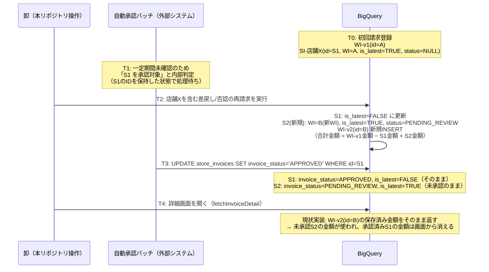

# MYP-4203: 自動承認バッチ実行後の請求金額の差分を修正

## 概要

再請求（差戻し・否認の修正再送信）の対象になった加盟店データが、卸側の再請求処理と、外部の自動承認バッチ（加盟店側の承認処理）の**タイミング競合**によって、以下の不整合を起こす可能性がある。

- 再請求により、対象の `store_invoices` レコードは `is_latest = FALSE` に切り替わり、新しい `store_invoices`（`is_latest = TRUE`, 未承認）が作られる。
- ところが自動承認バッチは、切り替わる**前**の（今は `is_latest = FALSE` になった）レコードを承認対象として保持しており、そのレコードに対して `invoice_status = 'APPROVED'` を書き込んでしまう。
- 結果、「本当に加盟店が合意した金額（＝承認済みだが `is_latest = FALSE`）」ではなく、「未承認の再請求後データ（＝ `is_latest = TRUE`）」の金額が、詳細画面ヘッダー・TOP画面の請求一覧の両方に表示されてしまう。

本修正では、金額の参照元を `wholesaler_invoices` の保存済みスナップショット列から、**画面表示のたびに `store_invoices` を正しい行選択ルールで集計し直す方式**に変更する。自動承認バッチ自体はこのリポジトリの管理外（別システム）であり修正できないため、**参照側（本リポジトリ）で防御する**方針とする。

対象チケット: MYP-4203
対象ブランチ: `feature/MYP-4203-fix-invoice-amount-diff-batch`

---

## 背景・データモデルのおさらい

| テーブル | 役割 |
|---|---|
| `wholesaler_invoices`（WI） | 請求バッチのヘッダー。再請求のたびに**新しい行がINSERT**される（UPDATEなし）。`wholesaler_invoice_id` 列が自己参照FKで、初回行は `NULL`、以降の版は初回行のIDを指す。 |
| `store_invoices`（SI） | 加盟店（`mall_code`）ごとの明細行。特定の1つのWI版に紐づく。`is_latest`（BOOL）列があり、再請求で加盟店が上書きされるたびに旧行が `FALSE` になり、新行が `TRUE` で追加される。`invoice_status` は `NULL`/`PENDING_CONFIRMATION`/`DISPUTED`/`APPROVED`/`WITHDRAWN` を取る。 |

`wholesaler_invoices` には `is_latest` 列自体が存在しない（`store_invoices` にのみ存在）。`wholesaler_invoices` は常にINSERT-onlyで、既存行へのUPDATEは一切ない。

## 問題が発生するシナリオ（タイムライン例）



この競合が起きるのは、自動承認バッチが「どのレコードを承認すべきか」を本リポジトリの再請求処理と**共有ロックなしに独立して**判定・実行しているため。自動承認バッチ自体は別システム（バックオフィス側）の管轄であり、本リポジトリからは修正できない。したがって、**参照側で「承認済みなら`is_latest`を問わず優先する」防御ロジックを持つ**必要がある。

## 根本原因（現状の実装）

以下の3箇所が、いずれも「1加盟店につき`is_latest = TRUE`の行を無条件に正とする」実装になっており、この防御ロジックを持っていない。

| # | 関数 | ファイル | 用途 | 現状の問題 |
|---|---|---|---|---|
| 1 | `fetchInvoiceDetailSummary_` | [db_bq_query.js](../src/db_bq_query.js#L154-L183) | 詳細画面ヘッダー金額 | `wi.*`（WI保存済みスナップショット列）をそのまま返す。`store_invoices`を一切見ない |
| 2 | `fetchStoreInvoicesByParent_` | [db_bq_query.js](../src/db_bq_query.js#L195-L246) | 詳細画面アコーディオン一覧 | `AND si.is_latest = TRUE` で無条件フィルタ。承認済みだが`is_latest=FALSE`の行は一覧に出てこない |
| 3 | `fetchInvoicesByWholesaler_` | [db_bq_query.js](../src/db_bq_query.js#L96-L143) | TOP画面請求一覧・差戻し否認バッジ | 同上（`si_flags` CTE内の`AND si.is_latest = TRUE`）。金額もWIスナップショット列をそのまま使用 |

---

## 修正方針

### 1. 加盟店ごとの「実効レコード」選択ロジック（共通ルール）

3箇所すべてに、以下の共通ルールを適用する。

> 加盟店（`mall_code`）ごとに、
> 1. `invoice_status = 'APPROVED'` の行が存在すればそれを採用する（`is_latest`は問わない）。複数存在する場合は `created_at` 降順で最新のものを採用する。
> 2. 存在しなければ、従来通り `is_latest = TRUE` の行を採用する。

BigQuery実装は、`ROW_NUMBER()` ウィンドウ関数で以下のように表現する（`{project}.{dataset}` は実装時に `config.gcpProjectId` / `config.bqDatasetId` から組み立てる）。

```sql
SELECT si.*,
  ROW_NUMBER() OVER (
    PARTITION BY si.mall_code
    ORDER BY
      CASE WHEN si.invoice_status = 'APPROVED' THEN 0 ELSE 1 END ASC,
      si.created_at DESC
  ) AS rn
FROM `{project}.{dataset}.store_invoices` si
WHERE si.wholesaler_invoice_id IN (
    SELECT id FROM `{project}.{dataset}.wholesaler_invoices`
    WHERE id = @invoice_id OR wholesaler_invoice_id = @invoice_id
  )
  AND si.wholesaler_id = @wholesaler_id
  AND (si.invoice_status = 'APPROVED' OR si.is_latest = TRUE)  -- ★候補を「承認済み」or「現行版」に絞る
```

`WHERE` 句で候補を「承認済み、または現行版（is_latest=TRUE）」に絞ってから `PARTITION BY mall_code` することで、過去の（承認もされていない）中間バージョンが誤って選ばれることはない。

### 2. 詳細画面ヘッダー（`fetchInvoiceDetailSummary_`）

金額系カラム（合計・小計・消費税・10%/8%内訳・非課税額）を、上記ロジックで選んだ行の **SUM** に置き換える。`wholesaler_invoice_date`・`created_at`・`handover_matter`・`wholesaler_fee_rate`（スナップショット）・`objection_end_at` は従来通り最新の `wholesaler_invoices` 行から取得する。`invoice_fee_amount`・`payment_amount` は古い合計金額に基づく値のため返却対象から外す（BE側で再計算する。後述）。

```sql
WITH effective_si AS (
  SELECT si.*,
    ROW_NUMBER() OVER (
      PARTITION BY si.mall_code
      ORDER BY CASE WHEN si.invoice_status = 'APPROVED' THEN 0 ELSE 1 END ASC, si.created_at DESC
    ) AS rn
  FROM `{project}.{dataset}.store_invoices` si
  WHERE si.wholesaler_invoice_id IN (
    SELECT id FROM `{project}.{dataset}.wholesaler_invoices`
    WHERE id = @invoice_id OR wholesaler_invoice_id = @invoice_id
  )
  AND si.wholesaler_id = @wholesaler_id
  AND (si.invoice_status = 'APPROVED' OR si.is_latest = TRUE)
),
si_totals AS (
  SELECT
    COALESCE(SUM(total_amount), 0)                  AS wholesaler_total_amount,
    COALESCE(SUM(subtotal_amount), 0)                AS wholesaler_subtotal_amount,
    COALESCE(SUM(tax_amount), 0)                     AS wholesaler_tax_amount,
    COALESCE(SUM(standard_tax_target_amount), 0)     AS wholesaler_standard_tax_target_amount,
    COALESCE(SUM(standard_tax_amount), 0)            AS wholesaler_standard_tax_amount,
    COALESCE(SUM(reduced_tax_target_amount), 0)      AS wholesaler_reduced_tax_target_amount,
    COALESCE(SUM(reduced_tax_amount), 0)             AS wholesaler_reduced_tax_amount,
    COALESCE(SUM(non_taxable_amount), 0)             AS wholesaler_non_taxable_amount
  FROM effective_si
  WHERE rn = 1
)
SELECT
  wi.id, wi.wholesaler_invoice_date,
  FORMAT_TIMESTAMP('%Y/%m/%d %H:%M:%S', wi.created_at, 'Asia/Tokyo') AS created_at,
  wi.wholesaler_fee_rate, wi.handover_matter,
  bc.end_at AS objection_end_at,
  st.wholesaler_total_amount, st.wholesaler_subtotal_amount, st.wholesaler_tax_amount,
  st.wholesaler_standard_tax_target_amount, st.wholesaler_standard_tax_amount,
  st.wholesaler_reduced_tax_target_amount, st.wholesaler_reduced_tax_amount,
  st.wholesaler_non_taxable_amount
FROM `{project}.{dataset}.wholesaler_invoices` AS wi
LEFT JOIN `{project}.{dataset}.business_calendar` AS bc
  ON bc.wholesaler_id = wi.wholesaler_id
  AND bc.event_type = 'OBJECTION_PERIOD'
  AND bc.year_month = DATE_TRUNC(wi.wholesaler_invoice_date, MONTH)
CROSS JOIN si_totals AS st
WHERE (wi.id = @invoice_id OR wi.wholesaler_invoice_id = @invoice_id)
  AND wi.wholesaler_id = @wholesaler_id
ORDER BY wi.created_at DESC
LIMIT 1
```

`si_totals` は必ず1行返る（対象0件でも `COALESCE(SUM(...),0)` により1行のゼロ集計になる）ため、`CROSS JOIN` してもWI側の行数が増えることはない。

### 3. 詳細画面アコーディオン一覧（`fetchStoreInvoicesByParent_`）

`AND si.is_latest = TRUE` の単純フィルタを、同じ `effective_si`（`rn = 1`）に置き換える。既存の `store` / `latest_merchants` とのJOIN、ステータスに応じたソート順（RETURNED→DISPUTED→その他）はそのまま維持する。

これにより、再請求中に対象データが承認された加盟店は、一覧に**承認済みの旧レコード**が表示され、未承認の再請求後レコードは表示されなくなる（今回のご要望通り）。ステータスバッジ・アクションボタンの表示制御（[fe_js_detail.html](../src/fe_js_detail.html#L306-L333) の `getDetailStatusBadge_` 等）は行の `backoffice_review_status`/`invoice_status` の値だけを見て判定しているため、FE側の修正は不要。

### 4. TOP画面請求一覧（`fetchInvoicesByWholesaler_`）

こちらは複数の請求（`root_id`）を一度に返すため、`mall_code` に加えて `root_id` でも分割する必要がある。既存の `ranked` CTE（WI全版に `root_id` を付与）はそのまま活用する。

```sql
WITH ranked AS (
  SELECT *, COALESCE(wholesaler_invoice_id, id) AS root_id,
    ROW_NUMBER() OVER (
      PARTITION BY COALESCE(wholesaler_invoice_id, id)
      ORDER BY created_at DESC
    ) AS rn
  FROM `{project}.{dataset}.wholesaler_invoices`
  WHERE wholesaler_id = @wholesaler_id
),
effective_si AS (
  SELECT
    r.root_id, si.*,
    ROW_NUMBER() OVER (
      PARTITION BY r.root_id, si.mall_code
      ORDER BY CASE WHEN si.invoice_status = 'APPROVED' THEN 0 ELSE 1 END ASC, si.created_at DESC
    ) AS si_rn
  FROM ranked AS r
  INNER JOIN `{project}.{dataset}.store_invoices` AS si
    ON si.wholesaler_invoice_id = r.id
    AND si.wholesaler_id = @wholesaler_id
    AND (si.invoice_status = 'APPROVED' OR si.is_latest = TRUE)
),
si_agg AS (
  SELECT
    root_id,
    COALESCE(SUM(total_amount), 0)              AS wholesaler_total_amount,
    COALESCE(SUM(subtotal_amount), 0)           AS wholesaler_subtotal_amount,
    COALESCE(SUM(tax_amount), 0)                AS wholesaler_tax_amount,
    COALESCE(SUM(standard_tax_target_amount),0) AS wholesaler_standard_tax_target_amount,
    COALESCE(SUM(standard_tax_amount), 0)       AS wholesaler_standard_tax_amount,
    COALESCE(SUM(reduced_tax_target_amount),0)  AS wholesaler_reduced_tax_target_amount,
    COALESCE(SUM(reduced_tax_amount), 0)        AS wholesaler_reduced_tax_amount,
    COALESCE(SUM(non_taxable_amount), 0)        AS wholesaler_non_taxable_amount,
    MAX(CASE WHEN backoffice_review_status = 'RETURNED'
              AND COALESCE(invoice_status, '') NOT IN ('APPROVED', 'WITHDRAWN') THEN 1 ELSE 0 END) AS has_resubmit,
    MAX(CASE WHEN backoffice_review_status = 'MERCHANT_CONFIRMATION_REQUESTED'
              AND invoice_status = 'DISPUTED' THEN 1 ELSE 0 END) AS has_denial
  FROM effective_si
  WHERE si_rn = 1
  GROUP BY root_id
)
SELECT
  wi.id AS wholesaler_invoice_id, wi.root_id, wi.wholesaler_invoice_date,
  FORMAT_TIMESTAMP('%Y/%m/%d', wi.created_at, 'Asia/Tokyo') AS created_at,
  wi.wholesaler_fee_rate,
  COALESCE(sa.wholesaler_total_amount, 0)              AS wholesaler_total_amount,
  COALESCE(sa.wholesaler_subtotal_amount, 0)           AS wholesaler_subtotal_amount,
  COALESCE(sa.wholesaler_tax_amount, 0)                AS wholesaler_tax_amount,
  COALESCE(sa.wholesaler_standard_tax_target_amount,0) AS wholesaler_standard_tax_target_amount,
  COALESCE(sa.wholesaler_standard_tax_amount, 0)       AS wholesaler_standard_tax_amount,
  COALESCE(sa.wholesaler_reduced_tax_target_amount,0)  AS wholesaler_reduced_tax_target_amount,
  COALESCE(sa.wholesaler_reduced_tax_amount, 0)        AS wholesaler_reduced_tax_amount,
  COALESCE(sa.wholesaler_non_taxable_amount, 0)        AS wholesaler_non_taxable_amount,
  COALESCE(sa.has_resubmit, 0) AS has_resubmit,
  COALESCE(sa.has_denial, 0)   AS has_denial
FROM ranked AS wi
LEFT JOIN si_agg AS sa ON sa.root_id = wi.root_id
WHERE wi.rn = 1
ORDER BY wi.wholesaler_invoice_date DESC
LIMIT 100
```

`has_resubmit`/`has_denial` バッジも `effective_si`（APPROVED優先で解決した行）のステータスを見て判定するため、対象データが承認済みになれば「差戻し無」「否認無」バッジに自動的に切り替わる（ご要望の「差戻し無し、否認なしのバッチにならないとダメ」に対応）。`invoice_fee_amount`・`payment_amount` は返却対象から外し、BEで再計算する。

### 5. 手数料額・振込予定金額の再計算（詳細画面・TOP画面共通）

- **手数料率** は現行通り、対象請求の最新 `wholesaler_invoices` 行に保存された **スナップショット値**（`wi.wholesaler_fee_rate`）を使う。卸マスタの現在値（ライブ値）は使わない。
  - 理由: 手数料率は卸マスタ側で将来変更されうる。もしライブ値を使うと、数ヶ月前に確定したはずの請求を後日開いた際に、振込予定金額の前提が変わってしまう。過去の請求は「その請求が確定した時点の率」で計算され続ける必要がある。
- **手数料額・振込予定金額** は、上記でSUMし直した合計金額に対して、都度その場で計算する（WIに保存された古い `invoice_fee_amount`/`payment_amount` は使わない）。丸め方式は卸ごとの `tax_rounding_method`（floor/ceil/round）に従う。

[be_invoice.js](../src/be_invoice.js#L576-L581) の `buildResubmitTransactionSql_` に既にある丸めロジックと同じパターンを、共通ヘルパー関数として切り出す。

```javascript
/**
 * 合計金額と手数料率から手数料額・振込予定金額を算出する共通ヘルパー。
 * @param {number} totalAmount        - 合計金額（税込）
 * @param {number} feeRate            - 手数料率（%）
 * @param {string} taxRoundingMethod  - 'floor' | 'ceil' | 'round'
 * @returns {{ feeAmount: number, paymentAmount: number }}
 */
function calcFeeAndPayment_(totalAmount, feeRate, taxRoundingMethod) {
  const round = (taxRoundingMethod === 'ceil')  ? Math.ceil
              : (taxRoundingMethod === 'round') ? Math.round
              : Math.floor;
  const feeAmount = round(Number(totalAmount || 0) * Number(feeRate || 0) / 100);
  return { feeAmount: feeAmount, paymentAmount: Number(totalAmount || 0) - feeAmount };
}
```

呼び出し側（案）:

```javascript
// fetchInvoiceDetail (be_invoice.js #L1844)
const summary = fetchInvoiceDetailSummary_(invoiceId, wholesalerId);
if (summary) {
  const { feeAmount, paymentAmount } = calcFeeAndPayment_(
    summary.wholesaler_total_amount, summary.wholesaler_fee_rate, accountInfo.tax_rounding_method
  );
  summary.invoice_fee_amount = feeAmount;
  summary.payment_amount     = paymentAmount;
}
```

```javascript
// fetchInvoices (be_invoice.js #L1816)
const result = fetchInvoicesByWholesaler_(wholesalerId);
(result || []).forEach(function (row) {
  const { feeAmount, paymentAmount } = calcFeeAndPayment_(
    row.wholesaler_total_amount, row.wholesaler_fee_rate, accountInfo.tax_rounding_method
  );
  row.invoice_fee_amount = feeAmount;
  row.payment_amount     = paymentAmount;
});
```

フロント側のフィールド名（`wholesaler_total_amount` / `invoice_fee_amount` / `payment_amount` / `wholesaler_fee_rate`）は変わらないため、[fe_js_detail.html](../src/fe_js_detail.html#L224) の `renderDetailSummary_`、[fe_js_home.html](../src/fe_js_home.html#L52) の `renderBillingHistory` ともに無修正で新しい値をそのまま表示できる。

### 6. TOP画面のキャッシュガード修正

[fe_js_home.html](../src/fe_js_home.html#L10) の `homeInitialized` は一度 `true` になると、以降ブラウザタブ内で `#home` に戻ってきても `fetchInvoices()` が再実行されない（CSV登録完了時にのみリセットされる）。このままではクエリを直しても「詳細画面で承認確認→TOPに戻る」だけでは古い表示のまま残ってしまう。

[fe_js_common.html](../src/fe_js_common.html#L433) のルーター `navigate()` に、詳細画面用の既存パターン（`targetId !== 'pageDetail'` のときキャッシュクリア、[fe_js_common.html#L490](../src/fe_js_common.html#L490)）と対称になるよう、以下を追加する。

```javascript
if (targetId !== 'pageHome') {
  // TOP画面以外に遷移したら、次回 #home 復帰時に請求一覧を再取得できるようにする
  homeInitialized = false;
}
```

これにより「画面遷移するだけ」で常に最新状態（自動承認バッチ実行後の状態を含む）が反映される。既存の `loadScheduleData_()` 側の独立したガード（カレンダー取得）はこの変更の影響を受けない。

---

## 修正対象ファイル・関数一覧

| ファイル | 関数 | 変更内容 |
|---|---|---|
| [db_bq_query.js](../src/db_bq_query.js) | `fetchInvoiceDetailSummary_` | 金額系SELECTを `effective_si` SUMベースに変更。`invoice_fee_amount`/`payment_amount`は返却しない |
| [db_bq_query.js](../src/db_bq_query.js) | `fetchStoreInvoicesByParent_` | `is_latest=TRUE`フィルタを `effective_si`（`rn=1`）に置き換え |
| [db_bq_query.js](../src/db_bq_query.js) | `fetchInvoicesByWholesaler_` | `si_flags` CTEを `effective_si`/`si_agg` に置き換え、金額SUM・バッジ判定を APPROVED優先ロジックに変更。`invoice_fee_amount`/`payment_amount`は返却しない |
| [be_invoice.js](../src/be_invoice.js) | `calcFeeAndPayment_`（新規） | 合計金額・手数料率・丸め方式から手数料額/振込予定金額を算出する共通ヘルパー |
| [be_invoice.js](../src/be_invoice.js) | `fetchInvoiceDetail`（[L1844](../src/be_invoice.js#L1844)） | `calcFeeAndPayment_` を呼び出し `summary` に反映 |
| [be_invoice.js](../src/be_invoice.js) | `fetchInvoices`（[L1816](../src/be_invoice.js#L1816)） | 各行に対し `calcFeeAndPayment_` を呼び出し反映 |
| [fe_js_common.html](../src/fe_js_common.html) | `navigate()`（[L433](../src/fe_js_common.html#L433)） | `targetId !== 'pageHome'` で `homeInitialized = false` をリセット |

FE側（[fe_js_detail.html](../src/fe_js_detail.html)・[fe_js_home.html](../src/fe_js_home.html)のレンダリング関数）は、返却フィールド名が変わらないため修正不要。

---

## 影響範囲の確認（安全性の担保）

- **`resubmitInvoiceData` / `bulkResubmitInvoiceData`**（[be_invoice.js#L770](../src/be_invoice.js#L770), [#L1127](../src/be_invoice.js#L1127)）は `fetchInvoiceDetailSummary_` の戻り値から `objection_end_at` のみ参照しており、金額フィールドは一切使用していない。今回の変更で影響なし（実装時に再確認）。
- **アクションボタン制御**（修正ファイルをアップ／変更なしで再請求／請求取り下げ）は `invoice_status === 'DISPUTED'` の行にのみ表示される（[fe_js_detail.html](../src/fe_js_detail.html#L306-L333)）。承認済み（`APPROVED`）行が一覧に出ても、ボタンは表示されず誤操作のリスクはない。
- **明細取得**（`fetchInvoiceLinesByStore_`, [db_bq_query.js#L260](../src/db_bq_query.js#L260)）は `is_latest` を一切見ないため、承認済み行の `store_invoice_id` が渡されても正しく明細が取得できる。
- **個別行のID紐付け**は各行のクロージャで独立しているため、ある加盟店の表示行が切り替わっても、他の加盟店の再請求操作対象には影響しない。

---

## スコープ外・今後の検討事項

- **非課税額（`non_taxable_amount`）**: 業務上「非課税」という概念自体が存在しないとの確認済み（常に `0`）。今回はSUM対象に含めるが、特別な計算ロジックは不要。
- **`fetchTargetStoreInvoiceAmounts_` の非課税額集計漏れ**（[db_bq_query.js#L417](../src/db_bq_query.js#L417)）: 再請求時の差分計算SUMに `non_taxable_amount` が含まれていない別の潜在バグを調査中に発見。非課税額が常に`0`のため実害はないが、今回のスコープ外とし、別チケットで対応する。
- **パフォーマンス**: 追加する `ROW_NUMBER()` ウィンドウ関数は、既存の `fetchAccountInfoByEmail_`（全リクエストで実行）で採用済みのパターンと同種であり、影響は軽微と評価。全クエリは `wholesaler_id`／請求IDで絞り込み済みで、対象テーブルも `wholesaler_id`/`wholesaler_invoice_id` でクラスタリングされている。TOP画面の毎回再取得化も、既存の認証チェック（`getServerAccountInfo_`）で発生している都度のBQ往復と同程度のコストであり、大きな体感速度の悪化は見込みにくい（実測値は本番/開発環境のログで別途確認）。

---

## 用語整理

| 用語 | 説明 |
|---|---|
| 実効レコード（本ドキュメント内の呼称） | 加盟店ごとに「承認済み（`APPROVED`、`is_latest`不問、複数あれば`created_at`降順）優先、なければ`is_latest=TRUE`」で選ばれる1行 |
| 自動承認バッチ | 加盟店が一定期間確認しない場合等に自動で承認済みにする、本リポジトリ外（バックオフィス側システム）の処理 |
