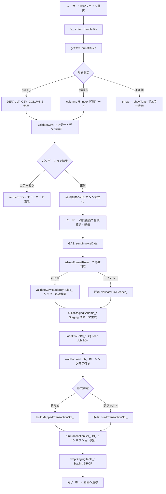
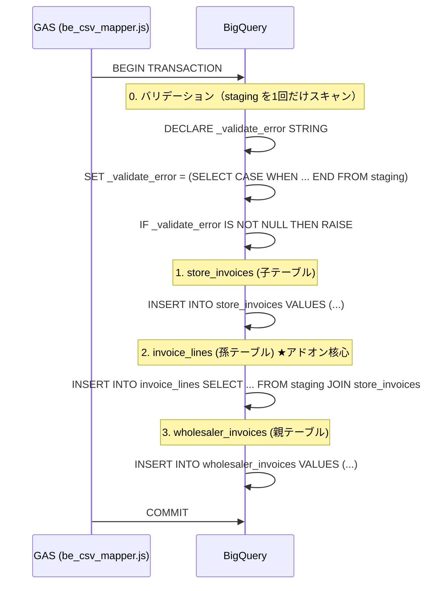
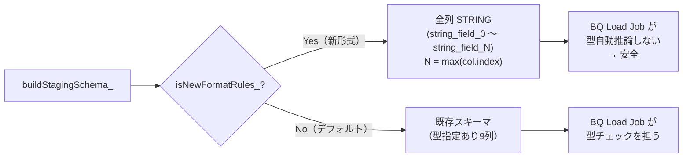
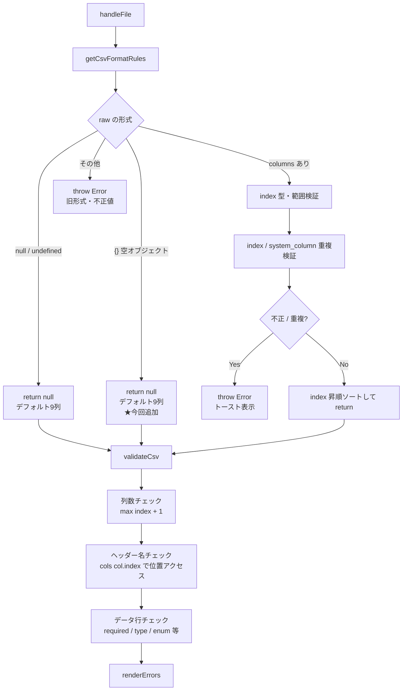

# MYP-3423 作業まとめ — 卸単位のCSVファイルアップロード対応

## 概要

卸業者ごとに独自フォーマットのCSVをアップロードできるようにする機能を実装し、  
Copilot レビュー指摘（セキュリティ・堅牢性）への対応を合わせて実施。

- **ブランチ:** `feature/MYP-3423-load-job-csv-upload`
- **PR:** [#10 MYP-3423 卸単位のCSVファイルでアップロードができるようにする](https://github.com/USEN-PAY-Products/connect-wholesale-gas-poc/pull/10)
- **主要変更ファイル:**
  - `src/be_csv_mapper.js`（新規）
  - `src/be_invoice.js`
  - `src/fe_js.html`

---

## csv_format_rules の形式

### デフォルト卸（固定9列）

`csv_format_rules` が `null` / `{}` の場合。  
フロント側では `DEFAULT_CSV_COLUMNS_` 定数をそのまま使用する。

### カスタム卸（新形式）

```jsonc
{
  "has_header": true,
  "columns": [
    {
      "index": 0,            // CSV 上の列位置（0始まり）
      "csv_header": "伝票日付",
      "system_column": "transaction_date",  // invoice_lines のカラム名。nullならINSERT不要列
      "type": "date",
      "format": "YYYYMMDD",  // date型のみ: YYYYMMDD / YYYY/MM/DD / YYYY-MM-DD
      "required": true
    },
    {
      "index": 3,
      "csv_header": "得意先名",
      "system_column": null, // マッピングなし（読み飛ばし列）
      "type": "string",
      "required": false
    }
  ]
}
```

---

## 全体フロー

### アップロード〜BQ登録フロー



---

### BQ トランザクション内部フロー（新形式）



---

### Staging スキーマ生成（新形式 vs デフォルト）



> **新形式で全列 STRING にする理由:**  
> BQ Load Job に型を指定しないと自動推論が走り、「0123」→ `123`（先頭ゼロ消失）などの  
> データ破損が起きる。Staging 全列を STRING で受け取り、後段の SELECT CAST で型変換する。

---

## 実装した修正一覧

### `src/be_csv_mapper.js`（新規ファイル）

| # | 関数 | 内容 |
|---|---|---|
| 1 | `validateCsvHeaderByRules_()` | ヘッダー行のみを検証（列数・位置・名称）。Load Job 前に呼び出すことで10万行パース不要 |
| 2 | `buildInvoiceLinesSelectSql_()` | csv_format_rules に従い Staging → invoice_lines の動的キャスト SELECT SQL を生成 |
| 3 | `buildMappedTransactionSql_()` | BEGIN TRANSACTION 〜 COMMIT 全体を組み立て。バリデーション RAISE を INSERT 前に配置 |
| 4 | `isNewFormatRules_()` | 新形式かどうかを判定（呼び出し側の分岐キー） |

#### セキュリティ対策（be_csv_mapper.js）

| 層 | 対象 | 手法 |
|---|---|---|
| 1 | 文字列値（remarks, csv_header 等） | `escSql_()` でシングルクォートをエスケープ |
| 2 | 金額・税率等の数値 | `Number()` キャスト + `isFinite` + `isInteger` + 非負チェック |
| 3 | invoiceUuid, wsUserId | UUID 正規表現で形式検証 |
| 4 | stagingId（テーブル名） | `/^[a-zA-Z0-9_]+$/` 正規表現で検証 |
| 5 | ddlCol（カラム名） | `ALLOWED_SYSTEM_COLUMNS` ホワイトリスト |
| 6 | SQL コメント内の csv_header | `sanitizeComment_()` で改行・制御文字を除去 |

#### Copilot レビュー指摘への対応（be_csv_mapper.js）

| 指摘 | 対応 |
|---|---|
| `selectParts.join(',\n')` でカンマがコメントに飲まれる SQL 構文エラー | 各要素末尾に `,` を付け `join('\n')` に変更 |
| RAISE MESSAGE に `col.csv_header` / `col.format` が未エスケープ | `escSql_()` を3箇所に適用 |
| `col.index` の型・範囲を検証していない | `Number.isInteger` / `>= 0` チェックを2関数に追加 |
| `index` / `system_column` の重複チェックがない | `seenIndexes` / `seenSystemColumns` チェックを2関数に追加 |
| `ddlCol` のカラム名インジェクション対策がない | `ALLOWED_SYSTEM_COLUMNS` ホワイトリストを追加 |
| `required:true` の integer/date 列で空文字が素通りする | 空文字・NULL チェックの RAISE を追加（詳細は後述） |
| `required:true` の **string 列**でバリデーションが未実装 | `case 'string':` ブロックに空文字・NULL チェックを追加（integer/date と同等） |
| `amount_ex_tax` / `tax_rate` / `customer_code` 以外の必須列が欠落してもエラーにならない | `REQUIRED_SYSTEM_COLUMNS` 配列を追加し `buildInvoiceLinesSelectSql_()` 冒頭で一括 `throw` | 
| `seenSystemColumns = {}` で `'constructor'` 等の既存プロパティと衝突し誤判定の可能性 | `Object.create(null)` に変更（`validateCsvHeaderByRules_` / `buildInvoiceLinesSelectSql_` の2箇所） |

---

### `src/be_invoice.js`

#### `buildStagingSchema_()` の修正

新形式（`columns` 配列あり）の場合、`col.index` の型・範囲チェック（上限 200）を行ったうえで、`max(col.index) + 1` 列分の `STRING` スキーマを動的生成する。全列 STRING にすることで BQ の型自動推論（先頭ゼロ消失等）を防ぐ。

---

### `src/fe_js.html`

#### フロント全体のバリデーションフロー



#### Copilot レビュー指摘への対応（fe_js.html）

| # | 指摘 | 修正内容 |
|---|---|---|
| 1 | `getCsvFormatRules()` が旧形式をエラーにしていない | `null` / 新形式 / 空オブジェクト 以外は `throw` に変更 |
| 2 | `{}` が `throw` されてフロントだけアップロード不可になる | `Object.keys(raw).length === 0` の場合は `null` と同等に扱う |
| 3 | `col.index` が非整数・負数・上限超えの場合に `NaN` が発生 | `getCsvFormatRules()` 内でループ前に型・範囲検証を追加（上限 200） |
| 4 | `expectedCols` を `columns.length` で算出していた | `max(col.index) + 1` に修正（欠番のある index に対応） |
| 5 | ヘッダー・データ行を `cols[idx]`（配列順）で取得していた | `cols[col.index]`（index 基準）に修正し列ずれを解消 |
| 6 | `downloadCsvTemplate()` も `index` 基準で配置していなかった | `headers[col.index]` に変更、欠番列を空文字で埋める |
| 7 | `downloadCsvTemplate()` で `getCsvFormatRules()` の例外が未捕捉 | `try/catch` を追加しトースト表示して DL 中断 |
| 8 | `downloadCsvTemplate()` で `Array(maxIndex+1)` がフリーズの原因になりうる | `MAX_COL_INDEX = 200` 上限チェックを追加 |
| 9 | 連続ファイル選択で古い `onload` が後から走り結果を上書きする | `_currentReader` で `abort()` + ガード判定を実装 |
| 10 | 未対応 `date format` で `else` ブランチに入り誤判定 | `else if` に限定し `else` は `throw` 追加 |
| 11 | `validateCsv()` の `throw` が未捕捉でスピナーが固まる | `reader.onload` 内を `try/catch` で囲む |
| 12 | `getCsvFormatRules()` で `index` / `system_column` の重複チェックがない | `seenIndexes` / `seenSystemColumns` を追加（バックエンドと同等の検証） |
| 13 | `resetDropZone()` が `is-analyzing` / `drag-over` を除去しないため、解析中にキャンセルすると操作不能になる | `classList.remove()` に `is-analyzing` と `drag-over` を追加 |
| 14 | `seenSystemColumns = {}` で `'constructor'` 等と衝突し誤った重複エラーになる可能性 | `Object.create(null)` に変更 |

---

## 空文字・NULL のバリデーションが必要な理由

新形式の Staging は **全列 STRING** のため、BQ Load Job は型チェックを行わない。`required:true` の列に空文字が入っていても、`AND field != ''` の条件で既存チェックをすり抜けていた。

**string `required:true` 列のチェック構造（今回追加）:**

| チェック | 条件 | エラーメッセージ |
|---|---|---|
| ①（追加） | `field IS NULL OR field = ''` | 「必須項目です。空欄なく入力してください。」 |

> string 型は CAST 変換がないため、シンプルに IS NULL / 空文字チェックのみ。  
> `item_name` / `quantity_unit` / `customer_code` 等 required:true の string 列が対象。

**integer `required:true` 列のチェック構造:**

| チェック | 条件 | エラーメッセージ |
|---|---|---|
| ①（既存） | 空でないのに非数値 | 「数値として解釈できない値が含まれています」 |
| ②（追加） | `field IS NULL OR field = ''` | 「必須項目です。空欄なく入力してください。」 |

**date `required:true` 列のチェック構造:**

| チェック | 条件 | エラーメッセージ |
|---|---|---|
| ①（既存） | 空でないのに無効な日付 | 「存在しない日付または不正な日付が含まれています」 |
| ②（追加） | `field IS NULL OR field = ''` | 「必須項目です。空欄なく入力してください。」 |

## staging スキャン最適化

各列ごとに `IF (SELECT COUNTIF(...) FROM staging)` を個別発行すると、列数分のフルスキャンが発生する（最大200列 × 2 = 400回）。これを `DECLARE + SET (CASE WHEN 複数 COUNTIF) + IF RAISE` の形に集約することで **staging のスキャンを1回** に削減した。

---

## system_column → DDL カラム名マッピング

| system_column | invoice_lines DDL カラム名 |
|---|---|
| `transaction_date` | `transaction_date`（1:1） |
| `item_name` | `item_name`（1:1） |
| `quantity` | `quantity`（1:1） |
| `quantity_unit` | `quantity_unit`（1:1） |
| `unit_price` | `unit_price`（1:1） |
| `tax_rate` | **`tax_category`** |
| `amount_ex_tax` | **`line_amount_excluding_tax`** |
| `invoice_detail_remark` | **`line_note`** |
| `customer_code` | INSERT 不要（JOIN キーのみ） |
| ―（CSV にない計算項目） | `line_tax_amount`（`FLOOR(amount × rate / 100)`） |

---

## デプロイ手順

```bash
# ローカル動作確認後、GAS にプッシュ
npm run push:local
```

---

## 関連ドキュメント

- [flow_csv_to_bq.md](./flow_csv_to_bq.md) — CSV → BQ の全体フロー詳細
- [load_job_csv_upload_design.md](./plan/load_job_csv_upload_design.md) — Load Job 設計
- [load_job_staging_design.md](./plan/load_job_staging_design.md) — Staging テーブル設計
- [CODING_RULES.md](./CODING_RULES.md) — コーディング規約
