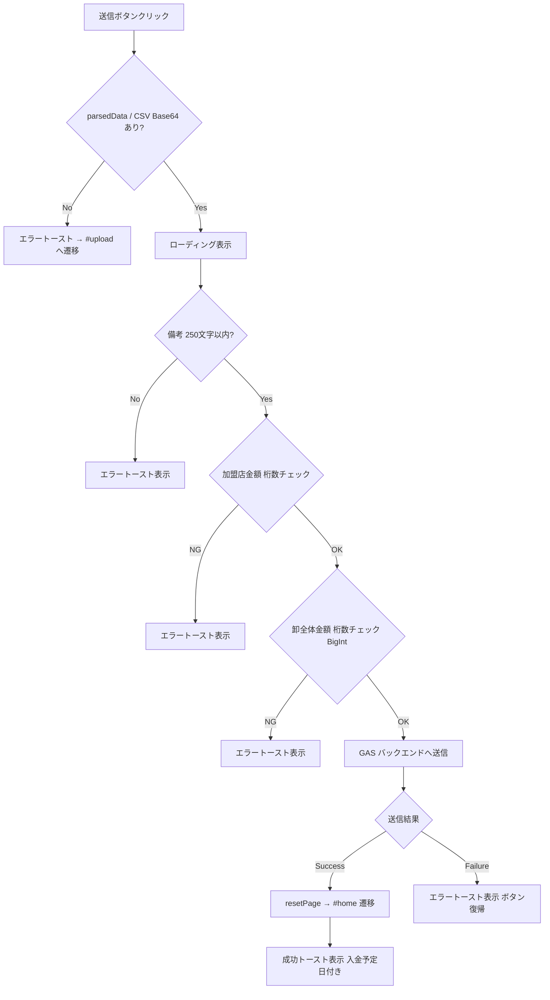
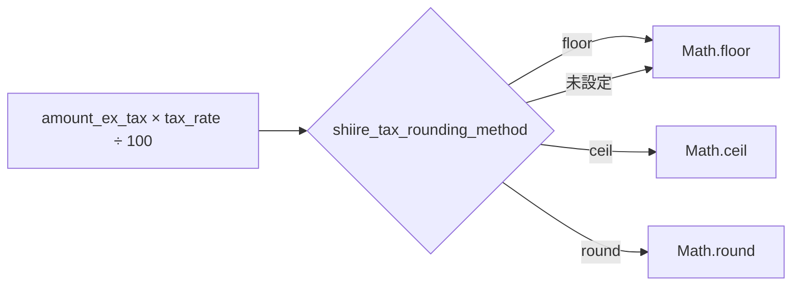
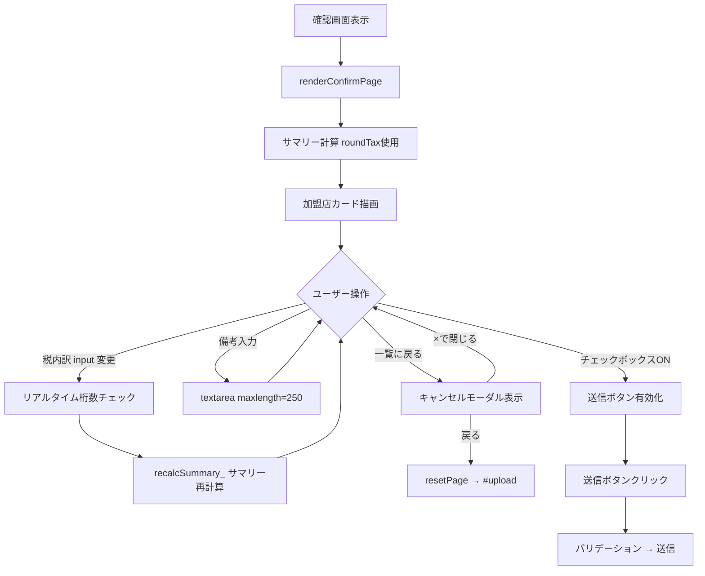
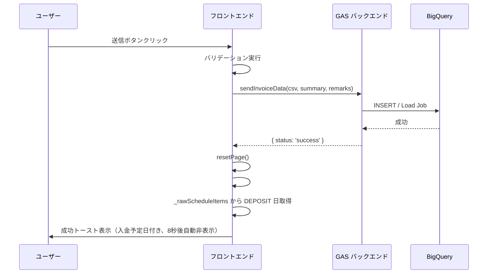
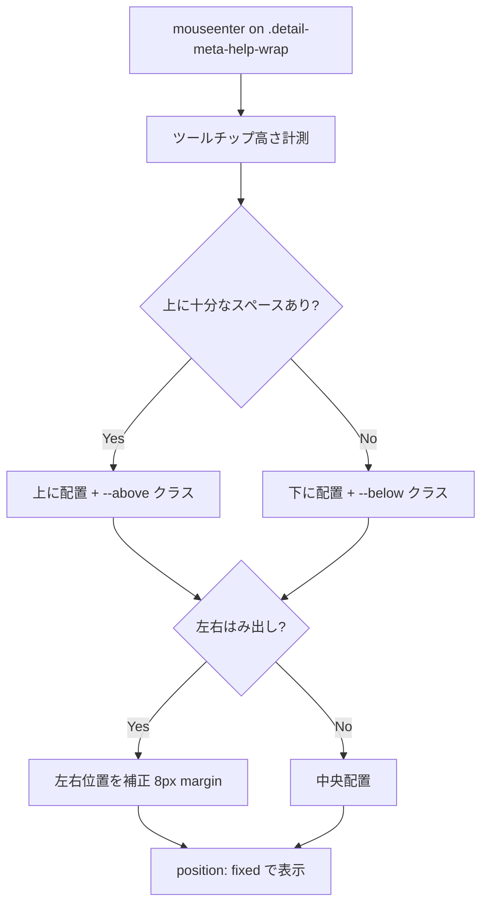

# PR 作業まとめ: MYP-3431 確認画面でのバリデーション追加とデザイン反映

## 概要

確認画面（`#confirm`）のデザインリニューアルおよびバリデーション強化を行った。  
加えて、送信成功時のトースト通知を入金予定日付きの詳細メッセージに改善した。

## 変更ファイル一覧

| ファイル | 変更内容 |
|---|---|
| `src/fe_page_confirm.html` | ヘッダー構造変更、請求月表示追加、モーダル刷新、下部戻るボタン追加 |
| `src/fe_js.html` | 税丸め関数追加、バリデーション追加、ツールチップ動的配置、トースト改善 |
| `src/fe_css.html` | カラム幅調整、色・フォント変更、トーストデザイン刷新、ツールチップスタイル変更 |
| `src/fe_index.html` | トーストHTML構造変更（title/body分離） |

---

## 変更詳細

### 1. 確認画面ヘッダーのデザイン変更

- `summary-card` → `card detail-summary-card` に変更し、詳細画面と同じセクション構造に統一
- 「請求基本情報」タイトルを `detail-summary-title` として表示
- **請求月**を登録日時の横に並列表示（`detail-meta-row--twin` レイアウト）
- 手数料ラベルにツールチップ（`?` アイコン）を追加
  - バルーン色: `#003255`、アイコン色: `#00A7B8`、サイズ: 15×15px

**色・フォント変更:**
- ヘッダー右ボックスの項目名: `#335B77`
- 全値・単位色: `#3C3C3C`
- 合計金額: 数値 32px / 単位 24px
- その他の金額: 16px

### 2. バリデーション追加

#### 2-1. 金額桁数バリデーション（DDL制約ベース）

送信時に BQ テーブルの `NUMERIC` 型制約に基づく桁数チェックを実施。

| 対象 | フィールド | 上限 |
|---|---|---|
| 加盟店単位 | `total_amount`, `subtotal_amount` | 12桁（999,999,999,999） |
| 加盟店単位 | `tax_amount`, `standard_tax_amount`, `reduced_tax_amount` | 11桁（99,999,999,999） |
| 卸全体 | `total_amount`, `fee_amount`, `payment_amount` | 25桁（BigInt使用） |

- 25桁チェックは `Number.MAX_SAFE_INTEGER` を超えるため `BigInt` で比較
- 税内訳 input にはリアルタイム入力制限（`max="99999999999"`、input イベントで強制補正）

#### 2-2. 備考バリデーション

- `<input type="text">` → `<textarea>` に変更（複数行対応）
- `maxlength="250"` 属性 + 送信時の250文字チェック

#### 2-3. 税端数処理

- `roundTax()` 関数を追加
- `sessionStorage` の `shiire_tax_rounding_method` に基づき `floor`/`ceil`/`round` を切り替え
- 確認画面の3箇所の `Math.floor()` を `roundTax()` に置換

#### 2-4. 単価の型変更

- `DEFAULT_CSV_COLUMNS_` の `unit_price` を `integer` → `decimal` に変更（小数単価対応）

### 3. UI/UX 改善

#### 3-1. キャンセルモーダルの刷新

アップロード画面のモーダルと同一デザインに統一:
- `modal--warn` スタイル（警告アイコン付き）
- 右上 × ボタンで閉じる
- メッセージ文言を「一覧に戻ると登録作業中のファイルは削除されますがよろしいですか？」に変更

#### 3-2. トースト通知の改善

- HTML 構造を title + body に分離
- 成功時: チェックアイコン（`fa-circle-check`）、背景 `#EFFCFA`、タイトル色 `#159E85`
- 本文に入金予定日（`business_calendar` の `DEPOSIT` イベントから取得）を表示
- 自動非表示: 8秒（従来4秒）
- 本文スタイル: 16px / `#3C3C3C` / `font-weight: 400` / `line-height: 120%`

#### 3-3. テーブルレイアウト調整

**親テーブル（加盟店一覧）カラム幅:**

| 列 | 幅 |
|---|---|
| 加盟店名 | 304px |
| 顧客ID | 57px |
| 請求金額 | 88px |
| 小計（税抜） | 88px |
| 消費税 | 65px |
| 税内訳（10%） | 105px |
| 税内訳（8%） | 105px |
| 開閉 | 24px |

- `justify-content: space-between`（gap なし）
- 税内訳 input: 89×24px、`font-size: 16px`、`font-family: Noto Sans JP`

**子テーブル（明細）カラム幅:**

| 列 | 幅 |
|---|---|
| 取引日 | 74px |
| 明細項目 | 302px |
| 単価 | 77px |
| 数量 | 35px |
| 明細金額（税抜） | 77px |
| 内 消費税 | 138px |
| 備考 | 320px |

- `border-collapse: collapse`、ヘッダー中央寄せ

#### 3-4. ツールチップ動的配置

JS（IIFE）によるビューポート内自動配置:
- `mouseenter` イベント委譲で `position: fixed` を使用
- 上に十分なスペースがあれば上に、なければ下に表示
- 左右はみ出し防止（8px マージン）
- 備考ラベルにもツールチップを追加

#### 3-5. その他の UI 変更

- 顧客IDに `customer_code` を表示（従来は `mall_code`）
- 下部に「一覧に戻る」ボタンを追加（右寄せ）
- `.page-header` の margin をリセット（0）

---

## 処理フロー

### 送信バリデーションフロー

### 消費税丸め処理フロー

### 確認画面操作フロー

### トースト表示シーケンス

### ツールチップ配置ロジック

