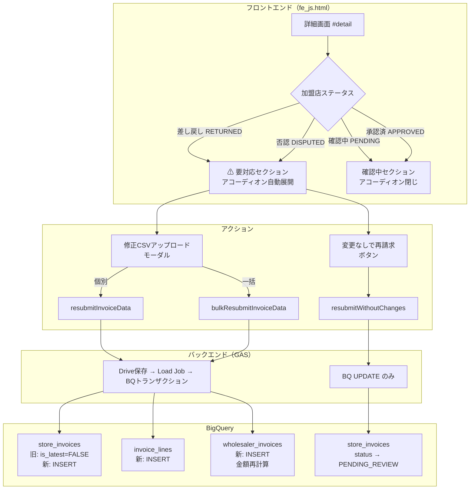
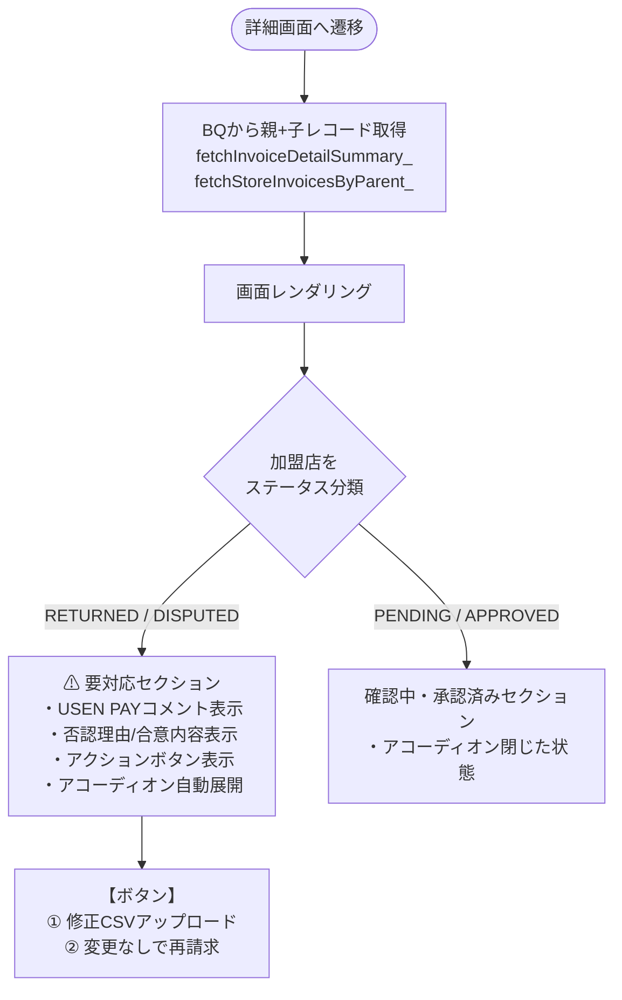
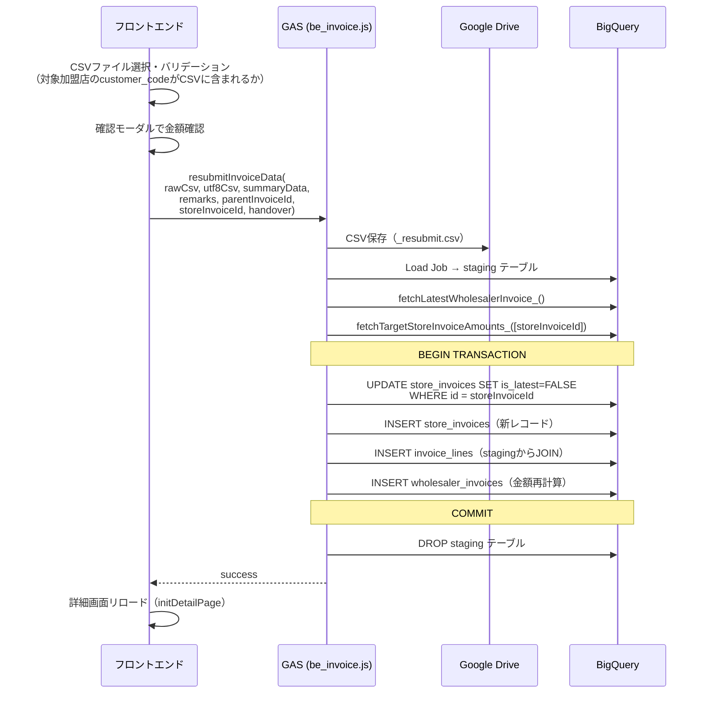
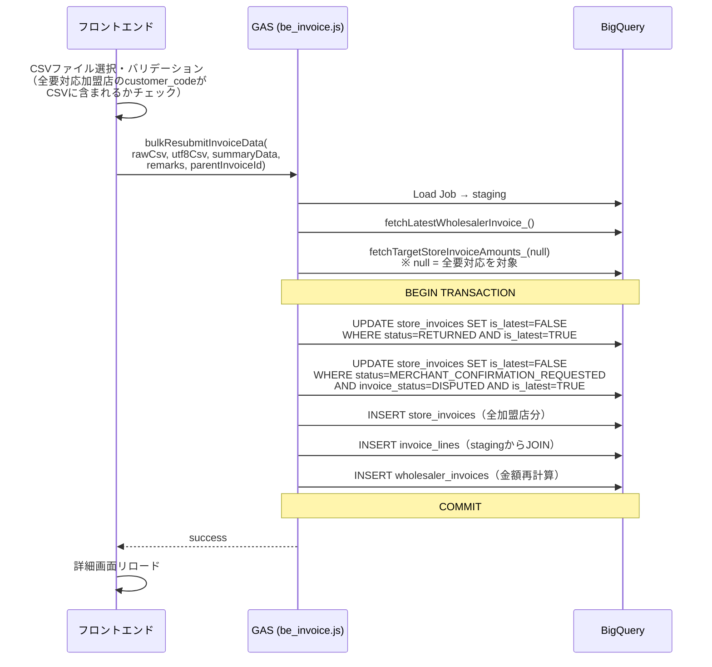
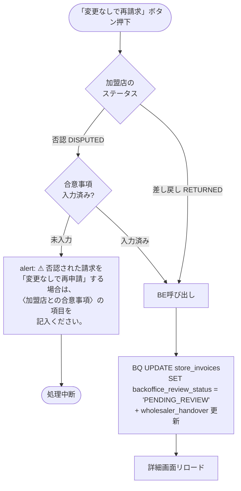
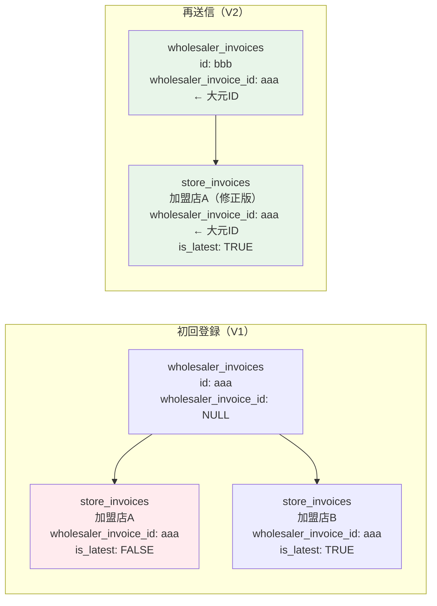
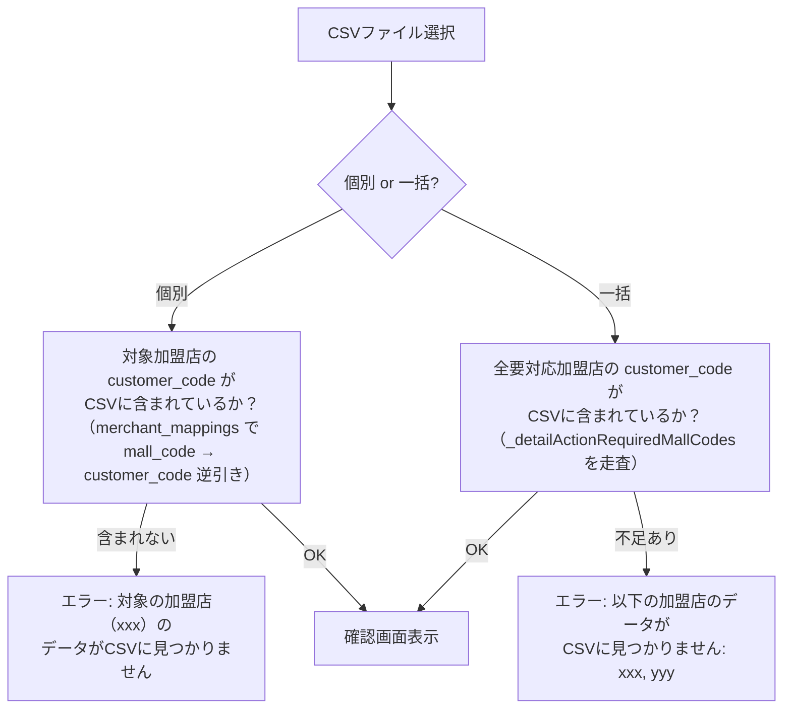

# MYP-3433 請求書情報詳細画面の表示（否認・差し戻し対応）

> **ブランチ**: `feature/MYP-3433-wholesale-invoice-detail-rejection-status`  
> **最終更新**: 2026-05-28

---

## 1. 概要

請求書詳細画面（`#detail`）において、BackOffice側から **差し戻し（RETURNED）** や **否認（DISPUTED）** が発生した場合の表示・操作機能を実装した。

### 実装した主要機能

| # | 機能 | 概要 |
|---|------|------|
| 1 | 詳細画面デザイン刷新 | 確認画面と統一したカードUI、ステータスバッジ、アコーディオン表示 |
| 2 | 個別 CSV 再送信 | 差し戻し/否認された1加盟店分のCSVを再アップロード |
| 3 | 一括 CSV 再送信 | 要対応の全加盟店分のCSVをまとめて再アップロード |
| 4 | 変更なしで再請求 | CSV再アップロードなしでステータスのみ更新 |
| 5 | バージョン管理（方式A） | `wholesaler_invoices` は常に大元の親IDを参照 |

---

## 2. 変更ファイル一覧

| ファイル | 変更行数 | 変更内容 |
|----------|----------|----------|
| `src/be_invoice.js` | +540 | 再送信・一括再送信・変更なし再請求のBE関数追加 |
| `src/db_bq_query.js` | +107 | BQクエリ修正・ヘルパー関数追加 |
| `src/fe_js.html` | +809 | 詳細画面のFEロジック大幅追加 |
| `src/fe_css.html` | +562 | 詳細画面のスタイル追加・ステータスバッジ |
| `src/fe_page_detail.html` | +104 | 詳細画面HTMLテンプレート拡充 |

---

## 3. アーキテクチャ全体図



---

## 4. 機能詳細

### 4-1. 詳細画面のステータス別表示



#### ステータスバッジのスタイル

| ステータス | 背景色 | アイコン色 | ラベル |
|-----------|--------|-----------|--------|
| 差し戻し (RETURNED) | `#FFFEEF` | `#FF7846` | 差し戻し |
| 否認 (DISPUTED) | `#FFE4E4` | `#DF4C4C` | 否認 |
| 確認中 (PENDING_REVIEW) | `#EFEFF9` | — | 確認中 |
| 承認済み (APPROVED) | `#CDF6EF` | — | 承認済み |

---

### 4-2. 個別 CSV 再送信（`resubmitInvoiceData`）

差し戻し/否認された **1加盟店** の修正CSVをアップロードして再送信する。



---

### 4-3. 一括 CSV 再送信（`bulkResubmitInvoiceData`）

要対応の **全加盟店** の修正CSVをまとめてアップロードする。



---

### 4-4. 変更なしで再請求（`resubmitWithoutChanges`）

CSVの再アップロードなしで、ステータスのみ更新する。



#### wholesaler_handover の更新ルール

| ケース | 更新動作 |
|--------|---------|
| 否認 → 入力値あり | 入力値で更新 |
| 差し戻し | 既存値を維持（`SET wholesaler_handover = wholesaler_handover`） |

---

### 4-5. バージョン管理（方式A: 常に大元の親ID参照）

再送信時に新規INSERTされる `wholesaler_invoices` と `store_invoices` は、常に **大元の親ID** を `wholesaler_invoice_id` に持つ。



**方式Aを選択した理由:**
- BQ再帰CTE不要でクエリが簡潔
- `store_invoices` と `wholesaler_invoices` でルールが統一
- 詳細画面のサマリー取得が `WHERE (id = @id OR wholesaler_invoice_id = @id) ORDER BY created_at DESC LIMIT 1` で済む

---

### 4-6. 金額再計算ロジック

再送信時、`wholesaler_invoices` の金額は以下の式で再計算される:

$$\text{新WI金額} = \text{最新WI金額} - \text{旧対象store金額合計} + \text{新CSV金額}$$

```
例: 
  最新WI合計 = 100,000円
  旧対象store合計 = 30,000円（差し戻しされた加盟店A分）
  新CSV合計 = 35,000円（修正後の加盟店A分）
  → 新WI合計 = 100,000 - 30,000 + 35,000 = 105,000円
```

これにより、2回目以降の修正でも直前の修正結果がベースになり、正確な金額が維持される。

---

## 5. BQクエリの変更点

### 5-1. 既存クエリの修正

| クエリ関数 | 変更内容 | 理由 |
|-----------|---------|------|
| `fetchStoreInvoicesByParent_` | `AND si.is_latest = TRUE` 追加 | 再送信で `is_latest=FALSE` になった旧レコードを除外 |
| `fetchInvoiceDetailSummary_` | `WHERE (id = @id OR wholesaler_invoice_id = @id) ORDER BY created_at DESC LIMIT 1` | 再送信版（新WI）を含めて最新を取得 |
| `fetchInvoicesByWholesaler_` | `AND wholesaler_invoice_id IS NULL` 追加 | 再送信版を一覧画面から除外 |

### 5-2. 新規ヘルパー関数

| 関数 | 用途 |
|------|------|
| `fetchLatestWholesalerInvoice_` | 金額再計算のベースとなる最新WIを取得 |
| `fetchTargetStoreInvoiceAmounts_` | 旧対象storeの金額合計を取得（個別/一括両対応） |

---

## 6. FE バリデーション

### CSVアップロード時の追加チェック



---

## 7. セキュリティ設計

| 対策 | 詳細 |
|------|------|
| `wholesaler_id` の改ざん防止 | サーバー側 `getServerAccountInfo_()` で取得（フロントからは受け取らない） |
| UUID形式バリデーション | `parentInvoiceId`, `storeInvoiceId` を正規表現で検証 |
| SQLインジェクション対策 | `esc()` でシングルクォートエスケープ、金額は `Number()` + `isFinite()` |
| UPDATE条件の厳格化 | `WHERE id = ? AND wholesaler_invoice_id = ? AND wholesaler_id = ? AND is_latest = TRUE` |

---

## 8. 影響範囲・注意事項

- `wholesaler_invoices` の新規INSERT時、`wholesaler_invoice_id` に大元のIDを設定する（チェーン方式ではない）
- `resubmitWithoutChanges` では `invoice_status`（DISPUTED等）は変更しない — BackOffice側で確認が必要なため
- 一括再送信の UPDATE は差し戻し・否認を2つの UPDATE 文で分けて実行（`backoffice_review_status` の条件が異なるため）
- 一覧画面では `wholesaler_invoice_id IS NULL` で再送信版を除外している
