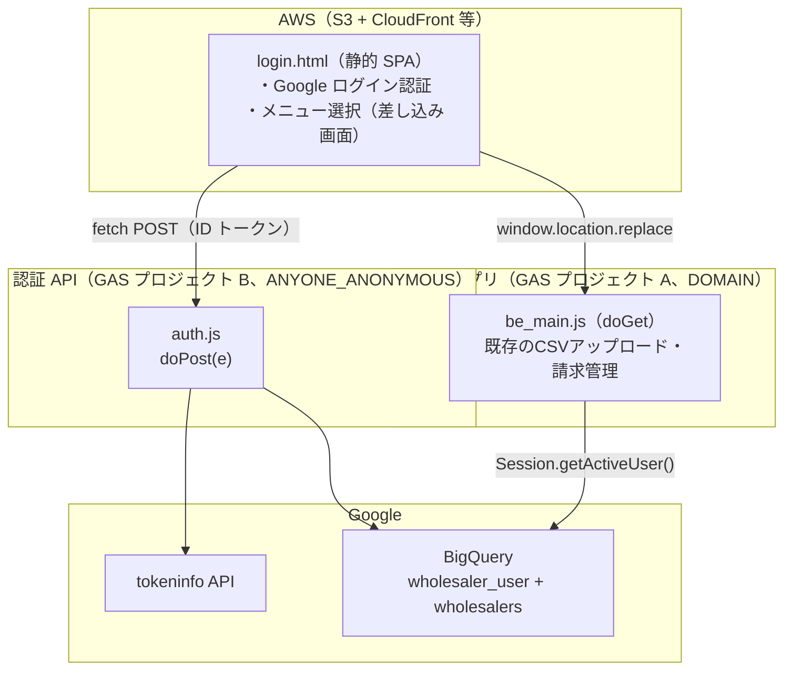
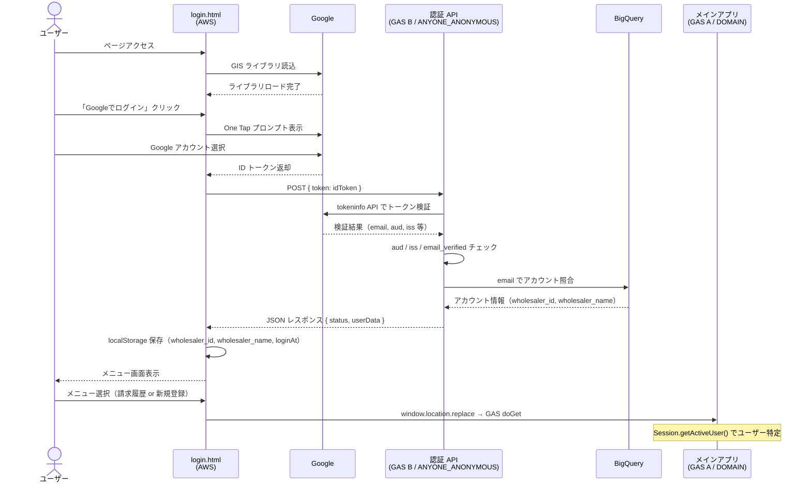
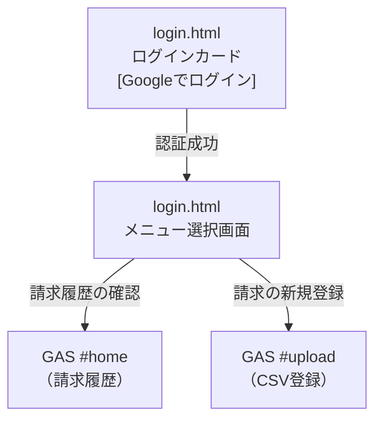
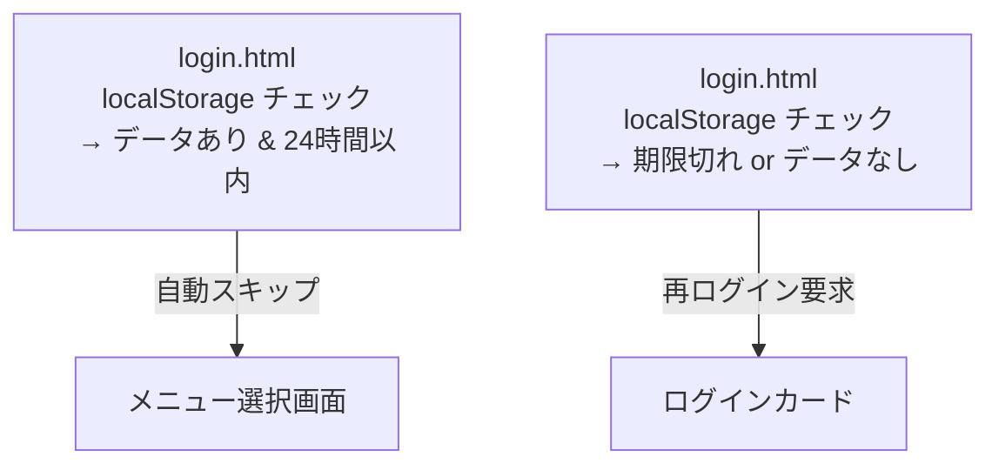

# MYP-3442【卸】ログイン画面実装

## 概要

Google 審査対応のため、ログイン認証を GAS 内蔵方式ではなく **AWS ホスティングの独立ドメイン** で実装する。  
ログイン後にメニュー選択画面（差し込み画面）を経由して GAS アプリへリダイレクトする。

メインアプリ（`src/`）は `access=DOMAIN` で `Session.getActiveUser()` によるユーザー特定を維持し、  
認証 API（`src-auth/`）は `access=ANYONE_ANONYMOUS` で外部オリジンからの `fetch()` に対応する。  
**1つの GAS プロジェクトでは `access` 設定を両立できないため、2つの GAS プロジェクトに分離している。**

---

## システム構成

---

## 認証シーケンス図

---

## 画面遷移フロー

### 再訪問時（localStorage にデータありかつ有効期限内）

---

## 変更ファイル一覧

### 新規追加

| ファイル | 説明 |
|---|---|
| `src/login.html` | AWS ホスティング用ログイン＋メニュー選択 SPA |
| `src-auth/auth.js` | 認証 API（別 GAS プロジェクト）トークン検証・ BQ 照合 |
| `src-auth/appsscript.json` | 認証 API 用 GAS マニフェスト（ANYONE_ANONYMOUS） |
| `.clasp-auth-local.json` | 認証 API 用 clasp 設定 |

### 変更

| ファイル | 変更内容 |
|---|---|
| `src/appsscript.json` | `access` を `"DOMAIN"` のまま維持（認証 API を別プロジェクトに分離） |
| `package.json` | `push:auth-local` / `deploy:auth-local` スクリプト追加 |
| `.claspignore` | `login.html` と `be_auth.js` をメインプロジェクトから除外 |
| `.github/workflows/deploy.yml` | `deploy-auth` ジョブ追加（認証 API の CI/CD） |

---

## 各ファイルの詳細

### `src/login.html`（新規）

AWS にデプロイする自己完結型の静的 HTML（SPA）。

**ページ構成:**
- **ページ1: ログインカード** — Google One Tap 認証ボタン、エラーバナー、ローディングスピナー
- **ページ2: メニュー選択（差し込み画面）** — 「請求履歴の確認」「請求の新規登録」の2カード

**主な機能:**
- `detectEnv()` でホスト名から環境（local/dev/prod）を自動判定
- `_configError` で GAS URL 未設定（`YOUR_PROD_DEPLOY_ID` のまま）を検知し、初期化を中断
- Google Identity Services（GIS）で One Tap ログイン
- `fetch` で GAS `doPost` に ID トークンを送信（`Content-Type: text/plain` で CORS プリフライト回避）
- `localStorage` には `wholesaler_id`、`wholesaler_name`、`loginAt` のみ保存（機微情報を含めない）
- セッション有効期限: 24時間（`LOGIN_SESSION_TTL_MS`）。期限切れ時は再ログインを要求
- GAS へのリダイレクトは `window.location.replace()` + `?t=Date.now()` でキャッシュ回避

**コーディング規約対応:**
- `var` 不使用（全て `const` / `let`）
- メニューボタンは `<button type="button">` を使用（`<a>` ではなくアクセシビリティ対応）

### `src-auth/auth.js`（新規）

認証 API 専用 GAS プロジェクトの POST エントリーポイント。
メインアプリとは別プロジェクト（`access=ANYONE_ANONYMOUS`）としてデプロイする。
自己完結型（BQ クエリも内包、メインアプリの `db_bq_query.js` に依存しない）。

**検証フロー:**
1. リクエストボディ存在チェック（`e.postData.contents`）
2. JSON パースの個別 try-catch
3. Google `tokeninfo` API でトークン検証（`encodeURIComponent` 適用）
4. `aud`（クライアントID）の一致検証（`GOOGLE_CLIENT_ID` 必須）
5. `iss`（発行者）の検証（`accounts.google.com` または `https://accounts.google.com`）
6. `email_verified` チェック
7. `fetchAccountForAuth_(email)` で BQ アカウント照合（最小限フィールドのみ返却）

**エラーハンドリング:**
- 全パターンで JSON レスポンスを返却（例外で 500 にならない）
- `GOOGLE_CLIENT_ID` 未設定時は「サーバー設定エラー」を返却

**規約対応:**
- 内部関数は末尾アンダースコア（`jsonResponse_`）
- `var` 不使用（全て `const` / `let`）

### `src/be_config.js`（変更）

- `GOOGLE_CLIENT_ID` を削除（認証 API 側に移動したため、メインアプリには不要）

### `src/appsscript.json`（変更なし）

`access: "DOMAIN"` のまま維持。`Session.getActiveUser()` によるユーザー特定が正常に動作する。

### `.github/workflows/deploy.yml`（変更）

`deploy-auth` ジョブを追加。`AUTH_SCRIPT_ID` / `AUTH_DEPLOYMENT_ID` を GitHub Environment Secrets から参照。

---

## セキュリティ対策

| 対策 | 実装箇所 | 内容 |
|---|---|---|
| トークン検証 | `auth.js` | Google `tokeninfo` API でサーバー側検証 |
| aud チェック | `auth.js` | `GOOGLE_CLIENT_ID` との一致を必須検証 |
| iss チェック | `auth.js` | `accounts.google.com` または `https://accounts.google.com` のみ許可 |
| email_verified | `auth.js` | 未確認メールアドレスのアカウントを拒否 |
| BQ 照合 | `auth.js` | 登録済みアカウントのみ許可 |
| レスポンス最小化 | `auth.js` | `wholesaler_id` / `wholesaler_name` のみ返却（加盟店マッピング等は含めない） |
| localStorage 最小化 | `login.html` | `wholesaler_id`、`wholesaler_name`、`loginAt` のみ保存 |
| セッション有効期限 | `login.html` | 24時間（`LOGIN_SESSION_TTL_MS`）。期限切れ時は再ログイン要求 |
| リクエスト検証 | `auth.js` | ボディ存在チェック + JSON パースの個別ガード |
| URL エンコード | `auth.js` | `encodeURIComponent(idToken)` |
| 設定未完了ガード | `login.html` | prod URL 未設定時にログインボタンを無効化 |
| CORS 回避 | `login.html` | `Content-Type: text/plain` でプリフライト回避 |
| プロジェクト分離 | アーキテクチャ | メイン=DOMAIN / 認証=ANYONE_ANONYMOUS で Session.getActiveUser() を維持 |

---

## 環境別設定

| 項目 | local | dev | prod |
|---|---|---|---|
| メインアプリ GAS access | DOMAIN | DOMAIN | DOMAIN |
| 認証 API GAS access | ANYONE_ANONYMOUS | ANYONE_ANONYMOUS | ANYONE_ANONYMOUS |
| 認証 API デプロイ URL | 設定済み | 設定済み | `YOUR_AUTH_PROD_DEPLOY_ID`（要設定） |
| メインアプリ GAS URL | 設定済み | 設定済み | `YOUR_PROD_DEPLOY_ID`（要設定） |
| OAuth クライアント ID | 共通 | 共通 | TBD（本番ドメイン承認後） |
| GitHub Secrets | — | `AUTH_SCRIPT_ID` / `AUTH_DEPLOYMENT_ID` | 同左 |

---

## デプロイ手順

### 認証 API（初回のみ）

1. GAS で新規プロジェクトを作成
2. `npm run push:auth-local` でコードを push
3. GAS エディタで `setupAuthScriptProperties()` を実行（`GCP_PROJECT_ID`、`BQ_DATASET_ID`、`GOOGLE_CLIENT_ID` を設定）
4. 「全員」アクセスでデプロイ
5. デプロイ URL を `login.html` の `ENV_CONFIG` に設定
6. GitHub Secrets に `AUTH_SCRIPT_ID` / `AUTH_DEPLOYMENT_ID` を登録

### メインアプリ（GAS 側）

1. `npm run push:local`（または `push:dev`）で GAS にコードをプッシュ
2. GAS エディタで `setupScriptProperties(true)` を実行
3. GAS を「ドメイン内全員」アクセスでデプロイ

### AWS 側

1. `src/login.html` を S3 にアップロード（または Amplify 等）
2. CloudFront でカスタムドメインを設定
3. Google Cloud Console で本番ドメインを OAuth クライアントの承認済みオリジンに追加
4. `login.html` の `ENV_CONFIG.prod` に本番 GAS デプロイ URL を設定

---

## 残課題

- [ ] 本番 GAS デプロイ ID の設定（`ENV_CONFIG.prod` — メインアプリ + 認証 API）
- [ ] 本番用 OAuth クライアント ID の確定（ドメイン承認後）
- [ ] AWS デプロイ（S3 + CloudFront）
- [ ] `detectEnv()` の開発環境ドメイン判定ロジック確定
- [ ] 本番 GitHub Environment に `AUTH_SCRIPT_ID` / `AUTH_DEPLOYMENT_ID` を登録
