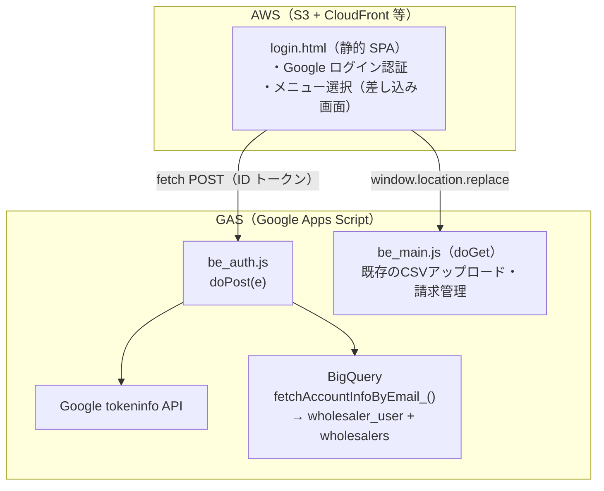
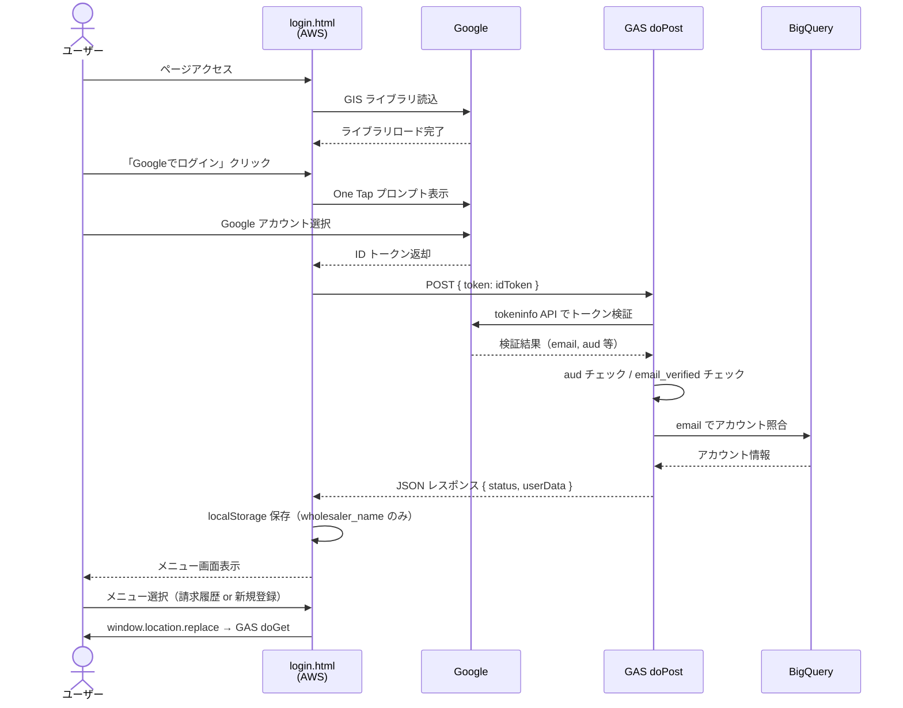
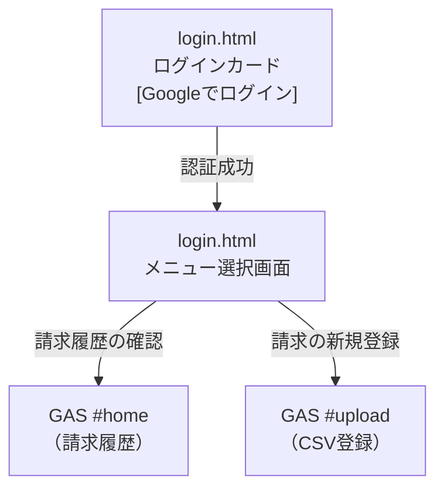
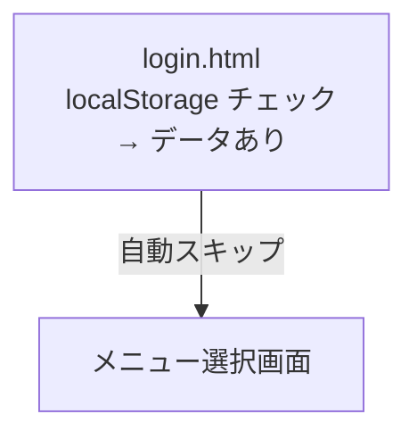

# MYP-3442【卸】ログイン画面実装

## 概要

Google 審査対応のため、ログイン認証を GAS 内蔵方式ではなく **AWS ホスティングの独立ドメイン** で実装する。  
ログイン後にメニュー選択画面（差し込み画面）を経由して GAS アプリへリダイレクトする。

---

## システム構成



---

## 認証シーケンス図



---

## 画面遷移フロー



### 再訪問時（localStorage にデータあり）



---

## 変更ファイル一覧

### 新規追加

| ファイル | 説明 |
|---|---|
| `src/login.html` | AWS ホスティング用ログイン＋メニュー選択 SPA |
| `src/be_auth.js` | GAS 側 POST API（トークン検証・BQ 照合） |

### 変更

| ファイル | 変更内容 |
|---|---|
| `src/be_config.js` | `GOOGLE_CLIENT_ID` を `setupScriptProperties()` と `getConfig_()` に追加 |
| `src/appsscript.json` | `access` を `"DOMAIN"` → `"ANYONE_ANONYMOUS"` に変更（外部フロントからの POST 対応） |
| `package.json` | `deploy:local` / `deploy:dev` / `deploy:prod` スクリプト追加 |

---

## 各ファイルの詳細

### `src/login.html`（新規）

AWS にデプロイする自己完結型の静的 HTML（SPA）。

**ページ構成:**
- **ページ1: ログインカード** — Google One Tap 認証ボタン、エラーバナー、ローディングスピナー
- **ページ2: メニュー選択（差し込み画面）** — 「請求履歴の確認」「請求の新規登録」の2カード

**主な機能:**
- `detectEnv()` でホスト名から環境（local/dev/prod）を自動判定
- `_configError` で GAS URL 未設定（`YOUR_PROD_DEPLOY_ID` のまま）を検知し、初期化を中断
- Google Identity Services（GIS）で One Tap ログイン
- `fetch` で GAS `doPost` に ID トークンを送信（`Content-Type: text/plain` で CORS プリフライト回避）
- `localStorage` には `wholesaler_name` のみ保存（機微情報を含めない）
- GAS へのリダイレクトは `window.location.replace()` + `?t=Date.now()` でキャッシュ回避

**コーディング規約対応:**
- `var` 不使用（全て `const` / `let`）
- メニューボタンは `<button type="button">` を使用（`<a>` ではなくアクセシビリティ対応）

### `src/be_auth.js`（新規）

GAS ウェブアプリの POST エントリーポイント。

**検証フロー:**
1. リクエストボディ存在チェック（`e.postData.contents`）
2. JSON パースの個別 try-catch
3. Google `tokeninfo` API でトークン検証（`encodeURIComponent` 適用）
4. `aud`（クライアントID）の一致検証（`GOOGLE_CLIENT_ID` 必須）
5. `email_verified` チェック
6. `fetchAccountInfoByEmail_(email)` で BQ アカウント照合

**エラーハンドリング:**
- 全パターンで JSON レスポンスを返却（例外で 500 にならない）
- `GOOGLE_CLIENT_ID` 未設定時は「サーバー設定エラー」を返却

**規約対応:**
- 内部関数は末尾アンダースコア（`jsonResponse_`）
- `var` 不使用（全て `const` / `let`）

### `src/be_config.js`（変更）

- `setupScriptProperties()` に `GOOGLE_CLIENT_ID` を追加
- `overwriteGoogleClientId()` ヘルパー追加
- `getConfig_()` に `googleClientId` を追加（取得・必須チェック・返却）

### `src/appsscript.json`（変更）

```json
// Before
"access": "DOMAIN"

// After
"access": "ANYONE_ANONYMOUS"
```

**理由:** AWS（外部ドメイン）からの `fetch` は Google 認証 Cookie を持たないため、`DOMAIN` のままだと GAS が未認証扱いで Google サインイン画面へリダイレクトしてしまう。認証は `doPost` 内の ID トークン検証で担保する。

---

## セキュリティ対策

| 対策 | 実装箇所 | 内容 |
|---|---|---|
| トークン検証 | `be_auth.js` | Google `tokeninfo` API でサーバー側検証 |
| aud チェック | `be_auth.js` | `GOOGLE_CLIENT_ID` との一致を必須検証 |
| email_verified | `be_auth.js` | 未確認メールアドレスのアカウントを拒否 |
| BQ 照合 | `be_auth.js` | 登録済みアカウントのみ許可 |
| localStorage 最小化 | `login.html` | `wholesaler_name` のみ保存（`fee_rate` 等の機微情報を含めない） |
| リクエスト検証 | `be_auth.js` | ボディ存在チェック + JSON パースの個別ガード |
| URL エンコード | `be_auth.js` | `encodeURIComponent(idToken)` |
| 設定未完了ガード | `login.html` | prod URL 未設定時にログインボタンを無効化 |
| CORS 回避 | `login.html` | `Content-Type: text/plain` でプリフライト回避 |

---

## 環境別設定

| 項目 | local | dev | prod |
|---|---|---|---|
| GAS デプロイ URL | 設定済み | 設定済み | `YOUR_PROD_DEPLOY_ID`（要設定） |
| OAuth クライアント ID | 共通 | 共通 | TBD（本番ドメイン承認後） |
| GAS access 設定 | ANYONE_ANONYMOUS | ANYONE_ANONYMOUS | ANYONE_ANONYMOUS |
| `GOOGLE_CLIENT_ID` Script Property | `setupScriptProperties()` で設定 | 同左 | GAS UI から直接設定 |

---

## デプロイ手順

### GAS 側

1. `npm run push:local`（または `push:dev`）で GAS にコードをプッシュ
2. GAS エディタで `setupScriptProperties(true)` を実行（`GOOGLE_CLIENT_ID` を含む全プロパティを設定）
3. GAS を「全員」アクセスでデプロイ

### AWS 側

1. `src/login.html` を S3 にアップロード（または Amplify 等）
2. CloudFront でカスタムドメインを設定
3. Google Cloud Console で本番ドメインを OAuth クライアントの承認済みオリジンに追加
4. `login.html` の `ENV_CONFIG.prod` に本番 GAS デプロイ URL を設定

---

## 残課題

- [ ] 本番 GAS デプロイ ID の設定（`ENV_CONFIG.prod`）
- [ ] 本番用 OAuth クライアント ID の確定（ドメイン承認後）
- [ ] AWS デプロイ（S3 + CloudFront）
- [ ] `detectEnv()` の開発環境ドメイン判定ロジック確定
