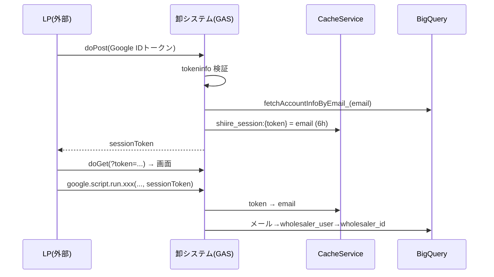
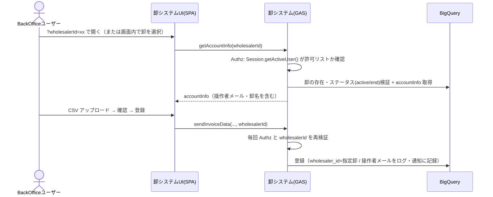

# BackOffice ユーザーによる卸データ CSV 登録 方式検討（最小変更案）

> ステータス: **履歴資料（方式検討の記録）**。実装仕様ではありません
>
> **確定仕様は次を参照してください**: `docs/design-bo-wholesaler-context-switch.md`（上位設計・決定事項 D-1〜D-15）、`docs/design-detail-supplier.md`（卸システム詳細設計）。
> 本書の初期推奨のうち、次は確定設計で置き換えられています。
> - 既存卸ユーザーの流用（§1・§5）→ 操作者本人の `wholesaler_user` 行を自動登録（D-3/D-4）
> - 許可リスト未設定時の拒否（fail-close、§6.1）→ dev は空リスト許容、prd は 1 件以上必須（D-9）
> - 引数名 `sessionToken` の維持（§4.3）→ `wholesalerId` に差し替え
> 作成日: 2026-10-02
> 対象: 卸システム（`shiire-poc-supplier`）/ BackOffice（`connect-backoffice-gas-poc`）
> 本書は旧 2 ドキュメント（初版・v2）を統合し、論点を「**現状実装からの変更を最小にして、BackOffice ユーザーだけが卸のデータとして CSV をアップロードし BQ へ登録できるようにする方法**」に絞って再構成したもの。

---

## 1. 結論

1. **LP は使わない**前提のため、LP / `doPost` / ID トークン検証 / `CacheService` セッションは**すべて不要**になる。認証は BackOffice と同じ `Session.getActiveUser()` + 許可リスト（`ALLOWED_DOMAINS` / `ALLOWED_EMAILS`）に統一する。
2. 現行コードは**卸の特定が `getServerAccountInfo_` の 1 箇所に集約**されており、しかも**すでに `Session.getActiveUser()` で動く経路を持っている**（組織内アカウント用フォールバック）。そのため、変更の本質は「**BackOffice ユーザーに、どの卸の `accountInfo` を返すか**」を決める部分だけ。CSV 検証・マッピング・BQ 登録・Drive 保存・再請求などの中核ロジックはそのまま使える。
3. 卸の切替（コンテキストスイッチ）は、サーバーにセッション状態を持たない **ステートレス方式**（卸 ID を毎回クライアントから送り、サーバーで BackOffice 権限と卸の実在を再検証）にする。複数タブ競合・Cache 揮発・トークン管理の問題が発生しない。
4. **推奨は「案 B: 別 GAS のまま BackOffice 認証へ置換 + `wholesalerId` 指定」**。BackOffice の GAS プロジェクトへのコード統合は必須ではなく、後から追加で実施できる。
5. 唯一の実質的な設計論点は **`wholesaler_user_id`（NOT NULL・FK）と監査（誰が登録したか）**。最小案では既存の卸ユーザー行を流用し、操作者メールをログ・Slack に残す。

---

## 2. 要件と前提

| # | 内容 |
|---|------|
| R1 | 卸ユーザーは卸システムを操作しない（BackOffice の社員のみが利用） |
| R2 | BackOffice ユーザーが卸を切り替えて（コンテキストスイッチ）操作する |
| R3 | 切り替えた卸のデータとして、CSV をアップロードし BQ へ登録できる |
| R4 | 現状実装からの変更を最小にする |
| R5 | **LP は使わない**（確定） |
| 前提 | 運用上、Google Drive 上のフォルダを揃える程度で、GAS プロジェクト・リポジトリは別のままでもよい（案 B はこの前提で成立する） |

---

## 3. 現状実装の要点（調査結果）

### 3.1 現在の認証・卸確定の流れ

### 3.2 変更範囲を小さくできる根拠

| # | 事実 | 場所 | 意味 |
|---|------|------|------|
| E1 | 全公開関数が `getServerAccountInfo_('', sessionToken)` で卸を確定し、`accountInfo.wholesaler_id` を SQL に使う | `be_server.js` / `be_invoice.js` | **卸確定ポイントは 1 箇所**。ここを差し替えれば全機能に反映される |
| E2 | `wholesaler_id` / `wholesaler_user_id` はクライアントから受け取らずサーバー側で確定する設計（改ざん防止） | `be_invoice.js` の `wsId` / `wsUserId` | 新方式でも「クライアント値を信用せず再検証する」原則を守る |
| E3 | `getServerAccountInfo_` に**メール未取得時に `Session.getActiveUser().getEmail()` を使うフォールバック**が既にある | `be_server.js` | BackOffice 認証との相性が良く、新規実装が少ない |
| E4 | `sessionToken` を受け取る公開関数は 10 個＋`getAccountInfo`＋`reportClientError`。フロントの `getSessionToken_()` 呼び出しは 14 箇所 | `be_invoice.js` / `be_server.js` / `be_slack.js` / `fe_js_common.html` ほか | 引数の**意味を差し替える**だけなら、これらの関数・呼び出し側のシグネチャ変更は不要 |
| E5 | `getConfig_()` の必須プロパティは `DRIVE_ROOT_FOLDER_ID` / `GCP_PROJECT_ID` / `BQ_DATASET_ID` のみ。`LP_URL` / `OAUTH_CLIENT_ID` は任意 | `be_config.js` | LP 廃止でも設定エラーにならない |
| E6 | `wholesaler_invoices.wholesaler_user_id` は **NOT NULL ＋ FK → wholesaler_user(id)** | BackOffice `docs/bigquery/schema_tables.md` T005 | BackOffice ユーザーは `wholesaler_user` にいないため、最小案では既存卸ユーザーを流用する必要がある |
| E7 | `wholesaler_user` は `id` / `wholesaler_id` / `wholesaler_email` / `registration_at` / `deleted_at`（`created_at` なし） | 同 T002 | 流用する行を決定的に選ぶには `ORDER BY registration_at, id` を使う |
| E8 | `wholesaler_id` は INT64。コード側も `Number(accountInfo.wholesaler_id)` で扱う | `be_invoice.js` | 受け取る卸 ID は **数字のみ**を許可する形式検証が容易 |

### 3.3 BackOffice 側の実装（参照）

| 項目 | 内容 |
|------|------|
| 認証 | `Session.getActiveUser().getEmail()` + `Authz.requireAuthorizedUser()`（`CONFIG.ACCESS` の `ALLOWED_DOMAINS` / `ALLOWED_EMAILS`）。ログイン画面なし |
| 公開形態 | `executeAs: USER_DEPLOYING` / `access: DOMAIN` |
| 監査 | 操作者メールを `operation_updated_by` / `final_updated_by` に記録 |
| BQ | 卸システムと同じ `connect_db` を使用。全卸分の請求を既に一覧・詳細表示している |
| デプロイ | `deploy.yml`（main→本番 / develop→開発の Script ID を Secrets で切替） |

---

## 4. 方式案

方式は 2 つの軸で整理できる。

- **軸 1: 認証と卸の確定の仕方**（案 A〜E）
- **軸 2: 卸をどこで指定するか**（§4.7）

### 4.1 案の一覧（変更が小さい順）

| 案 | 概要 | 変更量 | 判定 |
|----|------|--------|------|
| **A** | 卸ごとの代理 Google アカウントを `wholesaler_user` に登録し、社員がそのアカウントでログイン | コード 0 | ✕（運用負担・監査不可） |
| **B** | **別 GAS のまま** BackOffice 認証に置換し、`wholesalerId` で卸を指定（ステートレス） | **小** | **◎ 推奨** |
| **C** | B + BackOffice の GAS プロジェクトへコード統合 | 中 | △（B の後に任意で実施） |
| **D** | BackOffice に CSV アップロード機能を移植 | 大 | ✕ |
| **E** | ライブラリ化 / バッチ取込 | 中〜大 | ✕ |

### 4.2 案 A: 卸ごとの代理アカウントでログイン（参考）

- 卸ごとに共有 Google アカウントを作り、`wholesaler_user` に登録。社員がそれでログインする。
- **コード変更は 0**。ただし、
  - 誰が操作したか分からない（監査不可）
  - 卸の数だけアカウントを作成・管理する必要があり、切替のたびに Google アカウントを切り替える
  - 現行のログイン導線（LP）も必要
- 今回の要件（BackOffice ユーザーの識別・LP 不使用）に合わず、**不採用**。

### 4.3 案 B: BackOffice 認証 + `wholesalerId` 指定（推奨）

#### 概要
- 卸システムは**別 GAS プロジェクトのまま**。
- 認証を BackOffice と同じ `Session.getActiveUser()` + `Authz` に統一する。
- 卸は **`wholesalerId` で毎回指定**し、サーバーが BackOffice 権限と卸の実在を再検証して `accountInfo` を組み立てる。

#### 変更箇所（卸システム側）

| 対象 | 変更内容 | 規模 |
|------|---------|------|
| `appsscript.json` | `webapp.access` を `ANYONE` → `DOMAIN`（BackOffice と同じ）。`oauthScopes` は変更しない（`script.storage` は `PropertiesService.getScriptProperties()` の設定取得で引き続き必要） | 小 |
| `be_main.js` `doGet` | `Authz.requireAuthorizedUser()` を追加（BackOffice の `Authz` を移植）。許可外は 403。`?wholesalerId=` をテンプレートへ注入（現在の `?token=` 注入を置換） | 小 |
| `be_server.js` `getServerAccountInfo_` | ① 操作者メールを `Session.getActiveUser()` で取得 → 許可リスト検証 ② 受け取った値（これまでの `sessionToken` の位置）を **`wholesalerId` として形式検証（数字のみ）** ③ `fetchAccountInfoByWholesalerId_` で `accountInfo` を取得 ④ `operatorEmail` を `accountInfo` に付与 | 中（本体） |
| `db_bq_query.js` | `fetchAccountInfoByWholesalerId_(wholesalerId)` を追加（`fetchAccountInfoByEmail_` の SQL の WHERE を `w.id = @wholesalerId` へ。`wholesaler_user_id` は §5 のルールで 1 件決定） | 小 |
| `be_auth.js` | `doPost` / `jsonOutput_` を削除 | 削除 |
| `be_server.js` | `getLogoutUrl` / `getLoginUrl` を削除（LP 廃止） | 削除 |
| `be_config.js` | `lpUrl` / `oauthClientId` を削除（任意）。`ALLOWED_DOMAINS` / `ALLOWED_EMAILS` の読み込みを追加 | 小 |
| `be_invoice.js` | **ほぼ無改修**（E4: 引数の意味が変わるだけ）。登録・再請求などの開始ログに `operatorEmail` を追記 | 小 |
| `be_slack.js` | エラー通知に操作者（BackOffice ユーザー）を追加 | 小 |
| フロント `fe_js_common.html` | `getSessionToken_()` の取得元を「URL の `wholesalerId`（sessionStorage にタブ単位で保持）」に変更。ログアウト導線・エラー画面の「ログインページへ戻る」を撤去または BackOffice へのリンクに変更。ヘッダーに「〇〇として操作中」表示 | 小〜中 |
| フロント `fe_js_upload.html` | 登録前の確認ダイアログに卸名を表示 | 小 |
| テスト | `getServerAccountInfo_` 周辺の認証・卸確定の単体テスト追加（既存の `be_invoice.test.js` は `getServerAccountInfo_` をスタブしているため影響は限定的） | 小 |

> 引数名が `sessionToken` のままだと意味が分かりにくい。**最小変更では名前を保ったまま意味を差し替え**、後続の別 PR で `wholesalerId` へ機械的にリネームするのを推奨（リスク分離）。

#### メリット
- **変更が小さい**（本質は `getServerAccountInfo_` と認証部分）。CSV 検証・登録・再請求ロジックは無改修
- ステートレスなので、**複数タブで別の卸を同時に操作しても競合しない**。サーバーに状態がないため Cache 揮発の問題もない
- 別 GAS のままなので、**デプロイ・障害・実行クォータが BackOffice と分離**される
- `ANYONE` 公開・LP・`doPost` を廃止でき、**公開面が縮小**（セキュリティ向上）
- 後から案 C（統合）へ段階移行できる

#### デメリット / リスク
- `Authz`（許可リスト）が 2 つのプロジェクトに存在し、`ALLOWED_EMAILS` の**二重管理**になる
- URL が BackOffice と卸システムで 2 系統（遷移は別タブ）
- 「誰がどの卸として登録したか」は最小案では DB ではなくログ・Slack に残る（§5）

#### 工数感: **小**

---

### 4.4 案 C: 案 B + BackOffice の GAS プロジェクトへコード統合（任意）

#### 概要
案 B の実装を済ませた上で、卸システムのコードを BackOffice のプロジェクト（同一 Script ID・同一デプロイ）に取り込む。URL とデプロイを 1 本にしたい場合の選択肢。

#### 衝突調査の結果

| 区分 | 結果 |
|------|------|
| サーバー側トップレベル識別子 | 衝突は **`doGet` と `include` のみ**（両者の `be_main.js`）。それ以外は命名流儀が異なり衝突しない（BackOffice: `CONFIG` / `Authz` / `BqLib` / `AppError` / `SlackNotifier`、卸: `getConfig_` / `logError_` / `success_` ほか） |
| ファイル名 | **11 件衝突**: `appsscript.json` / `be_main.js` / `be_config.js` / `be_utils.js` / `db_bq_connection.js` / `db_bq_query.js` / `fe_index.html` / `fe_css.html` / `fe_part_header.html` / `fe_page_home.html` / `fe_page_detail.html` |
| Script Properties | `BQ_PROJECT_ID`(BO) vs `GCP_PROJECT_ID`(卸)、`APP_ENVIRONMENT` vs `ENV`、`BQ_LOCATION` の未設定時 `US`(卸) vs 固定 `asia-northeast1`(BO) 等。統合時に統一が必要 |
| `appsscript.json` | 卸が追加で必要なスコープ: `drive`（Drive 保存）。追加すると**デプロイ者の再認可**が必要 |
| CI | 卸の `unit_tests.yml`（`node --test test/`）/ `bq_integrity_check.yml` の移植が必要 |
| 実行リソース | 実行時間・クォータ（UrlFetch / BQ / Drive）が BackOffice と共有される。デプロイの爆発半径も拡大 |

#### 判断
- 実益は「URL・デプロイの一本化」「`SlackNotifier` / `BqLib` の再利用」。
- **要件（BackOffice ユーザーが卸を切り替えて CSV 登録）自体には統合は不要**。必要になったら案 B の完了後に、ファイル移動・リネームと `doGet` のルーティング統合（`?app=supplier`）で対応する。

#### 工数感: **中**（案 B に加算）

---

### 4.5 案 D: BackOffice に機能を移植（非推奨）

- 移植対象は `be_invoice.js`（約 2,200 行）、`be_csv_mapper.js`（約 1,500 行）、フロント JS（約 5,500 行超）、テスト、Slack 通知、Drive 保存など。BackOffice 本体（約 7,600 行）に対して大きく、`be_logic.js` / `fe_js.html` の肥大化を招く。
- 案 B で同じ目的を満たせるため、**不採用**。

### 4.6 案 E: ライブラリ化 / バッチ取込（非推奨）

- **ライブラリ化**: GAS ライブラリは HTML テンプレートと `google.script.run` の公開関数を持てず、UI を含む共有に不向き。サーバーロジックのみ共有する用途でも、バージョン固定・権限の運用コストが見合わない。
- **バッチ取込**（Drive に置いた CSV をトリガーで取り込む）: プレビュー確認・即時エラー表示ができず UX が大幅に後退。

### 4.7 軸 2: 卸をどこで指定するか（案 B・C 共通）

| 方式 | 内容 | BackOffice 側の変更 | 卸システム側の追加 |
|------|------|--------------------|-------------------|
| **(i) BackOffice からのリンク** | BackOffice の卸請求一覧/詳細に「CSV 登録」リンク（`<卸システムURL>?wholesalerId=xx`）を追加 | リンク追加のみ | なし |
| **(ii) 卸システム内の卸選択画面** | 起動時に卸一覧から選択（`listWholesalers()` を新設、`Authz` 保護）。選択を sessionStorage（タブ単位）に保持 | **なし** | 選択画面 + `listWholesalers()` |
| (iii) 併用 | リンクがあればそれを使い、なければ選択画面 | リンク追加 | 選択画面 |

- 「卸システム側だけで完結させたい」→ (ii)、「誤操作を減らしたい（卸を選んだ状態で遷移）」→ (i) が向く。
- (i) は卸 ID を BackOffice 画面が既に保持しているため実装が容易。(ii) は BackOffice を触らずに済むが、卸の取り違えには注意が必要（§6）。
- 最小変更の観点では **(i)**、BackOffice に手を入れられない場合は **(ii)**。

---

## 5. 監査・`wholesaler_user_id` の扱い

請求登録時に `wholesaler_user_id`（NOT NULL・FK → `wholesaler_user(id)`）を書き込んでいる（E6）。BackOffice ユーザーは `wholesaler_user` に存在しない。

| 選択肢 | 内容 | 評価 |
|--------|------|------|
| **① 既存の卸ユーザーを流用（最小・推奨）** | 指定卸の `wholesaler_user`（`deleted_at IS NULL`）のうち `ORDER BY registration_at, id` で先頭の 1 件を使う。**実操作者（BackOffice のメール）は `logInfo_` / Slack 通知に記録**（DB スキーマ変更なし） | スキーマ変更ゼロ。ただし卸に `wholesaler_user` が 1 件もいないと登録できない（事前に確認） |
| ② 代行専用のダミー卸ユーザーを卸ごとに作成 | `backoffice@<卸>` 的な行を `wholesaler_user` に登録して流用 | 「代行登録」を行単位で識別できるが、ダミー行の運用が増える |
| ③ スキーマ変更（`wholesaler_user_id` を NULL 許容 + 操作者メールのカラム追加） | BackOffice の `operation_updated_by` と同じ流儀で操作者を DB に記録 | 最も正確。BackOffice 側のマイグレーション運用（`db/bigquery/migrations`）・既存クエリへの影響確認が必要 |
| ④ 操作ログ専用テーブルを新設 | 登録・再請求・取り下げ等のイベントを記録 | 本体影響なし。実装量増 |

- **最小変更は①**。DB で操作者を追跡したい要件が出たら③または④へ拡張する。
- 確認事項: 全卸に `wholesaler_user` が存在するか（BQ で事前チェック）。

---

## 6. セキュリティ・誤操作防止

### 6.1 セキュリティ
- **全公開関数で毎回** `Authz` と `wholesalerId` の再検証を行う（`getServerAccountInfo_` に集約するため漏れにくい）。
- `wholesalerId` は**形式検証（数字のみ）+ BQ 存在確認 + ステータス（`active` / `end`）確認**。クライアント値をそのまま SQL へ埋め込まない（既存 SQL は `Number()` 変換 + 文字列連結のため、検証を通した値のみを `accountInfo` 経由で使う）。
- 許可リストは `ALLOWED_DOMAINS` / `ALLOWED_EMAILS` を Script Properties で管理。**空配列＝全員許可**という BackOffice 現行の挙動は、卸システムでは危険なので、**卸システムでは許可リスト未設定時はアクセス拒否**（フェイルクローズ）とすることを推奨。
- `access: DOMAIN` への変更により、外部ドメインの利用者は到達できなくなる。

### 6.2 誤操作防止（卸の取り違え）
- ヘッダーに**卸名・卸 ID を常時表示**し、BackOffice と見分けのつく配色にする。
- CSV 送信前の確認ダイアログに**卸名を明記**（「〇〇として登録します」）。
- 卸切替時は画面状態（アップロード済みデータ・確認画面のデータ）を破棄する。
- CSV 内の情報（加盟店コード等）と選択卸の `wholesaler_merchants` との整合性を突合し、不一致なら警告（現行のマッピング検証を活用）。
- 軸 2 の方式 (i) を使えば「卸を選択済みの BackOffice 画面から遷移」するため、取り違えが起きにくい。

---

## 7. 運用・デプロイ

| 項目 | 内容 |
|------|------|
| GAS プロジェクト | 別のまま（案 B）。Script ID・デプロイ URL・CI は現行を継続 |
| Drive | 監査証跡 CSV の保存先 `DRIVE_ROOT_FOLDER_ID` は現行のまま使える。BackOffice と同じ Drive 配下に揃えるのは運用上の整理であり、**コード・デプロイには影響しない** |
| Script Properties | 追加: `ALLOWED_DOMAINS` / `ALLOWED_EMAILS`（BackOffice と同値）。削除可: `LP_URL` / `OAUTH_CLIENT_ID` |
| `appsscript.json` | `access: DOMAIN` へ変更（**デプロイ設定変更 = 再デプロイが必要**） |
| 開発 / 本番 | 現行の `.clasp-{local,dev,prod}.json` を継続 |
| ドキュメント | `docs/specifications/05_common.md`（認証・ルーティング）、`06_user_guide.md`（利用者が社員に変わる）、`07_test_scenarios.md`、`docs/SETUP.md` を更新 |

### 7.1 切替リリースの流れ（案）
1. 認証・卸指定の実装を開発環境へデプロイし、`ALLOWED_*` を設定して検証
2. BackOffice へリンク追加（方式 (i) の場合）
3. 本番に反映（`access` を `DOMAIN` へ変更）
4. 卸ユーザー向け LP・ログイン導線を停止（本件の対象外だが、タイミングは調整が必要）

---

## 8. 比較（総括）

| 観点 | A: 代理アカウント | **B: BO認証+wholesalerId** | C: B+統合 | D: 移植 | E: ライブラリ/バッチ |
|------|------------------|---------------------------|----------|--------|--------------------|
| 変更量 | コード 0 | **小** | 中 | 大 | 中〜大 |
| BackOffice ユーザーの識別 | ✕ | ◎ | ◎ | ◎ | ○ |
| LP 不要 | ✕ | ◎ | ◎ | ◎ | ◎ |
| 既存ロジック流用 | ◎ | ◎ | ◎ | △ | △ |
| 複数卸の同時操作 | ✕ | ◎ | ◎ | ◎ | ◎ |
| 障害・デプロイの分離 | ◎ | **◎** | ✕ | ✕ | ○ |
| UX（プレビュー・即時エラー） | ◎ | ◎ | ◎ | ◎ | バッチは ✕ |
| 運用負担 | 大 | 小 | 小 | 中 | 中 |

---

## 9. 確認したい事項

| # | 確認事項 | 影響 |
|---|---------|------|
| 1 | **差戻し → 卸の再申請（RETURNED）フロー**を、BackOffice が再アップロードする形に変えてよいか（BackOffice の「再申請待ち」表示・文言・ステータス遷移の見直し要否） | 業務・文言 |
| 2 | 卸の指定方法は **(i) BackOffice リンク / (ii) 卸システム内の選択画面 / (iii) 併用** のどれか | 実装範囲・BackOffice 改修の要否 |
| 3 | 全卸に `wholesaler_user` が存在するか（①の前提） | 案 B の登録可否 |
| 4 | 操作者を **DB に残す必要があるか**（ログ・Slack のみで十分か） | §5 の①〜④ |
| 5 | BackOffice 全員が全卸を代行登録してよいか（担当卸・ロールの制限が必要か） | 権限粒度 |
| 6 | 許可リストの運用（BackOffice と同じ `ALLOWED_*` を二重管理するか、共通化したいか） | 運用 |
| 7 | 卸ユーザー向け LP・ユーザーガイドの廃止タイミング | リリース計画 |
| 8 | URL / デプロイを 1 本に統合したい要望があるか（ある場合のみ案 C） | 案 C の要否 |

---

## 10. 実装ステップ（案 B）

1. 確認事項（§9）の合意（特に #1 差戻しフロー、#2 指定方法、#3 `wholesaler_user` の有無）
2. `Authz`（許可リスト）の移植、`doGet` の認証化、`access: DOMAIN` 化
3. `fetchAccountInfoByWholesalerId_` 追加、`getServerAccountInfo_` を操作者メール + `wholesalerId` 方式へ変更（引数の意味差し替え）
4. 不要コードの削除（`doPost` / `getLogoutUrl` / `getLoginUrl` / LP・OAuth 設定）
5. フロント: 卸 ID の取得元変更、卸名バナー、登録前の確認ダイアログ、ログアウト導線の撤去
6. 操作者メールのログ・Slack 通知への追加
7. BackOffice へ「CSV 登録」リンク追加（方式 (i)）または卸選択画面の実装（方式 (ii)）
8. テスト（認証・許可外・不正な `wholesalerId`・存在しない/停止卸・他卸への越権・既存の CSV 登録の回帰）とドキュメント更新
9. 開発環境で検証 → 本番反映
10. （任意）引数名 `sessionToken` → `wholesalerId` の機械的リネーム、案 C（統合）の検討

---

## 11. 案 B ボトルネック・課題一覧（コード調査結果）

案 B 採用を前提に、登録・表示・BackOffice 連携の 3 領域を実コードで調査した結果。重大度は 🔴 致命（着手前に決める）/ 🟠 高（実装で必ず対処）/ 🟡 中 / 🟢 低。「推測」と書いたもの以外はコードで確認した事実。

### 11.1 致命級（着手前に決める）

| ID | 論点 | 内容 | 対処 |
|---|---|---|---|
| X-1 | 自己承認（職務分掌） | BO の承認・差戻し・取り下げ審査（`be_logic.js` 各 API）は操作者メールを取るだけで「登録者本人か」を照合しない。代理登録した社員が同じ案件を承認できる | 登録者≠承認者のルール化（運用 or システム強制）。取り下げ審査も同様 |
| X-2 | `wholesaler_user_id` 流用で監査が壊れる | 値は `wholesaler_invoices.wholesaler_user_id` と `store_invoices.final_updated_by` に入り、BO の再計算でも引き継がれる。BO 担当者の操作が「卸ユーザーの操作」として残る。取り下げ・取消・変更なし再請求の UPDATE は操作者を一切記録しない（`be_invoice.js` 1734-1741 / 1834-1845 / 1961-1968） | 代理登録者メール等の監査列追加（migration 要）、または卸ごとの BO 代理専用 service user を固定。任意既存ユーザー流用は禁止 |
| X-3 | 有効な `wholesaler_user` が 0 件の卸は登録不能 | `deleted_at IS NULL` が前提（`db_bq_query.js` 26-87）。seed は各卸 1 ユーザーだが本番実データは未確認 | 本番で全卸の有効ユーザー件数を確認。無い卸は代表ユーザーを投入 |
| X-4 | `wholesalerId` をクライアント指定にする越権 | 全公開関数の認可は `getServerAccountInfo_` の結果の `wholesaler_id` 一本に依存。存在確認だけでは不十分 | 全公開関数の唯一の入口にし、毎回 ①`Session.getActiveUser()` ②許可リスト ③ID 形式（`/^\d+$/`）④卸の実在・ステータスを検証。SQL 側の `wholesaler_id` 絞り込みは現状概ね入っている |
| X-5 | iframe 内での卸切替 | GAS は iframe で動くため URL クエリは `doGet(e).parameter` 経由のみ。現状は `window.__SESSION_TOKEN__` しか注入しない。SPA はハッシュのみ参照（`parseHash`） | 切替は `?wholesalerId=xx#home` へのトップレベル遷移（フルリロード）に固定。`doGet` で `wholesalerId` をテンプレート注入 |
| X-6 | 旧卸が新卸に勝つ | `getSessionToken_()` は `sessionStorage` を URL 注入値より優先（`fe_js_common.html:241-260`）。同一タブで切替しても旧卸のまま操作が続く | 切替時に必ず削除、優先順位を URL 注入値 > storage に変更。`currentWholesalerId` を別管理 |

### 11.2 登録まわり（🟠）

| ID | 内容 | 場所 | 対処 |
|---|---|---|---|
| R-1 | `accountInfo` 組み立て SQL を `wholesaler_id` 指定にすると wholesaler_user × 加盟店の直積になり、`rows[0].wholesaler_user_id` が呼び出しごとに揺れる（`ORDER BY` なし） | `db_bq_query.js:26-87` | 代表ユーザーを別 CTE で `ORDER BY registration_at, id LIMIT 1` と決定的に選ぶ |
| R-6 | 新規請求の「今月登録済み」判定（`hasCurrentMonthInvoice_`）がトランザクション外。`LockService` なし。BO 担当者 2 人の同時アップロードで同月二重登録 | `be_invoice.js:1538-1633` | `wholesalerId+YYYYMM` 単位の `LockService`、トランザクション内再確認 |
| R-7 | 再請求は旧データを事前読込して新親金額を計算。`is_latest=FALSE` の UPDATE に `@@row_count` 検証なし。並行再請求で親金額がズレる | `be_invoice.js:701-779, 949-974, 1405-1443` | 親請求単位ロック、SQL 内で現在値から再計算、更新件数検証で rollback |
| R-8 | 新規請求は有効加盟店のみ（`merchant_mappings`）、再請求は履歴ベースと 2 系統。組み立て変更時に潰すと新規で停止店を通す／再請求が失敗 | `be_invoice.js:522-536, 847-907, 1277-1365` | 2 系統を維持 |
| R-9 | 再請求時の `customer_code` が最新 `wholesaler_merchants` 由来で請求時点のスナップショットではない（マッピング変更後に失敗しうる。一部推測） | `db_bq_query.js:200-232` | 履歴に customer_code を保存、または再請求時の挙動を明文化 |

### 11.3 登録まわり（🟡）

| ID | 内容 | 対処 |
|---|---|---|
| R-4/R-11 | ログ・Slack が卸名・account_id 中心で操作者が特定できない。`reportClientError` はクライアント送信の卸名を信用（`be_slack.js:319-326, 558-586`） | server-side の active email を log/Slack context に付与。FE エラーはサーバーで補完 |
| R-10 | Drive 監査 CSV に操作者が残らない。実オーナーは deployer（`executeAs: USER_DEPLOYING`） | ファイル名/description に operatorEmail。フォルダ名は wholesaler_id 主体 |
| R-12 | `doPost`/`OAUTH_CLIENT_ID`/Cache セッション/`LP_URL`/ファビコン（`be_assets.js`）が残る | 認証切替は一括で（`access: DOMAIN`、死コード撤去、導線差替、favicon 独立 URL 化） |
| R-13 | 既存テストは `getServerAccountInfo_` スタブ固定。許可リスト・ID 検証・代表ユーザー選択のテストなし | 単体テスト追加（0 件/複数件/end 卸含む） |

### 11.4 表示まわり

| ID | 重大度 | 内容 | 対処 |
|---|---|---|---|
| F-4 | 🟠 | 卸依存状態が単一キー/グローバルに散在。`shiire_wholesaler_*`、`invoice_fee_rate`、`tax_rounding_method`、`merchant_mappings`、`csv_format_rules`、`invoices_cache`、`schedule_cache_*`、`parsedData`、`resubmit_handover_matter`、`session_token` に加え、メモリ上の `rawCsvBase64`/`utf8CsvBase64`/`parsedData`/`_scheduleLoaded`/`scheduleMap`/`_detailCurrentInvoiceId`/`_isResubmitConfirm`、開いているモーダル | 切替関数で storage + メモリ + モーダルを全消去してからフルリロード |
| F-3 | 🟠 | 卸選択画面が存在しない（5 画面のみ）。起動直後に `getAccountInfo` を呼ぶため `wholesalerId` なしで入る方式 (ii) は不成立 | `#select-wholesaler` 相当を追加。「認証 → 卸選択 → コンテキスト確定」の順に |
| F-5 | 🟠 | 卸名はヘッダー短縮表示のみ。確認画面は `wholesalerName` を読むが本文に未表示 | 全画面固定バナー「〇〇（ID:xx）として操作中」、送信前ダイアログに卸名・ID |
| F-6 | 🟠 | `shiire_invoices_cache` に卸 ID キーがない。A→B 切替後に A の履歴で「今月登録済み」判定（`fe_js_home.html:31-47`, `fe_js_upload.html:328-333`） | キーに卸 ID、または切替時削除。アップロード前に再取得 |
| F-7 | 🟡 | `_scheduleLoaded` が卸非依存の単一 bool。切替後に受付期間判定が旧データのまま | 卸単位化 or リセット、取得完了までアップロード無効化 |
| F-8 | 🟡 | `saveAccountInfo` が 1 つの try で複数 `setItem`。大きい卸で `QuotaExceeded` になると新旧混在 | 保存前に旧コンテキスト削除、サイズ監視、整合性チェック |
| F-9 | 🟡 | FE が `wholesaler_status==='end'` を一律ブロック。BO 代行で停止卸の後処理を許すか要件と衝突 | 要件確認。最終判断はサーバー側に |
| F-10/11 | 🟡 | エラー文言が「登録が見当たりません」「再ログイン」前提。ログアウト/「ログインページへ戻る」が LP 依存 | エラー種別を分離（forbidden_user/wholesaler_missing/invalid/inactive/system）、導線を「BO へ戻る/卸を選び直す」に |
| F-12 | 🟡 | 画面内切替をクエリに乗せないと、戻る/進む/ブックマークで卸が復元されない | 常に `?wholesalerId=...#route` へ遷移し、切替時は `#home` に戻す |
| F-13 | 🟡 | `shiire_resubmit_handover_matter` がグローバル保存で他卸に混入 | キーに卸 ID+請求 ID、または切替/離脱時削除 |
| F-15 | 🟡 | `access: DOMAIN` では未ログイン/権限外/別アカウント時、SPA 起動前に Google のアクセス拒否画面で止まる。複数アカウントで `Session.getActiveUser()` がズレる既知問題（一般知識に基づく推測） | 手順書で利用アカウント固定を明示、BO から別窓遷移 |
| F-14 | 🟢 | ヘッダーが卸名を読み上げない、`alert()` が対象卸を含まない | `aria-label`、卸名入りモーダル/トースト |

### 11.5 BackOffice 連携・業務・運用

| ID | 重大度 | 内容 | 対処 |
|---|---|---|---|
| B-3 | 🔴 | BO が新版 `wholesaler_invoices` を作る処理も `target_wi.wholesaler_user_id` を引き継ぐ（`db_bq_query.js:1256-1269, 1366-1421`） | `wholesaler_user_id` の意味（代表 ID）を設計書に明記 |
| B-6 | 🟠 | 両システムの仕様・文言・ユーザーガイドが「卸が申請 → BO が審査」の二者前提（「差戻し中=卸の再申請待ち」等） | 責務定義・運用手順・教育資料の全面見直し |
| B-7 | 🟠 | 取り下げ依頼（`WITHDRAW_REQUESTED`）の依頼者と審査者が同一人物になりうる | 承認と同様に分掌制御の対象に |
| B-8 | 🟡 | BO は一覧/詳細で `wholesaler_id` を保持しており deep link は実装可能（既存の無効な「CSV 一括アップロード」ボタン置換が候補）。卸システム URL を環境別 Script Property で持つ必要 | BO に `SUPPLIER_APP_URL` を追加 |
| B-9/10 | 🟡 | `doGet` は `?wholesalerId=` を受けられるが、以後の RPC でも毎回サーバー再検証が必要。BO 画面にも操作者と対象卸の明示が必要 | doGet は初期値のみ、本処理は毎回検証 |
| B-11/12 | 🟡 | BO 側は操作者メール・卸・請求 ID を通知に出せるが、卸システム側 Slack は出さない | 卸システム側ログ/通知の粒度を揃える |
| B-13 | 🟡 | `access`、認証方式、Script Properties が別物。`ALLOWED_*` の二重管理、`LP_URL`/`OAUTH_CLIENT_ID` 廃止、再認可・再デプロイが必要 | 手順書化。許可リスト空は拒否（BO の `Authz` は空で全許可 = fail-open なので踏襲しない） |
| B-14 | 🟡 | `bq_integrity_check` は `wholesaler_user_id → wholesaler_user.id` の FK を検証 | 代表ユーザー選定ロジックの整合性を検証対象に |
| B-15 | 🟢 | 監査列追加は BQ の制約変更がしにくい。migration/schema/integrity check を同時更新 | `db/bigquery/migrations` 運用に従う |
| 追加 | 🟡 | BO「再申請待ち」の解消手段が卸システムの再アップロードのみ。`WITHDRAW_REQUESTED` は TOP 集計で特殊扱いのため意味の再説明が必要 | 運用設計に含める |

### 11.6 優先順位と先に決めること

1. 代理登録者を DB に恒久記録するか（例: `registered_by_operator_email` 列）。しない場合はログ/Slack のみで監査要件を満たせるかの合意が必要。
2. 登録者と承認者の分離をルール化するか、システムで強制するか。
3. 本番で全卸に有効な `wholesaler_user` があるか確認し、無い卸には代表ユーザーを投入する。
4. `end` 卸・差戻し再申請・取り下げ審査の BO 代行時の扱い。
5. 実装の必須項目: `getServerAccountInfo_(wholesalerId)` の唯一入口化／切替をフルリロード＋全キャッシュ消去＋URL 注入値優先／卸名バナーと送信前確認／新規・再請求のロック／代表ユーザー決定的選択／LP・doPost・OAuth 撤去と `access: DOMAIN`／テスト追加。

## 付録: 調査で確認した事実

| 内容 | 場所 |
|------|------|
| 卸確定の集約ポイント / Session フォールバック | `src/be_server.js` `getServerAccountInfo_` |
| メール→卸の BQ 照会 | `src/db_bq_query.js` `fetchAccountInfoByEmail_` |
| 登録時に `wholesaler_id` / `wholesaler_user_id` を使う箇所 | `src/be_invoice.js`（`wsId` / `wsUserId`、INSERT 句） |
| LP 関連 | `src/be_auth.js` `doPost`、`src/be_server.js` `getLogoutUrl` / `getLoginUrl`、`src/be_config.js`（`LP_URL` / `OAUTH_CLIENT_ID`） |
| セッショントークンの注入・保持 | `src/be_main.js` `doGet`、`src/fe_js_common.html` `getSessionToken_` |
| BackOffice の認証 | `connect-backoffice-gas-poc/src/be_utils.js`（`Authz`）、`be_main.js`、`be_config.js` |
| BackOffice のデプロイ設定 | `src/appsscript.json`（`access: DOMAIN`）、`.github/workflows/deploy.yml` |
| スキーマ | BackOffice `docs/bigquery/schema_tables.md`（T001 / T002 / T005） |
| 識別子・ファイル名の衝突 | 両リポジトリの `src/` を比較（識別子: `doGet` / `include` のみ、ファイル名: 11 件） |
