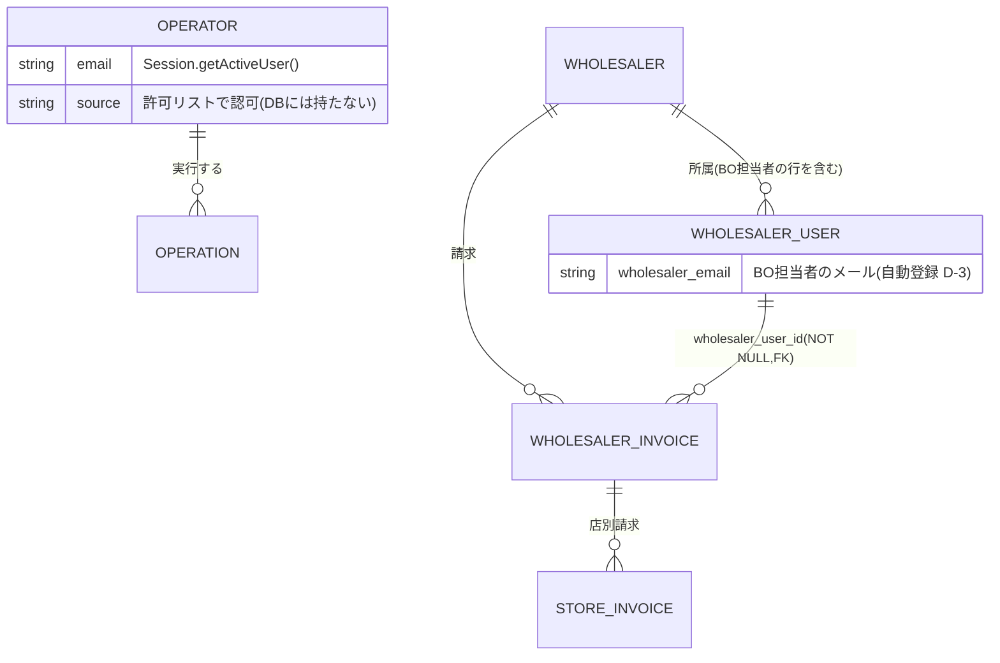
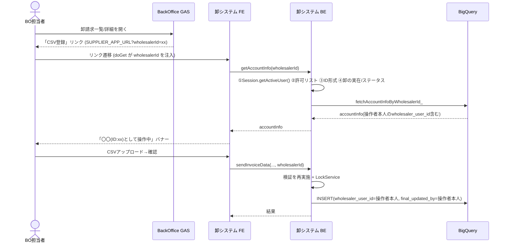

# 卸システム BackOffice 代行運用（コンテキストスイッチ）設計書

> ステータス: **ドラフト（レビュー中）**／決定事項ログを埋めながら確定する
> 作成日: 2026-10-08
> 前提資料: `docs/backoffice-wholesaler-csv-upload-options.md`（方式検討・案 B ボトルネック一覧 §11）
> 対象: 卸システム（`shiire-poc-supplier`）、BackOffice（`connect-backoffice-gas-poc`）、BigQuery `connect_db`

---

## 1. 目的・スコープ・前提

### 1.1 目的
卸ユーザーが卸システムを操作せず、BackOffice（社員）が卸を切り替えて CSV を登録・再請求・取り下げ操作できるようにする。

### 1.2 方針（確定済み）
| 項目 | 内容 |
|---|---|
| 採用方式 | **案 B**: 別 GAS のまま、BackOffice 認証へ置換 + `wholesalerId` 指定のステートレス方式 |
| LP | 使わない（LP / `doPost` / ID トークン / Cache セッション廃止） |
| 認証 | `Session.getActiveUser().getEmail()` + 許可リスト（`ALLOWED_DOMAINS` / `ALLOWED_EMAILS`）。`appsscript.json` の `webapp.access` を `DOMAIN` へ |
| 卸の指定 | サーバーにセッションを持たず、クライアントが毎回 `wholesalerId` を送り、サーバーが毎回再検証 |

### 1.2.1 責務分担の原則
- **業務ロジック（締切・受付期間・卸ステータス・登録/再請求/取り下げの判定）は、卸システムが選択された卸について現行のまま行う。BO 側では制御しない。**
- BO 側の変更は deep link（「CSV 登録」リンク、`SUPPLIER_APP_URL`）のみ。
- 卸システム側で変えるのは「認証」と「卸の確定方法（メール → `wholesalerId` 指定）」「FE の切替・表示」「排他」「監査記録」のみ。

### 1.3 スコープ
- 含む: 卸システムの認証・卸確定・FE の切替／キャッシュ／表示、登録系の排他、監査記録、BO からの導線。
- 含まない: BO 側の承認画面の改修（D-2 により自己承認制御なし。BO の変更は deep link のみ）、卸ユーザー向け機能の維持。

---

## 2. 決定事項ログ

状態: ⬜ 未決 / ✅ 決定。決定したら「決定内容」「決定者」「日付」を埋める。

| ID | 論点 | 選択肢 | 推奨 | 状態 | 決定内容 | 決定者/日付 |
|---|---|---|---|---|---|---|
| D-1 | 代理登録者（BO 担当者）を DB に恒久記録するか | (a) 列追加（`registered_by_email` 等）(b) ログ/Slack のみ (c) 別監査テーブル | (a) | ✅ | 記録する。ただし新しい列は追加せず（migration 不要）、`wholesaler_user_id`（操作者本人の行 id、D-4）と既存の `final_updated_by` で記録する（§3.2）。メールは `wholesaler_user` を JOIN して特定 | ユーザー 10/8（実現方法を見直し） |
| D-2 | 登録者と承認者の分離（自己承認） | (a) システムで強制（登録者は承認/差戻し/取り下げ審査不可）(b) 運用ルールのみ(c) 対象外 | (a)（D-1 が (a) の場合のみ実現可能） | ✅ | 自己承認は許容（システム強制しない）。D-1 の記録で事後追跡する。§8 の自己承認防止は不採用 | ユーザー 10/8 |
| D-3 | 有効な `wholesaler_user` が 0 件の卸 | (a) 代表ユーザーを事前投入 (b) BO 代行専用ユーザーを全卸に投入 (c) 当該卸は対象外 | (b) または (a)。**本番件数確認が前提** | ✅ | BO 担当者を各卸の `wholesaler_user` に**初回アクセス時の自動登録のみ**で登録（一括投入はしない）。同時初回アクセスは `LockService`/MERGE で重複防止、`deleted_at` 済みは復活 | ユーザー 10/8 |
| D-4 | `wholesaler_user_id` の意味づけ | (a) 「卸の代表ユーザー」と再定義（既存ユーザー決定的選択）(b) 代理専用ユーザーを卸ごとに固定 | (b)（実ユーザーと混同しない） | ✅ | `wholesaler_user_id` = 操作者本人の行 id（`wholesaler_id` + 操作者メールで一意に特定。代表ユーザー選定・識別列は不要） | ユーザー 10/8 |
| D-5 | 卸の指定方法 | (i) BO からの deep link (ii) 卸システム内の卸選択画面 (iii) 併用 | (iii)（BO 導線＋直接入場時の選択） | ✅ | (iii) 併用：BO から deep link、直接入場時はヘッダーのメニューから卸を選択（§5）| ユーザー 10/8 |
| D-6 | `end`（終了）卸の BO 代行 | (a) 従来どおり新規/再請求/取り下げ不可 (b) BO は後処理可 | 要件確認 | ✅ | 現行どおり（`end` 卸は新規/再請求/取り下げ不可）。卸システムの現行判定に任せ、BO 側では制御しない | ユーザー 10/8 |
| D-7 | 締切・受付期間ガード（`business_calendar`）を BO にも適用するか | (a) 適用 (b) BO は例外許可（理由入力） | 要件確認 | ✅ | 適用する。ただし BO 側では制御せず、選択された卸について遷移先の卸システムが現行ロジックのまま判定する（変更なし） | ユーザー 10/8 |
| D-8 | 差戻し再申請・取り下げ依頼を BO が卸システムで代行する運用 | (a) 代行する (b) BO 側画面に機能を寄せる | (a) | ✅ | 卸システムで BO が代行する（再請求・取り下げ依頼・取消も卸システムの現行機能をそのまま使う） | ユーザー 10/8 |
| D-9 | 許可リストの運用（誰が使えるか） | (a) BO と同じリストを複製 (b) 卸システム専用の狭いリスト | (b) | ✅ | BO ログインできる人全員が利用可（`access: DOMAIN` + BO と同じ `Authz`）。許可リスト（`ALLOWED_DOMAINS`/`ALLOWED_EMAILS`）は未設定でも DOMAIN 内全員が使える（BO と同じ挙動、PoC のため）。将来絞る場合は `ALLOWED_EMAILS` を設定するだけで、コード変更は不要。専用リストは作らない | ユーザー 10/8 |
| D-10 | 許可リストが空のときの挙動 | (a) 全拒否（fail-close）(b) 全許可（BO と同じ） | (a) | ✅ | D-9 に統合 | ユーザー 10/8 |
| D-11 | 卸名・卸切替の誤操作防止 | 固定バナー＋送信前確認ダイアログ＋切替時全キャッシュ消去 | 全部入れる | ✅ | 固定バナー＋送信前確認ダイアログ＋切替時の全キャッシュ消去を全て入れる（§5） | ユーザー 10/8 |
| D-12 | 切替方式 | (a) フルリロード（`?wholesalerId=xx#home`）(b) SPA 内で切替 | (a)（iframe 制約） | ✅ | フルリロード（`?wholesalerId=xx#home`）。iframe 制約のため SPA 内切替は行わない | ユーザー 10/8 |
| D-13 | 排他制御 | (a) `LockService`（卸+年月/親請求単位）+ トランザクション内再確認 (b) 運用で回避 | (a) | ✅ | `LockService`（新規=卸+年月、再請求=親請求単位）+ トランザクション内再確認 + `@@row_count` 検証（§6） | ユーザー 10/8 |
| D-14 | 環境別 URL（BO → 卸システム） | BO Script Property `SUPPLIER_APP_URL` | そのまま | ✅ | BO の Script Property `SUPPLIER_APP_URL`（環境別）で卸システム URL を保持 | ユーザー 10/8 |
| D-15 | 既存卸ユーザーの扱い（ログイン不可化、`wholesaler_user` データ維持） | (a) データ維持・ログインのみ廃止 (b) 論理削除 | (a) | ✅ | 既存卸ユーザーのデータは維持し、ログイン導線のみ廃止（論理削除はしない） | ユーザー 10/8 |

---

## 3. モデリング

### 3.1 概念モデル



- **OPERATOR（BO 担当者）は DB エンティティではない**。許可リストで認可し、実行主体は `Session.getActiveUser()` から取得する。
- `wholesaler_user_id` は操作者本人の `wholesaler_user` 行 id（D-4）。新しい列は追加せず、`final_updated_by`（既存列）と合わせて操作者を記録する（D-1）。

### 3.2 テーブル変更（D-1 見直し：新しい列は追加しない）

| テーブル／列 | 現状 | 変更 |
|---|---|---|
| `wholesaler_invoices.wholesaler_user_id` | 卸ユーザー id | **操作者本人の `wholesaler_user` 行 id**（D-4）。新規・再請求の操作者を表す。BO の再計算は元の値を引き継ぐ |
| `store_invoices.final_updated_by`（NOT NULL, STRING(50)） | 登録時に `wholesaler_user_id` を設定 | 同上（操作者本人の id）。**取り下げ依頼・取消・変更なし再請求の UPDATE でも `final_updated_by = 操作者の wholesaler_user_id` を更新**する（現状は未更新） |
| `wholesaler_user` | 卸ユーザー | 変更なし。BO 担当者の行が初回アクセス時に自動追加される（D-3） |

- **スキーマ変更・migration は不要**（NULL 許容列の追加なし）。
- 操作者のメールは `wholesaler_user.wholesaler_email` を JOIN して特定する。
- 既存の混在: BO の再計算・審査では `final_updated_by` に BO のメールが入る（現状どおり）。UUID と メールが同一列に混在する点は既存仕様。
- `STRING(50)` に UUID（36 文字）は収まる。

### 3.3 `accountInfo` の組み立て（`fetchAccountInfoByWholesalerId_`）

現行 `fetchAccountInfoByEmail_` は email → `wholesaler_user` を起点にしており、`wholesaler_id` 指定へそのまま変えると「ユーザー × 加盟店」の直積で `rows[0]` が揺れる。次の構造にする。

```sql
WITH ws AS (
  SELECT id, wholesaler_name, wholesaler_status, wholesaler_fee_rate,
         tax_rounding_method, csv_format_rules
  FROM wholesalers
  WHERE id = @wholesaler_id AND wholesaler_status IN ('active','end')
),
op_user AS (             -- 操作者本人の wholesaler_user（D-3/D-4）。無ければ自動登録してから再取得
  SELECT id AS wholesaler_user_id
  FROM wholesaler_user
  WHERE wholesaler_id = @wholesaler_id
    AND wholesaler_email = @operator_email
    AND deleted_at IS NULL
),
mm AS (                  -- 加盟店マッピング（現行ロジック踏襲：mall_code ごと最新、active store のみ）
  ...
)
SELECT ... FROM ws CROSS JOIN op_user LEFT JOIN mm ...
```

- `op_user` が 0 件のときは、`wholesaler_user` へ「無ければ追加」（MERGE、または `LockService` 配下で INSERT）してから再取得する。同一担当者の複数タブ同時初回アクセスでも重複行を作らない。`deleted_at` 済みの行は復活させる。
- 新規請求は「有効な加盟店のみ」、再請求は履歴ベースという現行の 2 系統（`be_invoice.js`）は維持する。

### 3.4 シーケンス



---

## 4. 認証・認可設計

### 4.1 入口の一本化
卸を対象とする業務 API は、全て最初に `getServerAccountInfo_(wholesalerId)` を呼ぶ（現行と同じ構造を維持）。内部で毎回以下を実施。例外は 2 つ: `listWholesalers()`（卸未選択でも使うため認可のみ）と `reportClientError`（認証・アカウント取得に失敗した場合でもエラー報告を送る必要があるため、アカウント取得は best-effort）。

1. `Session.getActiveUser().getEmail()` を取得（空なら `UNAUTHORIZED`）
2. BO と同じ `Authz` で判定（D-9。許可リスト未設定なら DOMAIN 内全員）
3. `wholesalerId` が `/^\d{1,15}$/`（15 桁以内。既存の `Number()` 変換で精度が落ちない範囲）か検証（SQL 文字列連結の保護も兼ねる）
4. 卸の実在・ステータス確認 → `accountInfo` 構築
5. 操作者本人の `wholesaler_user` を特定（無ければ自動登録）し、`accountInfo.wholesaler_user_id` と `accountInfo.operator_email` を付与（ログ・Slack・監査列に使用）

### 4.2 公開関数のシグネチャ変更
`sessionToken` 引数の位置を `wholesalerId` に差し替える（最小変更）。対象: `sendInvoiceData`、`resubmitInvoiceData`、`bulkResubmitInvoiceData`、`resubmitWithoutChanges`、`withdrawStoreInvoice`、`cancelWithdrawRequest`、`fetchInvoices`、`fetchInvoiceDetail`、`getInvoiceLinesByStore`、`fetchScheduleData`、`getAccountInfo`、`reportClientError`。

### 4.3 廃止するもの
`doPost`（`be_auth.js`）、`shiire_session:*` Cache、`getLoginUrl` / `getLogoutUrl`、`LP_URL`、`OAUTH_CLIENT_ID`、FE の `getSessionToken_` と URL ハッシュ `#token=`。

### 4.4 設定
| Script Property | 変更 |
|---|---|
| `ALLOWED_DOMAINS` / `ALLOWED_EMAILS` | コード上は未設定なら DOMAIN 内全員（D-9）。ただし prd はどちらか一方の設定を必須運用とする（詳細設計（卸）§2.2） |
| `BACKOFFICE_URL` | 追加。ヘッダー「BackOffice へ戻る」の遷移先（script.google.com の exec URL のみ許可）。未設定ならメニュー非表示 |
| `LP_URL` / `OAUTH_CLIENT_ID` | 廃止 |
| `FAVICON_URL` | ファビコンは LP 依存をやめ、この値（または埋め込み）で提供 |

---

## 5. 画面設計

| 項目 | 内容 |
|---|---|
| 起動 | `doGet(e)` が `e.parameter.wholesalerId` をテンプレートへ注入（`window.__WHOLESALER_ID__`）。**URL 注入値を storage より優先** |
| 卸選択（D-5 決定） | 専用の選択ページは作らない。**ヘッダーのユーザー名（操作者メール）をクリックしたドロップダウン**で選ぶ（BO のヘッダーと同じ作り）。内容: 操作者メール／現在の卸（名前・ID）／卸を切り替える（検索付き一覧）／BackOffice へ戻る。ログアウトは廃止。一覧用に `listWholesalers()` を新設 |
| 直接入場（`wholesalerId` なし） | 本文に「右上のメニューから卸を選択してください」の空状態を表示。`getAccountInfo` は呼ばない |
| 切替 | 卸を選択したら常に `?wholesalerId=yy#home` へトップレベル遷移（D-12）。切替関数で `shiire_*` の全キーとメモリ状態（`parsedData`、`rawCsvBase64`、`scheduleMap`、`_scheduleLoaded`、開いているモーダル等）を消去 |
| バナー | 全画面固定「〇〇（ID:xx）として操作中」。確認画面と送信前ダイアログにも卸名・ID を表示 |
| エラー画面 | 種別を分離: `forbidden` / `wholesaler_missing` / `wholesaler_invalid` / `wholesaler_inactive` / `system`（自動登録失敗を含む）。「ログインページへ戻る」は廃止 |
| キャッシュ | `shiire_invoices_cache`・`shiire_resubmit_handover_matter` のキーに卸 ID を含める。`_scheduleLoaded` / `scheduleMap` を卸単位化 |
| 容量 | `saveAccountInfo` は保存前に旧コンテキストを削除し、失敗時は全体をクリアして再取得 |

---

## 6. 排他制御・整合性（D-13）

| 対象 | 対策 |
|---|---|
| 新規請求の二重登録 | `LockService.getScriptLock()`（GAS 制約により実装は全体ロック。論理粒度は「卸+年月」。詳細設計（卸）§4.4 で合意）を取得し、**トランザクション内で再確認**（`hasCurrentMonthInvoice_` を外に置かない） |
| 再請求の並行更新 | 親請求 ID は論理的な競合対象（実装は新規請求と共用の全体 `getScriptLock()` による直列化）。新親金額は SQL 内で現在値から再計算。`is_latest=FALSE` の UPDATE に `@@row_count` 検証を追加し、0 件なら rollback |
| 複数 BO 担当者 | ロック待ち時間の上限（例: 30 秒）とユーザー向けメッセージ「他の担当者が処理中です」 |

---

## 7. 監査・ログ設計（D-1）

| 手段 | 内容 |
|---|---|
| DB | `wholesaler_user_id`・`final_updated_by`（操作者本人の行 id）で記録。メールは `wholesaler_user` を JOIN して特定（D-1, D-4） |
| ログ（`logInfo_`/`logError_`） | context に `operatorEmail`、`wholesalerId` を必ず含める |
| Slack | 通知に操作者を追加（既存の卸名・ファイル名・請求 ID と並べる） |
| Drive 監査 CSV | ファイル名または description に operatorEmail。フォルダ名は `wholesaler_id` を主にする |
| `reportClientError` | 卸名はクライアント値を信用せず、サーバーで `wholesalerId` から補完 |

---

## 8. BackOffice 連携

| 項目 | 内容 |
|---|---|
| deep link | BO 一覧/詳細（既存の無効な「CSV 一括アップロード」ボタンの置換候補）に「CSV 登録」を設置。`SUPPLIER_APP_URL` + `?wholesalerId=<id>#home`（D-12 と統一。D-14） |
| 環境別 URL | BO の Script Property `SUPPLIER_APP_URL`（dev/prd） |
| 自己承認（D-2 決定） | 自己承認は許容し、システム制御は入れない。登録者（`wholesaler_user_id` → `wholesaler_user.wholesaler_email`）と承認者（`operation_updated_by`）の突合で事後に追跡できる |
| 文言 | 「卸の再申請待ち」「卸の対応待ち」等を代行運用に合わせて見直し（仕様書・ユーザーガイド含む） |
| 再計算フロー | BO が新版 `wholesaler_invoices` を作る処理（`db_bq_query.js` 1256-1421）で `wholesaler_user_id` は元の値を引き継ぐ（現行のまま。変更不要） |

---

## 9. 移行・デプロイ・テスト

### 9.1 事前確認
1. 下流システムの `wholesaler_user` / `wholesaler_email` 参照確認（§10-4）: ✅ `mypage-backend` に参照なし（確認済み）。
2. dev で `access: DOMAIN` と `Session.getActiveUser()` の実機検証（§10-2,3）。

### 9.2 デプロイ順
1. 卸システム改修（`access: DOMAIN`、`Authz` 移植、自動登録、再認可・再デプロイ）。**BE のシグネチャ（`sessionToken`→`wholesalerId`）と FE の呼び出しが同時に変わるため、実装 PR A+B+C を統合ブランチで積み、一括（アトミック）でデプロイする。個別にデプロイしない**（詳細設計（卸）§12）
2. BO の deep link
3. 旧ログイン導線（LP 等）の停止、Script Property の整理

### 9.3 テスト
- 単体: `getServerAccountInfo_(wholesalerId)`（許可外、空リスト、不正 ID、存在しない卸、`end` 卸、操作者の wholesaler_user 無し(自動登録)/あり/deleted 済み）
- 単体: 排他（ロック取得失敗）、`fetchAccountInfoByWholesalerId_` の決定性
- 手動/E2E: 卸 A→B 切替時にキャッシュが残らない、確認画面の卸名、別卸への取り違え送信がない、複数タブ（複数 Google アカウントは Workspace 1 アカウント運用のため対象外）
- CI: `unit_tests.yml`、`bq_integrity_check.yml`（自動登録した行でも FK 検証が通ること）

### 9.4 更新対象ドキュメント
`docs/specifications/05_common.md`、`06_user_guide.md`、`07_test_scenarios.md`、`SETUP.md`、BO 側 `docs/specs/user-guide.md`・`invoice-withdrawal-review.md`・`schema_tables.md`。

---

## 10. リスクと未確認事項

| # | 内容 | 状態 |
|---|---|---|
| 1 | 本番の `wholesaler_user` の状況（D-3 の自動登録で 0 件問題は解消済み。既存行との重複・削除済み行の復活条件のみ確認） | 🟢 影響小 |
| 2 | `access: DOMAIN` 時の複数 Google アカウント問題 | ✅ 前提で回避: 会社アカウントは Google Workspace で 1 アカウントに絞られ、複数ログインは発生しない運用（2026-10-09 ユーザー確認）。dev 初回デプロイ時に `getEmail()` が取れることのみ軽く確認 |
| 3 | `Session.getActiveUser()` が空になる条件（デプロイ者とユーザーのドメイン関係） | ⬜ 実機検証 |
| 4 | 下流（マイページ連携等）が `wholesaler_user` / `wholesaler_email` / `wholesaler_user_id` を参照していないか | ✅ 確認済み（`mypage-backend` に参照なし） |
| 5 | 再請求時の `customer_code` が最新マッピング由来（スナップショットでない） | ✅ 今回はスコープ外（現状の挙動を維持。問題が出れば別チケット） |
| 6 | BO の再計算フローでの操作者引継ぎ | ✅ 解消（列追加なし。`wholesaler_user_id` は現行どおり引き継がれる） |

---

## 11. 次のステップ
1. §2 の決定事項ログは全項目決定済み。§10-5 もスコープ外で確定。
2. 実装前の検証項目: §10-2/3（`access: DOMAIN` と `Session.getActiveUser()` の実機検証）。§10-4（下流参照）は確認済み。
3. 検証後、実装タスクに分解（認証置換 → FE 切替 → 排他 → 監査 → BO 連携）。
