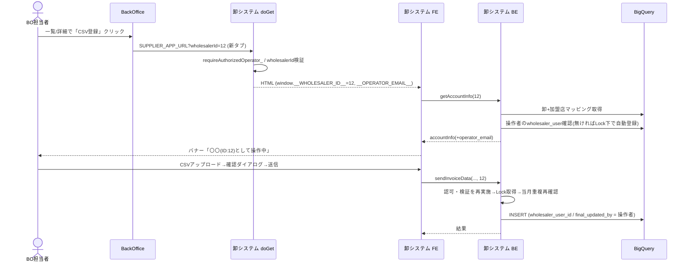

# 詳細設計書（卸システム側）BackOffice 代行運用（コンテキストスイッチ）

> ステータス: **レビュー待ち**
> 対象リポジトリ: `shiire-poc-supplier`（GAS / clasp）
> 上位設計: `docs/design-bo-wholesaler-context-switch.md`（決定事項 D-1〜D-15 はそちらが正）
> 関連: `connect-backoffice-gas-poc` リポジトリの `docs/design-detail-backoffice.md`（BO 側詳細設計）

---

## 0. このドキュメントの位置づけ

上位設計で決めた内容を「どのファイルのどの関数をどう変えるか」まで落とした実装用の設計書。
レビューが通ったら、§12 の実装順でそのまま着手できる粒度にしている。

### 0.1 確定している方針（再掲）

| 項目 | 内容 | 決定 |
|---|---|---|
| 認証 | `Session.getActiveUser()` + `access: DOMAIN`、BO と同じ `Authz`（許可リスト未設定なら DOMAIN 内全員） | D-9 |
| 卸の指定 | ステートレスな `wholesalerId`（BO の deep link / ヘッダーのメニューから選択） | D-5, D-12 |
| 業務ロジック | 締切・`end` 卸・受付期間などの判定は**現行ロジックのまま**卸システムが行う（BO 側では制御しない） | D-6, D-7, D-8 |
| 操作者の記録 | 新しい列は追加しない。`wholesaler_user_id` = 操作者本人の `wholesaler_user` 行 id、`final_updated_by` に同 id | D-1, D-4 |
| 操作者の登録 | **初回アクセス時の自動登録のみ**（一括投入しない） | D-3 |
| 切替 | フルリロード（`?wholesalerId=xx#home`）、切替時に全キャッシュ消去 | D-11, D-12 |
| 排他 | `LockService` + トランザクション内再確認 + `@@row_count` 検証 | D-13 |
| 既存卸ユーザー | データ維持、ログイン導線のみ廃止 | D-15 |
| 自己承認 | 許容（システム制御なし） | D-2 |

### 0.2 スコープ外

- BO 側の承認画面の変更（BO 側は deep link のみ → BO 詳細設計書を参照）
- `store_invoices` への `customer_code` スナップショット追加（§10-5：現状維持）
- スキーマ変更・migration（**なし**）

---

## 1. 改修ファイル一覧

| # | ファイル | 区分 | 改修概要 |
|---|---|---|---|
| 1 | `src/appsscript.json` | 変更 | `webapp.access`: `ANYONE` → `DOMAIN` |
| 2 | `src/be_config.js` | 変更 | `LP_URL` / `OAUTH_CLIENT_ID` を廃止。`ALLOWED_DOMAINS` / `ALLOWED_EMAILS` / `BACKOFFICE_URL` を追加。`setupScriptProperties` 系を整理 |
| 3 | `src/be_authz.js` | **新規** | BO の `Authz` 相当（操作者メール取得・許可判定）|
| 4 | `src/be_auth.js` | **削除** | `doPost`（ID トークン認証）と `jsonOutput_` を削除 |
| 5 | `src/be_server.js` | 変更 | `getServerAccountInfo_(wholesalerId)` に再設計、`getAccountInfo(wholesalerId)`、`listWholesalers()` 新設、`getLoginUrl` / `getLogoutUrl` 削除 |
| 6 | `src/db_bq_query.js` | 変更 | `fetchAccountInfoByEmail_` → `fetchAccountInfoByWholesalerId_`、`ensureOperatorWholesalerUser_`、`fetchWholesalerList_` を追加 |
| 7 | `src/be_main.js` | 変更 | `doGet(e)` で認可・`wholesalerId` / 操作者メール / BO URL をテンプレート注入 |
| 8 | `src/be_invoice.js` | 変更 | 公開関数の引数 `sessionToken` → `wholesalerId`、ロック導入、`final_updated_by` 更新、`@@row_count` 追加、ログに操作者追加 |
| 9 | `src/be_csv_mapper.js` | 変更 | `buildMappedTransactionSql_` / `buildMappedResubmitTransactionSql_` / `buildMappedBulkResubmitTransactionSql_` に、§4.4.2・§4.4.3 と同じ当月重複再確認・`@@row_count` 検証を追加（§4.5）。`wsUserId`（= `accountInfo.wholesaler_user_id`）の受け渡しは変更なし。標準／マッピング両形式のテスト追加 |
| 10 | `src/be_slack.js` | 変更 | 通知に操作者を追加、`reportClientError` の卸名をサーバー補完 |
| 11 | `src/be_assets.js` | 変更 | ファビコンの `LP_URL` 依存を廃止（`FAVICON_URL` のみ）|
| 12 | `src/fe_index.html` | 変更 | `window.__WHOLESALER_ID__` / `__OPERATOR_EMAIL__` / `__BACKOFFICE_URL__` / `__WEB_APP_URL__` 注入、`__SESSION_TOKEN__` 廃止 |
| 13 | `src/fe_part_header.html` | 変更 | ユーザー名（操作者メール）ドロップダウンへ作り替え、固定バナー追加 |
| 14 | `src/fe_js_common.html` | 変更 | `getSessionToken_` → `getWholesalerId_`、初期化フロー、切替関数、キャッシュ全消去、ログアウト/ログインへ戻る処理の削除 |
| 15 | `src/fe_js_home.html` / `fe_js_detail.html` / `fe_js_confirm.html` / `fe_js_calendar.html` / `fe_js_upload.html` | 変更 | `getSessionToken_()` 呼び出しの置換、キャッシュキー・状態の卸単位化、確認ダイアログに卸名 |
| 16 | `src/fe_page_error.html` | 変更 | エラー種別の分離、「ログインページに戻る」廃止 |
| 17 | `src/fe_css.html` | 変更 | バナー・卸切替ドロップダウンのスタイル追加 |
| 18 | `test/*.test.js` | 変更/追加 | `getServerAccountInfo_` モックの引数変更、新規テスト（§11）|
| 19 | `docs/*`、`SETUP.md` | 変更 | §13 |

---

## 2. 設定・デプロイ設定

### 2.1 `appsscript.json`

```json
"webapp": { "executeAs": "USER_DEPLOYING", "access": "DOMAIN" }
```

- `oauthScopes` は変更なし（`userinfo.email` は既に含まれる。`Session.getActiveUser()` に必要）。
- **デプロイ注意**: アクセス権の変更は既存デプロイの「編集 → 新バージョン」で反映し、**デプロイ URL を変えない**（BO の `SUPPLIER_APP_URL` を差し替え不要にするため）。反映時に再認可ダイアログが出る可能性あり。
- 配置先: 「BO のデプロイを管理しているフォルダ」へ同一ソースを配置する運用（上位設計 §9.2）。`.clasp-*.json` の scriptId 切替で対応。

### 2.2 Script Properties

| キー | 変更 | 内容 |
|---|---|---|
| `LP_URL` | 廃止 | 参照箇所（`be_config.js` / `be_server.js` / `be_assets.js`）をすべて削除 |
| `OAUTH_CLIENT_ID` | 廃止 | `doPost` 削除に伴い不要 |
| `ALLOWED_DOMAINS` | 追加 | カンマ区切り。コード上は未設定＝制限なし（D-9）だが、**prd では `ALLOWED_DOMAINS` か `ALLOWED_EMAILS` の少なくとも一方の設定を必須運用とする**（`listWholesalers` で卸一覧が広く見えるため）。`listWholesalers` 呼び出しは監査ログ（operator）に残す |
| `ALLOWED_EMAILS` | 追加（任意） | カンマ区切り。未設定＝制限なし（D-9） |
| `BACKOFFICE_URL` | 追加（✅ §14-4 承認済み） | ヘッダー「BackOffice へ戻る」の遷移先。未設定ならメニュー項目を非表示<br>dev: `https://script.google.com/a/macros/unext-hd.jp/s/AKfycbz1ojp_1pyXyRC2PjN1w_tfzWgtSNAQTHKtzQ22kGn_QxnQT5frYplG2VVWXdhkWZQ4fA/exec`<br>prd: `https://script.google.com/a/macros/unext-hd.jp/s/AKfycbzTUhU6twsNdkzx2qHOm56nfuHK75-fJiIoUBNNOHBjfOxkNAXCFIzaxHyV-iOO0xZN/exec`（2026-10-09 確定） |
| `FAVICON_URL` | 既存 | LP フォールバックをやめ、設定があればそれのみ使用 |
| その他（`DRIVE_ROOT_FOLDER_ID`、`GCP_PROJECT_ID`、`BQ_DATASET_ID`、`BQ_LOCATION`、`ENV`） | 変更なし | |

### 2.3 `be_config.js` の変更

```js
function getConfig_() {
  const props = PropertiesService.getScriptProperties();
  // ...既存の必須チェック（DRIVE_ROOT_FOLDER_ID / GCP_PROJECT_ID / BQ_DATASET_ID）は維持
  const splitCsv = function (v) {
    return String(v || '').split(',').map(function (s) { return s.trim(); }).filter(Boolean);
  };
  return {
    driveFolderId, gcpProjectId, bqDatasetId, bqLocation, env,
    allowedDomains: splitCsv(props.getProperty('ALLOWED_DOMAINS')),
    allowedEmails:  splitCsv(props.getProperty('ALLOWED_EMAILS')),
    // script.google.com の exec URL 形式のみ許可（誤設定時の任意サイトへの誘導防止）
    backOfficeUrl:  /^https:\/\/script\.google\.com\/(a\/macros\/[A-Za-z0-9.-]+|macros)\/s\/[A-Za-z0-9_-]+\/exec$/.test((props.getProperty('BACKOFFICE_URL') || '').trim()) ? props.getProperty('BACKOFFICE_URL').trim() : '',
  };
}
```

- 戻り値から `lpUrl` / `oauthClientId` を削除（呼び出し元は §3〜§5 で全て除去）。
- ファイル先頭のコメント、`setupScriptProperties`、`setLpUrl` 系ヘルパー（`LP_URL` / `OAUTH_CLIENT_ID` を設定する関数）を削除・置換。`ALLOWED_*` / `BACKOFFICE_URL` の設定ヘルパーは任意で追加。

---

## 3. 認証・認可（`be_authz.js` 新規）

BO の `Authz`（`connect-backoffice-gas-poc/src/be_utils.js`）と同一の判定を、卸システムの命名規則に合わせて実装する。

```js
// be_authz.js
function requireAuthorizedOperator_() {
  const email = Session.getActiveUser().getEmail() || '';
  if (!email) throw new Error('UNAUTHORIZED: ユーザーを識別できません。Googleアカウントでアクセスしてください。');

  const cfg = getConfig_();
  const domain = email.split('@')[1] || '';
  const domainOk = cfg.allowedDomains.length === 0 || cfg.allowedDomains.indexOf(domain) !== -1;
  const emailOk  = cfg.allowedEmails.length  === 0 || cfg.allowedEmails.indexOf(email)  !== -1;
  if (!domainOk || !emailOk) throw new Error('FORBIDDEN: このアカウントにはアクセス権がありません。');
  return email;
}
```

- エラーは既存方式（`err.message` のプレフィックス `UNAUTHORIZED:` / `NOT_REGISTERED:`）に合わせ、`FORBIDDEN:`、`WHOLESALER_MISSING:`、`WHOLESALER_INVALID:`、`WHOLESALER_INACTIVE:` を追加する。
- 未設定時が fail-open（全許可）になる点は D-9 のとおり（PoC）。

---

## 4. バックエンド詳細

### 4.1 `be_server.js`

#### `getServerAccountInfo_(wholesalerId)`（再設計）

```js
function getServerAccountInfo_(wholesalerId) {
  const operatorEmail = requireAuthorizedOperator_();              // ① 認証・認可

  const idStr = String(wholesalerId == null ? '' : wholesalerId).trim();
  if (!idStr)                 throw new Error('WHOLESALER_MISSING: 卸が指定されていません。');
  if (!/^\d{1,15}$/.test(idStr)) throw new Error('WHOLESALER_INVALID: 卸IDの形式が不正です。'); // ② 形式検証（SQLへ渡す値の保護も兼ねる）

  // 15 桁以内に制限（Number.MAX_SAFE_INTEGER 未満が保証される）。既存コードが Number(wholesaler_id) 変換を多用する（db_bq_query.js 72、be_invoice.js 307、be_csv_mapper.js 733 等）ため、精度落ちを入口で防ぐ
  const accountInfo = fetchAccountInfoByWholesalerId_(Number(idStr), operatorEmail); // ③ 卸の実在確認 + 操作者の wholesaler_user 特定/自動登録
  if (!accountInfo) throw new Error('WHOLESALER_INVALID: 指定された卸が見つかりません。');

  accountInfo.operator_email = operatorEmail;                       // ④ ログ・Slack・監査用に付与
  logInfo_('Auth', '認証成功: wholesaler_id=' + accountInfo.wholesaler_id +
                   ', operator=' + operatorEmail + ', account_id=' + accountInfo.wholesaler_user_id);
  return accountInfo;
}
```

- 返却オブジェクトの既存フィールド（`wholesaler_id` / `wholesaler_user_id` / `wholesaler_name` / `wholesaler_status` / `fee_rate` / `tax_rounding_method` / `csv_format_rules` / `merchant_mappings`）は**そのまま**。呼び出し側の改修を最小にするため。追加は `operator_email` のみ。
- `wholesaler_status` が `active`/`end` 以外（`entry` 等）の卸は `fetchAccountInfoByWholesalerId_` が `null` を返す → `WHOLESALER_INVALID` ではなく `WHOLESALER_INACTIVE` を返したい場合は、SQL 側でステータスを返して分岐する（§4.2 の `ws` CTE 参照）。**採用**: 実在するがステータス不可 → `WHOLESALER_INACTIVE`。

#### `getAccountInfo(wholesalerId)`（公開）

```js
function getAccountInfo(wholesalerId) {
  let operatorEmail_ = '';
  try { operatorEmail_ = Session.getActiveUser().getEmail() || ''; } catch (e) { /* 取得不可でもログのみのため継続 */ }
  try { return success_(getServerAccountInfo_(wholesalerId)); }
  catch (err) {
    // 認証/指定系エラーは err.message をそのままフロントへ（プレフィックスで画面を出し分け）
    const m = String(err.message || '');
    // SYSTEM: はロック取得失敗など利用者に伝えるべき文言のため、他の認証系と同様にそのまま返す
    if (/^(UNAUTHORIZED|FORBIDDEN|WHOLESALER_MISSING|WHOLESALER_INVALID|WHOLESALER_INACTIVE|SYSTEM):/.test(m)) throw err;
    logError_('Auth', 'getAccountInfo', err, { actionLabel: 'アカウント情報取得', operatorEmail: operatorEmail_ });
    throw new Error('アカウント情報の取得に失敗しました。ページを再読み込みしてください。');
  }
}
```

- 現行の `NOT_REGISTERED:`（BQ 未登録）は、自動登録（D-3）により発生しなくなる。**自動登録の失敗は `system` 扱い**。

#### `listWholesalers()`（新設・公開）

ヘッダーの卸切替一覧用。認可（`requireAuthorizedOperator_()`）のみ通せば呼べる（卸未選択でも使えるため）。

```js
function listWholesalers() {
  const operatorEmail = requireAuthorizedOperator_();
  logInfo_('Auth', 'listWholesalers: operator=' + operatorEmail); // 全卸一覧の参照を監査ログに残す
  return success_(fetchWholesalerList_()); // [{ wholesaler_id, wholesaler_name, wholesaler_status }]
}
```

- 検索はクライアント側（部分一致）で行う（卸数が数百規模までを想定）。

#### 削除

`getLogoutUrl` / `getLoginUrl`（`LP_URL` 依存）を削除。

### 4.2 `db_bq_query.js`

#### `fetchAccountInfoByWholesalerId_(wholesalerId, operatorEmail)`

現行 `fetchAccountInfoByEmail_`（26-88 行）を置換。`wholesaler_user` 起点の JOIN を廃止し、**卸（`ws`）起点**へ。

```sql
WITH ws AS (
  SELECT id, wholesaler_name, wholesaler_status, wholesaler_fee_rate,
         tax_rounding_method, csv_format_rules
  FROM `<project>.<dataset>.wholesalers`
  WHERE id = @wholesaler_id
),
latest_merchants AS (            -- 現行ロジックそのまま
  SELECT customer_code, mall_code, wholesaler_id,
    ROW_NUMBER() OVER (PARTITION BY mall_code, wholesaler_id
                       ORDER BY registration_at DESC, id DESC) AS rn
  FROM `<project>.<dataset>.wholesaler_merchants`
  WHERE deleted_at IS NULL AND wholesaler_id = @wholesaler_id
)
SELECT w.id AS wholesaler_id, w.wholesaler_name, w.wholesaler_status,
       w.wholesaler_fee_rate AS fee_rate, w.tax_rounding_method, w.csv_format_rules,
       wm.customer_code, wm.mall_code, s.store_name
FROM ws AS w
LEFT JOIN latest_merchants AS wm ON wm.rn = 1
LEFT JOIN `<project>.<dataset>.store` AS s
  ON s.mall_code = wm.mall_code AND s.store_status = 'active'
```

- 操作者の `wholesaler_user` は**別クエリ**で解決する（直積による `rows[0]` の不安定化を避ける）。
- 処理順:
  1. 上記クエリ → 0 行なら `null`（卸なし → `WHOLESALER_INVALID`）。
  2. `wholesaler_status` が `active`/`end` 以外 → `WHOLESALER_INACTIVE`。
  3. `ensureOperatorWholesalerUser_(wholesalerId, operatorEmail)` → `wholesaler_user_id`。
  4. 既存と同じ形（`merchant_mappings` 組み立て、`csv_format_rules` の `JSON.parse` 失敗時 `null`）で返却。
- `merchant_mappings` の組み立て（`mall_code && store_name` のフィルタ）は現行どおり。

> 現行の SQL は `wholesaler_status IN ('active','end')` を JOIN 条件にしているが、ステータス不可の理由を区別したいため WHERE から外し、アプリ側で判定する。

#### `ensureOperatorWholesalerUser_(wholesalerId, operatorEmail)`（新設）

D-3/D-4 の自動登録。**同時初回アクセスでの重複行を防ぐ**ため `LockService` と再確認を組み合わせる。

```text
1. SELECT id, deleted_at FROM wholesaler_user
   WHERE wholesaler_id = @id AND wholesaler_email = @email
   ORDER BY (deleted_at IS NULL) DESC, registration_at DESC, id DESC LIMIT 1
   → deleted_at IS NULL の行があればその id を返して終了（通常ケース・ロック不要）
2. ロック取得: LockService.getScriptLock().waitLock(10000)
   ※ 取得失敗 → Error('SYSTEM: 他の処理中のため登録できませんでした。再度お試しください。')
3. ロック内で 1 を再実行（他リクエストが先に登録していないか）
   - active 行あり → その id を返す
   - deleted_at 済みの行のみあり → UPDATE wholesaler_user SET deleted_at = NULL WHERE id = @id（復活）→ その id
   - 行なし → INSERT INTO wholesaler_user (id, wholesaler_id, wholesaler_email, registration_at)
              VALUES (<新規UUID>, @id, @email, CURRENT_DATE('Asia/Tokyo'))
4. finally: lock.releaseLock()
```

- 新規 id は既存の卸システムの慣例に合わせ `Utilities.getUuid()`（v4）を使う。スキーマ上は UUID v7 とされているが、現行の卸システムの INSERT は v4 であり FK・形式検証に影響しない（**決定 §14-3**：卸システムに揃えて v4。BO の `createV7` は移植しない）。
- `registration_at` は DATE。タイムゾーンは `Asia/Tokyo`。
- クエリは既存の `runQuery_`（パラメータクエリ）を使用し、メールを文字列連結しない。DML は既存の DML 実行ヘルパー（`be_invoice.js` で使用中のもの）に合わせる。
- ロックはスクリプト全体ロックのため、登録処理（数百 ms〜数秒）の間は他の初回登録のみ待たされる。通常ケース（既登録）はロックを取らない。

#### `fetchWholesalerList_()`（新設）

```sql
SELECT id AS wholesaler_id, wholesaler_name, wholesaler_status
FROM `<project>.<dataset>.wholesalers`
WHERE wholesaler_status IN ('active', 'end')
ORDER BY wholesaler_name, id
```

### 4.3 `be_main.js`（`doGet(e)`）

```js
function doGet(e) {
  // 認可（NG なら 403 ページを返す。BO の doGet と同じ作り）
  let operatorEmail = '';
  try { operatorEmail = requireAuthorizedOperator_(); }
  catch (err) {
    // 403 にするのは UNAUTHORIZED / FORBIDDEN のみ。設定不備（getConfig_ の必須プロパティ未設定など）を認可エラーに見せない
    if (/^(UNAUTHORIZED|FORBIDDEN):/.test(String(err.message || ''))) return forbiddenPage_(err);
    logError_('Auth', 'doGet', err, { actionLabel: '起動' });
    throw err;  // 設定・システム障害は握りつぶさず GAS のエラー画面＋ログに出す
  }

  const raw = String((e && e.parameter && e.parameter.wholesalerId) || '').trim();
  const wholesalerId = /^\d{1,15}$/.test(raw) ? raw : '';      // 不正値は未指定として扱う（空状態へ）

  const template = HtmlService.createTemplateFromFile('fe_index');
  template.isDev = isDev;
  template.wholesalerId = wholesalerId;
  template.operatorEmail = operatorEmail;
  template.webAppUrl = ScriptApp.getService().getUrl();        // 卸切替（top 遷移）のベース URL
  template.backOfficeUrl = getConfig_().backOfficeUrl;          // https のみ許可（isHttpsUrl_ 流用）
  ...
}
```

- `e.parameter.token` の読み取りと `template.sessionToken` は削除。
- `forbiddenPage_`: BO と同様、`HtmlService.createHtmlOutput('<h2>403 Forbidden</h2><p>アクセス権がありません。</p>')`（`UNAUTHORIZED` も同扱い）。
- GAS Web アプリは iframe 内で配信されるため、URL クエリを読めるのは `doGet(e).parameter` のみ（FE の `location.search` は使えない）。

### 4.4 `be_invoice.js`

#### 4.4.1 公開関数のシグネチャ

最終引数 `sessionToken` を `wholesalerId` に差し替える（位置は変えない）。冒頭の `getServerAccountInfo_('', sessionToken)` → `getServerAccountInfo_(wholesalerId)`。

| 関数 | 現行の行 | 変更 |
|---|---|---|
| `sendInvoiceData` | 1508 / 1518 | 引数・呼び出し置換、**ロック導入**（§4.4.2） |
| `resubmitInvoiceData` | 815 / 822 | 同上、**親請求ロック**（§4.4.3） |
| `bulkResubmitInvoiceData` | 1246 / 1253 | 同上 |
| `resubmitWithoutChanges` | 1691 / 1696 | 同上、`final_updated_by` 更新追加 |
| `withdrawStoreInvoice` | 1807 / 1811 | 同上、`final_updated_by` 更新追加 |
| `cancelWithdrawRequest` | 1911 / 1915 | 同上、`final_updated_by` 更新追加 |
| `fetchInvoices` | 2018 / 2022 | 引数・呼び出し置換のみ |
| `fetchInvoiceDetail` | 2052 / 2057 | 同上 |
| `getInvoiceLinesByStore` | 2100 / 2105 | 同上 |
| `fetchScheduleData` | 2132 / 2136 | 同上 |

- JSDoc の `@param {string} [sessionToken]` を `@param {string|number} wholesalerId - 操作対象の卸ID（getServerAccountInfo_ が検証・確定する）` に更新。
- **業務ロジック（`assertWholesalerActive_`、受付期間、締切、重複判定など）は一切変えない**（原則 §0.1）。

#### 4.4.2 新規請求の二重登録対策（`sendInvoiceData`）

現状（1547 行）: `hasCurrentMonthInvoice_` がトランザクションの外にあり、2 人の BO 担当者が同時に送ると両方すり抜ける可能性がある。

変更:

```js
const lock = LockService.getScriptLock();
if (!lock.tryLock(30000)) throw new Error('他の担当者が処理中です。しばらくしてから再度お試しください。');
try {
  // 既存の「当月重複チェック」をロック内に移し、チェック〜INSERT をロックで直列化する
  if (hasCurrentMonthInvoice_(accountInfo.wholesaler_id)) { throw new Error('今月は既に新規の請求書が登録されています。...'); }
  ... 既存の ⑤ BEGIN TRANSACTION ... COMMIT ...
} finally { lock.releaseLock(); }
```

- ロック単位: GAS の `getScriptLock()` は全体ロックなので、「卸+年月」単位の細粒度は取れない。**スクリプトロックで直列化する**（処理時間は数秒。BO 担当者の同時利用は少数のため許容。上位設計 §6 の「卸+年月」は論理的な粒度で、実装はスクリプトロック）。
- 追加のセーフティ: INSERT のトランザクション内にも当月重複の再確認（`IF EXISTS(...) THEN ROLLBACK`）を入れ、ロックを抜けた場合でも二重登録にならないようにする。メッセージは既存と同一。
- ステージング（CSV を BQ へロード）などロック不要な重い処理は**ロックの前**に済ませ、ロック保持時間を最小化する（`hasCurrentMonthInvoice_` 〜 INSERT のみをロック対象にする）。

#### 4.4.3 再請求の並行更新対策（`resubmitInvoiceData` / `bulkResubmitInvoiceData`）

| 箇所（現行行） | 現状 | 変更 |
|---|---|---|
| `is_latest = FALSE` の UPDATE（703、1130、1138 付近） | UPDATE 結果を検証していない | 各 UPDATE 直後に `IF @@row_count = 0 THEN ROLLBACK; RAISE ...` を追加（`resubmitWithoutChanges` 1741〜と同じ文言：「他の操作と競合したため更新できませんでした。ページを再読み込みして再度お試しください。」）。`bulkResubmit` の①②は件数が 0 の場合もありうるため、**「対象が 1 件以上あるはず」の側にだけ**検証を入れる（実装時に対象件数と比較）。 |
| 事前読み込み〜トランザクション間の競合 | 旧データを事前に読み、そのまま新版を作る | `LockService` を親請求 ID の取得後〜COMMIT まで取得（取得失敗時は上記メッセージ）。新親金額の再計算は既存どおり（事前読み取り値に依存する部分は、ロック取得後に最新値を読み直す） |

- 再請求・一括再請求は同一親請求に対する操作のため、スクリプトロックで直列化する（新規請求と同じロックを共用して可）。

#### 4.4.4 `final_updated_by` の記録（D-1）

| 経路 | 現状 | 変更 |
|---|---|---|
| 新規請求の INSERT（386 / 717 / 1156、`be_csv_mapper.js` 829・894・1116・1345） | `wsUserId`（= `accountInfo.wholesaler_user_id`）を設定済み | **変更なし**。`wholesaler_user_id` が操作者本人になるため自動的に操作者が記録される |
| 取り下げ依頼（`withdrawStoreInvoice` 1834〜1845） | `final_updated_by` 未更新 | UPDATE の SET 句に `final_updated_by = '<accountInfo.wholesaler_user_id>'` を追加 |
| 取り下げ取消（`cancelWithdrawRequest` 1961〜1968） | 同上 | 同上 |
| 変更なし再請求（`resubmitWithoutChanges` 1734〜1741） | 同上 | 同上 |

- 値は `esc()`（既存エスケープ）を通す。`STRING(50)` に UUID（36 文字）は収まる。
- BO 側の再計算（`db_bq_query.js` 1256〜1421）が `wholesaler_user_id` を元の値のまま引き継ぐ現行仕様は**変更しない**。
- 操作者メールの特定は `wholesaler_user` を JOIN して行う（BO・分析側で利用）。

#### 4.4.5 ログ

Drive 監査 CSV には `setDescription` で操作者メールを付与する（上記 §9）。

`logInfo_` / `logError_` の context に `operatorEmail`（`accountInfo.operator_email`）と `wholesalerId` を必ず含める。例:

```js
logInfo_('Invoice', 'sendInvoiceData 開始: wholesaler_id=' + accountInfo.wholesaler_id +
  ', operator=' + accountInfo.operator_email + ', account_id=' + accountInfo.wholesaler_user_id + ...);
```

### 4.5 `be_csv_mapper.js`

- 新規・再請求・一括再請求のトランザクション SQL は、`be_invoice.js` だけでなく `be_csv_mapper.js` の **`buildMappedTransactionSql_`（727）／`buildMappedResubmitTransactionSql_`（981）／`buildMappedBulkResubmitTransactionSql_`（1184）** が組み立てる（カスタム形式の卸が通る経路）。§4.4.2 のトランザクション内の当月重複再確認と、§4.4.3 の `is_latest = FALSE` UPDATE（1101 付近、1318／1328 付近）への `@@row_count` 検証は、**これらのビルダーにも同様に入れる**（標準形式・マッピング形式の両方で同じガードを保証する）。
- `wsUserId` の UUID 形式検証（739 付近の `UUID_RE`）はバージョン非依存のため、v4 の `wholesaler_user.id` でも通る。
- 回帰テストで、標準形式・マッピング形式の両方について「トランザクション内の当月重複再確認と `@@row_count` 検証が SQL に含まれる」ことと「INSERT 文の `wholesaler_user_id` / `final_updated_by` が操作者本人の id になる」ことを確認する（§11）。

### 4.6 `be_slack.js`

| 項目 | 変更 |
|---|---|
| `buildSlackContext`（Who 組み立て ~320） | `ctx.operatorEmail` があれば `操作者: <email>` を追加（エスケープは既存 `escapeSlackText_`）|
| `reportClientError(payload, wholesalerId)`（558） | 第2引数を `wholesalerId` に。サーバー側で卸名を `wholesalerId` から補完し、クライアント送信の `wholesalerName` は信用しない。`operatorEmail` は `Session` から取得。認証失敗時もエラー通知自体は握りつぶさず送る（現行方針維持）|

### 4.7 `be_assets.js`

- `getFaviconUrl_` から `LP_URL` 由来の導出（61〜72 行）と `FAVICON_LP_PATH_` を削除。`FAVICON_URL`（https のみ）が設定されている場合のみ返し、未設定ならファビコンなし。

### 4.8 `be_auth.js`（削除）

- `doPost` と `jsonOutput_` を削除（`jsonOutput_` は他ファイルから未使用）。`shiire_session:*` Cache の参照は `be_server.js` から除去済み。
- 既に配布済みの LP が `doPost` を叩いても `doPost` 不在で失敗するだけで副作用なし。LP は使わない前提（要件）。

---

## 5. フロントエンド詳細

### 5.1 `fe_index.html`

```html
<script>
  window.__APP_IS_DEV__ = ('<?= isDev ?>' === 'true');
  window.__WHOLESALER_ID__ = '<?= wholesalerId ?>';
  window.__OPERATOR_EMAIL__ = '<?= operatorEmail ?>';
  window.__BACKOFFICE_URL__ = '<?= backOfficeUrl ?>';
  window.__WEB_APP_URL__ = '<?= webAppUrl ?>';
</script>
```

- `<?= ?>`（強制エスケープ）を使う。`__SESSION_TOKEN__` は削除。

### 5.2 `fe_part_header.html`（ヘッダー）

現行: 卸名ボタン＋「ログアウト」ドロップダウン。→ BO のヘッダーに合わせ、**ユーザー名（操作者メール）をクリックするドロップダウン**に作り替え。

```
[ 請求スケジュール ]  [ 👤 operator@example.com ▼ ]
                          ┌───────────────────────────┐
                          │ operator@example.com       │
                          │ 現在の卸: ○○商事 (ID: 12) │
                          │ ───────────────────────── │
                          │ 卸を切り替える             │
                          │ [ 卸名で検索…         ]   │
                          │  ○○商事 (12)              │
                          │  △△物産 (34) …           │
                          │ ───────────────────────── │
                          │ BackOfficeへ戻る           │
                          └───────────────────────────┘
```

- 既存の `headerStoreTrigger` / `headerStoreDropdown` の開閉ロジック（`initHeaderStoreDropdown`、Escape・外クリックで閉じる）を流用。`btnLogout` を削除し、卸検索入力・一覧・BO 戻りリンクを追加。
- 卸一覧は初回ドロップダウンを開いたときに `listWholesalers()` を呼び、結果をメモリ保持（キャッシュはページ内のみ）。検索は部分一致（大小・全半角は考慮しない、`includes`）。表示は最大 50 件＋スクロール。
- 卸を選択 → `switchWholesaler_(id)`（§5.4）。現在の卸を選んだ場合は何もしない。
- 「BackOfficeへ戻る」は `window.__BACKOFFICE_URL__` が空なら非表示。`target="_top"`（GAS は iframe のため `window.top` 遷移）。
- 固定バナー（全画面共通、ヘッダー直下）: `〇〇（ID:12）として操作中`。`wholesalerId` なしの空状態では非表示。

### 5.3 `fe_js_common.html`

#### 卸 ID の取得

`getSessionToken_()`（241 行）を **`getWholesalerId_()`** に置換。優先順位は **URL 注入値 → なし**（storage は参照しない。storage を優先すると旧卸が勝つため）。

```js
function getWholesalerId_() {
  return String(window.__WHOLESALER_ID__ || '');
}
```

- 実質、卸コンテキストの唯一の真実は「ページロード時に注入された `__WHOLESALER_ID__`」。`shiire_wholesaler_id`（sessionStorage）は互換のため保存だけ行い、**判定には使わない**。

#### 初期化フロー（`DOMContentLoaded`、375〜400 行付近）

```text
wholesalerId = getWholesalerId_()
if (!wholesalerId)  → 空状態を表示（本文「右上のメニューから卸を選択してください」）。getAccountInfo は呼ばない。ヘッダー/メニューは使える
else                → getAccountInfo(wholesalerId)
   success → saveAccountInfo(data) / バナー表示 / enableUploadUi_() / loadScheduleData_() / navigate()
   failure → err.message のプレフィックスで showErrorPage_(種別)
```

- `reportClientError(payload, getWholesalerId_())` に更新（105 行）。

#### キャッシュ全消去 `clearWholesalerContext_()`（新設）

卸切替直前と `saveAccountInfo` 冒頭で実行。

| 種別 | 対象 |
|---|---|
| sessionStorage | `shiire_` で始まる全キー（`wholesaler_id/user_id/name/status`、`invoice_fee_rate`、`tax_rounding_method`、`merchant_mappings`、`csv_format_rules`、`invoices_cache`、`schedule_cache_*`、`parsedData`、`resubmit_handover_matter` など）|
| メモリ状態 | `rawCsvBase64`、`utf8CsvBase64`、`parsedData`、`scheduleMap = {}`、`_scheduleLoaded = false`、`_detailCurrentInvoiceId`、`_isResubmitConfirm`、開いているモーダルを閉じる |

- フルリロードで基本的にメモリは破棄されるが、「同一ドキュメント内で再初期化される経路」と「sessionStorage（同一タブで残る）」の両方を防ぐ二重の安全策として実装。
- `saveAccountInfo`（285 行）は保存前に旧コンテキストを消去。`setItem` が容量超過で失敗した場合は全体をクリアして再取得するフォールバックを入れる。

#### 卸切替 `switchWholesaler_(id)`（新設）

```js
function switchWholesaler_(id) {
  clearWholesalerContext_();
  // GAS は iframe 配信 → トップレベルを書き換える。ベース URL は doGet が注入した webAppUrl（ScriptApp.getService().getUrl()）を使い、window.top.location は読まない
  const base = window.__WEB_APP_URL__;
  window.top.location.href = base + '?wholesalerId=' + encodeURIComponent(id) + '#home';
}
```

- ベース URL は `doGet` が `ScriptApp.getService().getUrl()` をテンプレート注入（`window.__WEB_APP_URL__`）する方式を**基本**とする（`window.top.location` の読み取りは cross-origin で拒否され得るため使わない。レビュー指摘反映）。`top.location.href` への**代入**のみ行う（代入は可能）。
- フルリロードにより `doGet` が新しい `wholesalerId` で再評価される（D-12）。

#### 削除

- `initLogout`（705〜735 行）、`initBackToLogin`（737〜775 行）、`getLogoutUrl` / `getLoginUrl` 呼び出し、`#token=` フラグメント処理。

### 5.4 各ページ JS

| ファイル | 変更 |
|---|---|
| `fe_js_home.html` | `fetchInvoices(getSessionToken_())` → `getWholesalerId_()`（47 行）。`shiire_invoices_cache` のキーを `shiire_invoices_cache_<wholesalerId>` に変更（36 行ほか参照箇所）|
| `fe_js_detail.html` | 78 / 755 / 1657 / 1757 / 1827 / 1890 行の呼び出し置換。`shiire_resubmit_handover_matter` のキーに卸 ID を含める |
| `fe_js_confirm.html` | 392 / 415 行置換。送信前確認ダイアログに「卸名（ID）として登録します」を追加（D-11）|
| `fe_js_calendar.html` | 78 行置換。`_scheduleLoaded`（単一 bool）と `scheduleMap` を卸 ID 付きで管理（`_scheduleLoadedFor = wholesalerId`）|
| `fe_js_upload.html` | 225・328 行のキャッシュキー（既に卸 ID を含む `schedule_cache` は維持、`invoices_cache` は上記の新キー）|
| `fe_js_csv_common.html` | 変更なし（卸 ID に依存しない）|

### 5.5 `fe_page_error.html`

- 種別を分離: `forbidden`（FORBIDDEN）、`wholesaler_missing`、`wholesaler_invalid`、`wholesaler_inactive`、`system`（自動登録失敗含む）、`env`。
- 現行の「ログインに使用されたアカウントの登録が見当たりません」文言（`NOT_REGISTERED` 用）は廃止。「ログインページに戻る」ボタン（`btnBackToLogin`）は廃止し、`wholesaler_*` の場合は「右上のメニューから卸を選び直してください」を表示。
- `showErrorPage_(type)`（`fe_js_common.html` 430 行付近）の分岐を上記に合わせる。

### 5.6 `fe_css.html`

- 固定バナー（`.operating-as-banner`）、卸切替ドロップダウン（検索入力・リスト・選択中ハイライト）、空状態のスタイルを追加。既存のカラートークン（`#003255` 等）に合わせる。

---

## 6. シーケンス（BO から入場 → 登録）



---

## 7. エラー・例外設計

| エラー | 発生箇所 | FE の表示 |
|---|---|---|
| `UNAUTHORIZED:` メール取得不可 | `doGet`/各公開関数 | `doGet` で 403。API 経由なら `system` に「再読み込み」案内 |
| `FORBIDDEN:` 許可外 | 同上 | 403 ページ |
| `WHOLESALER_MISSING:` | `getServerAccountInfo_` | 空状態（`getAccountInfo` を呼ばないため通常は発生しない）|
| `WHOLESALER_INVALID:` | 同上 | 「指定された卸が見つかりません」+ メニュー誘導 |
| `WHOLESALER_INACTIVE:` | 同上 | 「この卸は現在利用できません」+ メニュー誘導 |
| ロック取得失敗 | 新規/再請求/自動登録 | 「他の担当者が処理中です。しばらくしてから再度お試しください」 |
| `@@row_count = 0` | 再請求/取り下げ等 | 既存文言（他の操作と競合）|

---

## 8. セキュリティ

| 観点 | 対策 |
|---|---|
| なりすまし | 認証は `Session.getActiveUser()` のみ。クライアント送信のメール・卸名・`wholesaler_user_id` は一切信用しない |
| 入力検証 | `wholesalerId` は `/^\d{1,15}$/`、SQL はパラメータクエリ（既存の `esc()` 連結は現行どおり）。`wholesalerId` を SQL に埋める箇所は `Number()` 化済みの値のみ（15 桁以内なので精度落ちなし） |
| 権限 | `access: DOMAIN` + `Authz`（D-9）。公開関数すべてで毎回認可を再実施 |
| URL 注入 | テンプレートは `<?= ?>`（エスケープあり）。`backOfficeUrl` は https のみ |
| 情報露出 | `listWholesalers` は卸名/ID/ステータスのみ。認可済みユーザーにのみ返す |

---

## 9. 監査・ログ

| 手段 | 内容 |
|---|---|
| DB | `wholesaler_user_id` / `final_updated_by` に操作者本人の `wholesaler_user.id`（メールは JOIN で特定） |
| アプリログ | context に `operatorEmail`、`wholesalerId` |
| Slack | 通知に操作者を追加（§4.6）|
| Drive 監査 CSV | フォルダ・ファイル名は現行どおり。操作者メールは、`be_invoice.js` の 3 つの `createFile` 経路（新規 939／再請求 1397／一括再請求 1600 付近）で作成直後に `csvFile.setDescription('operator=' + accountInfo.operator_email)` を設定する |

---

## 10. 既知の制約・方針

1. **自己承認**: 許容（D-2）。`wholesaler_user_id`（→メール）と BO の `operation_updated_by` の突合で事後追跡可能。
2. **`wholesaler_user` に BO 担当者の行が増える**: 自動登録（D-3）。退職者の行は残る（削除運用は今回対象外）。
3. **`customer_code` の再請求時の取得元**: 最新 `wholesaler_merchants` 由来のまま（スナップショットなし。スコープ外 §0.2）。
4. **スクリプトロック**: 全体で 1 つ。同時操作が多い運用になった場合は、ロック保持時間の短縮（ステージング等の重い処理をロック外へ）を優先して検討する。卸単位の分離が必要になった場合は、`getDocumentLock` は独立スクリプトでは `null` でキー別に使えないため、条件付き BigQuery DML やロック用テーブルなどキー付きの仕組みを別途設計する。
5. **シート/Drive 権限**: `executeAs: USER_DEPLOYING` のままのため、BQ・Drive へのアクセスはデプロイ者権限（現行と同じ）。

---

## 11. テスト設計

### 11.1 単体（`node --test test/`）

既存の `test/be_invoice.test.js` は `getServerAccountInfo_` をモック（178 行）しているため、**引数変更後も動くようモックを更新**。以下を追加:

| 対象 | ケース |
|---|---|
| `requireAuthorizedOperator_` | メール空→`UNAUTHORIZED`／許可リスト空→許可／ドメイン外→`FORBIDDEN`／メール外→`FORBIDDEN` |
| `getServerAccountInfo_` | `wholesalerId` 空→`WHOLESALER_MISSING`／不正文字→`WHOLESALER_INVALID`／存在しない卸→`WHOLESALER_INVALID`／`entry` 卸→`WHOLESALER_INACTIVE`／`end` 卸→成功（`wholesaler_status='end'`）／成功時に `operator_email` が付与される |
| `fetchAccountInfoByWholesalerId_` | 加盟店マッピングが複数でも `wholesaler_user_id` が決定的／マッピング 0 件 |
| `ensureOperatorWholesalerUser_` | 既存 active→INSERT しない／無し→INSERT／deleted 済み→復活／ロック失敗→エラー／ロック内再確認で他者が先に登録→INSERT しない |
| `sendInvoiceData` | `wholesalerId` で卸が確定／ロック取得失敗メッセージ／当月重複（ロック内）|
| `resubmitInvoiceData` / `bulkResubmit` | `@@row_count` 検証が SQL に含まれる／ロック失敗 |
| `listWholesalers` | 許可外/メール空は `FORBIDDEN`/`UNAUTHORIZED` で拒否（`fetchWholesalerList_` を呼ばない）／返却は `active`・`end` の卸のみ／呼び出し時に操作者付きの監査ログが出る |
| 取り下げ系 3 関数 | UPDATE の SET 句に `final_updated_by` が含まれる（値が `accountInfo.wholesaler_user_id`）|
| `be_csv_mapper` | INSERT の `wholesaler_user_id` / `final_updated_by` が `accountInfo` の値。3 つのマッピングビルダーに重複再確認・`@@row_count` 検証が含まれる |
| Drive 監査 CSV | 新規／再請求／一括再請求の保存で `setDescription` に操作者メールが入る（`createFile` をモックして検証）|
| `be_slack` | 操作者が通知の Who に含まれる／`reportClientError` が卸名をサーバー補完 |

### 11.2 結合・手動（dev 環境）

| # | 観点 |
|---|---|
| 1 | BO から deep link で入場→バナー・ヘッダー表示・`wholesaler_user` 自動登録 |
| 2 | ヘッダーのメニューから別卸へ切替→請求一覧/カレンダー/CSV 設定/加盟店マッピング/キャッシュが旧卸のものを引きずらない |
| 3 | 卸 A で CSV 解析中に卸 B へ切替→アップロード状態が破棄される |
| 4 | 確認画面・送信前ダイアログに卸名/ID が表示される。別卸への取り違え送信ができない |
| 5 | 新規請求を 2 人同時に送信→1 件のみ成功、他方は「他の担当者が処理中/既に登録済み」 |
| 6 | 再請求・取り下げ・取り下げ取消・変更なし再請求で `final_updated_by` に操作者 id が入る |
| 7 | `end` 卸で新規/再請求/取り下げが現行どおり拒否される |
| 8 | 許可外アカウント→403、未指定アクセス→空状態、不正 `wholesalerId`→空状態/エラー |
| 9 | dev で `Session.getActiveUser().getEmail()` が操作者のメールで取得できること（§14-1）|
| 10 | `bq_integrity_check.yml` が自動登録した `wholesaler_user` 行でも通る |

---

## 12. 実装手順（タスク分解・依存関係）

| 順 | タスク | 主な対象 | 依存 |
|---|---|---|---|
| 1 | 認証基盤: `be_authz.js`、`getConfig_` 改修、`appsscript.json`、`doGet` 認可 | #1〜3,7 | なし |
| 2 | アカウント情報: `fetchAccountInfoByWholesalerId_`、`ensureOperatorWholesalerUser_`、`fetchWholesalerList_`、`getServerAccountInfo_`/`getAccountInfo`/`listWholesalers` | #5,6 | 1 |
| 3 | `be_invoice.js` のシグネチャ置換＋ログ（機能変更なし） | #8 | 2 |
| 4 | 排他制御（新規/再請求のロック・再確認・`@@row_count`）| #8 | 3 |
| 5 | `final_updated_by` の UPDATE 追加（3 経路）| #8 | 3 |
| 6 | Slack/アセット/旧認証の削除（`be_auth.js`、`getLoginUrl`/`getLogoutUrl`、`LP_URL`）| #4,10,11 | 3 |
| 7 | FE: 注入・ヘッダー・バナー・切替・キャッシュ消去・エラー画面 | #12〜17 | 2,3 |
| 8 | テスト追加/既存修正・CI 確認 | #18 | 1〜7 |
| 9 | ドキュメント更新 | #19 | 8 |
| 10 | dev デプロイ＆手動検証（§11.2）、§14 の実機確認 | — | 8 |

- **デプロイ単位の注意（互換性）**: BE のシグネチャ（`sessionToken`→`wholesalerId`）と FE の呼び出しは同時に変わるため、A・B・C を個別にマージして dev/prd へデプロイしてはならない。A〜C は統合ブランチ（例: `feature/MYP-5393-bo-wholesaler-context-switch`）へ積み、**A+B+C を一括でデプロイ**する（個別 PR は統合ブランチ向けのレビュー単位）。
- PR 分割の推奨: **(A) 1〜3 + 8の一部**（認証置換、機能変更なし）→ **(B) 4・5**（整合性）→ **(C) 6・7**（FE・旧認証削除）→ **(D) 9**。BO 側 PR（BO 詳細設計書）は C の後にマージ。
- ブランチ命名は `feature/MYP-{チケット番号}-{kebab-case}`（卸側チケット: **MYP-5393**。例: `feature/MYP-5393-bo-wholesaler-context-switch`）。

---

## 13. 更新対象ドキュメント

| ファイル | 内容 |
|---|---|
| `docs/specifications/05_common.md` | 認証方式（LP/ID トークン → BO 代行・`wholesalerId` 指定）、ヘッダー、キャッシュ |
| `docs/specifications/06_user_guide.md` | 利用者が卸ユーザー → BO 担当者に変更 |
| `docs/specifications/07_test_scenarios.md` | §11.2 の追加 |
| `docs/SETUP.md` | Script Properties（`LP_URL`/`OAUTH_CLIENT_ID` 廃止、`ALLOWED_*`/`BACKOFFICE_URL` 追加）、デプロイ手順 |
| `docs/DESIGN.md` / `01_directory_structure.md` | `be_authz.js` 追加、`be_auth.js` 削除 |

---

## 14. 実装前に確認が必要な項目

| # | 内容 | 方法 |
|---|---|---|
| 1 | `access: DOMAIN` 時の `Session.getActiveUser().getEmail()` 取得。複数 Google アカウント問題は、会社アカウントが Google Workspace で 1 つに絞られる前提のため対象外（ユーザー確認済み）。`window.top.location` は読まず `webAppUrl` 注入＋代入のみ（§6） | dev 初回デプロイで軽く確認 |
| 2 | 下流システム（マイページ連携等）が `wholesaler_user` / `wholesaler_email` を参照していないか | ✅ 確認済み（2026-10-09）: `mypage-backend` 全体を検索し `wholesaler_user` / `wholesaler_email` / `wholesaler_user_id` の参照なし。`final_updated_by` は同リポジトリでも UMID / `INVOICE_CLOSING_BATCH` / `system` 等が入る可変文字列として扱われ、UUID 前提の処理なし |
| 3 | `wholesaler_user.id` の生成を v4（`Utilities.getUuid()`、現行の卸システムの慣例）にするか BO の v7 にするか | ✅ 決定: 卸システムに揃えて v4（`Utilities.getUuid()`）|
| 4 | `BACKOFFICE_URL`（BO へ戻るリンク）を追加する点 | ✅ 承認済み |
| 5 | チケット番号（ブランチ名）| ✅ 卸: MYP-5393 / BO: MYP-5337 |
