# 詳細画面（登録済み請求内容）仕様書

## 1. 概要

詳細画面は、卸事業者が登録済みの請求内容を確認・管理するための画面である。  
親請求（`wholesaler_invoices`）の基本情報と、配下の加盟店別請求（`store_invoices`）の一覧をアコーディオン形式で表示する。  
差し戻し・否認された請求に対しては、CSV再アップロード・変更なし再請求・請求取り下げの操作が可能。

### 画面URL

```
#detail/{wholesaler_invoice_id}
```

### 変更対象ファイル

| ファイル | 役割 |
|---------|------|
| `fe_page_detail.html` | 詳細画面の HTML テンプレート |
| `fe_js.html` | 詳細画面の描画ロジック・イベントハンドラ |
| `fe_css.html` | スタイル定義 |
| `be_invoice.js` | バックエンド API（GAS サーバーサイド） |
| `db_bq_query.js` | BigQuery クエリ関数 |

---

## 2. 画面構成

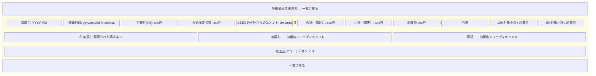

### 2.1 加盟店アコーディオンの構成

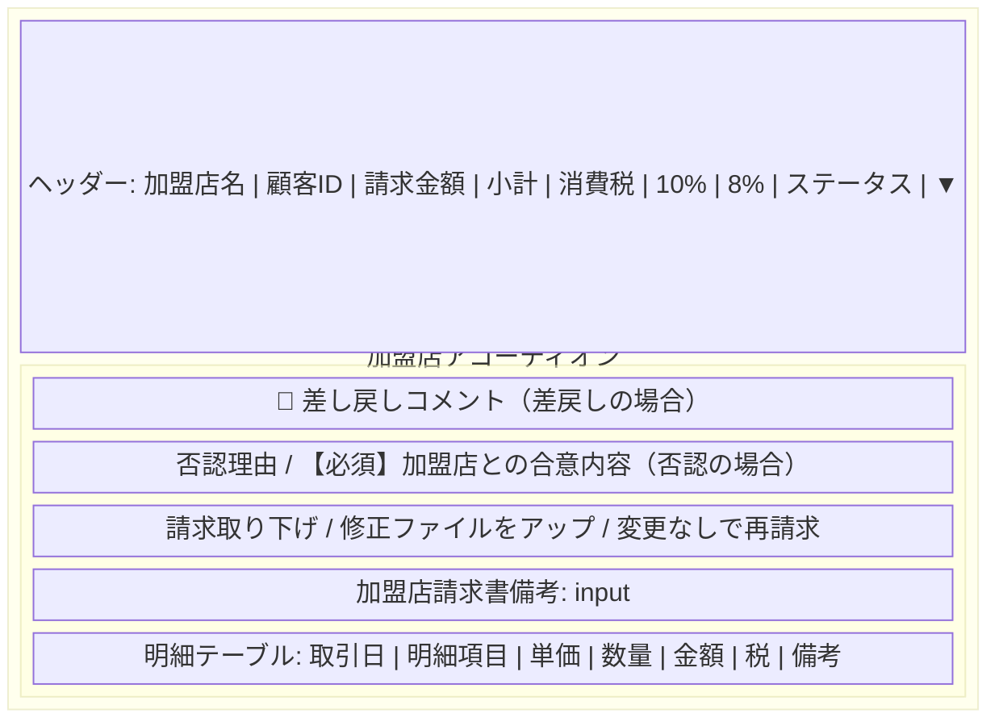

---

## 3. ステータス体系

### 3.1 ステータスバッジ一覧

| `backoffice_review_status` | `invoice_status` | バッジ表示 | バッジクラス | セクション |
|---------------------------|-----------------|-----------|-------------|-----------|
| - | `WITHDRAWN` | ✓ 取下げ済 | `badge--withdrawn` | 否認 |
| `MERCHANT_CONFIRMATION_REQUESTED` | `DISPUTED` | ⊖ 否認差戻 | `badge--disputed` | 否認 |
| `RETURNED` | `DISPUTED` | ⊖ 否認差戻 | `badge--disputed` | 否認 |
| `PENDING_REVIEW` | `DISPUTED` | 未検閲 | `badge--pending` | 否認 |
| `RETURNED` | その他 | ↺ 差戻し | `badge--returned` | 差戻し |
| `MERCHANT_CONFIRMATION_REQUESTED` | `APPROVED` | ✓ 承認 | `badge--approved` | 確認中・承認済み |
| `MERCHANT_CONFIRMATION_REQUESTED` | `PENDING_CONFIRMATION` | 確認中 | `badge--requested` | 確認中・承認済み |
| その他 | その他 | 未検閲 | `badge--pending` | 確認中・承認済み |

### 3.2 セクション振り分けロジック

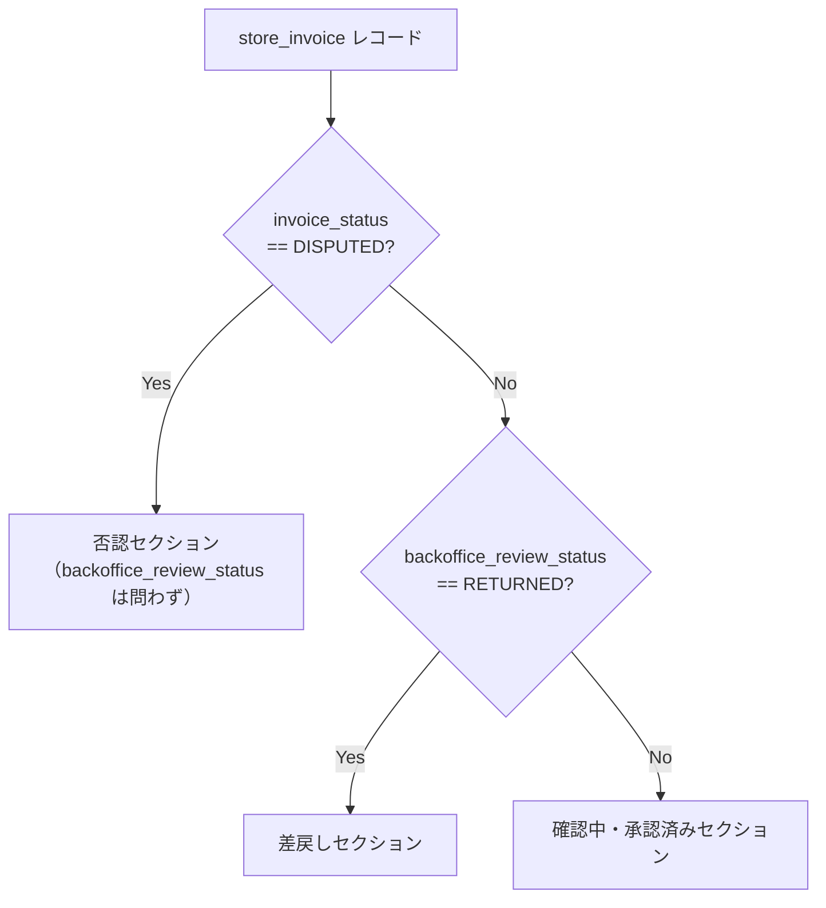

---

## 4. 画面遷移フロー

### 4.1 全体フロー

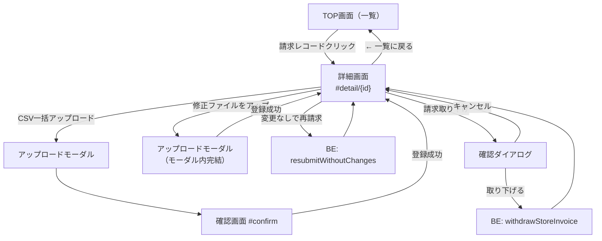

### 4.2 ページ読み込みシーケンス

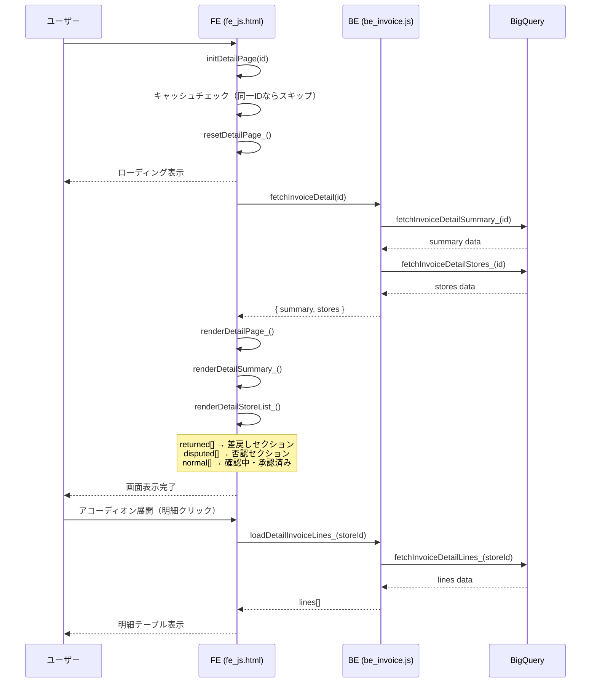

---

## 5. 操作フロー詳細

### 5.1 修正ファイルをアップ（個別リアップロード — モーダル内完結）

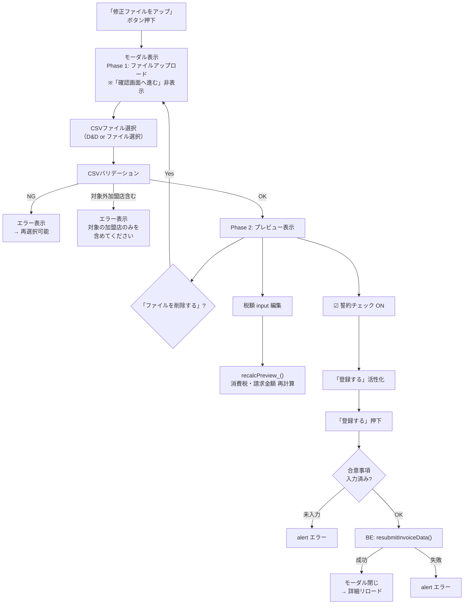

#### シーケンス図

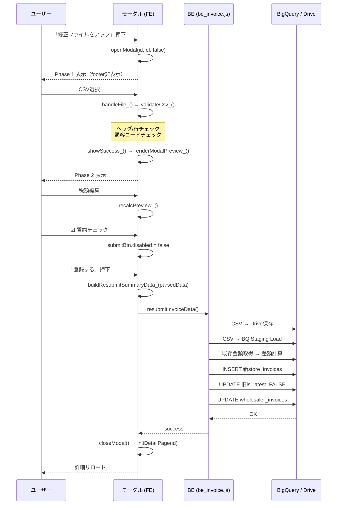

### 5.2 CSV一括アップロード（確認画面経由）

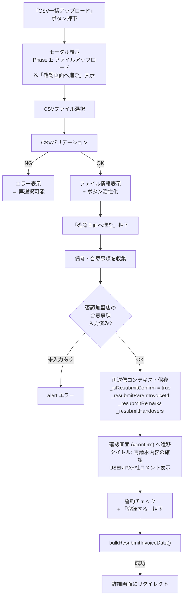

### 5.3 変更なしで再請求

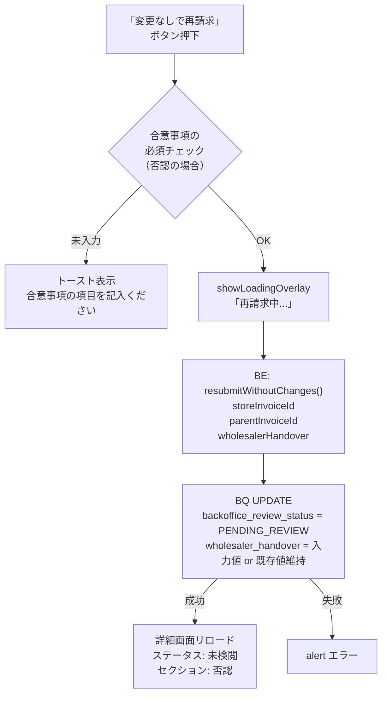

#### シーケンス図

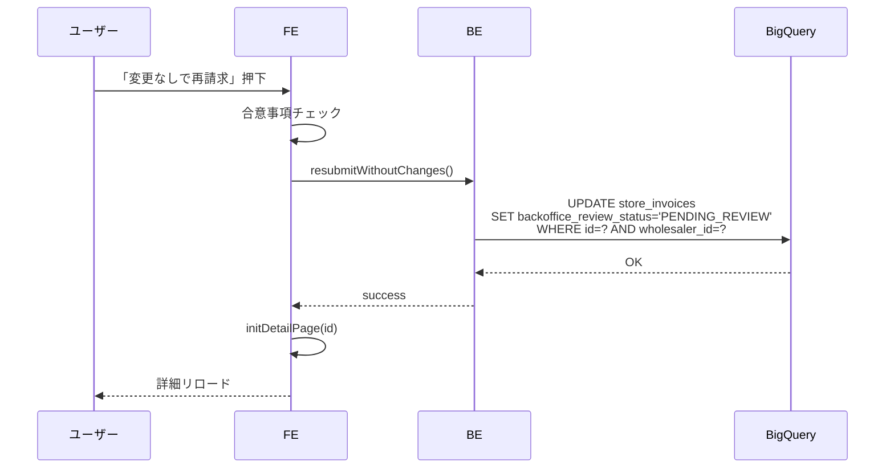

### 5.4 請求取り下げ

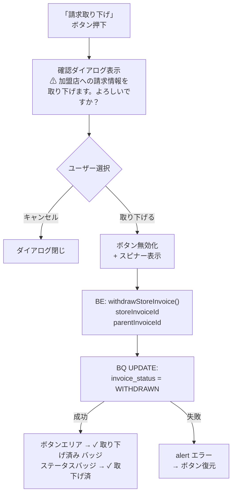

#### シーケンス図

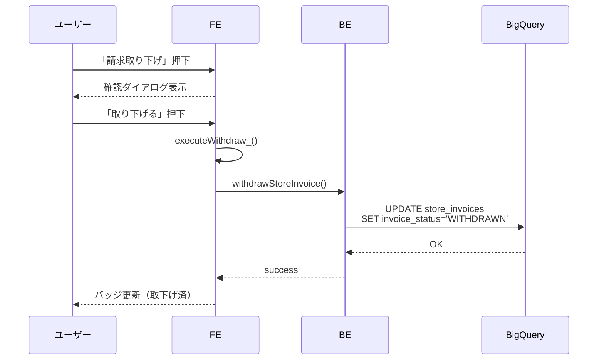

---

## 6. データ構造

### 6.1 API レスポンス: `fetchInvoiceDetail`

```javascript
{
  data: {
    summary: {
      wholesaler_invoice_id: "uuid",
      wholesaler_invoice_date: "2026-03-01",    // → 請求月 (YYYY/MM)
      created_at: "2026/03/15 10:30:00",        // → 登録日時
      invoice_fee_rate: 3.0,                     // → 手数料率
      invoice_fee_amount: 5000,                  // → 手数料額
      payment_amount: 165000,                    // → 振込予定金額
      handover_matter: "...",                     // → USEN PAY社コメント
      total_amount: 170000,                      // → 合計（税込）
      subtotal_amount: 155000,                   // → 小計（税抜）
      tax_amount: 15000,                         // → 消費税
      standard_tax_target_amount: 100000,        // → 10%対象小計
      standard_tax_amount: 10000,                // → 10%消費税
      reduced_tax_target_amount: 55000,          // → 8%対象小計
      reduced_tax_amount: 5000,                  // → 8%消費税
      // wholesaler_invoices の金額フィールド（卸側サマリ）
      wholesaler_total_amount: 170000,
      wholesaler_subtotal_amount: 155000,
      wholesaler_tax_amount: 15000,
      wholesaler_standard_tax_target_amount: 100000,
      wholesaler_standard_tax_amount: 10000,
      wholesaler_reduced_tax_target_amount: 55000,
      wholesaler_reduced_tax_amount: 5000,
    },
    stores: [
      {
        store_invoice_id: "uuid",
        mall_code: "M001",
        store_name: "テスト加盟店1",
        total_amount: 50000,
        subtotal_amount: 45000,
        tax_amount: 5000,
        standard_tax_amount: 3000,
        reduced_tax_amount: 2000,
        backoffice_review_status: "RETURNED",
        invoice_status: "DISPUTED",
        backoffice_handover: "差し戻しコメント",
        store_disputed_reason: "金額間違い",
        wholesaler_handover: "合意事項テキスト",
        wholesaler_remark: "備考テキスト",
      },
      // ... 他の加盟店
    ]
  }
}
```

### 6.2 `buildResubmitSummaryData_` の出力

```javascript
{
  wholesalerTotal: {
    totalAmount: 170000,
    subtotalAmount: 155000,
    taxAmount: 15000,
    exTax10: 100000,
    tax10: 10000,
    exTax8: 55000,
    tax8: 5000,
    feeAmount: 0,
    paymentAmount: 170000,
  },
  merchantTotals: [
    {
      customerCode: "C001",
      totalAmount: 50000,
      subtotalAmount: 45000,
      taxAmount: 5000,
      exTax10: 30000,
      tax10: 3000,
      exTax8: 15000,
      tax8: 2000,
    }
  ]
}
```

### 6.3 CSV パース後データ構造（`parsedData`）

```javascript
[
  {
    customer_code: "C001",
    merchant_name: "テスト加盟店1",
    transaction_date: "2026-03-01",
    item_name: "ガス代",
    unit_price: 1000,
    quantity: 10,
    amount_ex_tax: 10000,
    tax_rate: 10,
    tax_amount: 1000,
    invoice_detail_remark: "備考",
  },
  // ...
]
```

---

## 7. グローバル変数

| 変数名 | 型 | 用途 |
|--------|------|------|
| `_detailCurrentInvoiceId` | `string\|null` | 表示中の `wholesaler_invoice_id`。同一IDの再描画スキップに使用 |
| `_detailActionRequiredMallCodes` | `string[]` | 要対応（差戻し＋否認）の `mall_code` 一覧。バリデーション用 |
| `_detailReturnedOnlyMallCodes` | `string[]` | RETURNED かつ `invoice_status` が null の `mall_code`。CSV未含有時に警告のみ（エラーにしない） |
| `_isResubmitConfirm` | `boolean` | 一括再送信モードで確認画面を表示するフラグ |
| `_resubmitParentInvoiceId` | `string\|null` | 一括再送信時の親請求ID |
| `_resubmitRemarks` | `Object` | 一括再送信時の備考 `{ customerCode: value }` |
| `_resubmitHandovers` | `Object` | 一括再送信時の合意事項 `{ customerCode: value }` |
| `rawCsvBase64` | `string\|null` | 生CSV（Shift-JIS）の Base64。BE送信用 |
| `utf8CsvBase64` | `string\|null` | UTF-8変換CSVの Base64。BQ Load Job用 |
| `parsedData` | `Array\|null` | CSVパース結果の行配列。プレビュー描画・サマリ算出に使用 |

---

## 8. モーダル状態遷移

### 8.1 修正ファイルアップロードモーダル（個別）

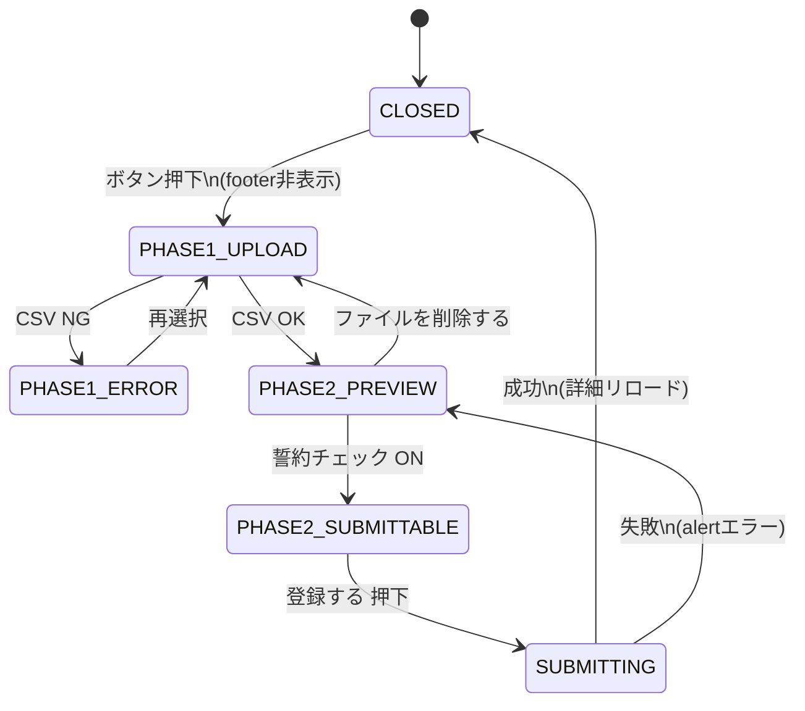

### 8.2 修正ファイルアップロードモーダル（一括）

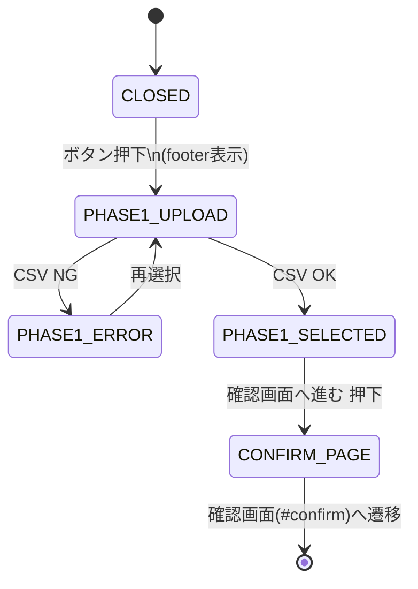

### 8.3 請求取り下げ確認ダイアログ

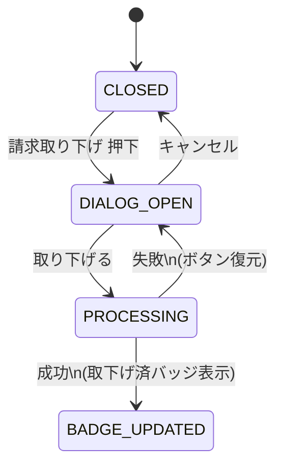

---

## 9. バリデーション

### 9.1 CSV バリデーション（共通）

| チェック項目 | エラー/警告 | 内容 |
|-------------|-----------|------|
| ファイル拡張子 | エラー | `.csv` のみ許可 |
| ヘッダー行 | エラー | 必須カラムの存在確認 |
| データ行 | エラー | 数値・日付フォーマット等 |
| 要対応加盟店の網羅性 | エラー/警告 | CSVに要対応の `mall_code` が含まれているか |

### 9.2 個別リアップロード時の追加チェック

| チェック項目 | タイミング | 内容 |
|-------------|-----------|------|
| 対象外加盟店チェック | `renderModalPreview_` 冒頭 | CSVに対象加盟店以外の `customer_code` が含まれている場合エラー |
| 合意事項 必須 | 「登録する」押下時 | `previewHandoverInput` が空の場合 alert |

### 9.3 一括アップロード時の追加チェック

| チェック項目 | タイミング | 内容 |
|-------------|-----------|------|
| 否認加盟店の合意事項 | 「確認画面へ進む」押下時 | すべての否認加盟店の `handover-input` が入力済みか |
| RETURNED+null 加盟店 | CSV バリデーション時 | 警告のみ（エラーにしない） |
| RETURNED+DISPUTED 加盟店 | CSV バリデーション時 | エラー |

---

## 10. UI デザイン仕様

### 10.1 ステータスバッジ

| バッジ | 文字色 | 背景色 | アイコン |
|--------|--------|--------|---------|
| 取下げ済 | `#159E85` | `#CDF6EF` | `fa-check` |
| 否認差戻 | (disputed色) | (disputed背景) | `fa-minus-circle` |
| 差戻し | (returned色) | (returned背景) | `fa-rotate-left` |
| 承認 | (approved色) | (approved背景) | `fa-circle-check` |
| 確認中 | (requested色) | (requested背景) | なし |
| 未検閲 | (pending色) | (pending背景) | なし |

### 10.2 アクションボタン（否認セクション）

| ボタン | アイコン色 | テキストスタイル |
|--------|----------|----------------|
| 請求取り下げ | `#DF4C4C` | 14px / normal / 400 / color `#3C3C3C` |
| 修正ファイルをアップ | `#00A7B8` | 14px / normal / 400 |
| 変更なしで再請求 | `#00A7B8` | 14px / normal / 400 |

### 10.3 取り下げ確認ダイアログ

| 項目 | 値 |
|------|-----|
| ダイアログサイズ | 505 × 291px |
| 背景色 | `#FFF1EC` |
| ボーダー | 2px solid `#DF4C4C` |
| タイトル色 | `#FF7846`、font: 16px / 700 / 140% |
| 本文 | font: 16px / 400 / 120% |
| 「取り下げる」ボタン | 212 × 40px、背景 `#00A7B8`、角丸 999px |
| 「キャンセル」ボタン | 212 × 40px、outline、角丸 999px |

### 10.4 モーダル内プレビュー

| 項目 | 値 |
|------|-----|
| モーダル幅 | 1121px |
| 金額ヘッダー | `store-accordion__header` クラス（詳細画面と同一） |
| 否認理由・合意事項 | `backoffice-remark` クラス（詳細画面と同一） |
| 備考 | `store-accordion__remarks` クラス（詳細画面と同一） |
| 明細テーブル | `detail-table` クラス、max-height: 300px、スクロール可能 |
| 明細ヘッダー | sticky 固定、背景 `#EAEBED` |
| カード角丸 | `border-radius: 8px`、`border: 1px solid #E0E0E0` |

---

## 11. BE API 仕様

### 11.1 `fetchInvoiceDetail(invoiceId)`

| 項目 | 内容 |
|------|------|
| 引数 | `invoiceId`: `wholesaler_invoice_id` |
| 処理 | `fetchInvoiceDetailSummary_` + `fetchInvoiceDetailStores_` を呼び出し |
| 戻り値 | `{ data: { summary, stores } }` |
| IDOR保護 | `wholesaler_id` によるフィルタリング |

### 11.2 `resubmitInvoiceData(rawCsv, utf8Csv, summaryData, remarks, parentId, storeId, handover)`

| 項目 | 内容 |
|------|------|
| 処理 | CSV → Drive保存 → BQ Staging Load → 差額計算 → トランザクション実行 |
| トランザクション内容 | 新 `store_invoices` INSERT + 旧 `is_latest=FALSE` + `wholesaler_invoices` 金額更新 |

### 11.3 `resubmitWithoutChanges(storeInvoiceId, parentInvoiceId, wholesalerHandover)`

| 項目 | 内容 |
|------|------|
| 処理 | `backoffice_review_status` → `PENDING_REVIEW` に更新 |
| 条件 | RETURNED または (MERCHANT_CONFIRMATION_REQUESTED + DISPUTED) のレコードのみ |

### 11.4 `withdrawStoreInvoice(storeInvoiceId, parentInvoiceId)`

| 項目 | 内容 |
|------|------|
| 処理 | `invoice_status` → `WITHDRAWN` に更新 |
| IDOR保護 | `wholesaler_id` + `wholesaler_invoice_id` でフィルタリング |

---

## 12. BQ テーブル参照

### 使用テーブル

| テーブル | 用途 |
|---------|------|
| `wholesaler_invoices` | 親請求情報（金額サマリ、手数料、振込予定額） |
| `store_invoices` | 加盟店別請求（ステータス、金額、備考、合意事項） |
| `invoice_lines` | 明細行（品名、単価、数量、税率） |
| `merchant_mappings` | `mall_code` ↔ `customer_code` 変換 |
| `store` | 加盟店名の取得 |

### 主要クエリ

| 関数 | 対象テーブル | 概要 |
|------|------------|------|
| `fetchInvoiceDetailSummary_` | `wholesaler_invoices` | 親請求の最新レコードを取得 |
| `fetchInvoiceDetailStores_` | `store_invoices` JOIN `store` | 加盟店別請求一覧（`is_latest=TRUE`） |
| `fetchInvoiceDetailLines_` | `invoice_lines` JOIN `store_invoices` | 明細行（最大1000行） |
