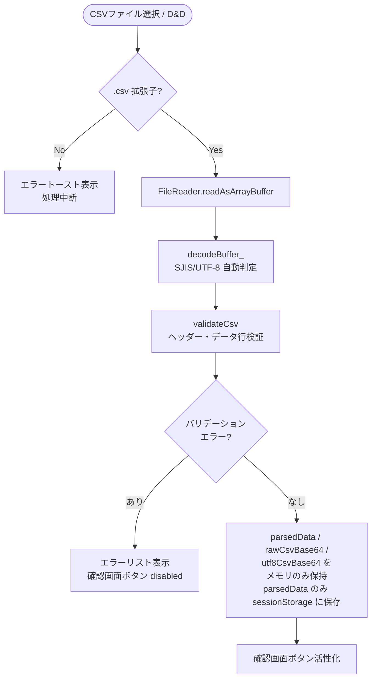
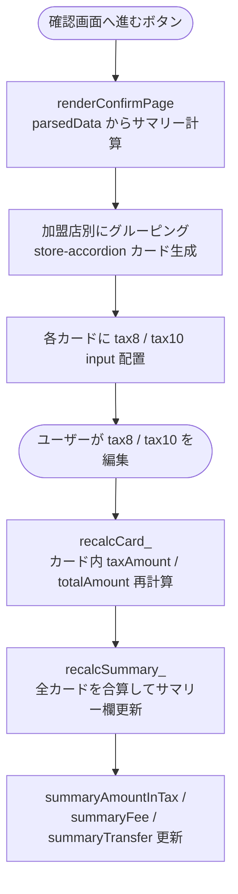
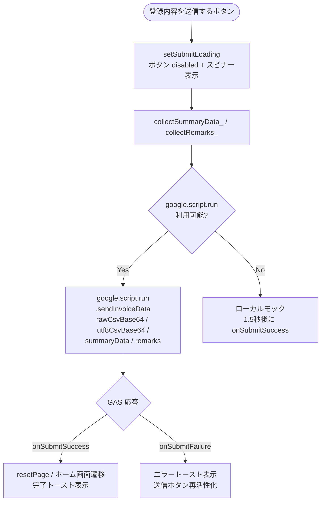
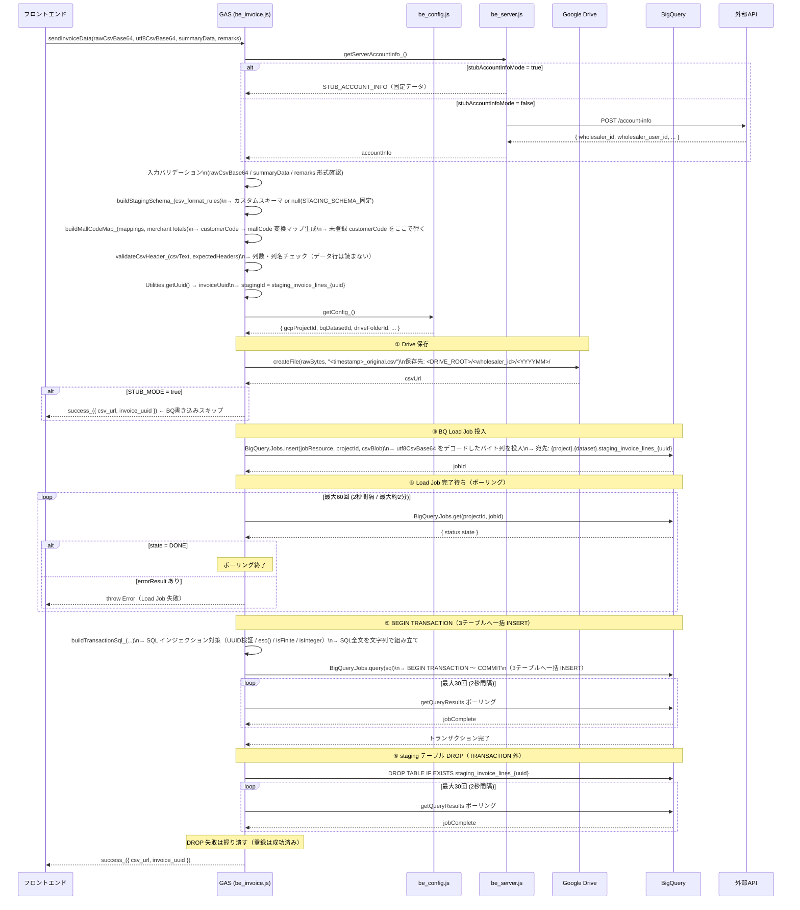
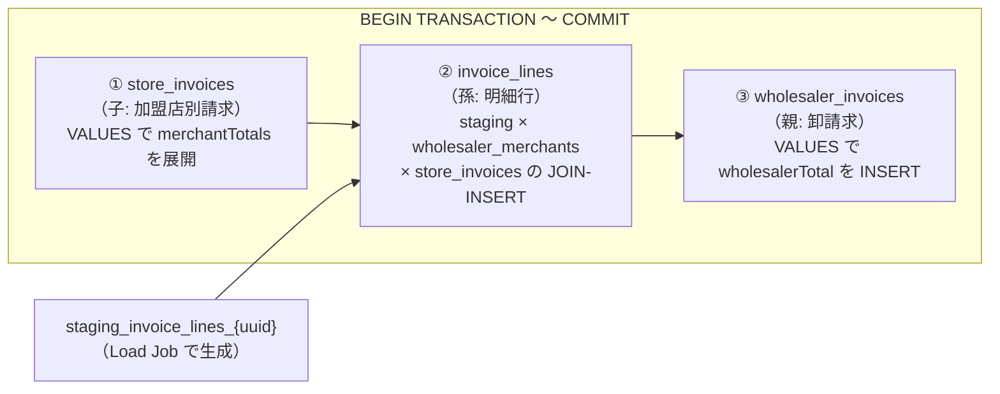

# CSV アップロード → BigQuery 登録 一気通貫フロー

> **対象ブランチ**: `feature/insert-bq-invoice-data-fix`  
> **最終更新**: 2026-05-22

---

## 1. 全体概要

```
ブラウザ (GAS Webアプリ)          GAS サーバー                  外部サービス
─────────────────────────         ──────────────────────         ───────────────────
① CSVファイル選択・検証
② 確認画面で金額確認・編集
③ 送信ボタン押下
                          ──────> ④ アカウント情報取得
                                  ⑤ ヘッダー行検証
                                  ⑥ Drive に CSV 保存       →  Google Drive
                                  ⑦ BQ Load Job 投入        →  BigQuery (staging)
                                  ⑧ Load Job 完了待ち       ←  BigQuery
                                  ⑨ BQ トランザクション実行  →  BigQuery (3テーブル)
                                  ⑩ staging テーブル DROP   →  BigQuery
                          <─────  ⑪ 完了レスポンス
④ ホーム画面へ遷移・完了トースト表示
```

---

## 2. フロントエンド処理フロー（`fe_js.html`）

### 2-1. ファイル読み込み・バリデーション



**主な検証内容（`validateCsv`）**

| チェック項目 | 詳細 |
|---|---|
| ヘッダー列数 | `csv_format_rules` が定義する列数と一致しているか |
| ヘッダー列名 | 各列名が期待値と完全一致しているか（順序含む） |
| データ行列数 | ヘッダーと同じ列数か |
| 型チェック | `date` / `integer` / `string` / `enum` |
| customer_code | `merchant_mappings` の有効コードに存在するか |

---

### 2-2. 確認画面の描画と金額再計算



**収集データ（送信直前）**

| 関数 | 収集内容 |
|---|---|
| `collectSummaryData_()` | `wholesalerTotal`（合計金額）+ `merchantTotals`（加盟店別金額） |
| `collectRemarks_()` | 加盟店別備考テキスト |

---

### 2-3. 送信処理



---

## 3. バックエンド処理フロー（GAS）

### 3-1. `sendInvoiceData` 全体シーケンス



---

### 3-2. BQ トランザクション内の INSERT 順序

> BQ のトランザクションは失敗時に全ロールバックされる。  
> 親テーブルを最後に INSERT することで、子・孫の INSERT 失敗時も親レコードが残らない。



**各テーブルへの INSERT 内容**

| テーブル | データソース | 主なフィールド |
|---|---|---|
| `store_invoices` | `summaryData.merchantTotals` | mall_code, total_amount, tax_amount, backoffice_review_status='PENDING_REVIEW' |
| `invoice_lines` | staging テーブル（CSV明細） | transaction_date, item_name, quantity, unit_price, tax_category, line_amount_excluding_tax |
| `wholesaler_invoices` | `summaryData.wholesalerTotal` | wholesaler_total_amount, wholesaler_fee_rate, payment_amount, invoice_csv_url |

---

## 4. セキュリティ設計

### 4-1. サーバー側で固定する値（フロントから受け取らない）

| 値 | 取得元 |
|---|---|
| `wholesaler_id` | `getServerAccountInfo_()` → Script Properties / BackOffice API |
| `wholesaler_user_id` | 同上 |
| `mall_code` | `merchant_mappings`（サーバー側の accountInfo を参照） |
| `fee_rate` | 同上 |

### 4-2. SQL インジェクション対策

BQ のマルチステートメントトランザクション内では named parameter (`@param`) が使用不可のため、以下の対策を組み合わせている。

| 値の種類 | 対策 |
|---|---|
| 文字列（remarks, csvUrl 等） | `esc()` でシングルクォートを `''` にエスケープ |
| 金額（整数） | `Number()` キャスト + `isFinite()` + `>= 0` + `Number.isInteger()` |
| UUID（invoiceUuid, wsUserId） | `/^[0-9a-f]{8}-...-[0-9a-f]{12}$/i` 正規表現検証 |
| staging テーブル名 | `/^[a-zA-Z0-9_]+$/` 正規表現検証 |
| customerCode | `buildMallCodeMap_()` で `merchant_mappings` に存在するか検証 |

### 4-3. 金額の改ざん防止（POC の割り切り）

- **操作者は卸業者自身**のため、自分が損する改ざんの動機がない
- 登録後に `backoffice_review_status = 'PENDING_REVIEW'` でバックオフィスが目視確認する
- **本番実装時の宿題**: Load Job 完了後に staging を BQ で再集計し、`summaryData` との差異が許容範囲を超えた場合はエラーにする

---

## 5. エラーハンドリング

| フェーズ | エラー内容 | 挙動 |
|---|---|---|
| CSVバリデーション | ヘッダー不一致・型エラー等 | エラーリスト表示、送信ボタン disabled のまま |
| Drive 保存失敗 | フォルダ権限エラー等 | `sendInvoiceData` が throw → `onSubmitFailure` → エラートースト |
| Load Job 投入失敗 | BQ API エラー | 同上 |
| Load Job タイムアウト | 約2分経過 | 同上 |
| トランザクション失敗 | SQL エラー・BQ が自動ロールバック | 同上 |
| staging DROP 失敗 | テーブル残存（手動削除が必要） | **エラーはフロントに返さない**（登録は完了しているため） |

---

## 6. データフロー図（ファイル・テーブル対応）

```
[ブラウザ]
  │
  ├─ rawCsvBase64 ───────────────────────────────────────> Google Drive
  │    元ファイルのバイト列そのまま                         <wholesaler_id>/<YYYYMM>/
  │    (SJIS の場合もそのまま保存)                          <timestamp>_original.csv
  │
  └─ utf8CsvBase64 ─────────────────────────────────────> BigQuery
       SJIS→UTF-8変換済みバイト列                          staging_invoice_lines_{uuid}
       (BQ Load Job は UTF-8 のみサポート)                  ↓ JOIN
                                                           wholesaler_merchants
                                                           ↓ INSERT → invoice_lines
                                                           ↓ INSERT → store_invoices
                                                           ↓ INSERT → wholesaler_invoices
                                                           ↓ DROP
                                                           staging_invoice_lines_{uuid}
```

---

## 7. 関連ファイル一覧

| ファイル | 役割 |
|---|---|
| `src/fe_js.html` | CSV読み込み・バリデーション・確認画面描画・送信処理 |
| `src/fe_page_confirm.html` | 確認画面 HTML テンプレート |
| `src/be_invoice.js` | `sendInvoiceData` 公開関数・SQL組み立て・Drive保存 |
| `src/db_bq_connection.js` | Load Job投入・ポーリング・トランザクション実行・staging DROP |
| `src/db_bq_query.js` | BQ 参照系クエリ（請求一覧・詳細） |
| `src/be_server.js` | GASエントリポイント・アカウント情報取得 |
| `src/be_config.js` | Script Properties 読み込み・上書きヘルパー |
| `src/be_utils.js` | `success_()` / `getOrCreateSubFolder_()` 等のユーティリティ |
| `docs/plan/bq_table_create_ddl.sql` | BQ テーブル DDL |
| `docs/plan/load_job_staging_design.md` | Load Job ハイブリッド方式の設計詳細 |
