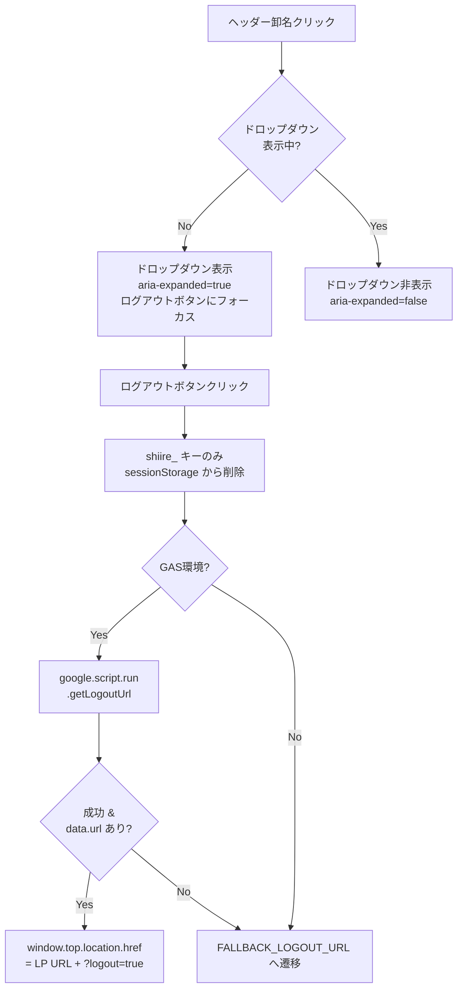
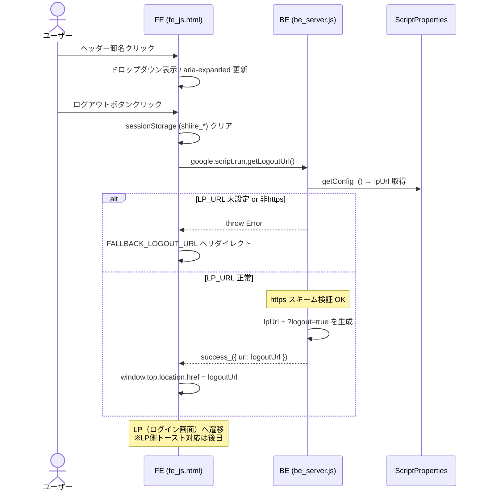

# PR 作業まとめ: MYP-3709 ログアウト処理追加

## 概要

ヘッダーの卸名（会社名）クリックでログアウト用ドロップダウンメニューを表示し、ログアウトボタン押下で `sessionStorage` クリア → LP（ログイン画面）へリダイレクトする機能を追加した。  
リダイレクト先 LP URL は `ScriptProperties` で環境別に管理し、バックエンド側で https スキームの検証を行うことでオープンリダイレクト/XSS を防止している。  
LP 側のログアウトトースト表示対応は `docs/plan/logout_feature_design.md` に設計を記録し、後日 `wholesale-portal-lp` リポジトリで対応予定。

## 対象ブランチ

`feature/MYP-3709-implement-logout` → `develop`

---

## 変更ファイル一覧

| ファイル | 変更種別 | 変更内容 |
|----------|---------|---------|
| `src/be_config.js` | 変更 | `getConfig_()` に `lpUrl` プロパティ追加、`setupScriptProperties()` に `LP_URL` 追加、`overwriteLpUrl()` ヘルパー追加、プロパティ一覧コメントに `LP_URL` 追記 |
| `src/be_server.js` | 変更 | `getLogoutUrl()` 公開関数を追加（LP URL + `?logout=true` を返却、https スキーム検証付き） |
| `src/fe_part_header.html` | 変更 | 卸名エリアを実 `<button>` トリガー + 兄弟ドロップダウンに構造変更。アクセシビリティ属性（`aria-haspopup` / `aria-expanded` / `aria-controls`）を追加 |
| `src/fe_css.html` | 変更 | `.header-store-trigger`（ボタンリセット + focus-visible）、`.header-store-dropdown`（絶対配置メニュー）、`.header-store-chevron`（回転アニメーション）のスタイルを追加 |
| `src/fe_js.html` | 変更 | ドロップダウン開閉ロジック（IIFE `initHeaderStoreDropdown`）とログアウト処理（IIFE `initLogout`）を追加 |
| `src/db_bq_query.js` | 変更 | 請求一覧取得クエリの結合ロジックを変更（`IN (SELECT ...)` → `JOIN ranked` 経由） ※ログアウトとは別件 |

---

## 設計方針

### ログアウトURL管理方式

| 方式 | 採用理由 |
|------|---------|
| `ScriptProperties` で `LP_URL` を管理 | 開発/本番で LP URL が異なるため環境変数方式を採用。フロントへのハードコードを避けセキュリティを確保 |
| バックエンドで https 検証 | `javascript:` / `data:` 等の危険スキームによるオープンリダイレクト/XSS を防止 |
| フォールバック URL をローカル定数化 | 3箇所の重複を `FALLBACK_LOGOUT_URL` 定数にまとめ、修正漏れを防止 |

### アクセシビリティ対応

| 対応内容 | 方式 |
|----------|------|
| トリガー要素 | `
` → 実 `<button>` に変更（ネイティブキーボード操作対応） |
| インタラクティブ要素のネスト回避 | ドロップダウンをトリガーボタンの兄弟要素に分離 |
| ARIA 属性 | `aria-haspopup="true"` / `aria-expanded` / `aria-controls` をトリガーに付与 |
| アクセシブルネーム | `aria-label` ではなく `visually-hidden` テキストで卸名 + 補足テキストの両方を読み上げ |
| ARIAロール | `role="menu"` / `role="menuitem"` は不使用（矢印キーナビの実装不要なため通常ボタンとして扱う） |
| キーボード操作 | Enter/Space（ネイティブ click）でトグル、Escape で閉じてトリガーへフォーカス戻し |

### sessionStorage クリア方式

| Before | After |
|--------|-------|
| `sessionStorage.clear()` | `shiire_` プレフィックスのキーのみ削除 |

同一オリジンの他アプリへの副作用を防止するため、プレフィックスベースの選択的削除に変更。

---

## 全体フロー図

### ログアウト処理フロー

### シーケンス図

---

## 変更詳細

### `src/be_config.js`

- `getConfig_()`: `LP_URL` の取得を追加（未設定時は空文字フォールバック）。戻り値オブジェクトに `lpUrl` を追加
- `setupScriptProperties()`: `LP_URL` のデフォルト値（`https://connect-dev.usen-pay.com/`）を追加
- `overwriteLpUrl()`: GASエディタから直接実行して `LP_URL` を設定するためのヘルパー関数を新規追加
- ファイル先頭のプロパティ一覧コメントに `LP_URL` の説明を追記

### `src/be_server.js`

- `getLogoutUrl()`: フロントから `google.script.run` 経由で呼ばれる公開関数を新規追加
  - `getConfig_()` から `lpUrl` を取得
  - 空チェック → https スキーム検証 → `?logout=true` パラメータ付与 → `success_()` で返却
  - エラー時は `logError_()` でログ出力後、ユーザー向けメッセージを throw

### `src/fe_part_header.html`

- `.header-store` を非インタラクティブなラッパー `
` に変更（`id="headerStoreArea"`）
- 内部に実 `<button class="header-store-trigger">` を追加（`aria-haspopup` / `aria-expanded` / `aria-controls`）
- ドロップダウン（`.header-store-dropdown`）をトリガーボタンの兄弟要素として配置
- `visually-hidden` テキスト「アカウントメニュー」をボタン内に追加（卸名と合わせてスクリーンリーダーが読み上げ）
- 装飾アイコン（SVG / `<i>`）に `aria-hidden="true"` を追加

### `src/fe_css.html`

- `#headerStoreArea`: ID セレクタで `position: relative`（既存 `.header-store` との重複回避）
- `.header-store-trigger`: ネイティブ `<button>` のリセット + `:hover` / `:focus-visible` スタイル
- `.header-store-trigger span`: 卸名テキストのスタイル（既存 `.header-store span` から移行）
- `.header-store-chevron`: シェブロンアイコン + `.is-open` 時の 180° 回転アニメーション
- `.header-store-dropdown`: 絶対配置メニュー（白背景・角丸・ボックスシャドウ）
- `.header-store-dropdown__item`: メニュー項目のスタイル（ホバーエフェクト付き）
- セクションコメントの重複を解消（`Store Dropdown` / `Store Dropdown Menu` に分離）

### `src/fe_js.html`

- `initHeaderStoreDropdown`（IIFE）: ドロップダウン開閉ロジック
  - `openDropdown()` / `closeDropdown()` に共通化し、`aria-expanded` を同期
  - クリックでトグル（実 `<button>` なので Enter/Space もネイティブ click として発火）
  - Escape キーで閉じてトリガーへフォーカス戻し
  - `document` クリックで外側クリック時に閉じる
- `initLogout`（IIFE）: ログアウト処理
  - `FALLBACK_LOGOUT_URL` 定数でフォールバック URL を一元管理
  - `shiire_` プレフィックスのキーのみ選択的に `sessionStorage.removeItem()`
  - `google.script.run.getLogoutUrl()` で LP URL を取得 → `window.top.location.href` でリダイレクト
  - 成功ハンドラで `data.url` なしの場合もフォールバック遷移

### `src/db_bq_query.js`（※ログアウトとは別件）

- 請求一覧取得クエリの `store_invoices` への結合方法を変更
  - Before: `IN (SELECT rr.id FROM ranked rr WHERE rr.root_id = wi.root_id)`
  - After: `JOIN ranked AS rr ON rr.root_id = wi.root_id` → `ON si.wholesaler_invoice_id = rr.id`

---

## コーディングルール準拠

| ルール | 対応 |
|--------|------|
| `var` 禁止 → `const` / `let` 使用 | ✅ |
| 内部関数は末尾 `_` | ✅（`getConfig_` 等の既存内部関数を利用） |
| 公開関数は `function` キーワードで定義 | ✅（`getLogoutUrl`） |
| フロントの IIFE パターン準拠 | ✅（`initHeaderStoreDropdown` / `initLogout`） |
| `withFailureHandler` 設定 | ✅ |
| CSS は `fe_css.html` に追記 | ✅ |
| JS は `fe_js.html` に追記 | ✅ |

---

## 影響範囲

- **機能影響**: ヘッダーの卸名エリアの HTML 構造が `
` → `<button>` + ドロップダウンに変更。既存の卸名表示（`#headerWholesalerName`）は維持されており、`saveAccountInfo()` による値セットに影響なし
- **パフォーマンス影響**: なし（ログアウト時の `getLogoutUrl()` は `ScriptProperties` の読み取りのみ）
- **後日対応**: LP リポジトリ（`wholesale-portal-lp`）で `?logout=true` パラメータ検知時のトースト表示を実装する必要あり（設計は `docs/plan/logout_feature_design.md` に記載済み）。本番 LP URL の `ScriptProperties` 設定も別途必要
