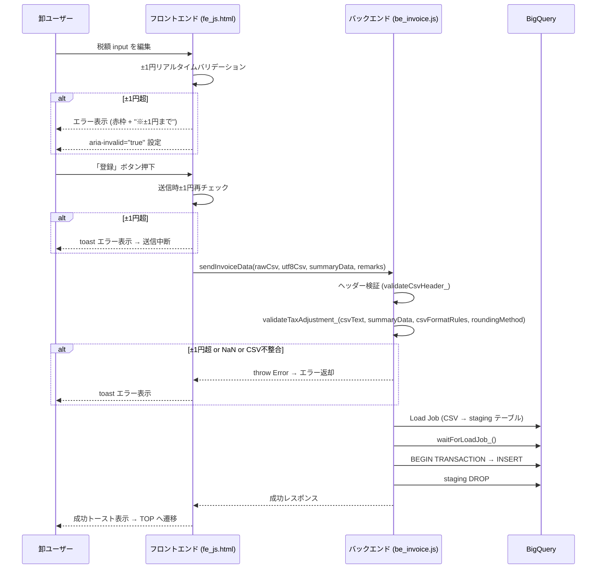
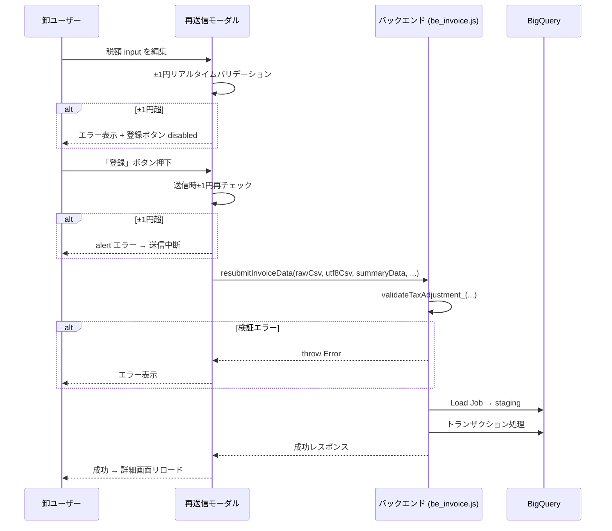
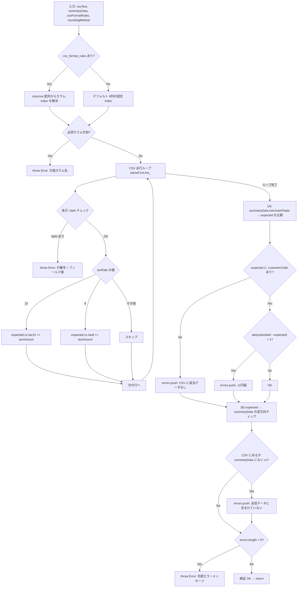
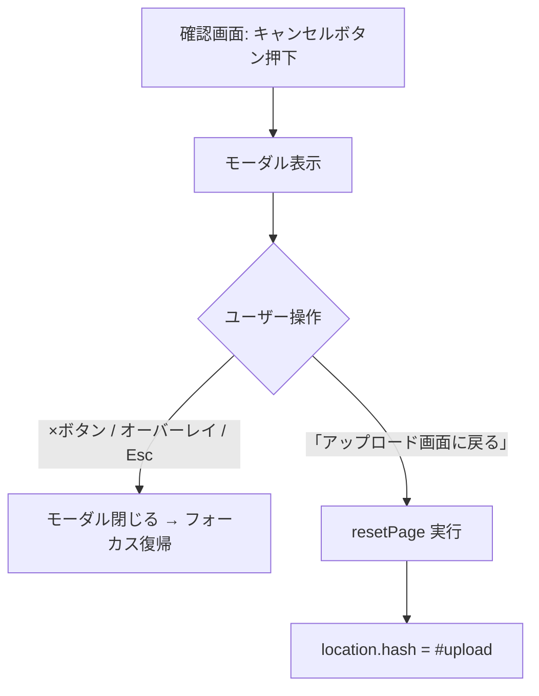
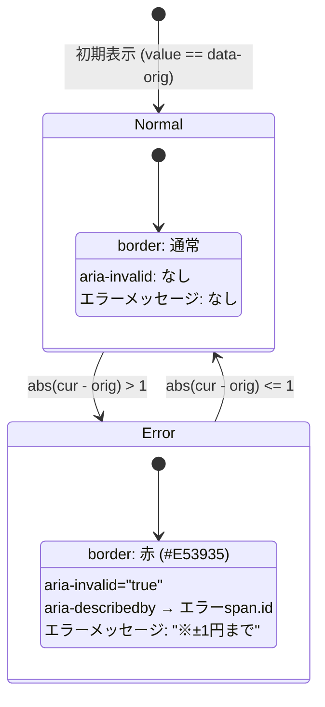
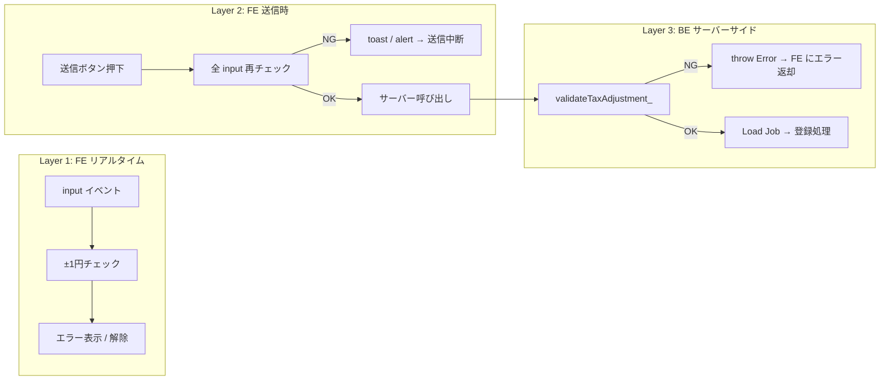

# PR #29 MYP-3710【卸】消費税の修正の対応

## 概要

確認画面・詳細画面（再送信モーダル）の税額 input に対して **±1円バリデーション** を追加し、不正な税額調整を防止する。また、UX 改善として確認画面のナビゲーション変更・キャンセルボタン追加・成功トースト文言変更を実施。

---

## 変更ファイル一覧

| ファイル | 変更内容 |
|---|---|
| `src/be_invoice.js` | `validateTaxAdjustment_` 新規追加、3エントリーポイントへの呼び出し追加、設計コメント更新 |
| `src/fe_js.html` | FE 税額±1円バリデーション、キャンセルモーダル制御、DOM スコーピング修正、トースト文言変更、税率分岐修正 |
| `src/fe_css.html` | エラースタイル追加、キャンセルボタン/モーダル幅レスポンシブ対応、`position: relative` 追加 |
| `src/fe_page_confirm.html` | キャンセルボタン HTML、キャンセル確認モーダル HTML 追加 |

---

## 機能一覧

### 1. 税額±1円バリデーション（FE リアルタイム）

確認画面・再送信モーダルの tax10/tax8 input で、入力値が CSV 計算値から ±1円を超えた場合にエラー表示。

### 2. 税額±1円バリデーション（FE 送信時ブロック）

送信ボタンクリック時に再チェックし、±1円超の場合は送信をブロック。

### 3. 税額±1円バリデーション（BE サーバーサイド防御）

`validateTaxAdjustment_` で CSV 全行をパースして期待税額を再計算し、`summaryData` との乖離が ±1円超ならエラー。
双方向チェックにより、改ざんで加盟店を落とす攻撃も検知する。
- (A) summaryData にあるが CSV にない加盟店 → エラー
- (B) CSV にあるが summaryData にない加盟店 → エラー

### 4. 確認画面キャンセルボタン + モーダル

確認画面に「キャンセル」ボタンを追加。押下でモーダル表示 → OK でアップロード画面へ遷移。

### 5. 確認画面「戻る」ボタンの遷移先変更

確認画面下部の戻るボタン（既存のキャンセルモーダル経由）の遷移先を `#upload` → `#home` に変更。

### 6. 成功トースト文言変更

登録完了時のトースト本文を入金日表示から、差戻・否認時の再対応依頼文言に変更。

### 7. アクセシビリティ対応

`aria-invalid` / `aria-describedby` をエラー時に付与し、スクリーンリーダーにエラー状態を通知。

### 8. 再送信モーダル誓約チェック × 税額エラーのボタン制御

誓約チェックボックス ON 時に `.amount-input--error` が存在するかを確認し、税額エラーが残っている場合はボタンを `disabled` のまま維持。

### 9. コード品質改善

- `var` → `const/let`
- `else` → `else if (taxRate === 8)` で明示的分岐
- DOM クエリのスコーピング（`document.querySelectorAll` → `confirmList.querySelectorAll`）

---

## シーケンス図

### 初回送信フロー（税額検証含む）

### 再送信フロー（詳細画面モーダル）

---

## フロー図

### 税額±1円バリデーション処理（BE: validateTaxAdjustment_）

### 確認画面キャンセルフロー

### FE 税額±1円バリデーション状態管理

---

## バリデーション防御レイヤー

---

## 主要な設計判断

| 項目 | 判断 | 理由 |
|---|---|---|
| BE の CSV パース方式 | GAS 上で `parseCsvLine_` ループ | POC（GAS+BQ）では 10万行でも GAS 制限内。本番(Kotlin)では DB 集計に切り替え |
| 検証呼び出し位置 | ヘッダー検証の直後（Load Job 前） | Load Job 前に弾くことで不要な BQ リソース消費を防ぐ |
| 丸め方式 | `accountInfo.tax_rounding_method` | 卸毎に floor/ceil/round を設定可能 |
| 税率分岐 | `if (10)` / `else if (8)` | 0%やその他の税率は集計対象外（明示的に除外） |
| DOM スコーピング | `confirmList.querySelectorAll` | SPA で全ページが同一 DOM に存在するため、ページ単位でスコープを限定 |
| キャンセルモーダル max-width | `calc(100vw - 32px)` | 狭い画面でのはみ出し防止 |
| アクセシビリティ | `aria-invalid` + `aria-describedby` | スクリーンリーダーにエラー状態を伝達 |
| 加盟店落とし防止 | CSV → summaryData の逆方向チェック追加 | summaryData のみチェックでは CSV 側の加盟店を削除する改ざんを検知できないため |
| invoice_lines の税額 | CSV 原本値を保持（補正しない） | 明細は CSV の忠実なコピーとして保全。±1円差は丸め由来であり実害なし。本番移行時に再設計 |
| モーダルボタン制御 | 誓約チェック ON 時にも税額エラーを確認 | チェック切替だけでエラー中のボタンが有効化される不整合を防止 |

---

## テスト観点

| # | 観点 | 確認内容 |
|---|---|---|
| 1 | FE ±1円以内 | tax10/tax8 を ±1円変更 → エラー出ない、送信可能 |
| 2 | FE ±2円以上 | 赤枠 + "※±1円まで" 表示、送信ブロック |
| 3 | FE エラー解除 | 値を戻す → エラー消える、aria-invalid 除去 |
| 4 | BE 正常系 | CSV 計算値と summaryData が ±1円以内 → 登録成功 |
| 5 | BE ±1円超 | 改ざん summaryData を送信 → エラーレスポンス |
| 6 | BE NaN | CSV に数値不正行 → 行番号付きエラー |
| 7 | BE CSV 不一致 | summaryData に CSV にない customerCode → エラー |
| 8 | キャンセルモーダル | ボタン押下 → モーダル表示 → OK でアップロード画面 |
| 9 | キャンセルモーダル閉じ | ×/Esc/オーバーレイ → 閉じる、フォーカス復帰 |
| 10 | 戻るボタン | 確認画面下部の戻る → `#home` へ遷移 |
| 11 | 成功トースト | 登録成功 → 新文言で表示 |
| 12 | モーダル(詳細) ±1円 | 再送信モーダルでも同様のバリデーション動作 |
| 13 | レスポンシブ | 狭い画面でモーダルがはみ出さない |
| 14 | スクリーンリーダー | エラー時に aria-invalid が読み上げられる |
| 15 | BE 加盟店落とし | CSV に3加盟店あり summaryData を2加盟店に改ざん → エラー |
| 16 | モーダル誓約+エラー | 税額エラー中に誓約チェック ON/OFF → ボタンは disabled のまま |
