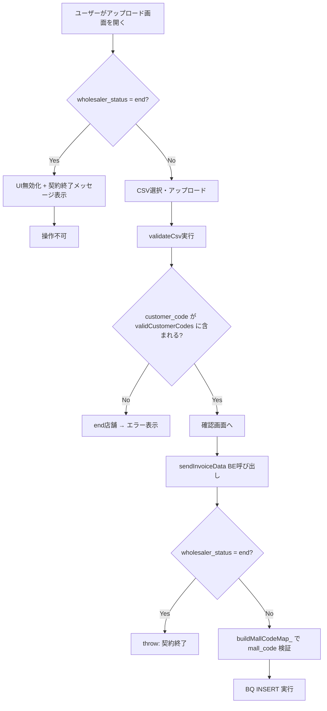
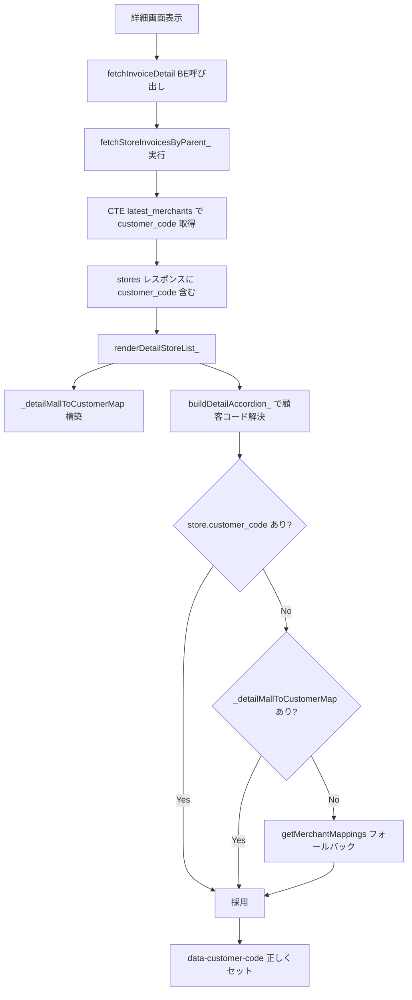
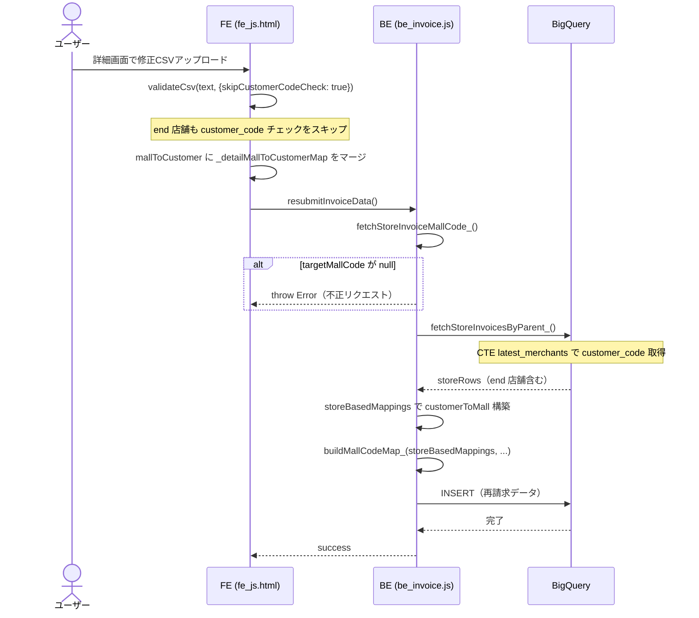

# PR 作業まとめ: MYP-3713 加盟店・卸ステータス制御（store_status / wholesaler_status）

## 概要

`store_status=end` の加盟店を新規請求から除外し（再請求は維持）、`wholesaler_status=end` の卸業者による新規請求を不可化する（ログイン・再請求は維持）。  
これにより、契約終了済みの加盟店・卸業者に対する不適切な請求発生を防止する。  
FE/BE の二重ガード構造で新規請求をブロックしつつ、詳細画面からの再請求パスは store 由来マップで end 店舗も変換可能にしている。

## 対象ブランチ

`feature/MYP-3713-bug-fix` → `develop`

---

## 変更ファイル一覧

| ファイル | 変更種別 | 変更内容 |
|----------|---------|---------|
| `src/db_bq_query.js` | 変更 | `fetchAccountInfoByEmail_`: JOIN緩和(`IN ('active','end')`) + `wholesaler_status` 追加 + フィルタ強化(`r.store_name`)。`fetchStoreInvoicesByParent_`: CTE で `customer_code` を追加 |
| `src/be_invoice.js` | 変更 | `sendInvoiceData`: 契約終了卸の新規請求ブロック。`resubmitInvoiceData` / `bulkResubmitInvoiceData`: `customerToMall` を store 由来に差し替え + `targetMallCode` null ガード |
| `src/fe_js.html` | 変更 | `saveAccountInfo`: `wholesaler_status` 保存。`checkUploadDeadline_`: 契約終了UI無効化。`validateCsv`: `skipCustomerCodeCheck` オプション追加。詳細画面: `_detailMallToCustomerMap` 構築 + `buildDetailAccordion_` の顧客コード解決統一 |
| `src/be_main.js` | 変更 | タイトル文言修正（「Portal Site」削除） |
| `src/fe_index.html` | 変更 | タイトル文言修正 |
| `src/fe_part_header.html` | 変更 | ヘッダーロゴ文言修正 |
| `src/fe_css.html` | 変更 | テーブルヘッダーコメント修正 |

---

## 設計方針

### 1. store_status=end の加盟店除外

| 項目 | Before | After |
|------|--------|-------|
| BQクエリ | `LEFT JOIN store` で `store_status='active'` だが `wm.mall_code` で filter → end 店舗が漏れ通る | `.filter(r => r.mall_code && r.store_name)` で end 店舗 / store 未登録を除外 |
| 新規CSV | end 店舗も `validCustomerCodes` に含まれる → 請求可能 | end 店舗は `merchant_mappings` から除外 → FE でエラー |
| 再請求 | `merchant_mappings` 依存 → end 店舗で `customerToMall` が引けず throw | `fetchStoreInvoicesByParent_` 由来の store ベースマップ → end 店舗も変換可能 |

### 2. wholesaler_status=end の卸ブロック

| 項目 | Before | After |
|------|--------|-------|
| ログイン | `wholesaler_status='active'` の INNER JOIN → end 卸はログイン不可 | `IN ('active', 'end')` に緩和 → ログイン可能 |
| 新規請求 | 制限なし（ログインできないので実質不可だったが設計と矛盾） | FE: UI無効化 + メッセージ表示、BE: `wholesaler_status === 'end'` で throw |
| 再請求 | — | 制限なし（契約終了後も過去請求のやり取り継続のため） |

### 3. 詳細画面の顧客コード解決統一

| 項目 | Before | After |
|------|--------|-------|
| `buildDetailAccordion_` | `getMerchantMappings()` のみ → end 店舗は `customerCode` 空 | 3段フォールバック: `store.customer_code` → `_detailMallToCustomerMap` → `getMerchantMappings()` |
| 影響 | `data-customer-code` 空 → 備考/合意内容の収集が破綻 | 全店舗で正しくセットされ再請求が正常動作 |

### 4. resubmitInvoiceData の targetMallCode null ガード

| 項目 | Before | After |
|------|--------|-------|
| `targetMallCode` null 時 | `if (targetMallCode)` で防御フィルタがスキップ → 全加盟店分が未フィルタで再送 | `if (!targetMallCode) throw` で即時エラー |

---

## 全体フロー図

### 新規請求のステータス制御フロー

### 再請求の顧客コード解決フロー

### FE / BE 間の再請求シーケンス

---

## 変更詳細

### db_bq_query.js

#### `fetchAccountInfoByEmail_()`
- **JOIN 緩和**: `w.wholesaler_status = 'active'` → `IN ('active', 'end')`。end 卸もログイン可能に
- **SELECT 追加**: `w.wholesaler_status` を取得し return オブジェクトに含める
- **フィルタ強化**: `merchantMappings` のフィルタを `r.mall_code` → `r.mall_code && r.store_name` に変更。`store_name` が null（= store_status が active でない or store 未登録）の行を除外
- **JSDoc 更新**: 「非アクティブ卸は除外」→ end 許容の意図を明記

#### `fetchStoreInvoicesByParent_()`
- **CTE 追加**: `latest_merchants` CTE で `wholesaler_merchants` を `(mall_code, wholesaler_id)` ごとに `created_at DESC` で `ROW_NUMBER()` を振り、`rn = 1` の最新行のみ使用
- **LEFT JOIN**: `lm.mall_code = si.mall_code AND lm.rn = 1` で結合し `customer_code` を取得
- 相関サブクエリではなく CTE + LEFT JOIN にすることで、`wholesaler_merchants` のスキャンを1回に抑制

### be_invoice.js

#### `sendInvoiceData()`
- `accountInfo.wholesaler_status === 'end'` の場合に `throw new Error('契約が終了しているため、新規請求ができません。')` を追加（再請求関数には入れない）

#### `resubmitInvoiceData()`
- `targetMallCode` が null の場合に即座に throw するよう変更（従来はフィルタがスキップされるだけだった）
- `customerToMall` / `buildMallCodeMap_` の構築ソースを `merchant_mappings` → `fetchStoreInvoicesByParent_` 由来の `storeBasedMappings` に差し替え（end 店舗の再請求を可能に）
- 未使用の `mappings` 変数を削除

#### `bulkResubmitInvoiceData()`
- 同上: `customerToMall` / `buildMallCodeMap_` を store 由来に差し替え
- 未使用の `mappings` 変数を削除

### fe_js.html

#### `saveAccountInfo()`
- `sessionStorage.setItem('shiire_wholesaler_status', ...)` を追加

#### `checkUploadDeadline_()`
- リセット直後に `wholesalerStatus === 'end'` をチェック。該当時は既存の期限切れと同じ UI（ドロップゾーン無効化・ボタン無効化・バナー表示）で無効化

#### `validateCsv(csvText, options)`
- 第2引数 `options` を追加。`options.skipCustomerCodeCheck === true` の場合、`customer_code` のメンバーシップチェックをスキップ（必須チェックは維持）
- JSDoc に `options` / `skipCustomerCodeCheck` の説明を追記

#### 詳細画面
- `_detailMallToCustomerMap` グローバル変数を追加（離脱時にリセット）
- `renderDetailStoreList_()` で stores から `mall_code → customer_code` マップを構築
- 詳細モーダルの `mallToCustomer` に `_detailMallToCustomerMap` をマージ
- 詳細モーダルの `validateCsv` 呼び出しに `{ skipCustomerCodeCheck: true }` を渡す
- `buildDetailAccordion_()` の顧客コード解決を3段フォールバックに統一: `store.customer_code` → `_detailMallToCustomerMap` → `getMerchantMappings()`

---

## コーディングルール準拠

| ルール | 対応 |
|--------|------|
| `var` 禁止 → `const` / `let` 使用 | ✅ |
| 内部関数は末尾 `_` | ✅ |
| `function` キーワードで定義 | ✅ |
| エラーハンドリング `try-catch` + `throw new Error` | ✅ |
| BE公開関数に `_` なし | ✅ |

---

## 影響範囲

- **機能影響**:
  - **新規CSVアップロード**: end 店舗が `validCustomerCodes` から除外され、CSV に含めると FE でエラー。API 直叩き時は BE で throw
  - **ログイン**: `wholesaler_status='end'` でもログイン可能（JOIN 緩和）
  - **新規請求**: `wholesaler_status='end'` の場合、UI 無効化 + メッセージ表示、BE でも throw
  - **再請求**: end 店舗・end 卸ともに再請求可能（store 由来マップで変換）
  - **詳細画面表示**: `customer_code` がレスポンスに追加（既存箇所では未使用なので影響なし）
  - **TOP 画面**: end 店舗が `merchant_mappings` に含まれなくなるが、カバレッジ警告は影響なし

- **パフォーマンス影響**:
  - `fetchStoreInvoicesByParent_`: 相関サブクエリ → CTE + LEFT JOIN に変更し、`wholesaler_merchants` のスキャンを1回に削減
  - 再請求時に `fetchStoreInvoicesByParent_` の追加呼び出しが発生するが、対象行数は少量（詳細画面の店舗数）のため影響は軽微
