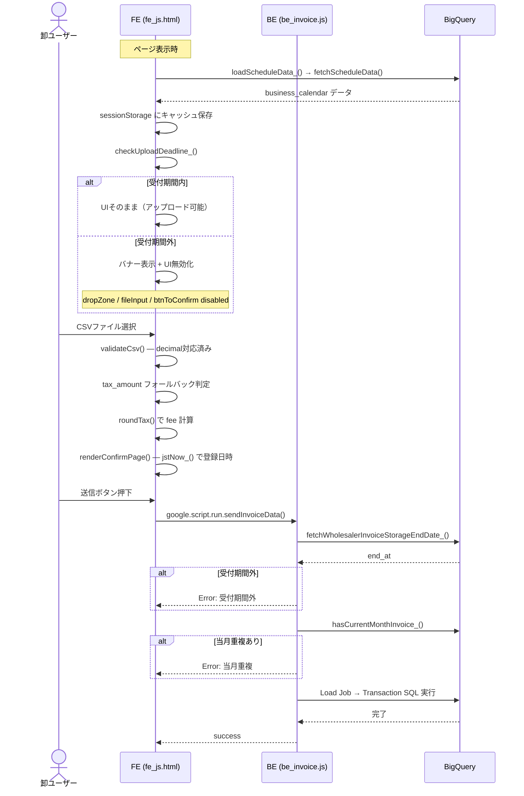
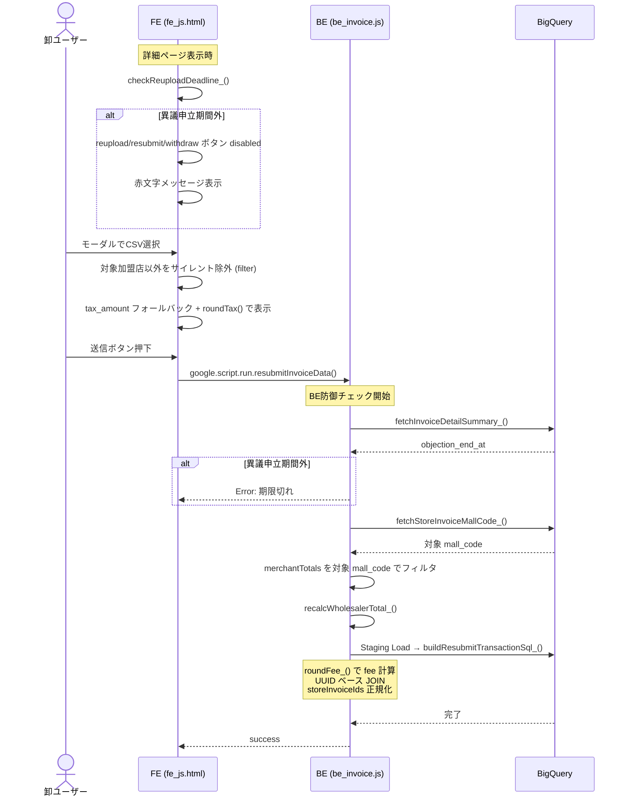
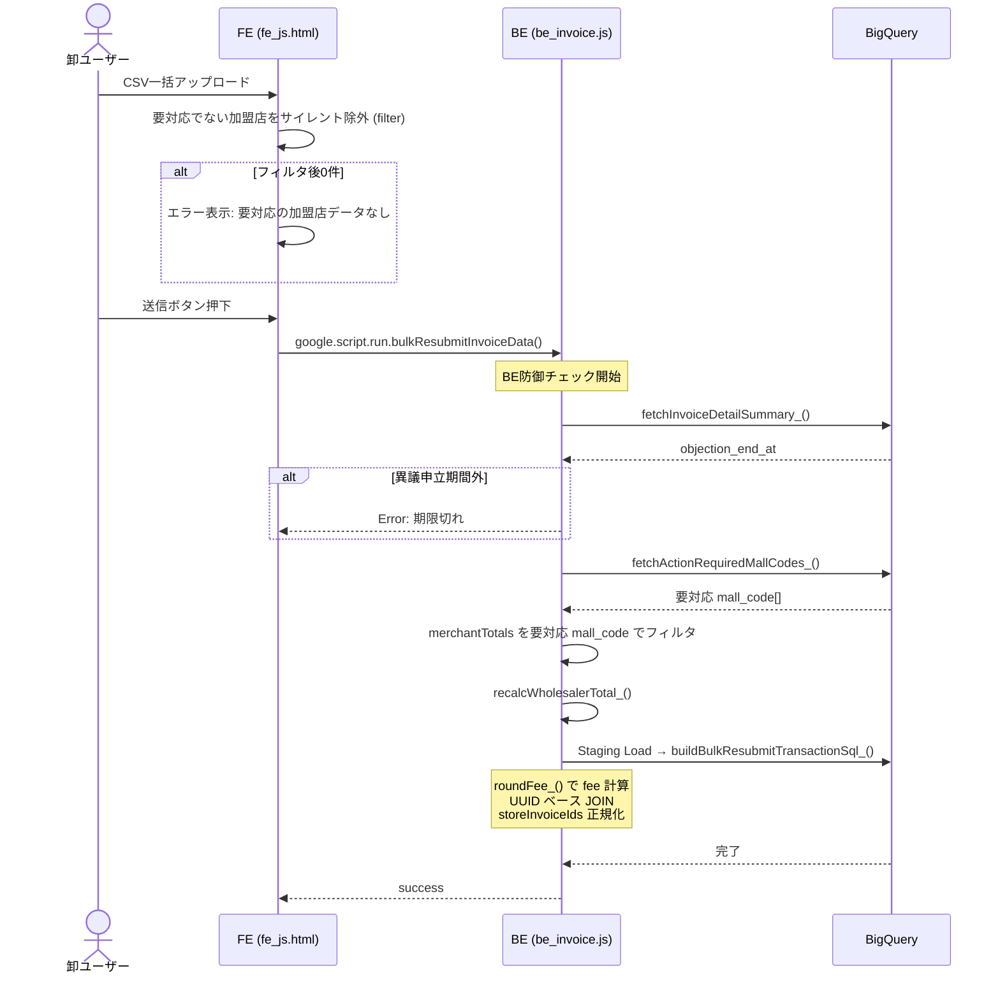
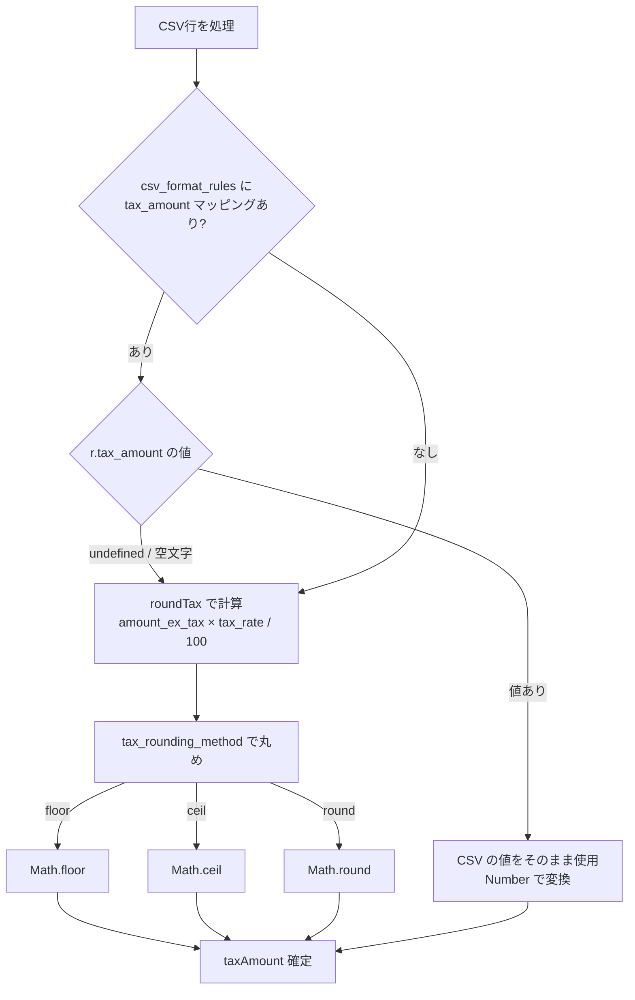
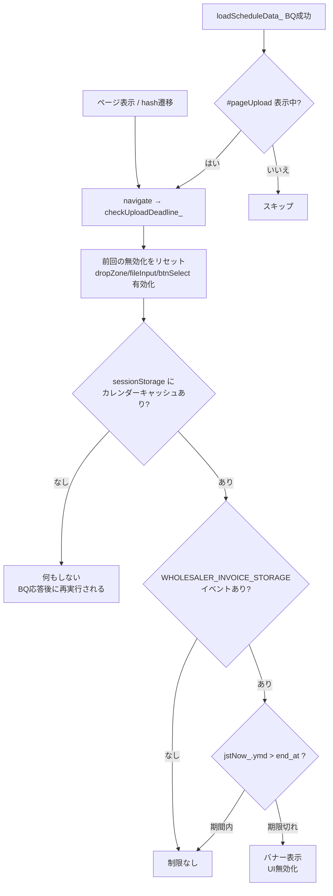
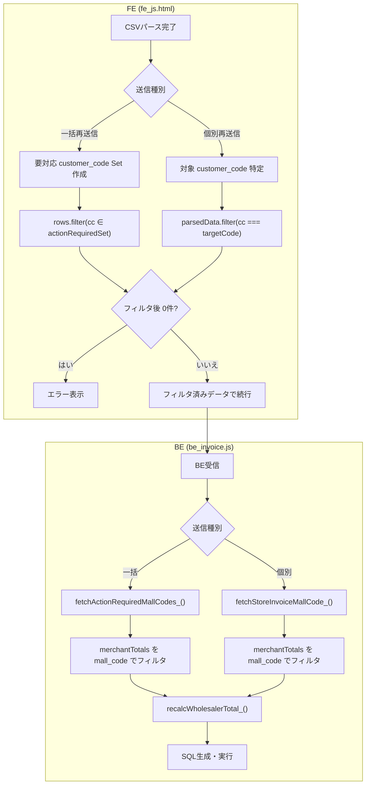

# PR 作業まとめ: MYP-3739 CSVアップロード関連のバリデーション追加・修正

## 概要

CSVアップロード機能全体にわたるバリデーション強化・不整合修正・安全性向上を行った。  
FE（期限チェック・表示補正・TZ統一）と BE（防御フィルタ・端数処理統一・SQLインジェクション対策）の両面で対応。

---

## 全体フロー図

### 新規アップロード（sendInvoiceData）



### 個別再送信（resubmitInvoiceData）



### 一括再送信（bulkResubmitInvoiceData）



---

## 判定フロー図

### tax_amount 決定フロー（FE + BE 共通ロジック）



### 期限チェックフロー（CSVアップロードページ）



### 非対象加盟店フィルタフロー



### UUID ベース JOIN と storeInvoiceIds 正規化

```mermaid
flowchart LR
    subgraph 呼び出し側
        A[Utilities.getUuid] --> B["childUuids.push(uuid)"]
        B --> C["raw UUID 配列<br/>['abc-123', 'def-456']"]
    end

    subgraph "buildInvoiceLinesSelectSql_()"
        C --> D["クォート剥がし<br/>replace(/^['\"]|['\"]$/g, '')"]
        D --> E["escSql_(raw)"]
        E --> F["再クォート<br/>'escaped_uuid'"]
        F --> G["IN ('abc-123', 'def-456')"]
        G --> H["JOIN store_invoices si<br/>ON si.id IN (...)"]
    end
```

---

## 変更ファイル一覧

| ファイル | 変更内容 |
|---|---|
| `src/fe_js.html` | JST統一、期限チェック、tax_amount フォールバック、fee丸め、非対象加盟店サイレント除外、decimal対応 |
| `src/fe_css.html` | 期限切れバナーCSS、詳細画面ボタン縦並び、期限切れメッセージスタイル |
| `src/fe_page_csv_upload.html` | 期限切れバナーHTML要素追加 |
| `src/be_invoice.js` | BE期限チェック、防御フィルタ、fee丸め、UUID JOIN、小数対応、recalcWholesalerTotal_ |
| `src/be_csv_mapper.js` | tax_amount パススルー、fee丸め、UUID JOIN正規化、decimal対応、JSDoc更新 |
| `src/db_bq_query.js` | 3つのBQクエリ関数追加 |
| `src/db_bq_connection.js` | StagingスキーマのNUMERIC対応 |

---

## 変更詳細

### 1. 小数（decimal）対応

**背景**: 数量・単価・税抜金額・消費税額が整数前提だったが、実運用で小数が必要。

| 対象 | 変更内容 |
|---|---|
| `DEFAULT_CSV_COLUMNS_` | `amount_ex_tax`, `tax_amount` の type を `'integer'` → `'decimal'` に変更 |
| `STAGING_SCHEMA_` | `unit_price`, `amount_ex_tax`, `tax_amount` を `INTEGER` → `NUMERIC` に変更 |
| `validateCsv()` | decimal のバリデーション正規表現を `/^-?\d+(\.\d{1,3})?$/` に修正（小数第3位まで許容） |
| BE バリデーション | `Number.isInteger(v)` チェックを削除し、小数値を許容 |
| `buildInvoiceLinesSelectSql_()` | `SAFE_CAST(... AS INT64)` → `SAFE_CAST(... AS NUMERIC)` に変更 |
| store_invoices VALUES | `Number(m.totalAmount)` → `Math.round(Number(m.totalAmount))` でBQのINT64カラムに安全に格納 |

---

### 2. 期限チェック（FE + BE）

#### 2-1. CSVアップロードページ — 請求書受付期間チェック

**背景**: 受付期間終了後もFE上でアップロードUIが有効なままで、送信後にBEで弾かれるUX問題。

- **FE**: `checkUploadDeadline_()` を新設
  - `business_calendar` の `WHOLESALER_INVOICE_STORAGE` イベント end_at を参照
  - 期限切れ時: バナー表示 + dropZone / ファイル選択 / 確認ボタンを無効化
  - リセット処理: 再呼び出し時に前回の無効化を解除（月跨ぎ対応）
  - `loadScheduleData_()` のBQ成功コールバックからも再実行（非同期キャッシュ未到着問題の解消）
- **BE**: `sendInvoiceData()` に `fetchWholesalerInvoiceStorageEndDate_()` による期限チェックを追加
- **HTML/CSS**: `fe_page_csv_upload.html` にバナー要素、`fe_css.html` に `.deadline-banner` スタイルを追加

#### 2-2. 詳細ページ — 異議申立期間チェック

**背景**: 異議申立期間終了後も再アップロード系ボタンが有効なままだった。

- **FE**: `checkReuploadDeadline_()` を新設
  - `_objectionEndAt` と JST 今日日付を比較
  - 期限切れ時: 「修正ファイルをアップ」「変更なしで再請求」「請求取り下げ」「CSV一括アップロード」ボタンを disabled + ツールチップ + 赤文字メッセージ表示
- **BE**: `resubmitInvoiceData()`, `bulkResubmitInvoiceData()` に `fetchInvoiceDetailSummary_()` 経由の期限チェックを追加
- **CSS**: `.detail-section-header__actions` を `flex-direction: column` に変更し、ボタン + メッセージを縦並びに

---

### 3. 非対象加盟店のサイレント除外（FE + BE防御フィルタ）

**背景**: 以前は対象外の加盟店がCSVに含まれているとエラーで拒否していたが、卸が全加盟店分を1ファイルで用意するケースが多く、UXが悪い。

#### 3-1. 一括再送信（CSV一括アップロード）

- **FE**: 要対応（RETURNED / DISPUTED）でない加盟店の行をサイレントに `filter()` で除外
  - フィルタ後0件の場合のみエラー表示
- **BE**: `fetchActionRequiredMallCodes_()` で要対応の mall_code を取得し、`summaryData.merchantTotals` をフィルタ
  - フィルタ後に `recalcWholesalerTotal_()` で wholesalerTotal を再計算

#### 3-2. 個別再送信（個別修正アップロードモーダル）

- **FE**: 対象加盟店の `customer_code` 以外の行をサイレントに `filter()` で除外
  - フィルタ後0件の場合のみエラー表示
- **BE**: `fetchStoreInvoiceMallCode_()` で対象の mall_code を取得し、`summaryData.merchantTotals` をフィルタ
  - フィルタ後に `recalcWholesalerTotal_()` で wholesalerTotal を再計算

#### 3-3. recalcWholesalerTotal_() 新設

merchantTotals をフィルタした後に wholesalerTotal を整合性ある値に再計算するユーティリティ。

---

### 4. 手数料（fee）・消費税の端数処理統一

**背景**: `feeAmount` / `paymentAmount` が `Math.floor` 固定だったが、卸ごとに `tax_rounding_method`（floor / ceil / round）が設定されている。

| 対象 | 変更内容 |
|---|---|
| **FE** `renderConfirmPage()` | `Math.floor(totalAmountInTax * feeRate / 100)` → `roundTax(...)` |
| **FE** `recalcSummary_()` | 同上 |
| **BE** `buildResubmitTransactionSql_()` | `Math.floor(...)` → `roundFee_(...)` (IIFE で `accountInfo.tax_rounding_method` を参照) |
| **BE** `buildBulkResubmitTransactionSql_()` | 同上 |
| **BE** `buildMappedResubmitTransactionSql_()` | 同上 |
| **BE** `buildMappedBulkResubmitTransactionSql_()` | 同上 |
| **BE** `buildInvoiceLinesSelectSql_()` | line_tax_amount の SQL 計算式を `FLOOR` 固定 → `taxRoundingMethod` パラメータに応じて `FLOOR/CEIL/ROUND` 切り替え |

---

### 5. tax_amount フォールバック（FE）

**背景**: `csv_format_rules` に `tax_amount` のマッピングがない卸では、FE の `Number(r['tax_amount'] || 0)` が常に `0` になり、サマリー・明細の消費税表示が崩れる。

- **全5箇所**で以下のパターンに統一:
  ```javascript
  const rawTax    = r['tax_amount'];
  const taxAmount = (rawTax !== undefined && rawTax !== '')
    ? Number(rawTax)
    : roundTax(amtExTax * taxRate / 100);
  ```
- 対象箇所:
  1. `renderConfirmPage()` メインサマリー reduce
  2. 加盟店別サマリー reduce
  3. 確認画面 明細テーブル描画
  4. モーダルプレビュー サマリー reduce
  5. モーダルプレビュー 明細テーブル描画

---

### 6. tax_amount CSVパススルー（BE）

**背景**: CSV に `tax_amount` がマッピングされている場合でも、BE の SQL では常に `FLOOR(amount_ex_tax * tax_rate / 100)` で計算しており、CSV の値が無視されていた。

- `buildInvoiceLinesSelectSql_()` で `tax_amount` が `columns` に存在する場合は `SAFE_CAST(... AS NUMERIC)` でパススルー
- `SYSTEM_COL_TO_DDL` に `'tax_amount': 'line_tax_amount'` を追加
- `ALLOWED_SYSTEM_COLUMNS` に `'tax_amount'` を追加
- 旧形式（`buildTransactionSql_`, `buildResubmitTransactionSql_`, `buildBulkResubmitTransactionSql_`）でも `CAST(FLOOR(...))` → `s.tax_amount` に変更

---

### 7. JST 統一（FE日付判定）

**背景**: FE の日付判定が `new Date()` のローカルTZ依存で、ユーザー端末が Asia/Tokyo 以外の場合にBE（`Utilities.formatDate(..., 'Asia/Tokyo', ...)`) と判定がズレる。

- `jstNow_()` ユーティリティを新設（UTC epoch + 9h 固定オフセット方式）
  - `getUTCFullYear()` / `getUTCMonth()` 等で取得（ロケール依存の文字列パースを回避）
  - `{ year, month, date, hours, minutes, ym, ymd }` を返却
- 全6箇所の `new Date()` ベース日付判定を `jstNow_()` に置き換え:
  - `loadScheduleData_()`: キャッシュキー・月末日計算
  - `checkUploadDeadline_()`: today 判定
  - 当月重複チェック: currentYM
  - `renderConfirmPage()`: registeredAt / billingMonth
  - `checkReuploadDeadline_()`: today 判定

---

### 8. UUID ベース JOIN（データ整合性）

**背景**: `store_invoices` との JOIN が `mall_code + wholesaler_invoice_id` ベースだと、同一 invoice に複数世代の store_invoices が存在する場合に意図しない行と紐づくリスクがある。

- 新規 INSERT した `store_invoices` の UUID を `childUuids` 配列に収集
- `buildInvoiceLinesSelectSql_()` に `options.storeInvoiceIds` パラメータを追加
  - 指定時: `ON si.id IN (...)` で UUID ベース JOIN
  - 未指定時: 従来の `ON si.mall_code = wm.mall_code AND si.wholesaler_invoice_id = ...` で JOIN
- 呼び出し側は raw UUID を渡し、受け取り側でクォート剥がし + `escSql_()` + 再クォートを行う正規化方式を採用

---

### 9. storeInvoiceIds の SQLインジェクション対策

**背景**: `opts.storeInvoiceIds` を `.join(', ')` でそのまま SQL に連結しており、呼び出し側がクォート付き文字列を渡す暗黙仕様だった。

- **受け取り側**（`buildInvoiceLinesSelectSql_()`）で正規化:
  ```javascript
  const quotedIds = opts.storeInvoiceIds.map(function(id) {
    const raw = String(id).replace(/^['"]|['"]$/g, '');
    return "'" + escSql_(raw) + "'";
  });
  ```
- **呼び出し側**（`buildMappedResubmitTransactionSql_`, `buildMappedBulkResubmitTransactionSql_`）: `childUuids.push("'" + uuid + "'")` → `childUuids.push(uuid)` (raw UUID)

---

### 10. その他の修正

| 項目 | 内容 |
|---|---|
| `var` → `const`/`let` | `checkReuploadDeadline_()` の4箇所、`be_csv_mapper.js` の `roundingFn` |
| JSDoc 更新 | `buildInvoiceLinesSelectSql_()` に `taxRoundingMethod`, `options.storeInvoiceIds` の `@param` を追加。端数処理・JOIN方式の説明を実装に合わせて更新 |
| `checkReuploadDeadline_()` JSDoc | 無効化対象に「請求取り下げ」「CSV一括アップロード」を明記 |
| テキスト修正 | 「未検閲」→「未検収」 |
| `checkUploadDeadline_()` リセット | 期限切れ解除時に dropZone / fileInput / btnSelectFile も復元 |

---

## 新規 BQ クエリ関数

| 関数名 | ファイル | 用途 |
|---|---|---|
| `fetchWholesalerInvoiceStorageEndDate_()` | `db_bq_query.js` | 請求書受付期間の end_at 取得 |
| `fetchActionRequiredMallCodes_()` | `db_bq_query.js` | 一括再送信: 要対応の mall_code 一覧取得 |
| `fetchStoreInvoiceMallCode_()` | `db_bq_query.js` | 個別再送信: 対象 store_invoices の mall_code 取得 |

---

## 新規 FE 関数

| 関数名 | 用途 |
|---|---|
| `jstNow_()` | JST 基準の現在日時を返すユーティリティ（UTC+9固定オフセット方式） |
| `checkUploadDeadline_()` | CSVアップロードページの請求書受付期間チェック |
| `checkReuploadDeadline_()` | 詳細ページの異議申立期間チェック |

## 新規 BE 関数

| 関数名 | ファイル | 用途 |
|---|---|---|
| `recalcWholesalerTotal_()` | `be_invoice.js` | 防御フィルタ後の wholesalerTotal 再計算 |
