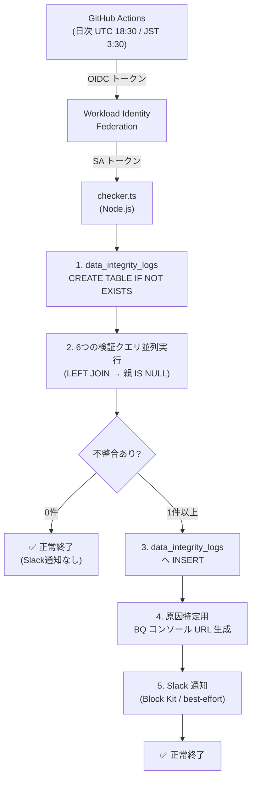
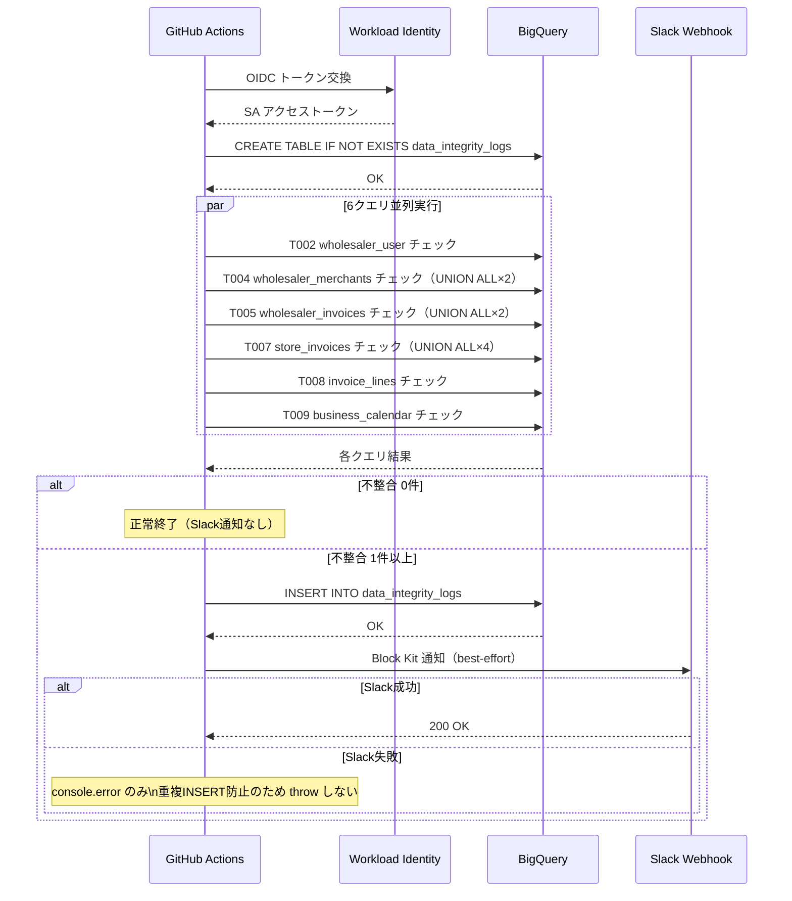

# PR 作業まとめ: MYP-3761 BQ テーブル間のデータ不整合を検知するツールを作成

## 概要

BigQuery の外部キー制約は `NOT ENFORCED` であり、親レコードが存在しない不整合データが物理的に発生し得る。本 PR では、9 テーブル・計 11 箇所の外部キーを LEFT JOIN で日次検証し、不整合を検知した場合に BigQuery のログテーブルへ INSERT（Looker Studio 連携）と Slack への Block Kit 通知を同時に行う Node.js (TypeScript) バッチスクリプトおよび GitHub Actions ワークフローを新規作成した。

## 対象ブランチ

`feature/MYP-3761-detect-bq-data-inconsistency` → `develop`

---

## 変更ファイル一覧

| ファイル | 変更種別 | 変更内容 |
|----------|---------|---------|
| `tools/bq-integrity-check/src/checker.ts` | 追加 | 検知バッチ本体（BQ クエリ実行・ログ INSERT・Slack 通知） |
| `tools/bq-integrity-check/package.json` | 追加 | Node20 / TypeScript プロジェクト設定・依存定義 |
| `tools/bq-integrity-check/tsconfig.json` | 追加 | TypeScript strict モードのビルド設定 |
| `tools/bq-integrity-check/package-lock.json` | 追加 | 依存パッケージのロックファイル |
| `tools/bq-integrity-check/.env.example` | 追加 | ローカル実行用環境変数テンプレート |
| `tools/bq-integrity-check/.gitignore` | 追加 | `node_modules` / `dist` / `.env` の除外設定 |
| `tools/bq-integrity-check/README.md` | 追加 | セットアップ・ローカル実行・GHA 設定手順 |
| `.github/workflows/bq_integrity_check.yml` | 追加 | 日次 cron + 手動実行 + WIF 認証 + 3 回リトライの GHA ワークフロー |
| `docs/bq_fk_integrity_check_remaining_tasks.md` | 追加 | デプロイ・運用開始までの残タスク管理ドキュメント |

> `tools/bq-integrity-check/` は既存の GAS プロジェクト（`src/` 配下、clasp の `rootDir`）と競合しないよう、独立したサブディレクトリとして配置。

---

## 設計方針

### GAS プロジェクトとの共存

既存の `src/` ディレクトリは clasp の `rootDir` として GAS に push される。Node.js ツールを `src/` に置くと `clasp push` で GAS へ送られてしまうため、`tools/bq-integrity-check/` 配下に独立サブプロジェクトとして配置した。

### 複数FK同時欠損の正確な記録（UNION ALL 方式）

当初 `CASE WHEN ... THEN ...` で欠損 FK を1件だけ代表させていたが、1 行が複数の FK を同時に欠損しているケースでロギングが不正確になる問題を修正した。

| 方式 | 問題 |
|---|---|
| **修正前** CASE 式 | 先頭の欠損 FK のみ記録。2件目以降の欠損が Looker Studio / Slack の内訳から消える |
| **修正後** UNION ALL | FK ごとに独立した SELECT を UNION ALL。同一 `child_id` が複数の FK を欠損していれば複数行として記録 |

対象テーブル: `wholesaler_merchants`（FK×2）、`wholesaler_invoices`（FK×2）、`store_invoices`（FK×4）

### Slack 通知の best-effort 化

INSERT → Slack の順で実行しているため、Slack 送信で失敗した場合に GHA がリトライすると `data_integrity_logs` に重複 INSERT される問題があった。

```
修正前: Slack 失敗 → throw → GHA リトライ → 重複 INSERT
修正後: Slack 失敗 → catch → console.error のみ → exitCode=0 で正常終了
```

BQ クエリ・INSERT（冪等でないが重大）はリトライ対象。Slack 通知（失敗しても INSERT 済み）は best-effort とした。

### スキャン範囲の制御

| モード | 条件 | 用途 |
|---|---|---|
| 前日分のみ（既定） | `ALL_RECORDS=false` | 日次定常運用。スキャンコスト最小化 |
| 全件スキャン | `ALL_RECORDS=true` / `--all-records` | 初回投入・リカバリ |

`business_calendar` のみ月初日付基準のため「直近2か月分」を対象とする。

---

## 全体フロー図

### 処理フロー



### シーケンス図



---

## 変更詳細

### `tools/bq-integrity-check/src/checker.ts`

バッチスクリプト本体。617行。主要な関数の役割：

| 関数 | 役割 |
|---|---|
| `buildChecks()` | 6つの `CheckDefinition`（検知SQL + 調査SQL）を構築して返す |
| `ensureLogTable()` | `data_integrity_logs` を `CREATE TABLE IF NOT EXISTS` で確保 |
| `runCheck(def)` | 1つの検証クエリを BQ SDK で実行し結果行を返す |
| `insertLogs(rows, checkedAt)` | 検知レコードをストリーミング挿入。テーブル伝播待ちのリトライを内包（最大5回） |
| `buildBqConsoleUrl(sql)` | 調査用 SQL を `encodeURIComponent` して BQ コンソール URL を生成 |
| `summarizeResult(res)` | テーブルごとの件数・内訳・先頭5件 ID を集計 |
| `buildSlackBlocks(...)` | Block Kit 形式のメッセージブロック配列を構築 |
| `sendSlackNotification(blocks)` | Slack Webhook へ POST（best-effort、失敗しても throw しない） |
| `main()` | 上記を順番に呼び出すエントリポイント |

**検証 SQL の設計（UNION ALL 方式）**

複数 FK を持つテーブルは FK ごとに独立した SELECT を `UNION ALL` で連結し、複数 FK 同時欠損を個別行として記録する。

```
T004 wholesaler_merchants:
  FK1: wholesaler_id → wholesalers
  UNION ALL
  FK2: mall_code → store

T007 store_invoices:
  FK1: wholesaler_invoice_id → wholesaler_invoices
  UNION ALL
  FK2: wholesaler_id → wholesalers
  UNION ALL
  FK3: invoice_number_id → invoice_numbers  ※ Nullable: IS NOT NULL のときのみチェック
  UNION ALL
  FK4: mall_code → store
```

**`data_integrity_logs` テーブル定義（スクリプト内 DDL）**

```sql
CREATE TABLE IF NOT EXISTS `usenpay-connect-dev.connect_db.data_integrity_logs` (
  checked_at              TIMESTAMP NOT NULL,  -- 検証実行日時
  child_table             STRING NOT NULL,     -- 不整合が発生した子テーブル名
  parent_table            STRING NOT NULL,     -- 欠損している親テーブル名
  fk_column               STRING NOT NULL,     -- 対象の外部キーカラム名
  child_id                STRING NOT NULL,     -- 不整合が発生した子テーブル側のレコードID
  child_record_created_at TIMESTAMP            -- 不整合レコード自体の作成日時
)
PARTITION BY DATE(checked_at)
CLUSTER BY child_table, parent_table
```

### `.github/workflows/bq_integrity_check.yml`

| 設定項目 | 値 |
|---|---|
| スケジュール | 毎日 UTC 18:30（JST AM 3:30） |
| 手動実行 | `workflow_dispatch`。`all_records`(boolean) で全件スキャン切替 |
| 認証 | Workload Identity Federation（OIDC）。SA キーファイル不使用 |
| リトライ | `nick-fields/retry@v3`、最大3回、30秒待ち |
| 依存インストール | `npm ci`（`package-lock.json` に固定し再現性を保証） |
| 同時実行制御 | `concurrency: bq-integrity-check`（多重起動による二重通知を防止） |

---

## コーディングルール準拠

本ツールは GAS（Google Apps Script）ではなく Node.js / TypeScript であるため、GAS 向けコーディングルール（`var` 禁止・末尾アンダースコア等）の適用外。TypeScript strict モードで型安全性を担保している。

| 観点 | 対応 |
|---|---|
| TypeScript strict モード | ✅ `tsconfig.json` で `strict: true` |
| `noUnusedLocals` / `noUnusedParameters` | ✅ |
| `npm ci` で再現性担保 | ✅ |
| SA キーファイルの非使用 | ✅ OIDC / WIF を採用 |
| Slack 通知の best-effort 化 | ✅ 重複 INSERT 防止 |

---

## 影響範囲

- **機能影響**: 既存 GAS 機能（`src/` 配下）への影響なし。`tools/bq-integrity-check/` は独立サブプロジェクト
- **BQ への影響**: `connect_db.data_integrity_logs` テーブルを新規追加。既存テーブルへの変更なし
- **コスト影響**: 日次バッチは前日分のみをスキャン（パーティションフィルタ付き）のためスキャン量は最小限
- **パフォーマンス影響**: 6クエリを `Promise.all` で並列実行するため実行時間を短縮
