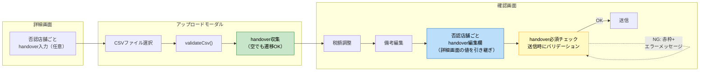
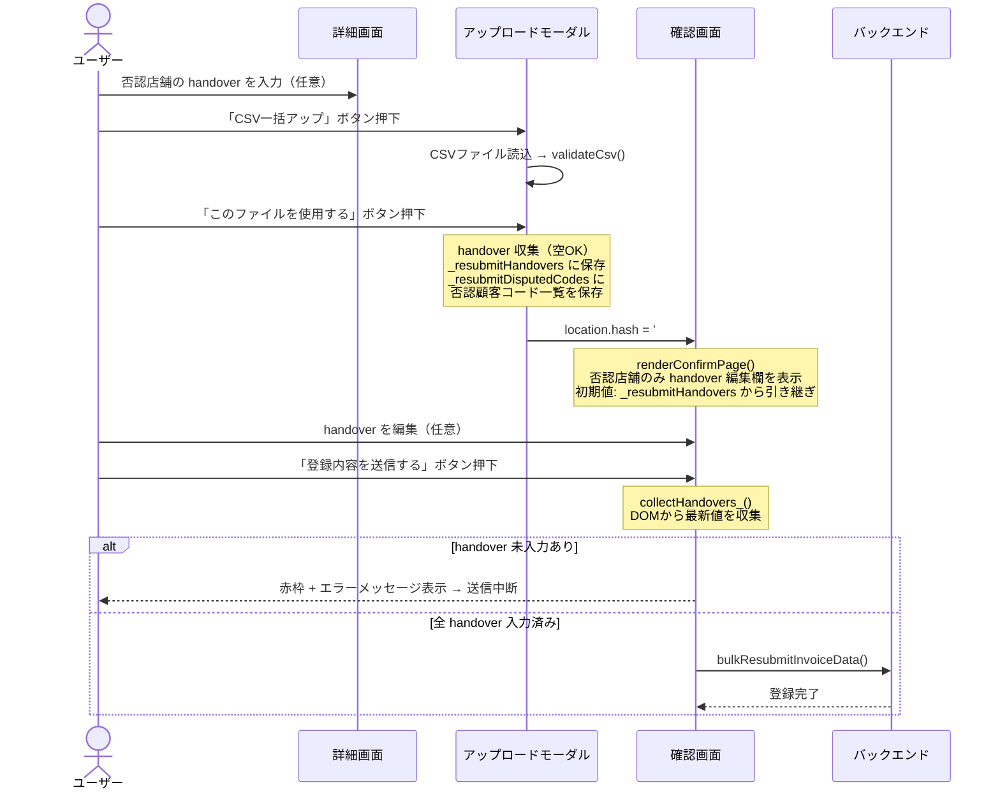

# PR 作業まとめ: MYP-3782 【卸】詳細画面からのCSV確認画面でのみ必須項目入力に修正

## 概要

詳細画面（否認レコードあり）からのCSV一括アップロード時、「加盟店との合意内容（handover）」の必須チェックをアップロードモーダルから確認画面の送信ハンドラへ移動。確認画面上で handover を編集可能にし、詳細画面からの入力値を引き継ぐ。  
加えて、確認画面の税額入力（tax8/tax10）でマイナス値を許容するよう修正し、翌月調整のビジネスパターンに対応。  
小計合算値にも `roundTax()` を適用し、SessionStorage の丸め設定（四捨五入/切り捨て/切り上げ）を反映。

## 対象ブランチ

`feature/MYP-3782-fix-csv-confirm-required-fields` → `develop`

---

## 変更ファイル一覧

| ファイル | 変更種別 | 変更内容 |
|----------|---------|---------|
| `src/fe_js.html` | 変更 | handover 必須チェック移動・確認画面 handover 編集欄追加・税額マイナス許容・小計丸め・キャンセル遷移修正・a11y 対応 |
| `src/fe_css.html` | 変更 | handover バリデーションエラーのスタイル追加、`disputed-handover` に `flex-wrap` 追加 |
| `src/be_invoice.js` | 変更 | `buildTransactionSql_` の金額検証から `v < 0` チェックを削除 |
| `src/be_csv_mapper.js` | 変更 | `buildMappedTransactionSql_` の金額検証から `v < 0` チェックを削除（不整合解消） |

---

## 設計方針

### 1. handover 必須チェックの移動

| 項目 | Before | After |
|------|--------|-------|
| チェック場所 | アップロードモーダル（「このファイルを使用する」ボタン） | 確認画面（「登録内容を送信する」ボタン） |
| 未入力時の動作 | `alert()` でブロック → 確認画面に遷移不可 | インラインバリデーション（赤枠+エラーメッセージ）→ 送信のみブロック |
| 編集可否 | 確認画面では編集不可 | 確認画面で編集可能（詳細画面の値を引き継ぎ） |
| 対象フロー | 一括CSV再アップロードのみ | 同左（個別モーダル・変更なし再請求は従来通り） |

### 2. 税額マイナス許容

| 項目 | Before | After |
|------|--------|-------|
| FE 税額入力 | `Math.max(0, Math.trunc(...))` → マイナス入力が即 `0` に | `Math.trunc(...)` → マイナス値をそのまま保持 |
| BE 金額検証 | `!isFinite(v) \|\| v < 0` → マイナスでエラー | `!isFinite(v)` → 有限チェックのみ |
| 対象関数 | `recalcCard_`, `recalcSummary_`, `recalcPreview_`, `buildTransactionSql_`, `buildMappedTransactionSql_` | 同左 |

### 3. 小計合算値の丸め

| 項目 | Before | After |
|------|--------|-------|
| 全体サマリー | `totals.amountExTax` をそのまま表示 | `roundTax(totals.amountExTax)` で丸めて表示 |
| 加盟店単位 | `st.amountExTax` をそのまま表示 | `roundTax(st.amountExTax)` で丸めて表示 |
| hidden input | `st.exTax10` をそのままセット | `roundTax(st.exTax10)` で丸めてセット |

---

## 全体フロー図

### handover 必須チェック移動後のフロー

### 一括再送信のデータフロー

---

## 変更詳細

### `src/fe_js.html`（+193行 / -32行）

#### モジュール変数追加

- `let _resubmitDisputedCodes = [];` — 否認対象の顧客コード一覧を確認画面に引き渡すための変数

#### handover 必須チェック移動

**btnConfirm ハンドラ（モーダル → 確認画面遷移）**
- `missingHandoverCodes` による必須チェック + `alert` + `return` を削除
- 代わりに全否認顧客コードを `_resubmitDisputedCodes` に保存し、空でも確認画面に遷移可能に

**collectHandovers_() 関数を新設**
- `collectRemarks_()` と同パターンで `.confirm-handover-input[data-customer-code]` から値を収集

**btnFinalSubmit ハンドラ（送信時バリデーション）**
- `const handovers = _resubmitHandovers` → `const handovers = collectHandovers_()` に変更
- `_resubmitDisputedCodes` の各コードが非空か検証
- 未入力時: textarea に赤枠 + エラーメッセージ + アコーディオン自動展開 + スクロール + フォーカス

#### 確認画面に handover 編集欄追加

- `renderConfirmPage()` 内、`remarksDiv` の直後に `_isResubmitConfirm` かつ否認対象の加盟店のみ handover textarea を追加
- 詳細画面の否認セクションと同じ `backoffice-remark__` 系クラスでデザインを統一
- 入力時に `input` イベントでエラー状態（赤枠・エラーメッセージ・aria属性）を自動クリア

#### 個別モーダルの handover バリデーション改善

- `alert()` → インラインバリデーション（赤枠 + エラーメッセージ + スクロール + フォーカス）に変更
- `previewHandoverInput` に `input` イベントリスナーを追加してエラー自動クリア

#### 税額マイナス許容

- `recalcCard_()`: `Math.max(0, Math.trunc(...))` → `Math.trunc(...)`
- `recalcSummary_()`: 同上
- `recalcPreview_()`: 同上

#### 小計合算値の丸め

- 全体サマリー: `totals.amountExTax` 等に `roundTax()` を適用
- 加盟店単位: `st.amountExTax`, `st.tax` に `roundTax()` を適用
- hidden input: `st.exTax10`, `st.exTax8` に `roundTax()` を適用

#### キャンセル遷移の修正

- 再送信モードのキャンセルモーダル: 文言を「詳細画面に戻る」に動的切り替え
- OK ボタンの遷移先: `#upload` → `#detail?invoiceId=` + `encodeURIComponent(parentId)` に変更
- `parentId` が取れない場合は `#home` にフォールバック

#### アクセシビリティ対応

- エラー時: `aria-invalid="true"` + `aria-describedby` でエラーメッセージを紐付け
- アコーディオン展開時: `aria-expanded="true"` をヘッダーに設定
- クリア時: `aria-invalid`, `aria-describedby` を `removeAttribute` で削除

### `src/fe_css.html`（+22行）

- `.confirm-handover-input--error` / `.confirm-handover-input--error.backoffice-remark__handover-input` — 赤枠 + 背景色（詳細度を上げて既存スタイルに勝つ）
- `.handover-validation-error` — エラーメッセージ（赤字・右寄せ・`width: 100%`）
- `.backoffice-remark__disputed-handover` — `flex-wrap: wrap` 追加（エラーメッセージを下の行に折り返す）

### `src/be_invoice.js`（-2行 / +2行）

- `buildTransactionSql_()` 内の卸合計値 / 加盟店合計値の検証から `|| v < 0` を削除
- `!isFinite(v)` のみ残し、マイナス値を許容

### `src/be_csv_mapper.js`（-3行 / +3行）

- `buildMappedTransactionSql_()` にも同じ変更を適用し、2つの経路で検証ルールを統一
- コメントを「有限・非負・整数」→「有限」に修正

---

## コーディングルール準拠

| ルール | 対応 |
|--------|------|
| `var` 禁止 → `const` / `let` 使用 | ✅ |
| 内部関数は末尾 `_` | ✅（`collectHandovers_`, `recalcCard_`, `recalcSummary_`, `recalcPreview_`） |
| `function` キーワードで公開関数を定義 | ✅（`collectHandovers_` は `function` キーワードで定義） |

---

## 影響範囲

- **機能影響**:
  - **一括CSV再アップロード**: handover 必須チェックが確認画面に移動。確認画面に handover 編集欄が追加。キャンセル時の遷移先が詳細画面に変更
  - **個別CSV再アップロード**: handover 未入力時のエラー表示が `alert` からインラインバリデーションに変更
  - **確認画面（共通）**: 税額入力でマイナス値が許容される。小計合算値に丸め処理が適用される
  - **通常アップロード・変更なし再請求**: 影響なし
- **パフォーマンス影響**: なし（DOM操作の追加は最小限、イベントリスナー数も微増のみ）
