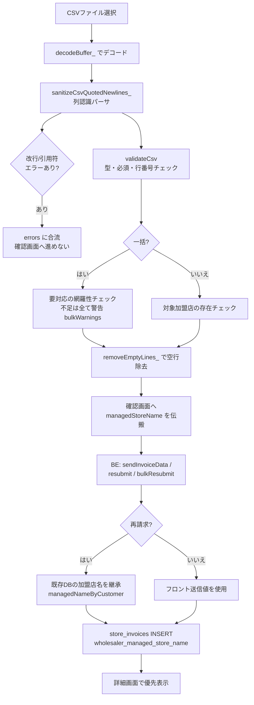
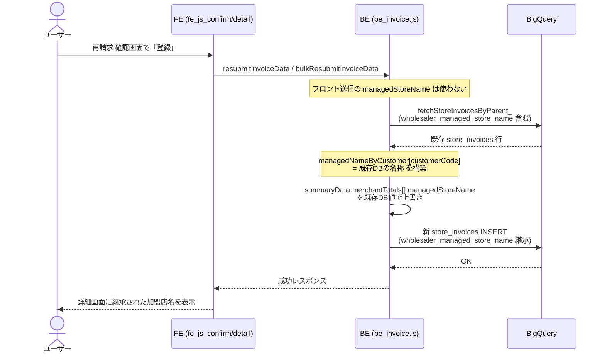

# PR 作業まとめ: MYP-3888 加盟店名の登録・表示・継承＋CSV／請求まわりバグ修正 part2

## 概要

詳細画面に表示される加盟店名を、新カラム `store_invoices.wholesaler_managed_store_name` に登録・表示・継承する仕組みを実装した。あわせて、受け入れテスト中に発見された CSV パース・一括再請求・手数料率表示・SQL エスケープなどの複数バグを修正している。

主な対応は以下の通り:

1. **加盟店名カラムの登録・表示・継承**: 新規登録・個別再請求・一括再請求の全経路で `wholesaler_managed_store_name` を INSERT し、詳細画面で優先表示。再請求時は既存 DB 値をサーバー側で継承する。
2. **一括再請求の網羅性チェック緩和**: 否認を含む「要対応」加盟店が CSV に無くても、エラーではなく警告にして確認画面へ進めるようにした。
3. **CSV パーサの堅牢化**: クォート内改行を列単位でエラー検出する列認識パーサへ刷新。クォート外の特殊改行（U+2028 等）を `\n` に正規化してパース崩れを防止。
4. **SQL エスケープ強化・手数料率の精度保持・エラー行番号の基準統一・手入力値の改行サニタイズ・文言修正・UI 表示順修正**。

## 対象ブランチ

`feature/MYP-3888-fix-merchant-name-change` → `develop`

---

## 変更ファイル一覧

| ファイル | 変更種別 | 変更内容 |
|----------|---------|---------|
| `src/db_bq_query.js` | 変更 | `fetchStoreInvoicesByParent_` の SELECT に `si.wholesaler_managed_store_name` を追加（再請求時の継承元・詳細表示用） |
| `src/be_invoice.js` | 変更 | 旧フォーマット3経路の `store_invoices` INSERT に `wholesaler_managed_store_name` 追加。再請求（個別/一括）で既存 DB 値を継承。`esc()` を強化（`\`→`\\`、改行→スペース） |
| `src/be_csv_mapper.js` | 変更 | 新フォーマット3経路の INSERT に同カラム追加。`escSql_` 強化。明細備考以外の列に改行が含まれる行を BQ `RAISE` で登録拒否 |
| `src/fe_js_confirm.html` | 変更 | サマリーに `managedStoreName` を伝搬。手数料率を表示用（生文字列）と計算用（数値）に分離。handover 必須チェックを DOM 描画済み欄のみに変更。備考/合意内容に `nl2space_` 適用 |
| `src/fe_js_detail.html` | 変更 | 詳細アコーディオンで `wholesaler_managed_store_name` を優先表示。手数料率を生文字列表示に。新 CSV パーサ呼び出し＋改行エラー合流。一括網羅性チェックを全件警告化。デッドコード `buildResubmitRemarks_` 削除 |
| `src/fe_js_upload.html` | 変更 | 新 CSV パーサ呼び出し＋改行エラー合流。送信前に `removeEmptyLines_` 適用。送信ボタン文言修正 |
| `src/fe_js_csv_common.html` | 変更 | `stripQuotedNewlines` を列認識パーサ `sanitizeCsvQuotedNewlines_` に刷新。`nl2space_` / `removeEmptyLines_` 新設。`validateCsv` のエラー行番号を元ファイル基準に統一 |
| `src/db_bq_connection.js` | 変更 | Load Job に `allowQuotedNewlines: true` を追加（直接呼び出し時の最終防衛） |
| `src/fe_page_confirm.html` | 変更 | 送信ボタン文言を「登録内容を送信する」→「請求情報を登録する」 |
| `src/fe_page_detail.html` | 変更 | 再アップロードモーダルの表示順を「アップロードファイル → エラー一覧」に入れ替え |
| `docs/plan/bq_table_create_ddl.sql` | 変更 | `store_invoices` の DDL に `wholesaler_managed_store_name` 追加。既存テーブル向けの `ALTER TABLE ... ADD COLUMN IF NOT EXISTS` マイグレーションを追記（手動実行） |

> 📝 DB スキーマ変更: 新カラム `store_invoices.wholesaler_managed_store_name STRING(250)`（nullable）。`CREATE TABLE IF NOT EXISTS` は既存テーブルに列を追加しないため、`ALTER TABLE ADD COLUMN IF NOT EXISTS` を別途手動実行済み（BQ では既存テーブルへの列追加時に `DEFAULT` 句は指定不可）。

---

## 設計方針

### 1. 加盟店名は「サーバー側で継承」して single source of truth を担保

新規登録時はフロント送信値（確認画面の `displayName`）を登録するが、**再請求時はフロント送信値に依存せず、既存 DB（最新の `store_invoices`）の値をサーバー側で上書き継承**する。フロント改ざんや表示揺れの影響を受けず、名称の一貫性を保つ。

| 経路 | 加盟店名のソース |
|------|------------------|
| 新規登録（個別/一括アップロード） | フロント `summaryData.merchantTotals[].managedStoreName` |
| 個別再請求 / 一括再請求 | **既存 DB の `wholesaler_managed_store_name`（`managedNameByCustomer` で継承）** |
| 変更なしで再請求 | 同一行の UPDATE のため自動保持（追加処理不要） |

### 2. 一括再請求の網羅性チェック: 否認も含めて「警告」に統一

| Before | After |
|--------|-------|
| CSV に無い「差し戻し」→ 警告 / 「否認」→ **エラー**（確認画面へ進めない） | CSV に無い要対応加盟店は差し戻し・否認を問わず **すべて警告**。確認画面へ進める。CSV に無い加盟店はこの再請求では対象外（スキップ） |

加えて、確認画面側の handover 必須チェックを「画面に実際に描画されている合意内容欄のみ」を対象にした。CSV に無い否認店舗は欄が描画されないため、自然に必須チェックの対象外となり、確認画面で先に進めなくなる不具合を解消した。

### 3. CSV クォート内改行: スペース化のみ → 列単位でエラー検出する列認識パーサへ

| Before（`stripQuotedNewlines`） | After（`sanitizeCsvQuotedNewlines_`） |
|--------|-------|
| クォート内改行を一律スペース化するだけ（トグル方式） | フィールド先頭の `"` のみクォート開始と判定（`parseCsvLine` と同一モデル）。**明細備考列は黙ってスペース化、それ以外の列に改行があれば行番号付きエラーを収集**して確認画面手前でブロック |
| クォート外の特殊改行（U+2028/U+2029/U+0085/VT/FF）が素通り → 後段 `split('\n')` で分割されず CSV 全体が1行扱いに | クォート外改行を **すべて `\n` に正規化** してレコード区切り化。後段のパース崩れを防止 |

### 4. 行番号の基準統一（元ファイル＝Excel 行番号）

`sanitizeCsvQuotedNewlines_` の `newlineErrors`（改行エラー）と `validateCsv` の `errors`（型・必須エラー）を結合表示する際、空行を含む CSV で行番号がずれてユーザーが特定しづらくなる問題を解消。両者を **元ファイル基準（空行も1行として数える Excel 行番号）** に揃えた。

```
例: 3行目が空行の CSV
  1: ヘッダー
  2: A001,...
  3: （空行）
  4: A002,"改行入り",...  ← エラー

Before: newlineErrors=「4行目」/ validateCsv=「3行目」← ずれる
After : 両方とも「4行目」← 一致（Excel と同じ行番号）
```

### 5. 手数料率は BQ NUMERIC を「そのまま表示」

`runQuery_()` は `cell.v` を文字列で返すため、`Number()` 変換すると精度落ち（`0.1`→`0.10000000000000002`）や末尾0消失（`3.50`→`3.5`）が起き得る。表示は **String のまま `%` 付与**、計算（手数料額算出）にのみ `Number` を使うよう分離した。

---

## 全体フロー図

### CSV アップロード〜登録（加盟店名の流れ）



### 再請求時の加盟店名継承（シーケンス）



---

## 変更詳細

### 1. 加盟店名カラムの追加（DB / BE / FE 全層）

- **DB 参照**（`db_bq_query.js`）: `fetchStoreInvoicesByParent_` の SELECT に `si.wholesaler_managed_store_name` を追加。これが詳細表示と再請求継承の両方のソースになる。
- **BE INSERT（6サイト）**: 旧フォーマット（`be_invoice.js`）3経路＋新フォーマット（`be_csv_mapper.js`）3経路の `store_invoices` INSERT に `wholesaler_managed_store_name` 列と `managedNameSql`（値が空なら `NULL`）を追加。
- **BE 継承**（`be_invoice.js` の `resubmitInvoiceData` / `bulkResubmitInvoiceData`）: `storeRows` から `managedNameByCustomer[customerCode]` を構築し、`summaryData.merchantTotals[].managedStoreName` を既存 DB 値で上書き。**フロント送信値に依存しない**。
- **FE 伝搬**（`fe_js_confirm.html`）: `collectSummaryData_` で `managedStoreName: card.dataset.managedStoreName` を送信。カード描画時に `card.dataset.managedStoreName = displayName` をセット。
- **FE 表示**（`fe_js_detail.html`）: アコーディオン見出しを `escapeHtml(store.wholesaler_managed_store_name || store.store_name || store.mall_code)` に変更（新カラム優先のフォールバック）。

### 2. 一括再請求の網羅性チェック緩和（`fe_js_detail.html` / `fe_js_confirm.html`）

- `_detailReturnedOnlyMallCodes` による「差し戻しは警告／否認はエラー」分岐を撤廃し、CSV に無い要対応加盟店を **すべて `bulkWarnings` に集約**（確認画面へ進める）。
- 最低1件は要対応を含める制約（`rows.length === 0` で `errors`）は維持。
- `fe_js_confirm.html` の handover 必須チェックを、固定リスト `_resubmitDisputedCodes` ではなく **DOM 上に実在する `.confirm-handover-input` のみ** を走査する方式へ変更。

### 3. CSV 列認識パーサ（`fe_js_csv_common.html`）

- `stripQuotedNewlines(csvText)` → `sanitizeCsvQuotedNewlines_(csvText, columns)` に刷新。戻り値を `{ text, newlineErrors }` に変更。
- フィールド先頭の `"` のみをクォート開始とみなし（途中の `"` はリテラル）、トグル方式の desync を構造的に回避。
- クォート内改行: 明細備考列はスペース化のみ、それ以外は行番号付きエラーを `newlineErrors` に収集。
- クォート外改行（CRLF/CR/LF/U+2028/U+2029/U+0085/VT/FF）を `\n` に正規化。
- 新設ヘルパー: `nl2space_`（手入力値の改行→スペース）、`removeEmptyLines_`（空行物理除去・jagged row 対策）。
- 呼び出し側（`fe_js_upload.html` / `fe_js_detail.html`）で `newlineErrors` を `errors` 先頭に合流し、送信文字列に `removeEmptyLines_` を適用。

### 4. SQL エスケープ強化（`be_invoice.js` / `be_csv_mapper.js`）

`esc` / `escSql_` を順序厳守で強化:

1. `\` → `\\`（BQ は単一引用符リテラル内で `\` をエスケープ文字として解釈）
2. `'` → `''`
3. 改行・制御文字（CR/LF/U+2028/U+2029/U+0085/VT/FF）→ 半角スペース（生改行による Unclosed string literal を防止。TAB は除外）

加えて `be_csv_mapper.js` で、明細備考以外の文字列列に改行・制御文字が含まれる行を BQ `RAISE`（`COUNTIF(REGEXP_CONTAINS(...))`）で登録拒否し、明細データの意図しない結合を防止。

### 5. 手数料率の精度保持（`fe_js_detail.html` / `fe_js_confirm.html`）

- 詳細: `Number(s.wholesaler_fee_rate).toFixed(1)` → `String(s.wholesaler_fee_rate)` でそのまま表示。
- 確認: `feeRateRaw`（表示・生文字列）と `feeRate = Number(feeRateRaw)`（手数料額計算）に分離。

### 6. エラー行番号の基準統一（`fe_js_csv_common.html`）

`validateCsv` で `filter` による空行除外後の連番をやめ、`allLines` を保持して `lineNums[]` に元ファイル行番号を並走させ、各エラーメッセージで `lineNums[i]` を参照。

### 7. 手入力値の改行サニタイズ（`fe_js_confirm.html` / `fe_js_detail.html`）

備考（`collectRemarks_`）・合意内容（`collectHandovers_`）・各種 handover/remarks 収集に `nl2space_` を適用し、改行を含む手入力が SQL リテラルを壊さないようにした。

### 8. 文言・UI 修正

- 送信ボタン文言「登録内容を送信する」→「請求情報を登録する」（`fe_page_confirm.html` / `fe_js_upload.html`）。
- 再アップロードモーダルの並び順を「アップロードファイル → エラー／アラート一覧」に入れ替え（`fe_page_detail.html`）。

### 9. デッドコード削除・コメント整合性

- `fe_js_detail.html` の未使用関数 `buildResubmitRemarks_` を削除。
- 「FE/BE/BQ 全層で統一」というコメントを実態（FE サニタイズ・BQ ロード時クリーニングはフルセット、BE `stripQuotedNewlines_` は CR/LF のみ＋トグル方式の別実装）に合わせて修正。
- `utf8CsvBase64`（BQ 投入用）は `removeEmptyLines_` 済みで Drive 原本 `rawCsvBase64` と一致しない旨を注記。

### 10. Load Job 防御（`db_bq_connection.js`）

`loadCsvToBq_` に `allowQuotedNewlines: true` を追加。フロントのパーサ取りこぼしや BE 直接呼び出し時でも、クォート内改行を含む1行で Load Job 全体が失敗しないようにする最終防衛。

---

## コーディングルール準拠

| ルール | 対応 |
|--------|------|
| `var` 禁止 → `const` / `let` 使用 | ✅ 追加コードはすべて `const` / `let` |
| 内部関数は末尾 `_` | ✅ `sanitizeCsvQuotedNewlines_` / `nl2space_` / `removeEmptyLines_` / `escSql_` など |
| 公開関数は `function` キーワード・末尾 `_` なし | ✅ `resubmitInvoiceData` 等の公開関数は維持。ローカルコールバックのみアロー関数 |
| バックエンド受け口は try-catch + `throw new Error` | ✅ 既存の try-catch 構造を踏襲 |
| ファイル分割方針（責務・画面単位） | ✅ 既存ファイルの責務に沿って追記（新規ファイルなし） |

---

## 影響範囲

- **機能影響**:
  - 詳細画面の加盟店名表示が `wholesaler_managed_store_name` 優先に変わる（未設定行は従来どおり `store_name` → `mall_code` にフォールバック）。
  - 一括再請求で、要対応加盟店が CSV に無い場合の挙動が「エラーで停止」→「警告で続行（当該店はスキップ）」に変わる。
  - CSV の他カラム改行・引用符未閉じが、確認画面手前で行番号付きエラーとしてブロックされるようになる。
- **DB 影響**: `store_invoices` に nullable カラムを追加（既存行は NULL）。`ALTER TABLE ADD COLUMN IF NOT EXISTS` を手動実行済み。既存データへの破壊的変更なし。
- **パフォーマンス影響**: CSV パーサは1パスの文字走査で従来と同等のオーダー。SELECT への1列追加・INSERT への1列追加のみで、クエリ負荷の有意な増加はなし。
- **後方互換**: `wholesaler_managed_store_name` が空/NULL でも全経路が `NULL` を INSERT し、表示はフォールバックするため、未移行データでも破綻しない。
