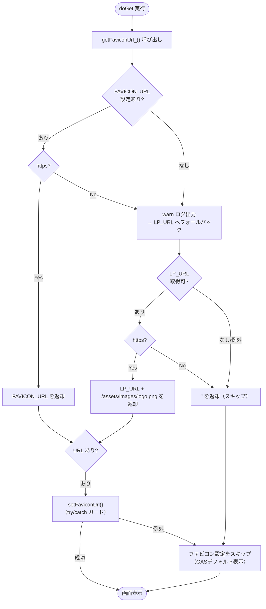
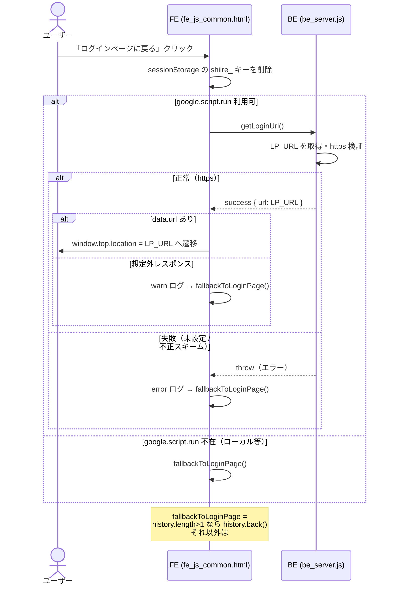

# PR 作業まとめ: MYP-3918 バグ対応 part3

## 概要

リリース後に検出された複数の不具合・UI崩れをまとめて修正した「バグ対応 part3」。
主な対応は、(1) ブラウザタブのファビコン設定機能の追加、(2) アカウント未登録エラー画面の文言・導線改善（「ログインページに戻る」ボタン追加）、(3) CSVアップロード離脱モーダルの文言・ボタン構成の見直し、(4) 確認/詳細画面の消費税セルの表示ガタつき修正、(5) 詳細画面の差戻しコメント表示形式の統一、の5テーマ。
いずれも既存の業務ロジック（請求登録・BQ連携）には手を入れず、画面表示・遷移・静的リソースまわりに限定した修正。

## 対象ブランチ

`feature/MYP-3918-bug-fix-part3` → `develop`

---

## 変更ファイル一覧

| ファイル | 変更種別 | 変更内容 |
|----------|---------|---------|
| `src/be_assets.js` | 追加 | ファビコンURLを解決する `getFaviconUrl_()` と https 検証ヘルパー `isHttpsUrl_()` を新規作成。`FAVICON_URL` / `LP_URL` を https のみ許可しフォールバック制御 |
| `src/be_main.js` | 変更 | `doGet` で `getFaviconUrl_()` を呼び、`setFaviconUrl()` を try/catch ガード付きで設定（失敗しても画面表示を止めない） |
| `src/be_server.js` | 追加 | エラー画面用の公開関数 `getLoginUrl()` を追加（`LP_URL` をそのまま返却・https 検証付き・`?logout=true` なし） |
| `src/fe_page_error.html` | 変更 | 連絡先を電話番号→メールアドレスに変更。フッターに「ログインページに戻る」ボタン（`#btnBackToLogin`）を追加 |
| `src/fe_js_common.html` | 変更 | アカウント未登録時のエラー文言を更新。「ログインページに戻る」処理 `initBackToLogin`（フォールバック遷移付き）を追加 |
| `src/fe_page_csv_upload.html` | 変更 | 離脱確認モーダルの文言を「登録情報が破棄されます」に変更し、ボタンを「OK / キャンセル」の2つに変更 |
| `src/fe_js_upload.html` | 変更 | 離脱モーダルにキャンセルボタンのハンドラを追加（OK/キャンセルの2ボタン化）。OKボタンのコメントを実態に修正 |
| `src/fe_js_confirm.html` | 変更 | 確認画面テーブルの消費税セルを `tax-cell`（金額＋税率を別 span に分割）構造へ変更 |
| `src/fe_js_detail.html` | 変更 | 差戻しコメント表示を「USEN PAY社からのコメント」形式（否認差戻と同一）に統一。消費税セルを `tax-cell` 構造へ変更 |
| `src/fe_css.html` | 変更 | エラー画面フッター／戻るリンク、離脱モーダルの警告スタイル、消費税セル（`tax-cell`）のスタイルを追加 |

---

## 設計方針

### テーマ1: ファビコン設定（`be_assets.js` 新規 / `be_main.js`）

GAS には静的ファイルをURLパスで配信する仕組みがなく、`HtmlOutput.setFaviconUrl()` は data URI を受け付けず**公開HTTPS URL のみ有効**という制約がある。そこで、LP（S3 + CloudFront 配信）に既設のロゴ画像を流用する方式を採用した。

| 観点 | 方針 |
|------|------|
| 画像の調達 | LP の `{LP_URL}/assets/images/logo.png` を流用（dev で HTTP 200 / image/png 確認済み） |
| 環境切替 | ドメインは Script Property `LP_URL` に追従＝dev/prod が自動で切り替わる |
| 個別上書き | Script Property `FAVICON_URL` を設定するとそちらを最優先 |
| セキュリティ | `FAVICON_URL` / `LP_URL` とも **https 以外（http/data/javascript 等）はスキップ**。誤設定による `setFaviconUrl` 例外・意図しない外部参照を防止 |
| 堅牢性 | URL 取得不可・不正値なら `''` を返し、`doGet` 側でファビコン設定を try/catch でスキップ（GASデフォルト表示に退避） |

#### ファビコンURL解決の優先順位

| 優先 | ソース | 条件 |
|------|--------|------|
| 1 | `FAVICON_URL`（明示指定） | https のときのみ採用。不正値はログ出力してフォールバック |
| 2 | `LP_URL` + `/assets/images/logo.png` | `LP_URL` が https のときのみ。不正値はスキップ |
| 3 | `''`（空文字） | 取得不可・不正値。ファビコン設定をスキップ |

### テーマ2: アカウント未登録エラー画面の改善

ログインに使用した Google アカウントが DB 未登録だった場合のエラー画面を、汎用「システムエラー」から**原因と次のアクションが明確な専用画面**へ変更した。

| 項目 | Before | After |
|------|--------|-------|
| バナー文言 | システムエラーが発生しました。 | ログインに使用されたアカウントの登録が見当たりません。 |
| 本文 | アカウント情報の取得に失敗しました。再読み込みしてください。 | 登録済みの Google アカウントで再ログインを促す案内 |
| 連絡先 | 電話番号（`tel:080-...`） | メールアドレス（`mailto:usenpay-connect-ope@usen-pay.co.jp`） |
| 復帰導線 | なし（行き止まり） | 「ログインページに戻る」ボタンを追加 |

#### 「ログインページに戻る」の堅牢化（フォールバック遷移）

ログアウト処理（`getLogoutUrl`）と同じく、`google.script.run` が使えない／レスポンス異常時でも**必ず画面遷移する**よう多段フォールバックを実装した。

| ケース | 挙動 |
|--------|------|
| 正常 | `getLoginUrl()` が返す LP URL へ `window.top.location.href` で遷移 |
| `google.script.run` 不在（ローカル開発等） | `fallbackToLoginPage()` を実行 |
| 失敗（`withFailureHandler`） | ログ出力後 `fallbackToLoginPage()` |
| 想定外レスポンス（`data.url` 無し） | ログ出力後 `fallbackToLoginPage()` |

`fallbackToLoginPage()` は `window.history.length > 1` なら `history.back()`、なければ `#home` へ遷移する。
バックエンド `getLoginUrl()` は `LP_URL` を https 検証のうえ返却し、ログアウトトーストが出ないよう `getLogoutUrl()` とは別関数に分離（`?logout=true` を付与しない）。

### テーマ3: CSVアップロード離脱モーダルの見直し

離脱時の確認モーダルを、片ボタン（「一覧に戻る」のみ）から**警告スタイルの OK / キャンセル 2ボタン**に変更し、誤離脱を防ぎやすくした。

| 項目 | Before | After |
|------|--------|-------|
| タイトル | 一覧に戻ると登録作業中のファイルは削除されますがよろしいですか？ | 登録情報が破棄されます |
| アイコン | `circle-exclamation` | `triangle-exclamation`（警告） |
| ボタン | 「一覧に戻る」1つ | 「OK」（破棄して遷移）／「キャンセル」（留まる）の2つ |
| スタイル | 通常 | `modal--warn`（オレンジ系警告配色） |

### テーマ4: 消費税セルの表示ガタつき修正

確認・詳細画面のテーブルで「金額（税率%）」を1つのセルに直書きしていたため、桁数で右端／左端がズレて行ごとにガタついていた。金額と税率を別 `span` に分割し、`tax-cell` で**金額は右寄せ・税率は左端固定（幅52px）**にして整列させた。

```
Before: <td>1,234円（10%）</td>            ← 桁数で揃わない
After:  <td class="tax-cell">
          <span class="tax-amount">1,234円</span>
          <span class="tax-rate">（10%）</span>  ← 税率の左端を固定
        </td>
```

### テーマ5: 詳細画面の差戻しコメント表示統一

差戻し（RETURNED）時の `backoffice_handover` 表示を、独自の「差し戻しコメント」バナーから、**否認差戻（RETURNED + DISPUTED）と同じ「・USEN PAY社からのコメント」表示形式（読み取り専用 textarea）**に統一した。コメント表示のUIを一本化し、画面間の体験を揃える狙い。

---

## 全体フロー図

### ファビコンURL解決フロー（`getFaviconUrl_`）



### 「ログインページに戻る」シーケンス（フォールバック付き）



---

## 変更詳細

### `src/be_assets.js`（新規）

- `isHttpsUrl_(url)`: 値が文字列で、前後空白を除き `https://` で始まるかを判定する内部ヘルパー。
- `getFaviconUrl_()`: `FAVICON_URL` → `LP_URL` 由来 → `''` の優先順位でファビコンURLを返す。両プロパティとも https 以外はスキップし、`console.warn` でログを残す。
- `FAVICON_LP_PATH_`: LP ロゴ画像の相対パス定数（`assets/images/logo.png`）。

### `src/be_main.js`

- `doGet` の戻り値を一旦 `output` に受け、`getFaviconUrl_()` の結果が非空なら `setFaviconUrl()` を呼ぶ。`setFaviconUrl` は data URI 等で例外を投げ得るため try/catch で囲み、失敗時も `console.warn` のみで画面表示は継続。

### `src/be_server.js`

- `getLoginUrl()` 公開関数を追加。`LP_URL` 未設定・https 以外は `logError_` のうえユーザー向けメッセージを throw。正常時は `success_({ url })` を返す。`getLogoutUrl()` と分離した理由（ログアウトトースト抑止）をコメントに明記。

### `src/fe_js_common.html`

- `showErrorPage_('system')` のバナー／本文／補足文言を、アカウント未登録向けの具体的な案内に差し替え。
- `initBackToLogin` IIFE を追加。`#btnBackToLogin` のクリックで shiire_ キーを削除し、`getLoginUrl()` 呼び出し＋3系統のフォールバック（不在・失敗・想定外）で `fallbackToLoginPage()` を実行。

### `src/fe_page_error.html`

- 連絡先を `tel:` から `mailto:usenpay-connect-ope@usen-pay.co.jp` に変更。
- フッター（`error-page__footer`）に「ログインページに戻る」ボタンを追加。

### `src/fe_page_csv_upload.html` / `src/fe_js_upload.html`

- モーダル文言を「登録情報が破棄されます」に変更し、警告アイコンへ差し替え。ボタンを「OK（`btn-danger`）／キャンセル（`btn-outline`）」の2つに変更。
- JS 側に `uploadBackModalCancel` の参照とクリックハンドラ（モーダルを閉じて留まる）を追加。OKボタンのコメントを「OKボタン → データリセットしてホームへ」に修正。

### `src/fe_js_confirm.html` / `src/fe_js_detail.html`

- 消費税セルを `tax-cell` クラス＋`tax-amount` / `tax-rate` の2 span 構造に変更（両画面で同一形式に統一）。
- 詳細画面の差戻しコメントを `dsl-returned-reason` バナーから `store-accordion__backoffice-remark`（読み取り専用 textarea）に変更し、否認差戻と同じ「・USEN PAY社からのコメント」表示に統一。

### `src/fe_css.html`

- `.error-page__footer` / `.error-page__back-link`（戻るリンク）スタイルを追加。
- `#uploadBackModal .modal--warn` 系の警告配色・OK/キャンセルボタンの寸法スタイルを追加。
- `.detail-table td.tax-cell .tax-amount`（右寄せ）/ `.tax-rate`（幅52px・左寄せ）を追加し行のガタつきを解消。

---

## コーディングルール準拠

| ルール | 対応 |
|--------|------|
| `var` 禁止 → `const` / `let` 使用 | ✅ 追加コードはすべて `const` / `let` |
| 内部関数は末尾 `_` | ✅ `isHttpsUrl_` / `getFaviconUrl_` / `FAVICON_LP_PATH_` |
| 公開関数は `function` キーワード・末尾 `_` なし | ✅ `getLoginUrl()` を `function` 定義・末尾 `_` なし |
| 同名グローバルの重複定義禁止 | ✅ ファビコン関連は新規 `be_assets.js` に集約、FE 追加処理は共通 `fe_js_common.html` に集約 |
| ファイル追加ルール（新ドメインは `be_` 新規ファイル） | ✅ 静的リソース管理を `be_assets.js` として新設 |

---

## 影響範囲

- **機能影響**:
  - ファビコン設定は任意機能であり、URL 不正・例外時はスキップして従来どおりの表示に退避するため既存画面への悪影響なし。
  - エラー画面・離脱モーダルは文言／ボタン構成の変更が中心で、業務ロジック（請求登録・BQ連携）には未着手。
  - 消費税セル・差戻しコメントは表示（HTML構造・CSS）のみの変更で、計算ロジックやデータには影響なし。
- **パフォーマンス影響**: なし（`getFaviconUrl_` は `doGet` 時の軽量な Script Property 参照のみ。クエリ追加や追加の外部通信は発生しない）。
- **セキュリティ**: `FAVICON_URL` / `LP_URL` / ログイン URL すべてで https スキームを検証し、オープンリダイレクト・意図しない外部参照・XSS を抑止。
