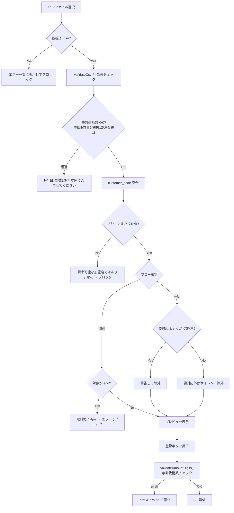
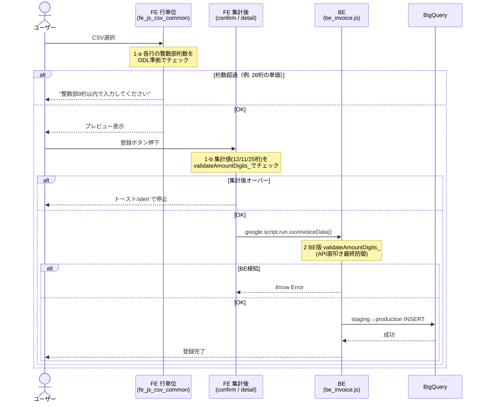

# PR 作業まとめ: MYP-3960 バグ対応 part4

## 概要

リリース後に検出された CSV 再請求まわりの不具合をまとめて修正した「バグ対応 part4」。
主な対応は、(1) CSV 以外のファイル選択時のエラー表示をトースト/標準ダイアログからエラー一覧 UI へ統一、(2) 取引終了（`store_status='end'`）加盟店・リレーション外 `customer_code` の混入を FE/BE 双方でブロック、(3) 金額桁数の上限チェックを行単位（CSV 読込時）＋集計後（送信時）＋ BE 最終防御の三段構えで実装、(4) disabled ボタンのスタイル調整、の 4 テーマ。
特に (3) は、26 桁の単価が BigQuery の `SAFE_CAST(... AS INT64)` でオーバーフローし、「数値として解釈できない値です（半角数字で入力してください）」という**誤解を招くエラー**になる実害バグの根治を目的としている。

## 対象ブランチ

`feature/MYP-3960-bug-fix-part4` → `develop`

関連チケット: MYP-3960 / MYP-3965 / MYP-3966 / MYP-3967

---

## 変更ファイル一覧

| ファイル | 変更種別 | 変更内容 |
|----------|---------|---------|
| `src/fe_js_upload.html` | 変更 | 新規アップロード画面で CSV 以外を選択した際、トースト→エラー一覧 UI（`renderErrors`）表示に変更 |
| `src/fe_js_detail.html` | 変更 | 詳細画面の CSV 再アップロードで、(a) CSV 以外を `alert`→エラー一覧表示、(b) 取引終了加盟店・リレーション外 `customer_code` の検知/ブロック、(c) 店舗名検索の O(1) 辞書化、(d) 個別プレビュー登録に金額桁数チェック追加 |
| `src/be_invoice.js` | 追加/変更 | 集計後金額桁数チェック関数 `validateAmountDigits_()` を新設し 3 送信関数に組込み。取引終了加盟店の再請求拒否・リレーション外 `customer_code` 拒否の BE 防御を追加 |
| `src/fe_js_csv_common.html` | 追加/変更 | 行単位の整数部桁数チェック（`AMOUNT_INT_DIGIT_LIMITS_`）を `validateCsv()` に追加。集計後桁数チェックの共通関数 `validateAmountDigits_()` を新設 |
| `src/fe_js_confirm.html` | 変更 | 確認画面の inline 金額桁数チェックを共通関数 `validateAmountDigits_()` 呼び出しへ置換（挙動不変のリファクタ） |
| `src/db_bq_query.js` | 変更 | 詳細取得クエリ `fetchStoreInvoicesByParent_` の SELECT に `s.store_status` を追加（end 判定用） |
| `src/fe_css.html` | 変更 | disabled ボタン（`.btn-primary` / `.btn-submit` / `.preview-submit-btn`）の背景色・文字色・shadow を統一 |

---

## 設計方針

### テーマ1: CSV 以外ファイル選択時のエラー表示統一

CSV 以外のファイルを選んだ際の通知が、画面ごとにトースト（自動で消える）や `alert`（標準ダイアログ）とバラバラだった。これを**他のバリデーションエラーと同じエラー一覧 UI** に寄せ、ファイル名・サイズと併せて恒久表示することで、ユーザーが原因を見失わないようにした。

| 画面 | Before | After |
|------|--------|-------|
| 新規アップロード（`fe_js_upload.html`） | `showToast('CSVファイルを選択してください')` + `resetDropZone()` | `hideToast()` の上で `renderErrors([...], [], file.name, file.size)` |
| 詳細・再アップロード（`fe_js_detail.html`） | `alert('CSVファイルを選択してください')` | `showErrors_(['CSVファイル（.csv）を選択してください。'])` |

### テーマ2: 取引終了（end）加盟店・リレーション外 customer_code のブロック

取引終了済み（`store_status='end'`）の加盟店や、卸のリレーション（マッピング）に存在しない `customer_code` が CSV に混入した場合の挙動を、フロー別に整理して FE/BE 双方で制御した。

#### end 加盟店の扱い（フロー別）

| フロー | 挙動 |
|--------|------|
| **個別再請求** | 対象加盟店が end なら**エラーでブロック**（CSV の有無に関わらず再請求不可） |
| **一括再請求** | 「要対応」かつ end の店舗が CSV に含まれる場合のみ**警告**し、今回の再請求から除外。それ以外（要対応でない end / CSV 未収載の end）は警告なしで**サイレント除外** |

> この整理に合わせ、`_detailEndStores` のコメントを「CSV に含まれていたら警告/エラー」という広すぎる表現から、上記のフロー別挙動を明記する形に更新した。

#### リレーション外 customer_code の扱い

リレーションに存在する全 `customer_code`（active + end）の集合 `validCcSet` を作り、これに無い `customer_code` は**一括・個別とも一律ブロック**（「請求可能な加盟店ではありません」）。FE で弾くだけでなく、API 直叩き対策として BE（`resubmitInvoiceData` / `bulkResubmitInvoiceData`）でも `customerToMall` を使った同等チェックを追加した。

| 防御層 | チェック内容 |
|--------|-------------|
| FE | `validCcSet` に無い `customer_code` をブロック。end 集合 `endCcSet` で個別=エラー/一括=警告除外 |
| BE | `endMallCodeSet`（end 店舗）で再請求拒否。`customerToMall` に無い `customer_code` を `invalidCustomerCodes` として拒否 |

> Copilot レビュー指摘を受け、`invalidCustomerCodes` 抽出は `String(m.customerCode || '')` で空文字に落としてから判定し、`'undefined'` 文字列の誤検知を防止している。

### テーマ3: 金額桁数バリデーション（三段構え）

**実害バグ**: 26 桁の単価をアップロードすると、BQ 側の `SAFE_CAST(... AS INT64)` が INT64 上限（約 19 桁）を超えて NULL になり、「数値として解釈できない値です。半角数字で入力してください」という**桁数とは無関係な誤導メッセージ**が表示されていた。

これを根治するため、DDL の `NUMERIC` 桁数（正本: `docs/plan/column_limits.csv`）に基づくチェックを **3 層**で実装した。行単位は単一セルのオーバーを送信前に弾き、集計後は合算起因のオーバーを捉える補完関係にある。

| 層 | 区分 | 対象 | 役割 |
|----|------|------|------|
| **1-a** | FE 行単位 | `validateCsv()` の `integer` / `decimal` ケース | CSV 読込時に各行の**整数部桁数**を DDL 準拠でチェック。BQ 送信前にブロックし誤導メッセージを回避 |
| **1-b** | FE 集計後 | 確認画面 ＋ 個別プレビュー登録 | 共通関数 `validateAmountDigits_()` で加盟店単位（12/11 桁）・卸全体（25 桁）を検証 |
| **2** | BE 最終防御 | `sendInvoiceData` / `resubmitInvoiceData` / `bulkResubmitInvoiceData` | BE 版 `validateAmountDigits_()` を `validateTaxAdjustment_` 直後に呼び、API 直叩きの桁あふれを防御 |

#### 桁数上限（DDL 正本準拠）

| 区分 | 対象 | 上限 | 比較方式 |
|------|------|------|---------|
| 行単位 | 請求金額(税抜) / 消費税 / 単価 / 数量 | 12 / 11 / 8 / 6 桁（整数部） | 生文字列の桁数 |
| 加盟店集計 | 請求金額合計・小計（`store_invoices`） | 12 桁 | `Math.abs` |
| 加盟店集計 | 消費税・税内訳 10%/8%（`store_invoices`） | 11 桁 | `Math.abs` |
| 卸全体 | 請求金額合計・手数料・振込予定（`wholesaler_invoices`） | 25 桁 | `BigInt` |

> **2 つの落とし穴対応**:
> 1. 整数部桁数は `Number` 経由（`Math.trunc`）だと `1e21` 以上で指数表記になり桁数を誤るため、**生文字列**から符号・小数点以降・先頭ゼロを除いて数える方式に修正。
> 2. clasp のパーサーが BigInt リテラル `0n` を `Unexpected token ILLEGAL` で弾くため、BE 側は `BigInt(0)` に置換（FE はトランスパイル前提のためリテラルのまま）。

### テーマ4: disabled ボタンのスタイル統一

無効化ボタンの配色が要素ごとに異なっていた（`#b0bec5` / `#C7C7C7` / `opacity:0.5`）ため、淡いグレーで統一し、押下不可であることを視覚的に揃えた。

| 対象 | Before | After |
|------|--------|-------|
| `.btn-primary:disabled` | 背景 `#b0bec5` / 文字 `#eceff1` | 背景 `#F8F8F9` / 文字 `#A5A5A5` / `box-shadow: none` |
| `.btn-submit:disabled` | 背景 `#C7C7C7` / 文字 `#fff` | 背景 `#F8F8F9` / 文字 `#A5A5A5` / `box-shadow: none` |
| `.preview-submit-btn:disabled` | `opacity: 0.5` | `box-shadow: none`（opacity 廃止） |

---

## 全体フロー図

### CSV 再アップロードのバリデーション（テーマ2 + テーマ3）

### 金額桁数チェックの三段防御（テーマ3）

---

## 変更詳細

### `src/fe_js_csv_common.html`

- **定数追加**: `AMOUNT_INT_DIGIT_LIMITS_`（行単位・整数部桁数）と `AMOUNT_DIGIT_LIMITS_`（集計後・加盟店/税）を新設。値は DDL 正本 `column_limits.csv` に準拠。
- **共通関数 `validateAmountDigits_(summaryData)`**: 加盟店単位は `Math.abs`、卸全体（25 桁）は `BigInt` で比較し、エラー文言配列を返す。確認画面・個別プレビューの両方から呼ぶ。
- **`validateCsv()` の `integer`/`decimal` ケース**: `intDigits`（生文字列ベースの整数部桁数）が `digitLimit` を超えたら行番号付きでエラー。`else if` 分岐のため enum チェックとは排他。

### `src/fe_js_confirm.html`

- 約 45 行あった inline の金額桁数チェック（加盟店 forEach + BigInt 25 桁）を、共通関数 1 行 `validateAmountDigits_(summaryData)` に置換。**挙動は不変**でロジックの二重管理を解消。

### `src/fe_js_detail.html`

- **`_detailEndStores`**: end 店舗情報を保持するグローバル変数を追加。`renderDetailStoreList_` で `store_status==='end'` の店舗を抽出。コメントにフロー別挙動を明記。
- **`handleFile_`**: CSV 以外を `alert`→`showErrors_` に変更。
- **店舗名辞書化**: `mallToStoreName`（`mall_code → store_name`）を事前構築し、一括チェックの入れ子ループ（`mappings.forEach` の毎回走査）を O(1) 参照に改善（Copilot 指摘対応）。
- **検証ロジック**: `validCcSet`（リレーション外検出）、`endCcSet`（end 検出）を導入。個別=エラー、一括=警告除外、二重エラー表示防止（`errors.length === 0 && rows.length === 0`）。
- **個別プレビュー登録**: `summaryData` 構築後に `validateAmountDigits_()` を呼び、超過時は `alert` で停止（確認画面を経由しない個別フローの穴を補填）。

### `src/be_invoice.js`

- **`validateAmountDigits_(summaryData)`**: FE と同一ロジックの BE 版を新設。違反時は `logError_` の上 `throw new Error(errors[0])`。BigInt は `BigInt(0)`（clasp パーサー対応）。
- **3 送信関数へ組込み**: `resubmitInvoiceData` / `bulkResubmitInvoiceData` / `sendInvoiceData` の `validateTaxAdjustment_` 直後（トランザクション前）に呼び出し。
- **end / リレーション防御**: `endMallCodeSet` を構築し、個別は対象が end なら拒否、一括は filter で除外。`invalidCustomerCodes` は `String(m.customerCode || '')` で空文字化してから検証。

### `src/db_bq_query.js`

- `fetchStoreInvoicesByParent_` の SELECT に `s.store_status` を 1 列追加。FE の end 判定に必要なステータスを供給する最小変更。

### `src/fe_css.html`

- disabled 3 セレクタの配色を統一（`#F8F8F9` / `#A5A5A5` / `box-shadow: none`）。`preview-submit-btn` は `opacity:0.5` を廃止。

---

## コーディングルール準拠

| ルール | 対応 |
|--------|------|
| `var` 禁止 → `const` / `let` 使用 | ✅ 追加コードは全て `const` / `let` |
| 内部関数は末尾 `_` | ✅ `validateAmountDigits_` / `handleFile_` / `renderDetailStoreList_` 等 |
| `function` キーワードで定義 | ✅ `function validateAmountDigits_(...)` |
| FE/BE/DB のファイル命名規則 | ✅ `fe_` / `be_` / `db_` プレフィックスを踏襲 |
| 桁数等の定数はマジックナンバーを避け定数化 | ✅ `AMOUNT_INT_DIGIT_LIMITS_` / `AMOUNT_DIGIT_LIMITS_` |

---

## 影響範囲

- **機能影響**:
  - CSV 以外ファイルの通知方法のみ変更（弾く挙動は同じ）。
  - 取引終了加盟店・リレーション外 `customer_code` は**新たにブロック対象**になるため、従来すり抜けていた不正データが登録前に止まる。正常な active 加盟店の請求フローには影響なし。
  - 金額桁数チェックは新規追加だが、上限は DDL の `NUMERIC` 制約と同値のため、**従来 BQ で失敗していたケースを早期・明示的に弾く**だけで、正常値の登録は従来どおり。
  - 確認画面の桁数チェックは共通関数化のリファクタで挙動不変。
- **パフォーマンス影響**:
  - 一括チェックの店舗名検索を入れ子ループ→O(1) 辞書参照に改善（Copilot 指摘対応）。対象店舗数×マッピング数の反復が解消され、むしろ軽量化。
  - 桁数チェックは行数・加盟店数に対する線形走査のみで、実用上の負荷増は無視できる範囲。
