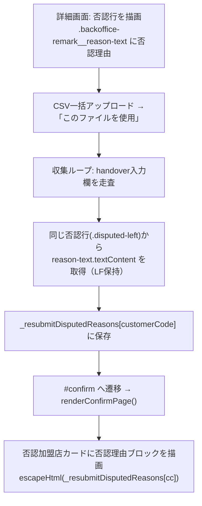
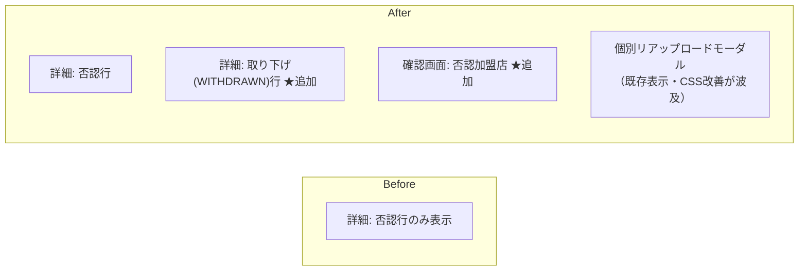

# PR 作業まとめ: MYP-4013 バグ修正part6（否認理由表示の拡張・レイアウト崩れ修正・確認画面の戻る遷移修正）

## 概要

本 PR では、否認理由の表示にまつわる UI バグ群を 3 点まとめて修正した。

1. **否認理由の表示範囲を拡張**: 従来は詳細画面の否認行のみに表示していた否認理由を、**再申請の確認画面（否認加盟店）**と**詳細画面の取り下げ（WITHDRAWN）行**にも表示するようにした。確認画面はCSV由来データで描画されBE側に否認理由を持たないため、詳細画面DOMから**改行(LF)を保持したまま**引き継ぐ方式を採用した。
2. **長文・改行によるレイアウト崩れの修正**: 否認理由（最大250文字・LF含む）が折り返さず横に伸び、操作ボタン列がカード外へ押し出されてクリック不能になる不具合を、CSS（折り返し + flex の `min-width:0`）のみで解消した。
3. **確認画面「一覧に戻る」の遷移先修正**: CSV一括再請求の確認画面で「一覧に戻る」を押すと TOP ではなく詳細画面に遷移していた不具合を、常に `#home`（TOP）へ遷移するよう修正した。あわせて仕様書・テストシナリオを実装に合わせて統一した。

## 対象ブランチ

`feature/MYP-4013-bug-fix-part6` → `develop`

---

## 変更ファイル一覧

| ファイル | 変更種別 | 変更内容 |
|----------|---------|---------|
| `src/fe_js_detail.html` | 変更 | グローバル変数 `_resubmitDisputedReasons` 追加 / 取り下げ(WITHDRAWN)行に否認理由ブロックを追加 / 再申請開始時に否認理由を DOM(`textContent`)から LF 保持で収集 |
| `src/fe_js_confirm.html` | 変更 | 確認画面の否認加盟店に否認理由ブロックを追加 / 「一覧に戻る」を常に `#home` 遷移へ修正 / ページタイトル文言を「請求内容の確認（再申請）」へ調整 |
| `src/fe_css.html` | 変更 | 否認理由テキストの折り返し・LF 改行・`min-width:0`・`overflow:hidden` でボタン位置を固定 |
| `docs/specifications/03_confirm_page.md` | 変更 | 「一覧に戻る」= 常に TOP の仕様に統一 / 状態変数表に `_resubmitDisputedReasons` 追記 / 再送信モードのフロー図に離脱動線を追加 |
| `docs/specifications/07_test_scenarios.md` | 変更 | テストシナリオ C-9・C-14 を TOP 遷移に修正 / 「キャンセル」動線の C-15 を新設 |

---

## 設計方針

### 1. 否認理由の取得方式（確認画面）

確認画面は CSV（`parsedData`）から描画されるため BE 側に否認理由を持たない。BE を改修して再取得する案もあるが、否認理由は既に詳細画面の DOM 上に存在するため、**既存の `_resubmitHandovers`（合意内容の引き継ぎ）と同一パターンで DOM から引き継ぐ**方式を採用した（BE 変更ゼロ）。

| 案 | 内容 | 採否 |
|----|------|------|
| A. BE で確認画面用に否認理由を再取得 | `db_bq_query.js` に取得を追加 | 不可（変更大・既存と非対称） |
| **B. 詳細画面 DOM から引き継ぎ** | `.backoffice-remark__reason-text` を収集し `_resubmitDisputedReasons` 経由で描画 | **採用**（既存 handover と同型・BE 変更不要） |

> 📌 否認理由は最大250文字で改行(LF)を含みうるため、合意内容で使う `nl2space_`（改行→空白変換）は**適用せず**、`textContent` をそのまま保持して引き継ぐ点が重要な判断。

### 2. レイアウト崩れの原因と対処

否認行は `disputed-left`（否認理由＋合意内容）と `actions`（ボタン群）が横並び(flex)の構造。崩れは次の 3 点の複合が原因だった。

| 原因 | 内容 | 対処 |
|------|------|------|
| ① テキストが折り返さない | `reason-text` に折り返し指定なし | `white-space:pre-wrap` + `word-break:break-all` を付与 |
| ② flex 子が縮まない | `disputed-left`/`disputed-reason` が `min-width:auto` のまま膨張 | 各要素に `min-width:0` を付与 |
| ③ ボタンが逃げ場なく押し出される | `actions` は `flex-shrink:0` + 固定幅197px | 上記①②で左カラムを縮め、保険に親へ `overflow:hidden` |

既存の `.backoffice-remark__handover-readonly`（`pre-wrap` + `break-all`）と表現を統一し、否認・取り下げ・確認画面・個別リアップロードモーダルすべて（同一クラス再利用）に同時適用される。

### 3. 「一覧に戻る」の遷移先（Before / After）

「一覧」= TOP を指すため、再送信モードでも詳細画面ではなく TOP へ戻すのが正。詳細画面へ戻る動線は別ボタン「キャンセル」が担う。

```
Before（バグ）                          After（修正後）
─────────────────────────────          ─────────────────────────────
[一覧に戻る] 確定                        [一覧に戻る] 確定
  ├ 通常モード   → #home                  └ 常に #home（TOP）
  └ 再送信モード → #detail?invoiceId  ✗

[キャンセル] 確定（変更なし）            [キャンセル] 確定（変更なし）
  ├ 通常モード   → #upload                ├ 通常モード   → #upload
  └ 再送信モード → #detail?invoiceId      └ 再送信モード → #detail?invoiceId
```

再送信フラグ（`_isResubmitConfirm`）と詳細画面キャッシュは、`navigate()` が `#home` 遷移時に自動でクリアするため、ハンドラ側での明示クリアは不要になりコードも簡素化された。

---

## 全体フロー図

### 否認理由の引き継ぎフロー（詳細画面 → 確認画面）



### 否認理由の表示箇所（Before / After）



---

## 変更詳細

### `src/fe_js_detail.html`

- **グローバル変数追加**: `let _resubmitDisputedReasons = {};` を `_resubmitDisputedCodes` の隣に追加。再申請時の否認理由を `{ customerCode: 否認理由 }` で保持する。
- **取り下げ(WITHDRAWN)行への否認理由表示**: `buildDetailAccordion_` の `isWithdrawn` 分岐で、既存の合意内容（読取専用）欄は残したまま、その前に否認行と同形の `backoffice-remark__disputed-reason` ブロック（`store.store_disputed_reason`）を追加。否認理由は BQ で全ステータス分取得済み（`db_bq_query.js`）のため BE 変更は不要。
- **否認理由の DOM 収集**: 再申請開始処理の handover 収集ループ内で、`el.closest('.backoffice-remark__disputed-left')` から `.backoffice-remark__reason-text` を取得し、`textContent` を**そのまま**（LF保持・`nl2space_` 不適用）`_resubmitDisputedReasons[cc]` に保存。収集結果はコンテキスト確定時に代入する。

### `src/fe_js_confirm.html`

- **確認画面の否認理由表示**: `renderConfirmPage()` の再送信モード分岐（`_isResubmitConfirm && _resubmitDisputedCodes.includes(customerCode)`）で生成する `handoverDiv` に、合意内容欄の**前**へ否認理由ブロックを追加。値は `escapeHtml(_resubmitDisputedReasons[customerCode] || '')`。
- **「一覧に戻る」遷移修正**: `cancelModalOk` のハンドラから再送信時の詳細画面分岐を削除し、`resetPage()` 後に常に `location.hash = '#home'` へ統一。
- **タイトル文言調整**: 再送信時のページタイトルを「請求内容の確認（再申請）」に変更。

### `src/fe_css.html`

- `.backoffice-remark__reason-text`: `flex:1` `min-width:0` `line-height:1.6` `white-space:pre-wrap` `word-break:break-all` を追加（折り返し・LF改行・全文表示）。
- `.backoffice-remark__disputed-left`: `min-width:0` を追加（ボタン押し出しの根本対策）。
- `.backoffice-remark__disputed-reason`: `min-width:0` 追加 + `align-items` を `center` → `flex-start`（複数行時にラベルを先頭行へ）。
- `.store-accordion__backoffice-remark`: `overflow:hidden` を追加（保険）。

### `docs/specifications/03_confirm_page.md` / `07_test_scenarios.md`

- 仕様書 7.1 節・4.2 節を「一覧に戻る = 常に TOP」「キャンセル = （再送信時）詳細画面」に整理し、フロー図に離脱動線を追記。状態変数表に `_resubmitDisputedReasons` を追加。
- テストシナリオ C-9（通常）・C-14（再送信）の期待結果を TOP 遷移へ修正し、対となる「キャンセル」動線の C-15 を新設。

---

## コーディングルール準拠

| ルール | 対応 |
|--------|------|
| `var` 禁止 → `const` / `let` 使用 | ✅ 追加変数は `let _resubmitDisputedReasons` / `const disputedReasons_` 等すべて const・let |
| 内部関数は末尾 `_` | ✅ 収集用の一時変数も既存慣習に合わせ `disputedReasons_` と末尾 `_` 付き（新規関数の追加はなし） |
| `function` キーワードで定義 | ✅ 既存関数内の修正のみで新規関数定義なし（該当なし） |

---

## 影響範囲

- **機能影響**:
  - 否認理由の表示が「詳細の否認行」に加え「詳細の取り下げ行」「再申請の確認画面」へ拡大。個別リアップロードモーダルは既存表示のまま CSS 改善の恩恵を受ける。
  - 「一覧に戻る」は再送信モードでも TOP へ遷移するよう挙動変更（仕様統一）。「キャンセル」ボタンの遷移先は従来どおり変更なし。
  - 否認理由表示はすべて表示専用で、登録・保存系のデータフローには影響しない。
- **パフォーマンス影響**: なし（DOM 1 回の `querySelector` 追加と CSS のみ。BE/BQ 変更なし）。
