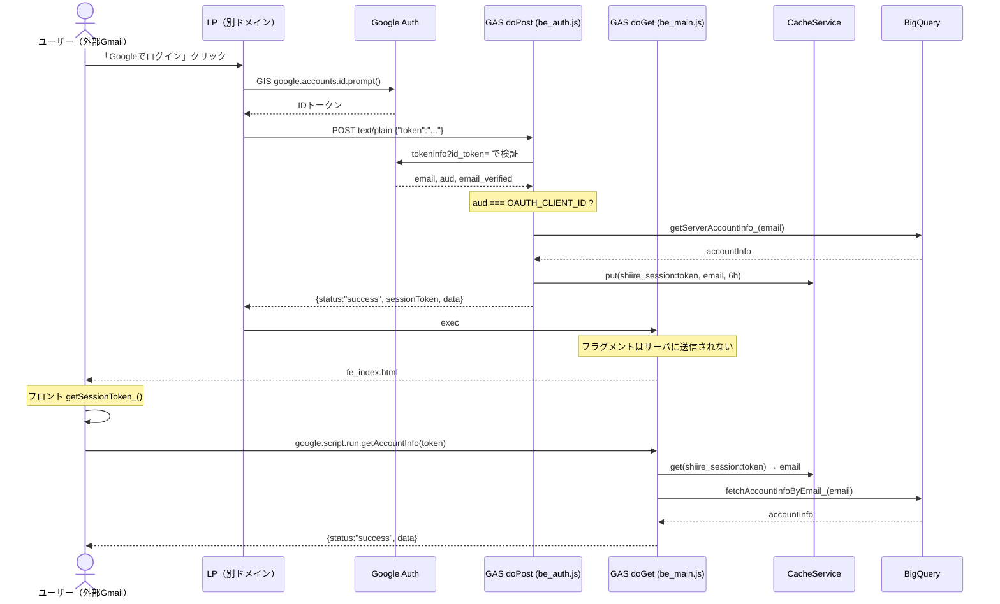
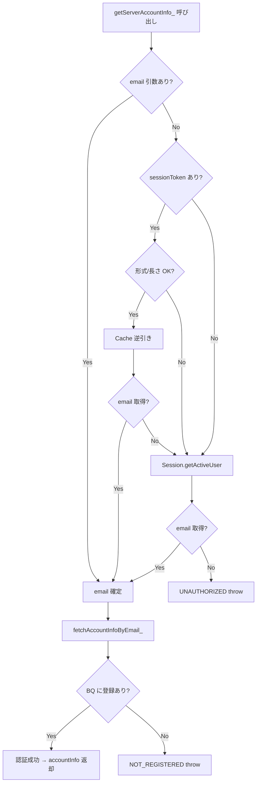

# PR 作業まとめ: MYP-4062 外部アカウントでのログイン方法修正

## 概要

組織外の個人Googleアカウント（外部Gmail）でもログインできるよう、認証方式を **IDトークン doPost + セッショントークン Cache** 方式に移行した。
現状の `Session.getActiveUser().getEmail()` は `executeAs: USER_DEPLOYING` 設定下で外部ドメインのメールを返せない Google の仕様制約があったため、LP 側で Google Identity Services (GIS) を使った認証を行い、IDトークンを GAS の `doPost` へ送信→tokeninfo API で検証→メール取得→BQ 照合→セッショントークン発行、という経路を新設した。
BQ アクセスはサーバ権限（USER_DEPLOYING）を維持し、停止卸も閲覧可、未登録のみ専用文言で弾く。

## 対象ブランチ

`feature/MYP-4062-fix-external-account-login` → `develop`

---

## 変更ファイル一覧

| ファイル | 変更種別 | 変更内容 |
|----------|---------|---------|
| `src/be_auth.js` | **追加** | 外部ログイン用 `doPost` エンドポイント新設（tokeninfo 検証→aud 照合→BQ 照合→Cache 保存→JSON 返却）、`jsonOutput_` ヘルパー |
| `src/be_server.js` | 変更 | `getServerAccountInfo_` を email/sessionToken 対応に拡張（Cache 逆引き→Session フォールバック）、エラー種別を UNAUTHORIZED/NOT_REGISTERED に分離、`getAccountInfo` に sessionToken 引数追加 |
| `src/be_config.js` | 変更 | `getConfig_()` に `OAUTH_CLIENT_ID` 追加（aud 検証用）、`setupScriptProperties` にデフォルト追加、コメント追記 |
| `src/be_invoice.js` | 変更 | 公開関数 10 件に `sessionToken` 引数追加し `getServerAccountInfo_('', sessionToken)` へ伝播、JSDoc 全件更新 |
| `src/appsscript.json` | 変更 | `oauthScopes` 明示追加（external_request / storage / bigquery / drive / userinfo.email）。webapp 設定は維持 |
| `src/fe_js_common.html` | 変更 | `getSessionToken_()` 新設（フラグメント抽出→sessionStorage 保存→除去）、`getAccountInfo` に token 付与、NOT_REGISTERED 分岐追加 |
| `src/fe_js_home.html` | 変更 | `fetchInvoices` 呼び出しに `getSessionToken_()` 付与 |
| `src/fe_js_calendar.html` | 変更 | `fetchScheduleData` 呼び出しに `getSessionToken_()` 付与 |
| `src/fe_js_confirm.html` | 変更 | `sendInvoiceData` / `bulkResubmitInvoiceData` 呼び出しに `getSessionToken_()` 付与 |
| `src/fe_js_detail.html` | 変更 | `fetchInvoiceDetail` / `getInvoiceLinesByStore` / `resubmitInvoiceData` / `withdrawStoreInvoice` / `undoWithdrawStoreInvoice` / `resubmitWithoutChanges` 呼び出しに `getSessionToken_()` 付与 |
| `docs/CODING_RULES.md` | 変更 | ディレクトリ構成に `be_auth.js` を追記 |

---

## 設計方針

### なぜ IDトークン方式か

| 方式 | メール取得 | BQ 権限 | 採否 |
|------|-----------|--------|------|
| A. `executeAs: USER_ACCESSING` | ✅ 外部も可 | ❌ 利用者権限→BQ 全滅 | 不可 |
| B. `getEffectiveUser()` | ❌ デプロイ者のみ | ✅ 維持 | 不可 |
| **C. IDトークン doPost** | **✅ tokeninfo で取得** | **✅ USER_DEPLOYING 維持** | **採用** |

### セッショントークン受け渡し方式

| 方式 | サーバログ漏洩 | Referrer 漏洩 | 採否 |
|------|-------------|-------------|------|
| `?token=xxx`（クエリ） | ❌ 残る | ❌ 残る | 不可 |
| **`#token=xxx`（フラグメント）** | **✅ 残らない** | **✅ 残らない** | **採用** |

### エラー種別の分離

| Before | After |
|--------|-------|
| `UNAUTHORIZED:` 1 種のみ | `UNAUTHORIZED:` メール未取得（再ログイン案内） |
| | `NOT_REGISTERED:` BQ 未登録（管理者案内） |
| 停止卸も弾いていた（暗黙的に null 統合） | 停止卸(end)は弾かず閲覧可（新規請求のみ抑止は既存ガード維持） |

### メール取得の優先順位

```
1. 引数 email（doPost の tokeninfo 検証後に渡される）
2. sessionToken → CacheService 逆引き（外部アカウント用）
3. Session.getActiveUser().getEmail()（組織内フォールバック）
```

---

## 全体フロー図

### シーケンス図（外部アカウントログイン）



### 処理フロー（認証判定）



---

## 変更詳細

### `src/be_auth.js`（新規）

外部ログイン用の POST エンドポイント。コーディング規約で `be_main.js` はエントリーポイント専用のため、認証系は `be_auth.js` に分離した。

- `doPost(e)`: IDトークンを JSON 文字列 or 純テキストで受信 → `tokeninfo` API 検証 → aud 照合 → email_verified チェック → `getServerAccountInfo_(email)` で BQ 照合 → UUID セッショントークン発行 → `CacheService.getScriptCache().put()` で 6h 保存 → JSON 返却
- エラーレスポンスは `status: 'fail'`（認証失敗）と `status: 'not_registered'`（BQ 未登録）に分離
- `jsonOutput_(obj)`: ContentService で JSON 返却するヘルパー

### `src/be_server.js`

- `getServerAccountInfo_(email, sessionToken)`: 3 段階 email 解決（引数 > Cache 逆引き > Session）。sessionToken は形式/長さ検証（`/^[A-Za-z0-9_-]{1,128}$/`）をサーバ側でも実施し、CacheService key 制約超過や不正値による想定外エラーを防止
- 未登録エラーを `UNAUTHORIZED:` → `NOT_REGISTERED:` に変更し、フロントが原因別に表示を分岐可能に
- `getAccountInfo(sessionToken)`: sessionToken を受け取り `getServerAccountInfo_('', sessionToken)` へ伝播

### `src/be_config.js`

- `getConfig_()` に `oauthClientId`（`OAUTH_CLIENT_ID`）を追加。GCP で発行した OAuth クライアント ID を環境別に設定し、doPost の aud 検証に使用

### `src/be_invoice.js`

- 公開関数 10 件（sendInvoiceData / resubmitInvoiceData / bulkResubmitInvoiceData / resubmitWithoutChanges / withdrawStoreInvoice / undoWithdrawStoreInvoice / fetchInvoices / fetchInvoiceDetail / getInvoiceLinesByStore / fetchScheduleData）に `sessionToken` 引数を末尾追加
- 各関数冒頭の `getServerAccountInfo_()` → `getServerAccountInfo_('', sessionToken)` に統一
- JSDoc の `@param` に sessionToken の用途（外部アカウント認証用、組織内は Session フォールバック）を全件明記

### `src/appsscript.json`

- `oauthScopes` を明示追加。スコープ未明示だと自動推定で不足する可能性があるため、使用 API に対応する 5 スコープを列挙
  - `script.external_request`（UrlFetchApp / tokeninfo 呼び出し）
  - `script.storage`（PropertiesService / CacheService）
  - `bigquery`（BigQuery Advanced Service）
  - `drive`（DriveApp / CSV 保存）
  - `userinfo.email`（Session.getActiveUser）

### `src/fe_js_common.html`

- `getSessionToken_()`: sessionStorage → フラグメント（`#token=xxx`）→ 空の優先順で取得。初回はフラグメントから抽出・sessionStorage 保存・フラグメント除去（漏洩防止）
- DOMContentLoaded の `getAccountInfo()` に `getSessionToken_()` を付与
- 失敗ハンドラに `NOT_REGISTERED:` 分岐を追加（`showErrorPage_('system')` で専用メッセージ表示）

### フロント各画面（fe_js_home / calendar / confirm / detail）

- 全 11 箇所の `google.script.run.関数名(...)` 呼び出しに `getSessionToken_()` を末尾引数として付与
- 組織内アカウントは `getSessionToken_()` が空文字を返すため、サーバ側で Session フォールバックが働き既存動作に影響なし

---

## コーディングルール準拠

| ルール | 対応 |
|--------|------|
| `var` 禁止 → `const` / `let` 使用 | ✅ 全箇所 const/let |
| 内部関数は末尾 `_` | ✅ `getSessionToken_()` / `jsonOutput_()` |
| `function` キーワードで定義 | ✅ アロー関数不使用 |
| `be_main.js` はエントリーポイントのみ | ✅ doPost は `be_auth.js` に分離 |
| 新規ファイルは CODING_RULES に追記 | ✅ `be_auth.js` を追記済み |

---

## 影響範囲

- **機能影響**: 組織内アカウントは `sessionToken` が空で Session フォールバックが働くため既存動作に影響なし。外部アカウントは LP 側の GIS ボタン実装完了後に初めて利用可能
- **パフォーマンス影響**: `CacheService.get()` が全リクエストに 1 回追加されるが、GAS インメモリキャッシュのため応答時間への影響は無視できるレベル
- **インフラ依存**: GCP で OAuth クライアント ID の作成・承認済み JavaScript 生成元への LP ドメイン登録が必要（develop/prod 各 1 個、設定済み）
- **再デプロイ必須**: oauthScopes 明示により再認可が走るため、`clasp push` 後に **新規デプロイ** が必要
