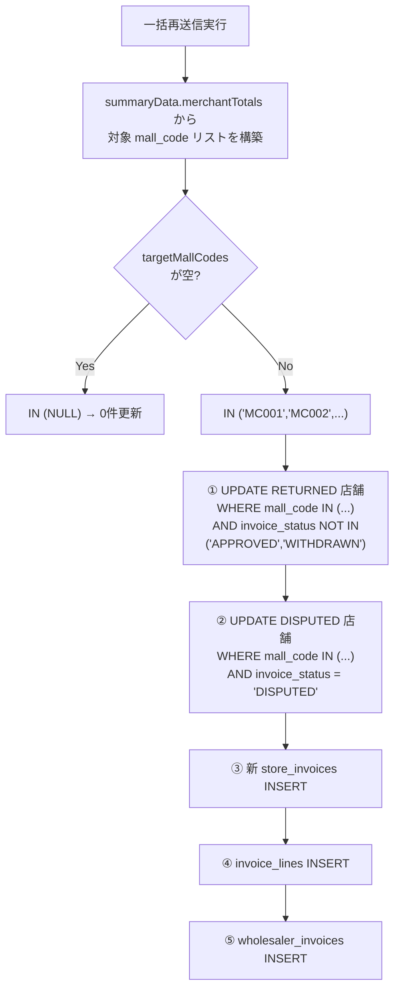
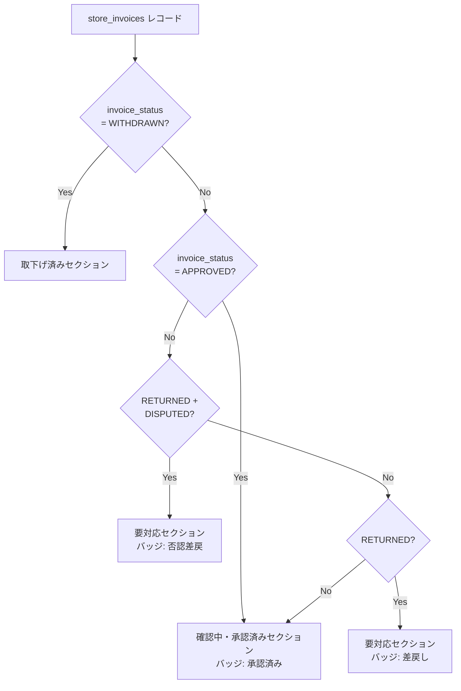

# PR 作業まとめ: MYP-4104 バグ修正 part7

## 概要

一括再送信時に CSV に含まれない要対応加盟店の `is_latest` が誤って FALSE に更新されるバグを修正。
加えて、加盟店ステータスが「承認済み（APPROVED）」の場合は BO ステータスに関係なく承認済みとして扱うようステータス判定ロジックを修正。

## 対象ブランチ

`feature/MYP-4104-bug-fix-part7` → `develop`

---

## 変更ファイル一覧

| ファイル | 変更種別 | 変更内容 |
|----------|---------|---------|
| `src/be_invoice.js` | 変更 | 一括再送信 UPDATE に mall_code IN 絞り込み + APPROVED/WITHDRAWN 除外を追加 |
| `src/be_csv_mapper.js` | 変更 | 同上（新形式 csv_format_rules 版） |
| `src/db_bq_query.js` | 変更 | 請求一覧の has_resubmit 判定から APPROVED/WITHDRAWN を除外 |
| `src/fe_js_detail.html` | 変更 | ステータスバッジ優先順位変更 + セクション振り分けロジック修正 |

---

## 設計方針

### 1. is_latest UPDATE の対象絞り込み（一括再送信）

| 項目 | Before | After |
|------|--------|-------|
| UPDATE 対象 | 親請求に紐づく**全** RETURNED/DISPUTED 店舗 | CSVに含まれる mall_code の店舗**のみ** |
| APPROVED 店舗 | is_latest が落ちる（バグ） | `NOT IN ('APPROVED','WITHDRAWN')` で保護 |
| 空配列時 | N/A | `IN (NULL)` で0件更新を保証 |

### 2. ステータス判定の優先順位

| 優先度 | Before | After |
|--------|--------|-------|
| 1 | WITHDRAWN | WITHDRAWN |
| 2 | MCR + DISPUTED | **APPROVED（BO問わず）** |
| 3 | RETURNED + DISPUTED | MCR + DISPUTED |
| 4 | RETURNED | RETURNED + DISPUTED |
| 5 | MCR + APPROVED → 承認 | RETURNED |
| 6 | MCR + PENDING_CONFIRMATION | MCR + PENDING_CONFIRMATION |
| 7 | それ以外 → 未検収 | それ以外 → 未検収 |

**核心**: `invoice_status === 'APPROVED'` は BO ステータスに関係なく**最優先で承認済み**。

---

## 全体フロー図

### 一括再送信の is_latest UPDATE フロー



### 詳細画面のセクション振り分け



---

## 変更詳細

### `src/be_invoice.js` / `src/be_csv_mapper.js`

`buildBulkResubmitTransactionSql_` / `buildMappedBulkResubmitTransactionSql_` に以下を追加:

1. **`targetMallCodes` の構築**: `summaryData.merchantTotals` → `mallCodeMap` 経由で CSV に含まれる mall_code を抽出
2. **`mallCodeInClause`**: 空配列時は `'NULL'`（SQL の `IN (NULL)` = 常に不一致）
3. **① RETURNED UPDATE**: `AND mall_code IN (...)` + `AND COALESCE(invoice_status, '') NOT IN ('APPROVED', 'WITHDRAWN')` を追加
4. **② DISPUTED UPDATE**: `AND mall_code IN (...)` を追加（`invoice_status = 'DISPUTED'` が既にあるため APPROVED/WITHDRAWN は自然に除外）

### `src/db_bq_query.js`

`fetchInvoicesByWholesaler_` の `has_resubmit` 判定:

```sql
-- Before
MAX(CASE WHEN si.backoffice_review_status = 'RETURNED' THEN 1 ELSE 0 END)

-- After
MAX(CASE WHEN si.backoffice_review_status = 'RETURNED'
  AND COALESCE(si.invoice_status, '') NOT IN ('APPROVED', 'WITHDRAWN')
  THEN 1 ELSE 0 END)
```

`COALESCE` で NULL を空文字に変換し、`invoice_status` が NULL の正当な RETURNED 行を誤除外しないようガード。

### `src/fe_js_detail.html`

1. **`getDetailStatusBadge_`**: `APPROVED` 判定を WITHDRAWN 直後（最上位）に移動。BO ステータスに関係なく「承認済み」バッジを返す。
2. **`renderDetailStoreList_`**:
   - `returned` フィルタに `&& invoice_status !== 'APPROVED'` を追加
   - `normal` フィルタ先頭に `if (invoice_status === 'APPROVED') return true` を追加

---

## コーディングルール準拠

| ルール | 対応 |
|--------|------|
| `var` 禁止 → `const` / `let` 使用 | ✅ |
| 内部関数は末尾 `_` | ✅ |
| `function` キーワードで定義 | ✅ |

---

## 影響範囲

- **機能影響**:
  - 一括再送信: CSVに含まれない要対応加盟店の `is_latest` が維持されるようになる
  - 詳細画面: APPROVED 店舗が要対応セクションに表示されなくなり、確認中・承認済みセクションに正しく表示される
  - TOP画面: RETURNED + APPROVED/WITHDRAWN の加盟店が「差戻し有」バッジを表示しなくなる
- **パフォーマンス影響**: なし（WHERE 条件の追加のみ。既存インデックスで十分カバー）
