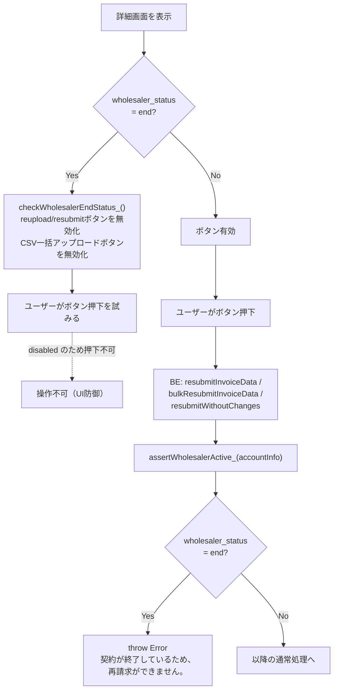
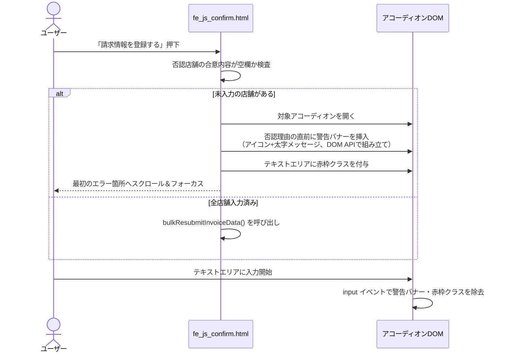

# PR 作業まとめ: MYP-4136 バグ対応part9

## 概要

本 PR では、独立した 7 件のバグ修正・改善を実施した。

1. **死んだCSSの削除**: 一覧画面バッジの `.badge--pending` が詳細画面バッジの同名クラスにカスケードで上書きされ続けていた孤立ルールを削除。
2. **個別再請求の完了トースト漏れ修正**: 「修正ファイルをアップ」「変更なしで再請求」の2フローで、他の登録完了操作と同じ「登録完了しました。」トーストが表示されていなかった不具合を修正。あわせて全登録完了トーストの句点を統一。
3. **ヘッダー卸名の表示改善**: 12文字を超える卸名がヘッダーで見切れる問題に対し、先頭10文字＋「...」＋末尾3文字（計16文字）に短縮表示し、ログアウトドロップダウン内に全文を表示するようにした。
4. **確認中・承認済み一覧への否認理由表示追加**: `store_invoices.store_disputed_reason` が登録されている場合に、詳細画面の「確認中・承認済みの請求一覧」でも否認理由を表示するようにした（BEは既に取得済みのフィールドを使うのみでBE変更なし）。
5. **確認画面エラーUIのFigma準拠**: CSV一括再請求の確認画面で「合意内容」未入力のまま登録しようとした際のエラー表示を、テキストエリア直後の小さい赤文字から、否認理由の直前に表示するアイコン付き警告バナーに変更。
6. **契約終了卸の再請求ブロック**: `wholesaler_status='end'`（契約終了）の卸は新規請求のみブロック対象で、個別再請求・CSV一括再請求は素通りしていた不具合を、BE（共通ヘルパー `assertWholesalerActive_`）・FE（詳細画面のボタン無効化）の両面で修正。
7. **CSVアップロード時の重複警告表示の修正**: 卸-加盟店リレーションテーブル（`wholesaler_merchants`）に同一加盟店の重複行が残っている場合、CSVアップロード画面の「加盟店網羅性チェック」の警告メッセージが重複行数分だけ複数回表示されていた不具合を、BE（`fetchAccountInfoByEmail_` のクエリに重複排除CTEを追加）・FE（警告生成ループに `customer_code` 単位の重複防止ガードを追加）の両面で修正。

## 対象ブランチ

`feature/MYP-4136-bug-fix-part9` → `develop`

---

## 変更ファイル一覧

| ファイル | 変更種別 | 変更内容 |
|----------|---------|---------|
| `docs/DESIGN.md` | 変更 | 使われていない一覧画面用 `.badge--pending`（未検閲）のバッジ定義行を削除 |
| `src/be_invoice.js` | 変更 | 契約終了卸チェックの共通ヘルパー `assertWholesalerActive_` を新設し、`resubmitInvoiceData` / `bulkResubmitInvoiceData` / `resubmitWithoutChanges` / `sendInvoiceData` の4関数に適用 |
| `src/db_bq_query.js` | 変更 | `fetchAccountInfoByEmail_`: `wholesaler_merchants` 取得に `latest_merchants` CTE（`ROW_NUMBER()` による重複排除）を追加し、リレーションテーブルの重複行が `merchant_mappings` に混入しないようにした |
| `src/fe_css.html` | 変更 | ヘッダードロップダウンの幅固定＋卸名折り返し用CSS追加、合意内容未入力時の警告バナー用CSS追加、孤立していた `.badge--pending` を削除 |
| `src/fe_js_common.html` | 変更 | ヘッダー表示用の卸名短縮ヘルパー `truncateWholesalerNameForHeader_` を新設し、`saveAccountInfo` をヘッダー短縮表示＋ドロップダウン全文表示に対応 |
| `src/fe_js_confirm.html` | 変更 | 合意内容未入力エラーを、テキストエリア直後の小さい赤文字からアイコン付き警告バナー（否認理由の直前・DOM APIで組み立て）に変更。登録完了トーストの文言に句点を追加 |
| `src/fe_js_detail.html` | 変更 | 契約終了卸のボタン無効化処理 `checkWholesalerEndStatus_` を新設。確認中・承認済み一覧に否認理由表示を追加。個別再請求2フロー（reupload/resubmit、各実処理・モック処理）に完了トースト表示を追加 |
| `src/fe_js_upload.html` | 変更 | 加盟店網羅性チェックの警告生成ループに `customer_code` 単位の重複防止ガード（`warnedCustomerCodes`）を追加 |
| `src/fe_part_header.html` | 変更 | ヘッダードロップダウン内に卸名全文表示用の `div` を追加 |

---

## 設計方針

### 1. 契約終了卸（wholesaler_status='end'）のブロック範囲拡張

既存は新規請求（`sendInvoiceData`）のみが対象で、再請求系3関数は対象外だった。過去請求の**参照・取り下げ**は契約終了後も継続利用を認める設計のため、再請求（reupload / resubmit-without-changes / bulk-resubmit）のみを新たにブロック対象に追加した。

| 操作 | Before | After |
|------|--------|-------|
| 新規請求（`sendInvoiceData`） | ブロック | ブロック（変更なし） |
| 個別再請求（`resubmitInvoiceData` / `resubmitWithoutChanges`） | 素通り | **ブロック** |
| CSV一括再請求（`bulkResubmitInvoiceData`） | 素通り | **ブロック** |
| 参照・取り下げ（`withdrawStoreInvoice` 等） | 素通り | 素通り（変更なし） |

判定条件・エラー文言が4関数に重複しないよう、共通ヘルパー `assertWholesalerActive_(accountInfo, actionLabel)` に一元化した（`actionLabel` 省略時は「再請求」、`sendInvoiceData` のみ既存文言を維持するため `'新規請求'` を明示指定）。

FE側（詳細画面）でも `checkReuploadDeadline_()`（異議申立期間切れ）と同様のパターンで `checkWholesalerEndStatus_()` を新設し、ボタンの事前無効化とツールチップ表示を行う。2つのチェックは同じボタン・同じメッセージ要素（`.detail-action-btn__period-expired-msg`）を対象にするため、**既に他方の理由で `disabled` かつ `title` 設定済みの場合は上書きしない**ガードを入れ、無効化理由（異議申立期間切れ／契約終了）が画面表示とツールチップで食い違わないようにしている。また「取下げをやめる」ボタンや再請求済みバッジ表示行など、reupload/resubmitボタンが存在しない行にはメッセージを表示しない。

### 2. 確認画面のエラーUI（Figma準拠）

| 項目 | Before（実機） | After（Figma準拠） |
|------|----------------|---------------------|
| 表示位置 | テキストエリアの直後（下） | 否認理由の直前（上） |
| 見た目 | 小さい赤文字（12px）のみ | アイコン付きバナー（背景色・枠線あり、太字） |
| テキストエリア自体のスタイル | 赤枠＋薄赤背景 | 変更なし（維持） |

エラー要素は `innerHTML` によるHTML文字列挿入ではなく、`createElement` + `textContent` によるDOM API組み立てに変更し、将来的にメッセージへ動的な値（加盟店名等）を混ぜてもXSSのリスクが生じない構造にしている。装飾アイコン（`fa-circle-exclamation`）には既存の他アイコンと同様 `aria-hidden="true"` を付与。

### 3. 確認中・承認済み一覧の否認理由表示

`db_bq_query.js` は元々全ステータス分の `store_disputed_reason` を取得済みだったため、BE変更は不要で、FEの表示条件のみを変更した（MYP-4013 で WITHDRAWN 行に同フィールドを追加した際と同一パターン）。

```
Before: !isReturned && !isDisputed && !isWithdrawn && store.wholesaler_handover
After:  !isReturned && !isDisputed && !isWithdrawn && (store.store_disputed_reason || store.wholesaler_handover)
```

否認理由・合意内容は互いに独立した条件でそれぞれ表示要否を判定するため、否認理由のみ登録されている場合・合意内容のみ登録されている場合のどちらでも欠落なく表示される。

### 4. ヘッダー卸名の短縮ロジック

固定の文字数閾値で判定すると「短縮後の文字数（先頭10＋...+末尾3＝16文字）より短い会社名を短縮してしまい、かえって表示が長くなる」問題が起きるため、短縮判定は `str.length <= 16` を基準にした（16文字以下は一切短縮しない）。

| 元の文字数 | 短縮結果 |
|---|---|
| 16文字以下 | そのまま表示（短縮しない） |
| 17文字以上 | 先頭10文字＋「...」＋末尾3文字（16文字）に短縮 |

短縮前の全文はヘッダーではなくログアウトドロップダウン内に別途表示し、ドロップダウン幅は既存の見た目を変えないよう固定幅を維持しつつ `overflow-wrap` で折り返す。

### 5. CSVアップロード時の重複警告表示の修正（merchant_mappings の重複データ対策）

`wholesaler_merchants`（リレーションテーブル）に同一 `mall_code` の行が複数残っている場合、`fetchAccountInfoByEmail_` が返す `merchant_mappings` にも同じ加盟店の行が重複して含まれてしまい、CSVアップロード画面の「加盟店網羅性チェック」でその加盟店の警告メッセージ（「〇〇店の請求明細がありません。」）が重複行数分だけ複数回表示される不具合があった。

BE側で `fetchStoreInvoicesByParent_` に既に実装済みの `ROW_NUMBER()` による重複排除パターンを `fetchAccountInfoByEmail_` にも適用し、リレーションテーブルの重複行が `merchant_mappings` に混入しないようにした（根本修正）。あわせてFE側の警告生成ループにも `customer_code` 単位の重複防止ガードを追加し、想定外の経路で重複データが渡ってきても表示側で二重に防御できるようにした。

| 項目 | Before | After |
|------|--------|-------|
| `fetchAccountInfoByEmail_` の `wholesaler_merchants` JOIN | 重複排除なし（`deleted_at IS NULL` のみ） | `latest_merchants` CTE で `(mall_code, wholesaler_id)` ごとに `registration_at DESC` の `ROW_NUMBER()` を振り、`rn = 1` の最新行のみ使用 |
| `fe_js_upload.html` の加盟店網羅性チェック | `mappings.forEach` で無条件に `warnings.push` | `warnedCustomerCodes`（Set）で `customer_code` ごとに1回のみ `push` |

---

## 全体フロー図

### 契約終了卸の再請求ブロック（FE/BE 二重防御）



### 確認画面: 合意内容未入力エラーの表示・解除



---

## 変更詳細

### `src/be_invoice.js`

- **`assertWholesalerActive_(accountInfo, actionLabel)`** を新規追加（`resubmitInvoiceData` 直前に配置）。`accountInfo.wholesaler_status === 'end'` の場合に `throw new Error('契約が終了しているため、' + (actionLabel || '再請求') + 'ができません。')`。
- `resubmitInvoiceData` / `bulkResubmitInvoiceData` / `resubmitWithoutChanges`: 認証情報取得直後に `assertWholesalerActive_(accountInfo);` を追加。
- `sendInvoiceData`: 既存のインラインチェック（新規請求用の文言）を `assertWholesalerActive_(accountInfo, '新規請求');` に置き換え（挙動は変更なし）。

### `src/fe_js_detail.html`

- **`checkWholesalerEndStatus_()`** を新規追加し、`renderDetailPage_()` から `checkReuploadDeadline_()` の直後に呼び出す。`sessionStorage` の `shiire_wholesaler_status` が `'end'` の場合、reupload/resubmitボタンとCSV一括アップロードボタンを無効化。異議申立期間切れで既に無効化・メッセージ設定済みのボタンは上書きしない。メッセージ段落はreupload/resubmitボタンが存在する行にのみ追加。
- `buildDetailAccordion_()` の normal group（`!isReturned && !isDisputed && !isWithdrawn`）分岐: 表示条件に `store.store_disputed_reason` を追加し、否認理由ブロックと合意内容ブロックをそれぞれ独立した条件で描画するよう HTML 生成を再構成。
- `resubmitInvoiceData` / `resubmitWithoutChanges` の成功ハンドラ・モックフォールバック（計4箇所）に `_detailPendingToastMsg = '登録完了しました。';` を追加し、`initDetailPage()` 呼び出し後にトーストが表示されるようにした。

### `src/fe_js_confirm.html`

- 合意内容未入力時のエラー表示ロジック（`btnFinalSubmit` クリックハンドラ内）を、`.backoffice-remark__disputed-handover` 直後への小さい赤文字（`handover-validation-error`）挿入から、`.backoffice-remark__disputed-left` 先頭への警告バナー（`backoffice-remark__error-banner`、アイコン+メッセージをDOM APIで組み立て）挿入に変更。エラー解除ロジック（`renderConfirmPage()` 内の `input` イベントリスナー）も同様に対応するバナー要素を除去するよう変更。
- 登録完了トーストの文言を3箇所（`showToast` / `_detailPendingToastMsg` 2箇所）とも「登録完了しました」→「登録完了しました。」に統一。

### `src/fe_js_common.html`

- **`truncateWholesalerNameForHeader_(name)`** を新規追加。文字数が16（先頭10＋省略記号3＋末尾3）以下ならそのまま返し、17文字以上の場合のみ先頭10文字＋「...」＋末尾3文字に短縮する。
- `saveAccountInfo()`: ヘッダー表示 (`#headerWholesalerName`) には短縮後の文字列を、新設のドロップダウン内要素 (`#headerStoreDropdownCompanyName`) には短縮前の全文を、それぞれ設定するよう変更。

### `src/fe_part_header.html`

- `#headerStoreDropdown` 内、ログアウトボタンの直前に `<div class="header-store-dropdown__company" id="headerStoreDropdownCompanyName">―</div>` を追加。

### `src/fe_css.html`

- `.header-store-dropdown`: `min-width: 160px` → `width: 160px`（既存の見た目の幅を維持するため固定値化）。
- `.header-store-dropdown__company`: 新規追加。`white-space: normal; overflow-wrap: break-word; word-break: break-all;` で長い卸名を折り返し表示。
- `.backoffice-remark__error-banner` / `.backoffice-remark__error-banner i`: 新規追加。警告バナーの背景色（`#FDECEA`）・枠線（`#F5C2C0`）・文字色（`#E53935`、太字）を定義。
- 一覧画面用の孤立した `.badge--pending {背景: #FFF3E0; 文字色: #E65100;}` を削除（詳細画面バッジの同名クラス定義がカスケードで常に上書きしていたため、実質未使用だった）。

### `docs/DESIGN.md`

- 一覧画面用バッジ定義表から `| 未検閲 | .badge--pending | #FFF3E0 | #E65100 |` の行を削除（削除したCSSに対応するドキュメント記述の整合性を維持）。

### `src/db_bq_query.js`

- **`fetchAccountInfoByEmail_()`**: `wholesaler_merchants` を直接 LEFT JOIN していた箇所を、`latest_merchants` CTE（`(mall_code, wholesaler_id)` ごとに `registration_at DESC` で `ROW_NUMBER()` を振り `rn = 1` のみ採用）経由の LEFT JOIN に変更。`fetchStoreInvoicesByParent_` で既に採用済みの重複排除パターンを踏襲。

### `src/fe_js_upload.html`

- 加盟店網羅性チェック（`mappings.forEach` ループ）に `warnedCustomerCodes`（`Set`）を追加し、同一 `customer_code` について警告メッセージが複数回 `push` されないようにガード。

---

## コーディングルール準拠

| ルール | 対応 |
|--------|------|
| `var` 禁止 → `const` / `let` 使用 | ✅ 追加コードはすべて `const` |
| 内部関数は末尾 `_` | ✅ `assertWholesalerActive_` / `checkWholesalerEndStatus_` / `truncateWholesalerNameForHeader_` |
| `function` キーワードで定義 | ✅ |
| BE公開関数に `_` なし | ✅ `sendInvoiceData` / `resubmitInvoiceData` / `bulkResubmitInvoiceData` / `resubmitWithoutChanges` は既存のまま維持 |
| エラーハンドリング `try-catch` + `throw new Error` | ✅ 既存の `try` ブロック内に `assertWholesalerActive_` 呼び出しを追加する形で統合 |

---

## 影響範囲

- **機能影響**:
  - 契約終了卸（`wholesaler_status='end'`）は個別再請求・CSV一括再請求ができなくなる（従来は新規請求のみ制限）。参照・取り下げには影響なし。
  - 詳細画面の確認中・承認済み一覧に否認理由が表示されるケースが増える（表示のみ、DBスキーマ・クエリへの変更なし）。
  - 確認画面のエラーUIの見た目が変わる（機能的な検証条件・送信可否のロジックは変更なし）。
  - ヘッダーの卸名表示が変わる（17文字以上の卸名のみ、表示上の短縮のみでデータそのものへの影響なし）。
  - `wholesaler_merchants` に同一加盟店の重複行がある場合でも、CSVアップロード画面の加盟店網羅性チェック警告が重複表示されなくなる（`merchant_mappings` を参照する他画面・他機能にも副次的に重複排除の恩恵が及ぶ）。
- **パフォーマンス影響**: `fetchAccountInfoByEmail_` に `ROW_NUMBER()` ウィンドウ関数を追加したことによるオーバーヘッドは軽微（`fetchStoreInvoicesByParent_` で同パターンを採用済みで実績あり）。その他はFE表示条件の変更、またはBE側の早期 `throw` 追加のみで影響なし。
