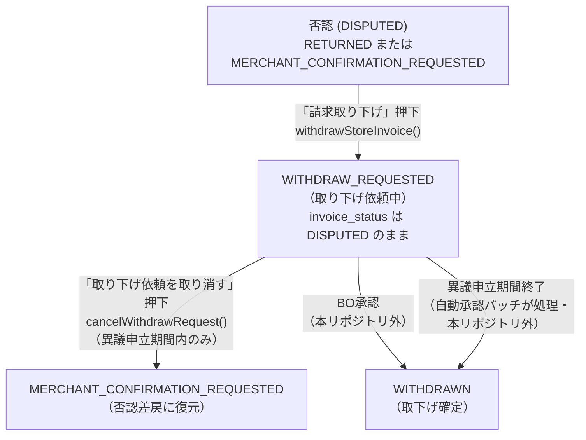
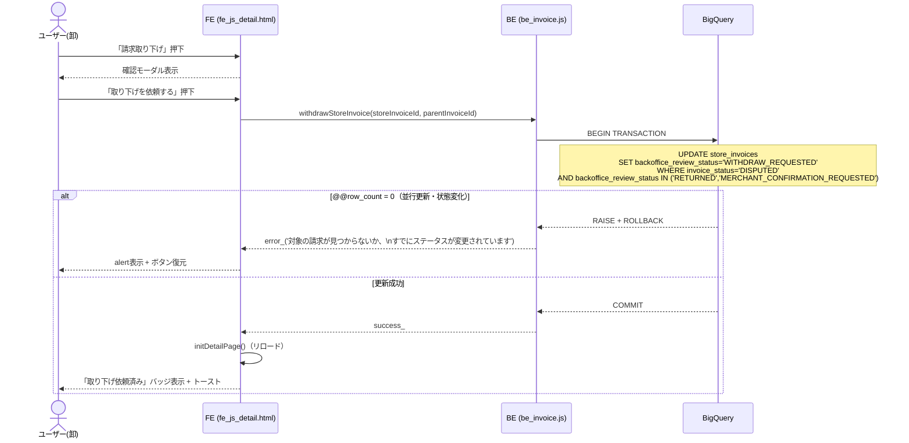
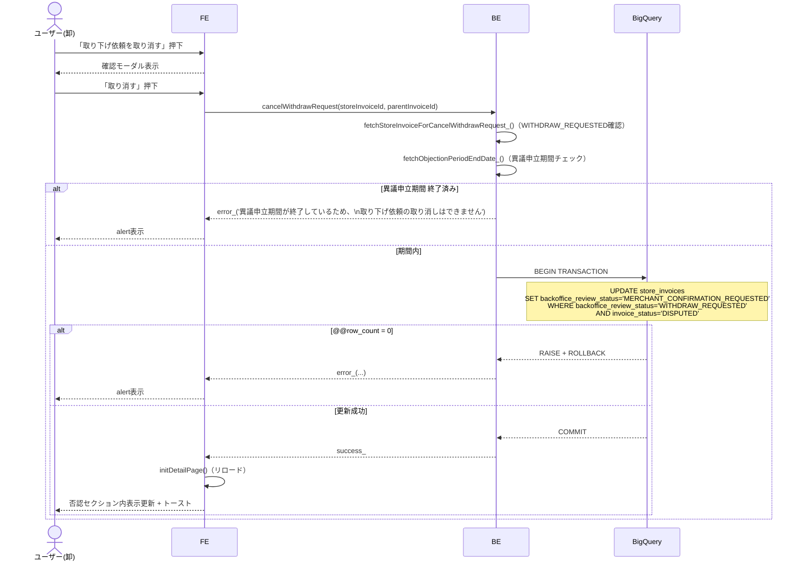

# PR 作業まとめ: MYP-4183 詳細画面の請求取り下げをBO承認待ちの「取り下げ依頼」に変更

## 概要

詳細画面の「請求取り下げ」操作を、即時に`WITHDRAWN`確定する仕様から、**BO（バックオフィス）の承認待ちとなる「取り下げ依頼」**（`backoffice_review_status = WITHDRAW_REQUESTED`）に変更した。あわせて、依頼を出す/取り消す2つのBE関数に対するコードレビュー指摘（認可条件の不足・`@@row_count`未検証）に対応し、再請求フロー周辺で見つかった否認理由の引き継ぎ漏れ等の副次的な修正、およびユニットテストの大幅な拡充（回帰防止）を行った。

## 対象ブランチ

`feature/MYP-4183-send-withdrawal-request-to-bo` → `develop`（[PR #53](https://github.com/USEN-PAY-Products/connect-wholesale-gas-poc/pull/53)）

---

## 変更ファイル一覧

| ファイル | 変更種別 | 変更内容 |
|----------|---------|---------|
| [src/be_invoice.js](../../src/be_invoice.js) | 変更 | 取り下げ依頼フロー本体（`withdrawStoreInvoice`/`cancelWithdrawRequest`）を実装。`@@row_count=0`検証を3関数に統一適用。再請求時の否認理由引き継ぎ、一括再請求での取り下げ依頼中店舗の除外 |
| [src/db_bq_query.js](../../src/db_bq_query.js) | 変更 | 事前バリデーション用クエリを`fetchStoreInvoiceForCancelWithdrawRequest_`に整理。TOP画面の否認バッジ(`has_denial`)判定を簡素化 |
| [src/be_csv_mapper.js](../../src/be_csv_mapper.js) | 変更 | カスタムCSV形式向け再請求SQL生成に否認理由(`store_disputed_reason`)引き継ぎ対応を追加 |
| [src/fe_js_detail.html](../../src/fe_js_detail.html) | 変更 | 「取り下げ依頼済み」バッジ・取り消しボタンの描画、CSV一括アップロード時の対象外警告、イベントハンドラを`cancel-withdraw-request`に刷新 |
| [src/fe_page_detail.html](../../src/fe_page_detail.html) | 変更 | 取り下げ依頼確認モーダル・取り消し確認モーダルの文言/ID更新 |
| [src/fe_css.html](../../src/fe_css.html) | 変更 | 新モーダルID対応、「取り下げ依頼済み」バッジのスタイル追加、トーストz-index調整 |
| [docs/specifications/04_detail_page.md](../specifications/04_detail_page.md) | 変更 | 取り下げ依頼フローの仕様・シーケンス図・実行方法（`@@row_count`検証）を全面更新 |
| [test/be_invoice.test.js](../../test/be_invoice.test.js) | 追加（新規） | 請求ドメインの回帰テスト一式を新規追加（17件） |
| [test/be_csv_mapper.test.js](../../test/be_csv_mapper.test.js) | 追加（新規） | カスタムCSVマッピングの回帰テスト一式を新規追加（7件） |
| [test/be_slack.test.js](../../test/be_slack.test.js) | 変更 | Slack通知のスタックトレース重複表示に関するテストを2件追加 |
| [.github/workflows/unit_tests.yml](../../.github/workflows/unit_tests.yml) | 追加（新規） | `npm test`（`node --test test/`）をpush/PR時に自動実行するCIワークフロー |
| [docs/MYP-4203-design.md](../MYP-4203-design.md) | 追加（新規） | 別チケット（MYP-4203: 自動承認バッチ実行後の請求金額差分）の設計ドキュメント（本PRでは未実装、提案書として追加） |
| [docs/bq_integrity_check_production_setup_tasks.md](../bq_integrity_check_production_setup_tasks.md) | 追加（新規） | BQ不整合検知バッチのProduction環境セットアップ残タスク一覧（MYP-3761） |

> 📌 下2件のドキュメントは、本PRの主目的（取り下げ依頼フロー）とは別に、作業過程で洗い出された別チケットの調査結果・残タスクをドキュメント化したもの。コード変更は伴わない。

---

## 設計方針

### 1. 「即時確定」から「BO承認待ちの依頼」への変更

| 項目 | Before（即時取下げ確定） | After（取り下げ依頼） |
|---|---|---|
| ステータス変更 | `invoice_status`: `DISPUTED` → `WITHDRAWN` | `backoffice_review_status`: `RETURNED`/`MERCHANT_CONFIRMATION_REQUESTED` → `WITHDRAW_REQUESTED`（`invoice_status`は`DISPUTED`のまま） |
| `wholesaler_invoices` | 金額再計算のうえ新版をINSERT | 変更なし（不要） |
| 実行SQL | `UPDATE` + `INSERT...SELECT`（2文） | `UPDATE`のみ（1文） |
| 確定までのフロー | 卸の操作のみで確定 | 卸が依頼 → BO（本リポジトリ外）が承認して初めて`WITHDRAWN`確定 |
| 関数名 | `withdrawStoreInvoice` / `undoWithdrawStoreInvoice` | `withdrawStoreInvoice`（依頼へ意味変更） / `cancelWithdrawRequest`（リネーム） |

金額再計算・`wholesaler_invoices`のINSERTが不要になったことで、実装が大幅に単純化された（事前検証も`fetchStoreInvoiceForWithdraw_` + `fetchLatestWholesalerInvoice_`の2クエリから、WHERE句の条件判定のみに削減）。

### 2. 取り消し時の戻し先ステータス選定

取り下げ依頼前の元ステータス（`RETURNED`または`MERCHANT_CONFIRMATION_REQUESTED`）は`withdrawStoreInvoice()`が単純UPDATEで上書きするため復元できない。この2つは画面表示上（ステータスバッジ「否認差戻」・3ボタンエリア）で区別されないため、`cancelWithdrawRequest()`の戻し先は一律`MERCHANT_CONFIRMATION_REQUESTED`を採用した。

- `RETURNED`に戻す案 → TOP画面の`has_resubmit`（差戻しあり）フラグを誤って立てる可能性があり不採用
- `PENDING_REVIEW`（変更なしで再請求時の遷移先）に戻す案 → 何も再請求していないのに「再請求済み」バッジ・ステータス「未検収」表示になってしまうバグとして実装時に発覚し、修正済み

### 3. `@@row_count = 0` 検証の統一適用（リグレッション修正）

コードレビューで「`withdrawStoreInvoice()`/`cancelWithdrawRequest()`のUPDATEに`@@row_count`チェックが無く、並行更新時に0行更新でも成功扱いになる」との指摘を受けた。`git log -S`で調査した結果、このチェックは**元々`fbadd60`（本ブランチの初回コミット）より前は存在していたが、取り下げ確定→依頼へのロジック簡素化の過程で欠落していたリグレッション**であることが判明。指摘を機に、`withdrawStoreInvoice`・`cancelWithdrawRequest`に加え、同種のパターンを持つ`resubmitWithoutChanges`にも一貫して以下のパターンを適用した。

```sql
BEGIN TRANSACTION;
UPDATE ... SET ... WHERE ...;
IF @@row_count = 0 THEN
  ROLLBACK TRANSACTION;
  RAISE USING MESSAGE = '他の操作と競合したため更新できませんでした。...';
END IF;
COMMIT;
```

BE側では`runTransactionSql_()`呼び出しを`try/catch`で囲み、このメッセージを含む例外のみを業務エラー（`error_()`）に変換する。それ以外の例外は従来通り再送出し、Slack通知（`logError_`）の対象とする。

### 4. 認可条件のFE/BE整合

`withdrawStoreInvoice()`のUPDATE条件が`invoice_status='DISPUTED'`のみだと、API直叩きで`PENDING_REVIEW`（再請求済み）や`WITHDRAW_REQUESTED`（依頼中）の行まで上書きできてしまう指摘を受け、WHERE句に`backoffice_review_status IN ('RETURNED', 'MERCHANT_CONFIRMATION_REQUESTED')`を追加。FE側で「請求取り下げ」ボタンが表示される条件と一致させ、IDOR/状態改ざん対策とした。

---

## 全体フロー図

### ステータス遷移フロー



### 取り下げ依頼 シーケンス図



### 取り下げ依頼の取り消し シーケンス図



---

## 変更詳細

### 1. 取り下げ依頼フロー本体（メイン機能）

- **`src/be_invoice.js`**
  - `withdrawStoreInvoice()`: `invoice_status`→`WITHDRAWN`確定+金額再計算INSERTのロジックを全面撤去し、`backoffice_review_status`→`WITHDRAW_REQUESTED`のUPDATE1文に置き換え。`@@row_count=0`検証、認可条件強化（`backoffice_review_status IN (...)`）を追加
  - `undoWithdrawStoreInvoice()`を`cancelWithdrawRequest()`にリネームし、`WITHDRAWN→DISPUTED`復元+金額再計算のロジックを、`WITHDRAW_REQUESTED→MERCHANT_CONFIRMATION_REQUESTED`のUPDATE1文に置き換え（金額再計算が不要になったため大幅に簡素化）
  - `resubmitWithoutChanges()`にも同様の`@@row_count=0`検証を追加（一貫性のため）
- **`src/db_bq_query.js`**
  - `fetchStoreInvoiceForWithdraw_(id, parentId, wholesalerId, expectedStatus)`を`fetchStoreInvoiceForCancelWithdrawRequest_(id, parentId, wholesalerId)`に整理（`expectedStatus`パラメータを廃し、`WITHDRAW_REQUESTED`+`DISPUTED`固定の条件に）
  - `fetchInvoicesByWholesaler_`の`has_denial`判定を、`backoffice_review_status`の個別分岐から`invoice_status='DISPUTED'`の単純判定に簡素化。`WITHDRAW_REQUESTED`中も「否認あり」バッジが正しく表示されるようにする
- **`src/fe_js_detail.html` / `fe_page_detail.html` / `fe_css.html`**
  - 否認セクション内に「✓ 取り下げ依頼済み」バッジ + 「取り下げ依頼を取り消す」ボタンを表示（異議申立期間終了後は無効化）
  - 取下げ済み（`WITHDRAWN`）セクションからは取り消しボタンを削除（BOによる最終確定後のため）
  - モーダルID/イベントハンドラを`undoWithdrawConfirmModal`→`cancelWithdrawRequestConfirmModal`、`undo-withdraw`→`cancel-withdraw-request`にリネームし、文言を「取り下げる/取下げをやめる」から「取り下げを依頼する/取り下げ依頼を取り消す」に統一
  - CSV一括アップロード時、取り下げ依頼中（`WITHDRAW_REQUESTED`）の加盟店がCSVに含まれる場合は警告のうえ請求対象外にする処理を追加
- **`docs/specifications/04_detail_page.md`**: 上記フローに合わせて6.4/6.5節、11.3〜11.5節、状態遷移表、モーダル仕様（13.3/13.4）を全面更新

### 2. 再請求時の否認理由（`store_disputed_reason`）引き継ぎ

再請求（個別・一括、固定/カスタムCSV形式問わず）で新規INSERTされる`store_invoices`に`store_disputed_reason`列が含まれておらず、否認理由が常にNULLになる不具合を修正。

- `src/be_invoice.js`: `buildResubmitTransactionSql_` / `buildBulkResubmitTransactionSql_`に`storeDisputedReason` / `disputedReasons`引数を追加し、INSERT列・VALUESに反映。`resubmitInvoiceData` / `bulkResubmitInvoiceData`で旧レコードから値を取得して引き渡す
- `src/be_csv_mapper.js`: カスタムCSV形式向けの`buildMappedResubmitTransactionSql_` / `buildMappedBulkResubmitTransactionSql_`にも同様に対応

### 3. ユニットテストの拡充

`test/be_invoice.test.js`（新規、17件）・`test/be_csv_mapper.test.js`（新規、7件）・`test/be_slack.test.js`（+2件）を追加。内訳は本PRで新規実装した機能の検証と、既存機能（過去のPRで対応済みだがテスト未整備だったもの）の回帰テストが混在する。

| 対象 | 新機能の検証 | 既存機能の回帰テスト |
|---|---|---|
| `test/be_invoice.test.js`（計17件） | 10件（否認理由引き継ぎ5・`cancelWithdrawRequest`3・`withdrawStoreInvoice`2） | 7件（一括再請求の対象絞り込み3・`wholesaler_merchants`重複対策3・Slack通知コンテキストキー1） |
| `test/be_csv_mapper.test.js`（計7件） | 2件（否認理由引き継ぎ・個別/一括） | 5件（`slip_number`/`item_code`対応4・`wholesaler_merchants`重複対策1） |
| `test/be_slack.test.js`（+2件） | 0件 | 2件（スタックトレース重複行の除去・無関係stackの非除去確認） |

> 既存機能側の回帰テストは、`src/be_invoice.js` / `src/be_csv_mapper.js` / `src/be_slack.js`側のロジック自体は変更せず、過去のPR（MYP-4204のバグ対応part10、Slack通知実装等）で対応済みの挙動にテストを新規で追加したもの。

### 4. CI・ドキュメント整備

- `.github/workflows/unit_tests.yml`: `src/**` / `test/**` / `package.json` / `package-lock.json`変更時に、push・PR両方で`npm ci` → `npm test`（`node --test test/`）を自動実行
- `docs/MYP-4203-design.md` / `docs/bq_integrity_check_production_setup_tasks.md`: 本PRの主目的とは別に、作業過程で整理した別チケットの設計提案書・残タスク一覧（コード変更なし）

---

## コーディングルール準拠

| ルール | 対応 |
|--------|------|
| `var` 禁止 → `const` / `let` 使用 | ✅ |
| 公開関数（`withdrawStoreInvoice`/`cancelWithdrawRequest`等）は`function`キーワード定義・末尾`_`なし | ✅ |
| 内部関数（`fetchStoreInvoiceForCancelWithdrawRequest_`等）は末尾`_` | ✅ |
| フロントからの呼び出し関数は`try-catch`必須 | ✅ |
| `google.script.run`に`.withFailureHandler()`必須 | ✅ |

---

## 影響範囲

- **機能影響**:
  - 「請求取り下げ」ボタンの挙動が変わるため、既にWITHDRAWN確定済みの過去データの表示・操作には影響しない（`WITHDRAWN`セクションは表示のみに変更、取り消しボタンは削除）。
  - TOP画面の否認バッジ（`has_denial`）判定ロジック変更により、`WITHDRAW_REQUESTED`中の請求も正しく「否認あり」として表示されるようになる（表示改善、既存の否認表示ロジックとの後方互換は維持）。
  - 再請求時の否認理由引き継ぎはデータ補完のみで、既存の再請求フロー自体の制御ロジックには影響しない。
- **パフォーマンス影響**: `withdrawStoreInvoice` / `cancelWithdrawRequest`は金額再計算・`wholesaler_invoices`へのINSERTが不要になったため、従来（UPDATE+INSERT-SELECTの2文トランザクション）よりクエリコストは減少する方向。
