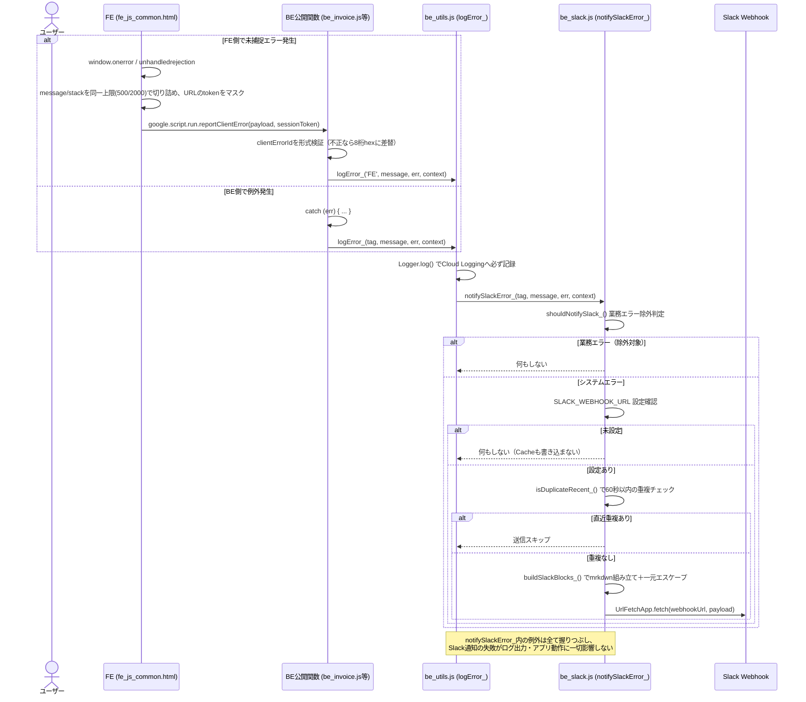
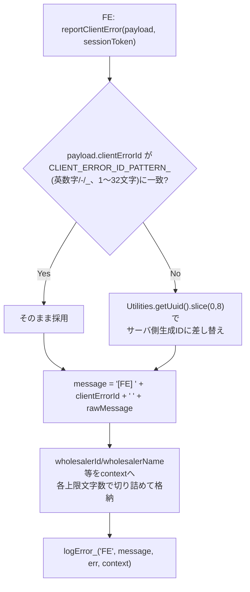

# PR 作業まとめ: MYP-4203 【卸】エラー発生時にslackに通知するようにする

## 概要

ランタイムエラー（BE/FE 双方）発生時に Slack へ自動通知する仕組みを新規実装した。`be_utils.js` の `logError_()` を起点に、BE の例外・FE の未捕捉エラー（`window.onerror` / `unhandledrejection`）を同一の通知経路（`be_slack.js`）に集約し、業務エラーの除外・重複抑制（レートリミット）・Slack mrkdwn 特殊記法のエスケープ・ペイロードサイズ制限などを備えた安全な通知基盤を構築した。

実装後、GitHub Copilot のコードレビューで指摘された **15 件のセキュリティ・堅牢性の指摘**（mrkdwn 注入、重複抑制回避、ペイロード肥大化、Cache 汚染等）に順次対応し、55 件のユニットテスト（`test/be_slack.test.js`）で安全性を担保している。

> **補足**: ブランチ名は `MYP-4203-fix-invoice-amount-diff-batch`（請求金額差分修正）だが、本ブランチで実際にコミットされた作業内容は Active Pull Request（[#50](https://github.com/USEN-PAY-Products/connect-wholesale-gas-poc/pull/50) 「MV-4203 【卸】エラー発生時にslackに通知するようにする」）の通り、Slack通知機能の実装であるため、本ドキュメントはその内容でまとめている。

## 対象ブランチ

`feature/MYP-4203-fix-invoice-amount-diff-batch` → `develop`

---

## 変更ファイル一覧

| ファイル | 変更種別 | 変更内容 |
|----------|---------|---------|
| `src/be_slack.js` | 追加（新規） | Slack通知ドメインを新規実装（通知要否判定・重複抑制・Block Kit組み立て・Webhook送信・FEエラー受信 `reportClientError`） |
| `src/be_utils.js` | 変更 | `logError_()` に Slack 通知フック（`notifySlackError_` 呼び出し）を追加し、失敗しても必ず握りつぶす二重防御を実装。`context` 引数を新設 |
| `src/be_auth.js` | 変更 | `doPost` の `logError_` 呼び出しに卸情報等の `context`（`wholesalerId`/`wholesalerName`/`actionLabel`）を付与 |
| `src/be_server.js` | 変更 | `getAccountInfo` の `logError_` 呼び出しに `context` を付与 |
| `src/be_invoice.js` | 変更 | 請求ドメイン10関数（`sendInvoiceData`, `resubmitInvoiceData`, `bulkResubmitInvoiceData`, `resubmitWithoutChanges`, `withdrawStoreInvoice`, `undoWithdrawStoreInvoice`, `fetchInvoices`, `fetchInvoiceDetail`, `getInvoiceLinesByStore`, `fetchScheduleData` 等）の `logError_` 呼び出しに `context`（卸ID/卸名/請求ID/操作名等）を付与。catch/finally から参照できるよう該当変数を try 外へ先行宣言 |
| `src/fe_js_common.html` | 変更 | グローバルエラーハンドラ（`window.onerror` / `unhandledrejection`）を追加し、`reportClientError_()` 経由で BE の `reportClientError` へ中継。URLトークンのマスク処理・送信ペイロードの長さ制限を実装 |
| `test/be_slack.test.js` | 追加（新規） | `be_slack.js` / `be_utils.js` を vm サンドボックスへ未改変のまま読み込み検証するユニットテスト一式（55件、検証1〜15） |
| `package.json` | 変更 | `npm test`（`node --test test/`）実行用の `test` スクリプトを追加 |
| `.github/workflows/unit_tests.yml` | 追加（新規） | `src/**` / `test/**` / `package.json` 変更時に push・PR 双方で `npm test` を自動実行するCIワークフロー |

---

## 設計方針

### 1. 通知経路の一本化と `be_config.js` 非経由の設計

BE/FE いずれの経路のエラーも、最終的に `be_utils.js` の `logError_(tag, message, error, context)` に合流させ、そこから `be_slack.js` の `notifySlackError_()` をフックする構造にした。FE 側は `reportClientError(payload, sessionToken)` という公開関数経由で BE に中継し、以降は BE のエラーと完全に同じ通知パイプラインに乗る。

`be_slack.js` は `be_config.js` の `getConfig_()` を一切経由せず、`PropertiesService` から直接値（`SLACK_WEBHOOK_URL` 等）を読む設計にした。`getConfig_()` は無関係な必須プロパティ（`DRIVE_ROOT_FOLDER_ID` 等）が未設定だと例外を投げる仕様のため、これを経由すると「設定不備」と「Slack通知」が道連れで失敗する自己矛盾が生じるためである。

### 2. 通知要否判定（ホワイトリスト方式ではなく除外リスト方式）

`shouldNotifySlack_()` は、既知の業務エラー（`UNAUTHORIZED:` 接頭辞・「契約が終了しているため」等の文言）のみを除外リストで管理し、それ以外は通知対象とする設計にした。将来の実装漏れが「通知されない」側ではなく「誤って通知される」側に倒れるよう、安全側に倒す設計判断。

### 3. 重複抑制（レートリミット）と FE `clientErrorId` の正規化

`isDuplicateRecent_()` は `CacheService` で 60 秒 TTL の重複抑制キー（`tag + message`）を管理する。FE 由来のメッセージは `'[FE] <clientErrorId> <rawMessage>'` 形式で、`clientErrorId` は呼び出しごとに異なるランダム値になるため、これを含めたままキー化すると同一エラーでも毎回別キー扱いになり重複抑制が機能しない。`normalizeMessageForDedup_()` で `tag==='FE'` の場合のみ `clientErrorId` 部分を取り除いてからキー化するよう修正した。

| 項目 | Before | After |
|------|--------|-------|
| FE由来messageのdedupキー | `[FE] a1b2c3d4 Cannot read...`（毎回変化） | `Cannot read...`（clientErrorId除去済み、同一エラーなら固定） |

### 4. Slack特殊記法エスケープの一元化（`buildSlackBlocks_` に集約）

Slack mrkdwn は `<!channel>` や `<@U...>` 等を特殊記法として解釈するため、DB由来の卸名・CSVアップロード内容由来のエラーメッセージ・FEブラウザ改ざん可能な入力など、あらゆる出どころの値が Slack 本文に混入し得る。レビュー対応を重ねる中で、呼び出し元（`reportClientError` 等）で個別にエスケープする方式は「二重エスケープ」バグを誘発することが判明したため、**エスケープは `buildSlackBlocks_()` 内でのみ行う**方針に統一した。

| 対象フィールド | エスケープ主体 |
|---|---|
| `ctx.wholesalerId` / `ctx.wholesalerName` | `buildSlackBlocks_` |
| `message` / `err.message` / `err.stack` | `buildSlackBlocks_` |
| `ctx.actionLabel`（`what`） | `buildSlackBlocks_` |
| `ctx[key]`（`invoiceUuid`/`stagingId`/`storeInvoiceId`/`parentInvoiceId`、idPairs） | `buildSlackBlocks_` |
| Cloud Logging検索リンク用の `searchText` | エスケープ**しない**（`ctx[key]` の生値を別途参照し `encodeURIComponent` するため、表示用エスケープとは独立） |

呼び出し元（`reportClientError` 含む）は一切エスケープを行わない。これにより「どこか1箇所で必ず1回だけエスケープされる」ことが保証される。

### 5. ペイロードサイズ制限（BE/FE 双方）

`google.script.run` の送信自体が、長大なペイロード（特に minify されたスタックトレース）で失敗・遅延しやすくなるため、BE側の表示用 `slice` とは別に、FE側でも送信前に同じ上限で事前に切り詰める設計にした。

| フィールド | 上限文字数 | 備考 |
|---|---|---|
| `message` | 500 | BE/FE 双方で同一上限 |
| `stack` | 2000 | BE/FE 双方で同一上限 |
| `url` / `ua` | 300 | BE側のみ（`reportClientError` 内） |
| `wholesalerId` / `wholesalerName` | 100 | BE側のみ。値がある場合のみ切り詰め、falsy値は `null` を維持し「不明」表示にフォールバック |

### 6. `notifySlackError_` の判定順序（Webhook設定確認 → 重複抑制判定）

当初「重複抑制判定（Cache書き込みを伴う） → Webhook設定確認」の順だったが、この順序だと `SLACK_WEBHOOK_URL` 未設定環境でも無駄に Cache キーが消費されてしまい、後から Webhook を設定した直後の最初の通知が TTL(60秒) 以内という理由だけで誤って抑制される副作用があった。Webhook確認を先に行うことで、「送信できないケース」では Cache に一切書き込まないよう順序を入れ替えた。

```
Before: 通知要否判定 → 重複抑制判定(Cache書込) → Webhook設定確認 → 送信
After : 通知要否判定 → Webhook設定確認 → 重複抑制判定(Cache書込) → 送信
```

### 7. `reportClientError` の `clientErrorId` 検証（不正値のサーバ側フォールバック）

`payload.clientErrorId` はブラウザ側で自由な文字列に書き換え可能な入力のため、`normalizeMessageForDedup_()` が前提とする「空白を含まない」（`\S+`）という制約が崩れた値（空白混入・Slack特殊記法・過剰な長さ等）を送られると、dedup用の接頭辞除去が正しく機能せず、同一エラーでも毎回別キー扱いになって重複抑制を回避されてしまう（＝Slack通知スパムの入口になり得る）。`CLIENT_ERROR_ID_PATTERN_`（英数字・ハイフン・アンダースコアのみ、1〜32文字）による形式検証を追加し、不一致の場合はサーバ側生成の8桁hex IDに全面的に差し替えるようにした。

---

## 全体フロー図

### 通知パイプライン全体（FE/BE 集約 → 判定 → Slack送信）



### `reportClientError` の `clientErrorId` 検証フロー



---

## 変更詳細

### `src/be_slack.js`（新規）

- **`shouldNotifySlack_(err)`**: 除外リスト（`SLACK_EXCLUDE_PREFIXES_` / `SLACK_EXCLUDE_SUBSTRINGS_`）に該当しない限り通知対象と判定。
- **`normalizeMessageForDedup_(tag, message)`** / **`isDuplicateRecent_(tag, message)`**: `CacheService` による60秒TTLの重複抑制。FE由来メッセージは `clientErrorId` を除去してからキー化。
- **`buildInvestigationHint_` / `buildCloudLoggingUrl_` / `buildGasExecutionsUrl_`**: tag別の一次切り分けヒント文、Cloud Logging・GAS実行ログへのディープリンクを生成。
- **`buildSlackBlocks_(tag, message, err, context)`**: Slack Block Kit本文を組み立てる中核関数。`wholesalerId`/`wholesalerName`/`message`/`err.message`/`err.stack`/`ctx[key]`(idPairs)/`actionLabel` の全てを、埋め込み直前に `escapeSlackText_()` へ通す（エスケープの一元化ポイント）。
- **`notifySlackError_(tag, message, err, context)`**: 通知要否判定 → Webhook設定確認 → 重複抑制判定 → 送信、の順で処理し、全体を単一 `try/catch` で防御。
- **`escapeSlackText_(text)`**: `&` → `<` → `>` の順でエスケープ（順序を誤ると `&` の二重エスケープが発生するため固定順）。
- **`reportClientError(payload, sessionToken)`**: FEからの唯一の公開エントリーポイント。`clientErrorId` の形式検証、`message`/`stack`/`url`/`ua`/`wholesalerId`/`wholesalerName` の長さ制限を行った上で `logError_('FE', ...)` に合流させる。

### `src/be_utils.js`

- `logError_(tag, message, error, context)`: 第4引数 `context` を新設。`Logger.log()` によるCloud Loggingへの記録を無条件・最優先で実行した**後**に、`notifySlackError_()` を `try/catch` で二重防御しながら呼び出す（Slack通知側の失敗がログ出力自体に一切影響しないようにするため）。

### `src/be_auth.js` / `src/be_server.js` / `src/be_invoice.js`

- 各関数の `catch` ブロックにおける `logError_()` 呼び出しに、`wholesalerId` / `wholesalerName` / `invoiceUuid` / `stagingId` / `storeInvoiceId` / `parentInvoiceId` / `actionLabel`（日本語の操作名、例:「新規請求登録」「請求取下げ」）を `context` として追加。
- `accountInfo` 等、従来 `try` 内の `const` で宣言していた変数を、`catch` 側からも参照できるよう `try` 外で `let ... = null;` として先行宣言する形に変更（ロジック自体の変更はなし）。

### `src/fe_js_common.html`

- **`generateClientErrorId_()`**: 8桁hexのランダムID生成。
- **`sanitizeUrlForErrorReport_(url)`**: エラーレポート送信前に URL 中の `token=` 値をマスク（`[?&#]token=` を起点に、次の `&` または `#` の手前までを `***` に置換。`#` も区切りに含めることで、`?token=xxx#section=...` のようなURLでもフラグメント以降の情報を失わない）。
- **`reportClientError_(message, stack)`**: `window.onerror` / `unhandledrejection` から呼ばれ、`message`/`stack` をBEと同一上限（500/2000文字）で切り詰めた上で `google.script.run.reportClientError()` を呼ぶ。`withFailureHandler` は `console.error` のみで再送信は行わない（無限ループ防止）。

### `test/be_slack.test.js`（新規、55件）

`src/be_utils.js` / `src/be_slack.js` を**未改変のまま** `node:vm` サンドボックスへ読み込み、GASのグローバルAPI（`PropertiesService`/`UrlFetchApp`/`CacheService`/`Logger`/`ScriptApp`/`Utilities`）をモック注入して検証する方式。検証項目は以下の15区分：

| # | 検証内容 |
|---|---|
| 1〜2 | 異常入力・Webhook未設定時に例外を外へ投げないこと |
| 3〜5 | 業務エラー除外判定、`logError_`の二重防御、`getConfig_`非経由の確認 |
| 6 | FE由来messageのclientErrorId正規化による重複抑制 |
| 7 | `reportClientError`のSlack特殊記法エスケープ |
| 8 | 正常系レートリミット（Cache機能時に2回呼んでfetch1回になること） |
| 9〜12 | `wholesalerName`/`err.message`/`err.stack`/`idPairs`/`actionLabel`のエスケープと二重エスケープ防止 |
| 13 | Webhook設定確認 → 重複抑制判定の順序（Cache汚染防止） |
| 14 | `wholesalerId`/`wholesalerName`の長さ上限(100文字) |
| 15 | `clientErrorId`の形式検証とサーバ側フォールバック |

### `.github/workflows/unit_tests.yml`（新規）

`src/**` / `test/**` / `package.json` の変更を含む push・PR（`main`/`develop`向け）で `npm ci` → `npm test` を自動実行するワークフロー。

---

## コーディングルール準拠

| ルール | 対応 |
|--------|------|
| `var` 禁止 → `const` / `let` 使用 | ✅ |
| 内部関数は末尾 `_`（`shouldNotifySlack_`, `buildSlackBlocks_`, `escapeSlackText_`, `sanitizeUrlForErrorReport_` 等） | ✅ |
| 公開関数（`reportClientError`）は `function` キーワードで定義し末尾 `_` なし | ✅ |
| BEの受け口は `try-catch` で保護 | ✅（`reportClientError`, `notifySlackError_`, `logError_` すべて try/catch） |
| `google.script.run` に `.withFailureHandler()` を設定 | ✅（`fe_js_common.html` の呼び出し箇所） |
| バックエンドはドメイン単位でファイル分割（`be_xxx.js`） | ✅（`be_slack.js` を新規ドメインとして分離） |

---

## 影響範囲

- **機能影響**: `logError_()` のシグネチャに `context` 引数を追加したが省略可能なため、既存呼び出し箇所（第4引数なし）は動作に影響しない。BE各関数の `catch` ブロックの再throw・エラーメッセージ判定ロジック自体は変更なし（`context` 引数の追加のみ）。Slack通知は多重の `try/catch` で防御されているため、通知処理自体が失敗してもアプリの既存機能（請求登録・取下げ等）には一切影響しない。
- **パフォーマンス影響**: `notifySlackError_` は `CacheService`/`PropertiesService`/`UrlFetchApp` を同期的に呼び出すが、`SLACK_WEBHOOK_URL` 未設定環境（ローカル開発等）では早期returnしCacheへの書き込みも発生しないためオーバーヘッドはほぼ無い。本番環境でも業務エラー除外・60秒間の重複抑制により、実際のSlack送信（`UrlFetchApp.fetch`、同期呼び出し）の発生頻度自体を抑制している。
