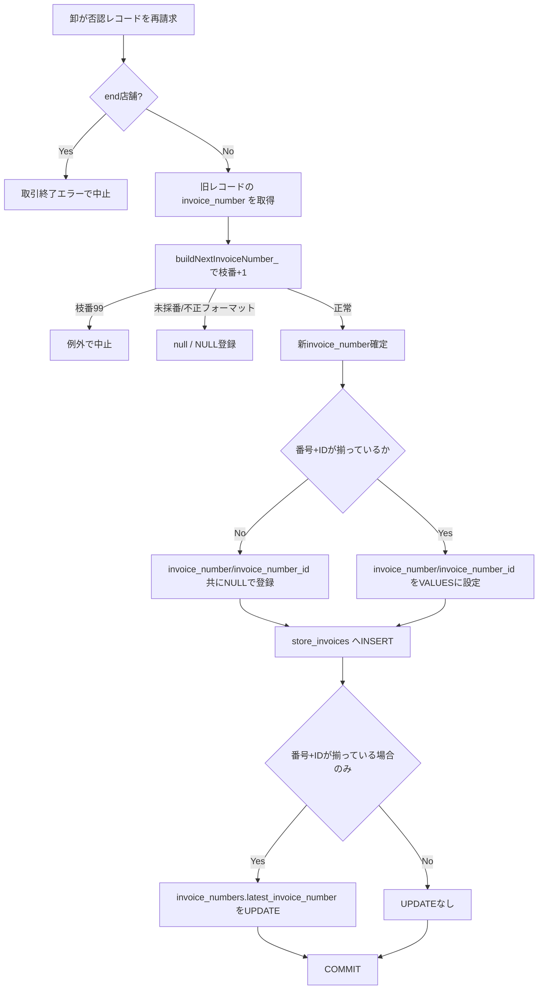
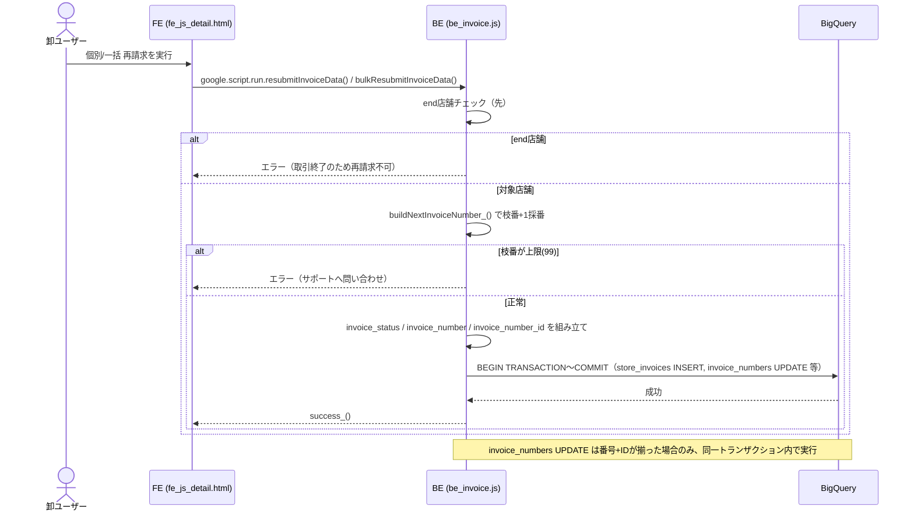

# PR 作業まとめ: MYP-4203 再請求時に否認ステータス・請求書番号を引き継ぐように修正

> **補足**: `docs/pr_work_logs/PR_作業まとめ_MYP-4203.md` は同一チケット番号だが別ブランチ（`MYP-4203-fix-invoice-amount-diff-batch`、Slack通知実装）の作業まとめのため、本ブランチ（`feature/MYP-4203-carry-over-rejection-status-on-rebilling`）の作業内容は本ファイルにまとめる。

## 概要

再請求（個別・一括 × 固定9列/カスタムCSV の4パス）で、旧レコードの否認ステータス（`invoice_status='DISPUTED'`）が新レコードに引き継がれず表示が消えてしまう不具合を修正した。あわせて、再請求時に請求書番号の枝番をインクリメント（例: `1000000001-01` → `-02`）し、`invoice_number_id` の引き継ぎと `invoice_numbers.latest_invoice_number` の更新を同一トランザクション内で行う機能を追加した。詳細画面の一覧振り分け（要対応 / 確認中・承認済み）・TOP画面の否認バッジ判定もあわせて見直し、コードレビュー指摘（不整合レコード防止・到達不能コード削除・処理順・内部ID非露出等）に順次対応した。

## 対象ブランチ

`feature/MYP-4203-carry-over-rejection-status-on-rebilling` → `develop`

---

## 変更ファイル一覧

| ファイル | 変更種別 | 変更内容 |
|----------|---------|---------|
| `src/be_invoice.js` | 変更 | `buildNextInvoiceNumber_()` 新設（枝番+1採番・上限99検知）。`buildResubmitTransactionSql_` / `buildBulkResubmitTransactionSql_` に `invoice_status` / `invoice_number` / `invoice_number_id` の引き継ぎと `invoice_numbers` UPDATE 文生成を追加。`resubmitInvoiceData` / `bulkResubmitInvoiceData` から新パラメータを配線。`fetchInvoiceDetail` のレスポンスから内部ID（`invoice_number_id`）を除去 |
| `src/be_csv_mapper.js` | 変更 | `buildMappedResubmitTransactionSql_` / `buildMappedBulkResubmitTransactionSql_` に同様の `invoice_status` / `invoice_number` / `invoice_number_id` 引き継ぎと `invoice_numbers` UPDATE 文生成を追加（固定9列側とロジックを統一） |
| `src/db_bq_query.js` | 変更 | `fetchInvoicesByWholesaler_` の `has_denial` 判定を要対応3ステータス限定に修正。`fetchStoreInvoicesByParent_` に `invoice_number_id` の SELECT を追加 |
| `src/fe_js_detail.html` | 変更 | 一覧振り分け（`disputed`/`normal`/`isDisputed`）から `PENDING_REVIEW + DISPUTED`（再請求済み）を除外し「確認中・承認済み」側に統一。到達不能になった「再請求済み」バッジ分岐を削除 |
| `test/be_invoice.test.js` | 変更 | 上記全機能のユニットテストを追加・既存テストをシグネチャ変更に追随 |
| `test/be_csv_mapper.test.js` | 追加 | カスタムCSV形式側の `invoice_number` / `invoice_number_id` 引き継ぎテストを追加 |
| `.gitignore` | 変更 | `test/` の ignore 指定を削除（テストファイルは追跡対象のため） |

---

## 設計方針

### 1. 否認ステータスの引き継ぎ条件

再請求時、旧レコードが `invoice_status === 'DISPUTED'` の場合のみ新レコードにも `'DISPUTED'` を設定する（それ以外は `NULL`）。これにより、否認 → 再請求後も「未検収+否認」の状態を維持し、詳細画面で否認理由・合意内容欄が表示され続ける。

### 2. 一覧振り分け・バッジ判定の見直し

再請求済み（`PENDING_REVIEW` + `DISPUTED`）は「要対応」ではなく「確認中・承認済み」に表示するよう統一した。

| 判定対象 | Before | After |
|---|---|---|
| 詳細画面 `disputed`（要対応） | `PENDING_REVIEW+DISPUTED` を含む | 除外（MCR/RETURNED/WITHDRAW_REQUESTED のみ） |
| 詳細画面 `normal`（確認中・承認済み） | `PENDING_REVIEW+DISPUTED` を除外 | 含む |
| TOP画面 `has_denial`（否認バッジ） | `invoice_status='DISPUTED'` のみで判定 | 要対応3ステータス（MCR/RETURNED/WITHDRAW_REQUESTED）に限定 |

これに伴い、詳細画面の「再請求済み」バッジ分岐（`isDisputed` 内、`backoffice_review_status==='PENDING_REVIEW' && invoice_status==='DISPUTED'` 時に表示）は `isDisputed` の定義から当該条件が除外されたことで到達不能になったため削除した。

### 3. 請求書番号の採番（枝番インクリメント）

`buildNextInvoiceNumber_(oldInvoiceNumber)` を新設し、「請求番号(10桁)-枝番(2桁)」フォーマットの枝番を +1 する。

```
1000000001-01  →  1000000001-02
```

| ケース | 挙動 |
|---|---|
| 正常フォーマット（`^(\d{10})-(\d{2})$`） | 枝番+1（ゼロ埋め2桁）を返す |
| 未採番（NULL/空文字/空白） | `null` を返す（新レコードは `invoice_number` も `NULL`） |
| 想定外フォーマット（桁数不一致等） | ログ出力のうえ `null` を返す（引き継ぎスキップ、例外にはしない） |
| 枝番が上限（99）に達している | 例外を投げ、再請求処理自体を中止する |

正規表現は当初 `^(\d+)-(\d+)$`（桁数を問わない）だったが、JSDoc の仕様（10桁-2桁固定）と不一致で、桁数の異なる値も「正常フォーマット」として枝番インクリメント対象になってしまう指摘があり、`^(\d{10})-(\d{2})$` に厳格化した。

### 4. `invoice_number` / `invoice_number_id` のペア登録（不整合レコード防止）

当初は `invoice_number` と `invoice_number_id` を個別に NULL/値判定していたため、片方だけ入った不整合レコード（例: 番号は NULL だが ID だけ入る）が作れてしまう問題があった。レビュー指摘を受け、4パス（固定9列/カスタムCSV × 個別/一括）すべてで「番号+IDが揃った場合のみ両方登録し、揃わなければ両方 NULL」に統一した。

```js
const hasInvoiceNumberPair = !!(newInvoiceNumber && invoiceNumberId);
const invoiceNumberSql   = hasInvoiceNumberPair ? "'" + esc(newInvoiceNumber) + "'" : 'NULL';
const invoiceNumberIdSql = hasInvoiceNumberPair ? "'" + esc(invoiceNumberId) + "'" : 'NULL';
```

`invoice_numbers.latest_invoice_number` の UPDATE 文生成条件（`number && id`）も同じ判定に揃えてあるため、INSERT側とUPDATE側のズレは発生しない。

### 5. 一括再請求における採番対象の絞り込み（無関係な例外による全体失敗の防止）

一括再請求（`bulkResubmitInvoiceData`）では、当初 `storeRows` ループの中で全店舗（要対応でない店舗・取引終了(end)店舗・取り下げ依頼中店舗を含む）に対して `buildNextInvoiceNumber_()` を実行していた。この場合、再請求対象外の店舗の旧レコードに枝番上限（99）が1件でも混ざっていると、無関係な例外で一括再請求全体が失敗してしまう。

対応として、採番処理を「要対応 かつ end/取り下げ依頼中でない」フィルタ確定後の対象店舗のみに絞り込むよう順序を変更した。

```
Before: storeRows 全件ループ内で採番 → フィルタ
After : フィルタで再請求対象を確定 → 対象店舗のみ採番
```

### 6. 個別再請求における end 店舗チェックと採番の順序（エラーメッセージの一致）

個別再請求（`resubmitInvoiceData`）でも同様の問題があり、取引終了（end）店舗の再請求を弾く判定より先に採番処理（枝番上限99で例外）が実行されていたため、end 店舗の再請求時に「取引終了エラー」ではなく「枝番上限エラー」が先に出てしまう不整合があった。end 店舗チェックを先に行い、その後に採番処理を行う順序に修正し、一括側の方針と揃えた。

### 7. `invoice_number_id`（内部ID）のクライアント非露出

`fetchStoreInvoicesByParent_` に `invoice_number_id` の SELECT を追加したことで、`fetchInvoiceDetail` のレスポンスにも内部IDがそのまま含まれてしまう状態になっていた。フロント（`fe_js_detail.html`）では参照していない値のため、返却直前にコピーから `delete` して除去する形で対応した（元データは非破壊。resubmit/bulkResubmit の内部処理は別途 `fetchStoreInvoicesByParent_` を直接呼ぶため影響なし）。

### 8. 処理順に関する検討事項（トランザクション内のため入れ替え不要）

レビューで「`invoice_numbers` 更新は `store_invoices` INSERT より先に行うべきでは」という指摘があったが、生成SQLは `BEGIN TRANSACTION 〜 COMMIT` の単一トランザクションで COMMIT 時に原子的に確定するため、文の順序は結果に影響しない。また新しい `invoice_number` は `invoice_numbers` テーブルからの SELECT ではなく GAS 側で計算したリテラル値を両方の文に埋め込んでいるため、この点でも順序依存はない。

---

## 全体フロー図





---

## 変更詳細

### `src/be_invoice.js`

- **`buildNextInvoiceNumber_(oldInvoiceNumber)`（新設）**: 正規表現 `^(\d{10})-(\d{2})$` で厳格に検証し、枝番+1・未採番/不正形式は `null`・上限99は例外、という3分岐を実装。
- **`buildResubmitTransactionSql_` / `buildBulkResubmitTransactionSql_`**: 引数に `storeInvoiceStatus`（一括は `invoiceStatuses`）、`newInvoiceNumber` / `invoiceNumberId`（一括は `invoiceNumbers: {customerCode: {number, id}}`）を追加。INSERT列・VALUESへの反映、`hasInvoiceNumberPair` による整合性確保、COMMIT前の `invoice_numbers` UPDATE 文生成（対象がある場合のみ）を実装。
- **`resubmitInvoiceData`**: end店舗チェック → `buildNextInvoiceNumber_()` 呼び出しの順に変更。
- **`bulkResubmitInvoiceData`**: `storeRows` ループでは生の `invoice_number`/`invoice_number_id` のみ保持し、要対応フィルタ確定後に対象店舗のみ採番する2段階構成に変更。
- **`fetchInvoiceDetail`**: 返却直前に `stores` の各要素をコピーし `invoice_number_id` を `delete`。

### `src/be_csv_mapper.js`

- `buildMappedResubmitTransactionSql_` / `buildMappedBulkResubmitTransactionSql_` に、`be_invoice.js` と同一ロジックの `invoice_status` / `invoice_number` / `invoice_number_id` 引き継ぎと `invoice_numbers` UPDATE 生成を追加。

### `src/db_bq_query.js`

- `fetchInvoicesByWholesaler_`: `has_denial` の判定条件を `invoice_status='DISPUTED'` のみから、要対応3ステータス（`MERCHANT_CONFIRMATION_REQUESTED` / `RETURNED` / `WITHDRAW_REQUESTED`）との AND 条件に変更（`PENDING_REVIEW` = 再請求済みは対象外）。
- `fetchStoreInvoicesByParent_`: SELECT 句に `si.invoice_number_id` を追加（BE内部の再請求処理での引き継ぎに使用。フロントへは非公開）。

### `src/fe_js_detail.html`

- `renderDetailStoreList_`: `disputed` フィルタ・`normal` フィルタの両方から `backoffice_review_status==='PENDING_REVIEW' && invoice_status==='DISPUTED'` の条件を削除。
- `buildDetailAccordion_`: `isDisputed` の定義から同条件を削除。到達不能になった「再請求済み」バッジの表示分岐（`<span class="detail-action-badge--resubmitted">`）を削除し、通常の3操作ボタン（請求取り下げ／修正ファイルをアップ／変更なしで再請求）に統一。

---

## コーディングルール準拠

| ルール | 対応 |
|--------|------|
| `var` 禁止 → `const` / `let` 使用 | ✅ |
| 内部関数は末尾 `_`（`buildNextInvoiceNumber_` 等） | ✅ |
| フロントから呼ばれる公開関数（`fetchInvoiceDetail` 等）は `function` キーワードで定義・末尾 `_` なし | ✅ |

---

## 影響範囲

- **機能影響**:
  - 再請求時（個別・一括、固定9列/カスタムCSVの4パス全て）に否認ステータス・請求書番号（枝番+1）・`invoice_number_id` が正しく引き継がれるようになる。
  - 詳細画面で再請求済み（`PENDING_REVIEW`+`DISPUTED`）レコードの表示先が「要対応」から「確認中・承認済み」に変わる（要対応バッジ・要対応3ボタンは表示されなくなる）。
  - TOP画面の否認バッジ（`has_denial`）は、再請求済みのみのケースでは表示されなくなる（要対応の否認が残っている場合のみ表示）。
  - `invoice_numbers.latest_invoice_number` を卸システム側から更新するようになる（BO以外の別システムとの並行調整が必要。ユーザー側で並行して改修中）。
  - `fetchInvoiceDetail` のレスポンスに `invoice_number_id`（内部ID）が含まれなくなる。
- **パフォーマンス影響**: 再請求トランザクションに `invoice_numbers` UPDATE 文が追加されるが、同一トランザクション内の軽量な条件付きUPDATEであり、既存の INSERT/UPDATE 群と比べて有意な影響はない。
