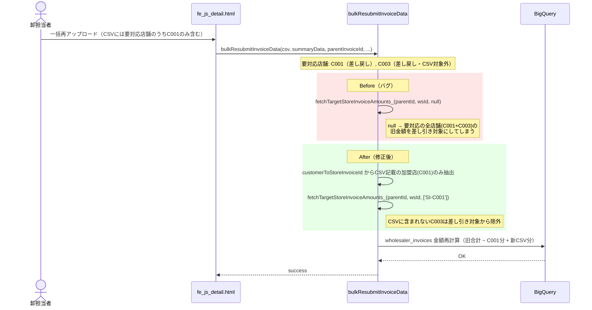
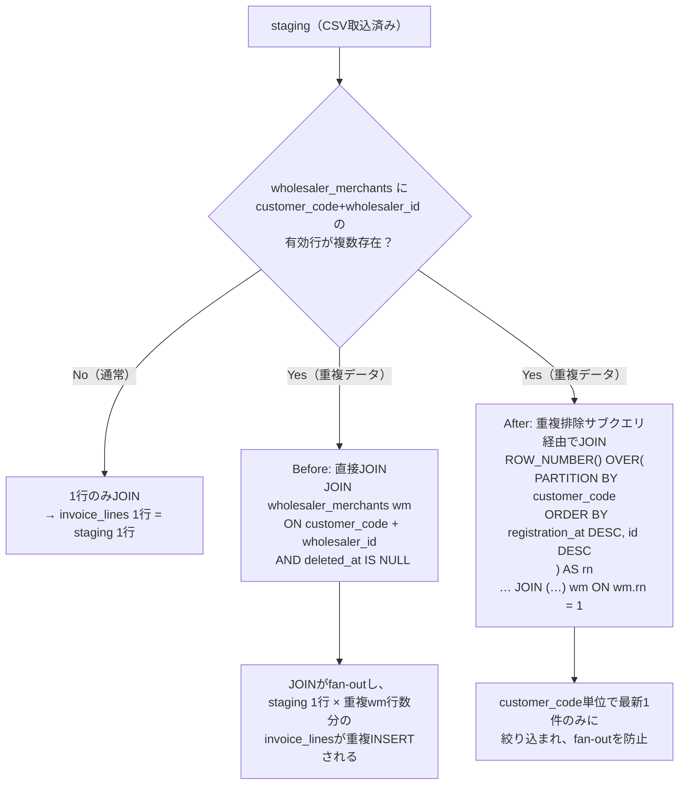

# PR 作業まとめ: MYP-4204 バグ対応part10

## 概要

本 PR では、独立した 9 件のバグ修正・仕様統一・機能追加を実施した。

1. **一括再請求の金額再計算バグ修正**: 要対応（差し戻し・否認）の加盟店が複数ある状態で、CSVに一部の加盟店のみを含めて一括再アップロードすると、CSVに含まれない要対応の加盟店の金額まで誤って `wholesaler_invoices` の再計算対象に含まれてしまい、詳細画面ヘッダーの金額表示が全てズレる不具合を修正。
2. **CSVアップロード画面の加盟店網羅性チェック警告文言の統一**: 新規アップロード画面の警告文言を、詳細画面（差し戻し→一括再アップロード）側の文言と統一。
3. **「加盟店別請求書備考」表記の統一**: 確認画面・詳細画面・個別再請求モーダル・関連仕様書における表記を「請求書備考」に統一。
4. **確認画面: 否認店舗の入力欄の表示順統一**: 「【必須】加盟店との合意内容」を「請求書備考」より前に表示するよう順序を変更し、詳細画面・個別再請求モーダルの表示順と統一。
5. **個別再請求モーダルの登録ボタン活性制御を確認画面と統一**: ボタンの活性/非活性を誓約チェックボックスの状態のみで判定するように変更（税額±1円エラーの有無では制御しない）。
6. **個別再請求モーダルのエラー表示を`showToast()`に統一**: 7箇所の `alert()` を `showToast()` に置き換え、あわせて「合意内容未入力」エラーの見た目を、テキストエリア直後の小さい赤文字からアイコン付き警告バナー（確認画面と同一デザイン）に変更。
7. **`showToast()` の複数行メッセージ表示不具合修正**: `showToast()` はタイトルを `textContent` で描画するため `join('\n')` では改行が視認できない問題を修正。1件目をタイトル、2件目以降を `body` 引数（` ` 区切り・`escapeHtml` 済み）で表示するように変更。
8. **CSVカスタムマッピング形式に伝票番号(slip_number)・商品コード(item_code)のパススルー対応を追加**: `csv_format_rules.columns` に `system_column: 'slip_number'` / `'item_code'` を定義した場合に、`invoice_lines.slip_number` / `invoice_lines.item_code` へ登録されるようにした（CSVに列が無い場合は従来通りNULL登録）。
9. **`wholesaler_merchants` の重複行による `invoice_lines` 重複INSERTリスクの解消**: `invoice_lines` の `INSERT...SELECT` が `wholesaler_merchants` を直接JOINしていたため、同一 `customer_code`+`wholesaler_id` の有効行が複数存在する場合にJOINがfan-outし明細が重複登録される恐れがあった。`customer_code` 単位で最新1件のみに絞り込む重複排除サブクエリ経由でJOINするように変更（新規アップロード・個別再請求・一括再請求の全6経路、固定9列形式・カスタムマッピング形式の両方に適用）。あわせて `registration_at` が同一の場合の非決定性を避けるため、`id`（UUID v7）の降順もタイブレークとして追加。

## 対象ブランチ

`feature/MYP-4204-bug-fix-part10` → `develop`

> 本ブランチは `feature/MYP-4203-fix-invoice-amount-diff-batch`（PR作業まとめ: [PR_作業まとめ_MYP-4203.md](./PR_作業まとめ_MYP-4203.md)）の先端から分岐しているため、以下の変更ファイル一覧・差分は **MYP-4204（part10）で追加された変更分のみ** を対象としている（MYP-4203の変更は含まない）。

---

## 変更ファイル一覧

| ファイル | 変更種別 | 変更内容 |
|----------|---------|---------|
| `src/be_invoice.js` | 変更 | ①`bulkResubmitInvoiceData`: 旧金額差し引き対象をCSVに含まれる加盟店の `store_invoice_id` のみに限定 ／ ⑨`buildTransactionSql_`/`buildResubmitTransactionSql_`/`buildBulkResubmitTransactionSql_` の `invoice_lines` JOINを重複排除サブクエリ化＋`id DESC`タイブレーク追加 |
| `src/be_csv_mapper.js` | 変更 | ⑧`ALLOWED_SYSTEM_COLUMNS` に `slip_number`/`item_code` を追加 ／ ⑨`buildInvoiceLinesSelectSql_`（3フロー共通エンジン）の `invoice_lines` JOINを同様に重複排除サブクエリ化＋タイブレーク追加 |
| `src/db_bq_query.js` | 変更 | ⑨`fetchAccountInfoByEmail_`/`fetchStoreInvoicesByParent_` の既存 `latest_merchants` CTE（`ROW_NUMBER()`）に `id DESC` タイブレークを追加 |
| `src/fe_js_upload.html` | 変更 | ②加盟店網羅性チェックの警告文言を詳細画面と統一 |
| `src/fe_js_confirm.html` | 変更 | ③備考ラベル表記統一 ／ ④合意内容入力欄を備考欄より前に表示する順序へ変更 |
| `src/fe_js_detail.html` | 変更 | ③備考ラベル表記統一（3箇所）／ ⑤登録ボタン活性制御の統一 ／ ⑥`alert()`→`showToast()`変換（7箇所）＋エラーバナーUI統一 ／ ⑦`showToast()` 複数行対応（2箇所） |
| `src/fe_css.html` | 変更 | ⑥不要になった `.handover-validation-error` ルールを削除 |
| `docs/specifications/02_csv_upload_page.md` | 変更 | ②③の文言統一を仕様書に反映 |
| `docs/specifications/03_confirm_page.md` | 変更 | ③の表記統一を仕様書に反映 |
| `docs/specifications/04_detail_page.md` | 変更 | ③の表記統一を仕様書に反映 |
| `docs/specifications/07_test_scenarios.md` | 変更 | ②③のテストシナリオ記述を更新 |
| `docs/csv_upload_validation.md` | 変更 | ②の文言統一をバリデーション仕様に反映 |
| `docs/MYP-3782-design.md` | 変更 | ③の表記統一を設計書に反映 |
| `test/be_invoice.test.js` | 追加 | ①の金額再計算バグ修正の回帰テスト（3件）＋⑨の重複排除サブクエリ生成の回帰テスト（3件、対象関数ごと） |
| `test/be_csv_mapper.test.js` | 追加 | ⑧`slip_number`/`item_code` パススルーの回帰テスト（4件）＋⑨の重複排除サブクエリ生成の回帰テスト（1件） |

---

## 設計方針

### 1. 一括再請求の金額再計算バグ修正（対象店舗の限定）

`bulkResubmitInvoiceData` は「要対応（差し戻し・否認）の全店舗」と「今回のCSVに実際に含まれる店舗」を区別していなかった。要対応店舗が複数あり、CSVには一部の店舗のみを含めて再送信すると、CSVに含まれない要対応店舗の金額まで `wholesaler_invoices` の再計算（旧金額の差し引き）に巻き込まれ、金額がズレていた。

| 項目 | Before | After |
|------|--------|-------|
| `fetchTargetStoreInvoiceAmounts_` の第3引数 | `null`（＝「要対応の全店舗」を対象に旧金額を集計） | CSVに実際に含まれる加盟店の `store_invoice_id` の配列のみ |
| 対象解決不能時の挙動 | （事実上）全要対応にフォールバック | 明示的に `throw new Error(...)`（黙って過去の誤挙動に戻さない安全策） |

### 2〜7. 表記・UI挙動の3画面間統一

CSVアップロード・確認・詳細（個別再請求モーダル含む）の3画面で、同種の文言・挙動に差異が生じていた箇所を統一した。

| # | 項目 | Before | After |
|---|------|--------|-------|
| ② | CSVアップロード画面の加盟店網羅性チェック警告 | `〇〇店の請求明細がありません。` | `加盟店（顧客コード: 〇〇 / 〇〇店）のデータがCSVに含まれていません。この加盟店の請求は行われませんが、よろしいですか？`（詳細画面と統一） |
| ③ | 備考ラベル表記 | `加盟店別請求書備考` / `加盟店請求書備考`（画面ごとに表記ゆれ） | `請求書備考`（全画面・全仕様書で統一） |
| ④ | 確認画面: 否認店舗の入力欄順序 | 備考欄 → 合意内容欄 | 合意内容欄 → 備考欄（詳細画面・個別再請求モーダルと統一） |
| ⑤ | 個別再請求モーダルの登録ボタン活性条件 | 誓約チェック＋税額±1円エラー無しの両方で判定 | 誓約チェックボックスの状態のみで判定（確認画面の `checkConfirm` と同一挙動。±1円超過は登録ボタン押下時にエラーメッセージで止める） |
| ⑥ | 個別再請求モーダルのエラー表示 | `alert()`（7箇所）／合意内容未入力時は赤文字のみ | `showToast()` に統一／合意内容未入力時はアイコン付き警告バナー（確認画面と同一デザイン、`backoffice-remark__error-banner`） |
| ⑦ | `showToast()` の複数行メッセージ | `join('\n')` をタイトルに設定 → `textContent` のため改行が視認できず1行に潰れる | 1件目をタイトル、2件目以降を `body` 引数（` ` 区切り・`escapeHtml` 済み）に設定し、複数エラーを見やすく表示 |

⑥のエラーバナーは、確認画面（`fe_js_confirm.html`）で先行して採用していた「アイコン＋太字メッセージをDOM APIで組み立てる」パターンをそのまま踏襲しており、`innerHTML` によるHTML文字列挿入を避けている。

### 8. CSVカスタムマッピング形式: slip_number/item_code パススルー対応

`csv_format_rules.columns` に `system_column: 'slip_number'` / `'item_code'` を定義しても、`buildInvoiceLinesSelectSql_` 内の `ALLOWED_SYSTEM_COLUMNS` ホワイトリストに含まれていなかったため、CSVに列があっても `invoice_lines` へのINSERTがサイレントにスキップされていた（`Logger.log` で警告のみ）。

| 項目 | Before | After |
|------|--------|-------|
| `ALLOWED_SYSTEM_COLUMNS` | `slip_number`/`item_code` 無し → 定義してもINSERT対象外（`invoice_lines.slip_number`/`item_code` は常にNULL） | 追加済み → CSVに列があれば値をパススルー登録、無ければ従来通りNULL登録 |

対象のBQ側DDL（`invoice_lines.slip_number` / `invoice_lines.item_code`）は運用環境で追加対応済みであることを確認済み（PRレビューコメントで確認）。新規アップロード・個別再請求・一括再請求の3フローはいずれも `buildInvoiceLinesSelectSql_` を共通で経由するため、本修正1箇所で3フロー全てに適用される。

### 9. wholesaler_merchants 重複行による invoice_lines 重複INSERTリスクの解消

`invoice_lines` の `INSERT...SELECT` は `wholesaler_merchants` を `customer_code + wholesaler_id + deleted_at IS NULL` の条件で直接JOINしていた。運用上は同一 `customer_code`+`wholesaler_id` の有効行が重複することは無い想定だが、`wholesaler_merchants` は本アプリ外（手動/外部）で管理されているテーブルであり、DDL上もUNIQUE制約が無いため、万一重複行が生じた場合にJOINがfan-outし、`invoice_lines` が水増し登録される恐れがあった（`store_invoices` はVALUESベースのINSERTのため対象外）。

対象は新規アップロード・個別再請求・一括再請求の3フロー × 固定9列形式・カスタムマッピング形式の2種類 = 計6経路。全経路で同一パターンのJOINを使用していたため、同一の対策を適用した。

タイブレークに `id`（UUID v7。先頭が時系列順にソート可能な形式）の降順を追加しているのは、`registration_at`（日付型・粒度が粗い）が同一の重複行が存在した場合に `ROW_NUMBER()` の `rn=1` の選定が非決定的になり、実行のたびに異なる `mall_code` に紐づいてしまう（＝どのCSV明細行がどの店舗の請求として登録されるか揺れる）ことを防ぐため。この対策は本来INSERT対象ではない `db_bq_query.js` の既存2クエリ（`fetchAccountInfoByEmail_` / `fetchStoreInvoicesByParent_` の `latest_merchants` CTE）にも同様のリスクがあったため、あわせて同じタイブレークを追加している（前者は新規アップロード時に `store_invoices.mall_code` の確定に使う `merchant_mappings` の生成元であり、表示のみの問題に留まらないため）。

---

## 変更詳細

### `src/be_invoice.js`

- `bulkResubmitInvoiceData`: `storeRows`（`fetchStoreInvoicesByParent_` の結果）から `customerToStoreInvoiceId`（`customer_code → store_invoice_id`）を新設。旧 `fetchTargetStoreInvoiceAmounts_(parentInvoiceId, wholesalerId, null)` を、CSVの `summaryData.merchantTotals` から解決した `targetStoreInvoiceIds` を渡す形に変更。解決結果が空配列になった場合は例外を投げ、暗黙のフォールバックを防止。
- `buildTransactionSql_` / `buildResubmitTransactionSql_` / `buildBulkResubmitTransactionSql_`: `invoice_lines` の `SELECT ... FROM staging s JOIN wholesaler_merchants wm ON ...` を、`customer_code` 単位で `registration_at DESC, id DESC` の `ROW_NUMBER()` を振り `rn = 1` に絞り込むサブクエリ経由のJOINに変更（3関数とも同一パターン）。

### `src/be_csv_mapper.js`

- `buildInvoiceLinesSelectSql_`: `ALLOWED_SYSTEM_COLUMNS` に `item_code` / `slip_number` を追加。
- 同関数内の `invoice_lines` JOIN部分も `be_invoice.js` と同一の重複排除サブクエリ（`ROW_NUMBER() ... ORDER BY registration_at DESC, id DESC` → `rn = 1`）に変更。新規アップロード・個別再請求・一括再請求のマッピング形式3フローが本関数を共通で呼び出すため、1箇所の修正で全フローに適用される。

### `src/db_bq_query.js`

- `fetchAccountInfoByEmail_` / `fetchStoreInvoicesByParent_`: 既存の `latest_merchants` CTE内 `ROW_NUMBER() OVER (PARTITION BY mall_code, wholesaler_id ORDER BY registration_at DESC)` に `, id DESC` を追加し、タイの非決定性を解消。

### `src/fe_js_upload.html`

- 加盟店網羅性チェックの警告文言を、詳細画面側の文言（`加盟店（顧客コード: 〇〇 / 〇〇店）のデータがCSVに含まれていません。この加盟店の請求は行われませんが、よろしいですか？`）と統一。

### `src/fe_js_confirm.html`

- 備考ラベルの表記を「請求書備考」に統一。
- 否認店舗のアコーディオン内で、合意内容入力欄（`store-accordion__backoffice-remark`）を備考欄（`store-accordion__remarks`）より前に描画するよう順序を入れ替え。

### `src/fe_js_detail.html`

- 備考ラベルの表記を3箇所（要対応時・読取専用時・個別再請求モーダル内プレビュー）とも「請求書備考」に統一。
- 個別再請求モーダルの税額input変更ハンドラから `previewSubmit.disabled` の直接操作を削除。誓約チェックボックス（`previewOath`）の `change` ハンドラを `previewSubmit.disabled = !previewOath.checked;` のみに簡素化。
- `alert()` を7箇所とも `showToast(..., 'error')` に置換。
- 合意内容未入力エラーを、`insertAdjacentElement` によるインライン赤文字（`handover-validation-error`）挿入から、`backoffice-remark__disputed-left` 先頭へのアイコン付き警告バナー（`backoffice-remark__error-banner`。`createElement` + `textContent` で組み立て）挿入に変更。エラー解除ロジック（input監視）も対応するバナー要素を除去する形に変更。
- 税額±1円エラー・金額桁数エラーの複数行表示を、`showToast(msg[0], 'error', undefined, body)` の形に変更。`body` は2件目以降を `escapeHtml` した上で ` ` 結合。

### `src/fe_css.html`

- 用途が無くなった `.handover-validation-error` ルールを削除。

### `docs/specifications/*.md`, `docs/csv_upload_validation.md`, `docs/MYP-3782-design.md`

- 上記②③の文言・表記統一をドキュメント側にも反映（実装とドキュメントの整合性維持）。

### `test/be_invoice.test.js`（新規）

- `bulkResubmitInvoiceData` の金額再計算バグ修正について3パターンを検証: (1) CSVに一部の要対応店舗のみ含む場合に対象外店舗を巻き込まないこと、(2) 要対応の全店舗をCSVに含む場合は両方が対象になること、(3) 対象店舗のID解決に失敗した場合はフォールバックせず例外を投げること。
- `buildTransactionSql_` / `buildResubmitTransactionSql_` / `buildBulkResubmitTransactionSql_` それぞれについて、生成されるSQL文字列に重複排除サブクエリ（`id DESC` タイブレーク込み）が含まれ、旧来の素の直接JOINが残っていないことを検証。

### `test/be_csv_mapper.test.js`（新規）

- `buildInvoiceLinesSelectSql_` について、`slip_number`/`item_code` が `columns` に定義されている場合はINSERT対象に含まれ、無い場合は含まれない（NULL登録）こと、ホワイトリスト外の `system_column` は従来通りスキップされること、`required:false` のため必須チェックが追加されないことを検証。
- 同関数の重複排除サブクエリ（`id DESC` タイブレーク込み）が生成SQLに含まれることを検証。

---

## コーディングルール準拠

| ルール | 対応 |
|--------|------|
| `var` 禁止 → `const` / `let` 使用 | ✅ 追加・変更コードはすべて `const` |
| 内部関数は末尾 `_` | ✅ 変更対象はいずれも既存の `_` 付き内部関数（`buildTransactionSql_` 等） |
| `function` キーワードで定義 | ✅ |
| BE公開関数に `_` なし | ✅ `bulkResubmitInvoiceData` 等は既存のまま維持 |
| 対象ソースへの `module.exports` 追加禁止（テスト） | ✅ `test/be_invoice.test.js` / `test/be_csv_mapper.test.js` とも `vm.createContext` + `vm.runInContext` 方式でソース未改変のまま検証 |

---

## 影響範囲

- **機能影響**:
  - 一括再請求時、CSVに含まれない要対応店舗の金額が誤って再計算に混入しなくなる（金額表示の正確性向上。既存の正常系フローには影響なし）。
  - CSVアップロード・確認・詳細画面間で警告文言・備考ラベル・入力欄順序・エラー表示方式（トースト/バナー）の見た目が統一される（機能的な検証条件・送信可否のロジックへの影響は無し、⑤の登録ボタン活性条件のみ確認画面と同一の挙動に変更）。
  - カスタムマッピングCSV形式を利用する卸で、`system_column: 'slip_number'` / `'item_code'` を設定している場合、これまでNULLだった `invoice_lines.slip_number` / `item_code` に値が登録されるようになる（対象DDLは追加対応済みを確認済み）。
  - `wholesaler_merchants` に重複行が万一存在していても `invoice_lines` が重複登録されなくなる（保険的な対策。運用上は重複が起きない前提だが、外部/手動管理テーブルであるため安全策として追加）。
- **パフォーマンス影響**: `invoice_lines` INSERT時のJOINをサブクエリ化したことによるオーバーヘッドは軽微（既存の `fetchAccountInfoByEmail_` 等で採用済みの `ROW_NUMBER()` パターンと同種で、対象は常に単一 `wholesaler_id` に絞り込み済み）。その他はFE表示条件の変更、または早期 `throw` 追加のみで影響なし。
- **テスト**: 新規2ファイル・全8テストを追加。既存分と合わせて計66テストが全てパス。
