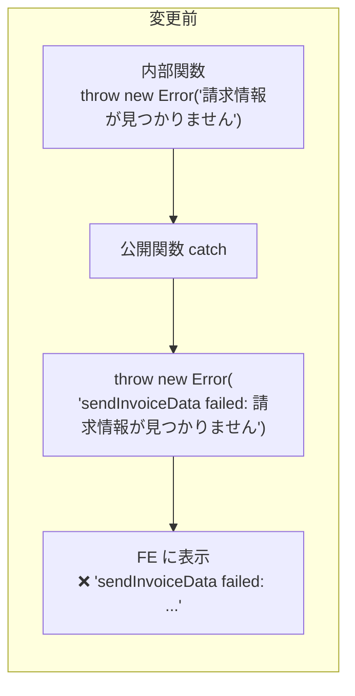
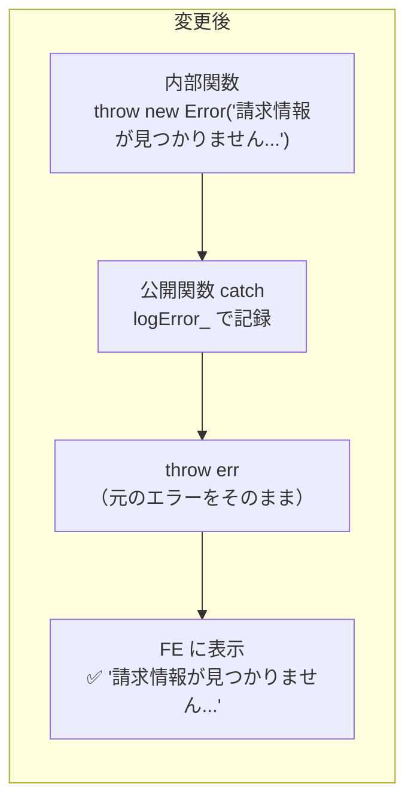
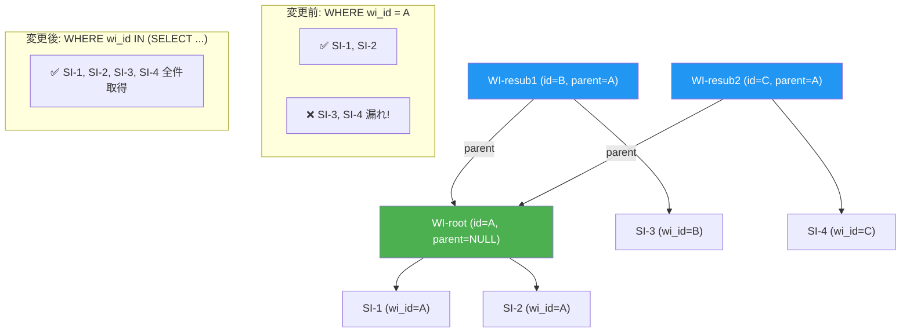
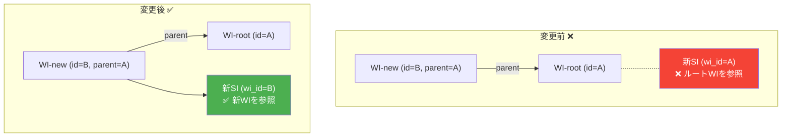
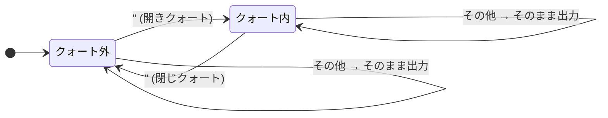

# PR 作業まとめ: データ登録の欠落部分の修正とエラーメッセージの文言修正

**ブランチ**: `feature/error-message-fix`
**PR**: [#30](https://github.com/USEN-PAY-Products/connect-wholesale-gas-poc/pull/30)
**対象ファイル**: `be_invoice.js` / `be_csv_mapper.js` / `be_server.js` / `db_bq_query.js` / `fe_js.html`

---

## 変更カテゴリ一覧

| # | カテゴリ | 対象ファイル | 概要 |
|---|----------|-------------|------|
| 1 | エラーメッセージの文言修正 | be_invoice.js, be_csv_mapper.js, be_server.js | 内部情報を含むエラーメッセージをユーザー向けに書き換え |
| 2 | エラー再 throw の改善 | be_invoice.js, be_server.js | `throw new Error('xxx failed: ' + err.message)` → `throw err` に統一 |
| 3 | UNAUTHORIZED 判定の安全化 | be_server.js, fe_js.html | `indexOf('UNAUTHORIZED')` → `startsWith('UNAUTHORIZED:')` |
| 4 | WI チェーン対応（`wholesaler_invoice_id IN (...)` 化） | be_invoice.js, be_csv_mapper.js, db_bq_query.js | 再送信2回目以降で旧 SI/WI が検索漏れする問題を修正 |
| 5 | 新 SI の `wholesaler_invoice_id` 参照先修正 | be_invoice.js, be_csv_mapper.js | `parentInvoiceId` → `newWiUuid` に修正 |
| 6 | bulk 再送信の `wholesaler_id` 条件追加 | be_invoice.js, be_csv_mapper.js | UPDATE の WHERE に `AND wholesaler_id = wsId` を追加 |
| 7 | `stripQuotedNewlines` の新規追加 | be_invoice.js, fe_js.html | RFC 4180 準拠の CSV 前処理（クォート内改行をスペースに正規化） |
| 8 | CSV 日付の実在チェック追加 | fe_js.html | `validateCsv` に Date オブジェクトによる日付存在検証を追加 |
| 9 | アップロード画面遷移時のリセット処理追加 | fe_js.html | `#upload` 再表示時に古いエラー表示・データが残る問題を修正 |
| 10 | FE エラーメッセージの文言修正 | fe_js.html | `getCsvFormatRules` 等のエラーメッセージをユーザー向けに統一 |

---

## 1. エラーメッセージの文言修正

### 目的

バックエンドのエラーメッセージが内部実装情報（関数名・変数名・内部 ID）を含んでおり、そのままフロントに表示されていた。ユーザーに不要な技術情報を見せず、具体的な対処法を案内する文言に統一した。

### 変更パターン

| 変更前（例） | 変更後（例） |
|---|---|
| `[buildTransactionSql_] invoiceUuid の形式が不正です: xxx` | `処理中にエラーが発生しました。ページを再読み込みして再度お試しください。` |
| `rawCsvBase64 が空です` | `CSVデータの送信に失敗しました。ファイルを再度選択してアップロードしてください。` |
| `summaryData の形式が不正です` | `送信データに不備があります。ページを再読み込みして再度お試しください。` |
| `最新の wholesaler_invoices が見つかりませんでした: xxx` | `請求情報が見つかりませんでした。ページを再読み込みしてください。` |
| `[CsvMapper] csv_format_rules が新形式ではありません...` | `CSVフォーマットの設定に不備があります。管理者にお問い合わせください。` |
| `mall_code が未設定の customerCode が含まれています: "xxx"` | `顧客コード「xxx」の店舗設定が完了していません。管理者にお問い合わせください。` |

### 方針

- **内部情報**（関数名・パラメータ名・ID値）はエラーメッセージから除去し、`logError_()` でサーバーログに記録
- **ユーザー向けメッセージ**は「何が起きたか」+「どう対処するか」の 2 文構成に統一
- バリデーション系エラーは元のエラー内容をそのまま throw（`throw err`）し、上位の catch で二重ラップしない

---

## 2. エラー再 throw の改善

### 変更前

```javascript
} catch (err) {
  logError_('Invoice', 'sendInvoiceData', err);
  throw new Error('sendInvoiceData failed: ' + err.message);
}
```

### 変更後

```javascript
} catch (err) {
  logError_('Invoice', 'sendInvoiceData', err);
  throw err;
}
```

### 対象関数

`sendInvoiceData` / `resubmitInvoiceData` / `bulkResubmitInvoiceData` / `resubmitWithoutChanges` / `withdrawStoreInvoice` / `undoWithdrawStoreInvoice` / `fetchInvoices` / `fetchInvoiceDetail` / `getInvoiceLinesByStore` / `fetchScheduleData`

### 理由

- 元のエラーメッセージ（ユーザー向けに修正済み）がそのままフロントに伝わるようになる
- `xxx failed:` プレフィックスがフロントに表示されなくなる

### エラー伝搬フロー





---

## 3. UNAUTHORIZED 判定の安全化

### 変更箇所

| ファイル | 変更 |
|---|---|
| `be_server.js` | `String(err.message \|\| '').indexOf('UNAUTHORIZED') !== -1` → `.startsWith('UNAUTHORIZED:')` |
| `fe_js.html` | `msg.indexOf('UNAUTHORIZED') !== -1` → `msg.startsWith('UNAUTHORIZED:')` |

### 理由

`indexOf` だとメッセージ本文に偶然 `UNAUTHORIZED` が含まれる場合に誤判定する。throw 側は全て `'UNAUTHORIZED: ...'` 形式なので、接頭辞判定に統一した。

---

## 4. WI チェーン対応（`wholesaler_invoice_id IN (...)` 化）

### 問題

再送信が 2 回以上行われると WI チェーンが形成される。旧コードでは `wholesaler_invoice_id = @invoice_id` で直接比較していたため、チェーン内の別 WI に紐づく SI が検索・更新の対象から漏れていた。



### 修正内容

以下のパターンで WI チェーン全体を検索するサブクエリに置き換えた：

```sql
-- 変更前
WHERE wholesaler_invoice_id = @invoice_id

-- 変更後
WHERE wholesaler_invoice_id IN (
  SELECT id FROM wholesaler_invoices
  WHERE id = @invoice_id OR wholesaler_invoice_id = @invoice_id
)
```

### 対象箇所

**db_bq_query.js（参照系クエリ 5 箇所）:**
- `fetchInvoicesByWholesaler_` — 請求一覧の SI JOIN
- `fetchStoreInvoicesByParent_` — 詳細画面の SI 取得
- `fetchStoreInvoiceForWithdraw_` — 取下げ事前検証
- `fetchTargetStoreInvoiceAmounts_` — 再送信時の旧 SI 金額取得
- `fetchActionRequiredMallCodes_` — 要対応加盟店コード取得
- `fetchStoreInvoiceMallCode_` — SI の mall_code 取得

**be_invoice.js（UPDATE / 取下げ系 4 箇所）:**
- `buildResubmitTransactionSql_` — 単体再送信の旧 SI 無効化
- `buildBulkResubmitTransactionSql_` — 一括再送信の ①差し戻し / ②否認 無効化
- `withdrawStoreInvoice` — 取下げ UPDATE
- `undoWithdrawStoreInvoice` — 取下げ取消 UPDATE
- `resubmitWithoutChanges` — 変更なし再請求 UPDATE

**be_csv_mapper.js（UPDATE 3 箇所）:**
- `buildMappedResubmitTransactionSql_` — 単体再送信
- `buildMappedBulkResubmitTransactionSql_` — 一括再送信 ①②

---

## 5. 新 SI の `wholesaler_invoice_id` 参照先修正

### 問題

再送信で INSERT する新 SI の `wholesaler_invoice_id` が `parentInvoiceId`（ルート WI の ID）を参照していた。正しくは新しく作成する WI の `newWiUuid` を参照すべき。



### 対象箇所（3 箇所 × 2 ファイル = 6 箇所）

| ファイル | 関数 | 変更 |
|---|---|---|
| be_invoice.js | `buildResubmitTransactionSql_` | `parentInvoiceId` → `newWiUuid` |
| be_invoice.js | `buildBulkResubmitTransactionSql_` | 同上 |
| be_csv_mapper.js | `buildMappedResubmitTransactionSql_` | 同上 |
| be_csv_mapper.js | `buildMappedBulkResubmitTransactionSql_` | 同上 |

---

## 6. bulk 再送信の `wholesaler_id` 条件追加

### 問題

一括再送信の `is_latest = FALSE` UPDATE が `wholesaler_invoice_id IN (...)` のみで `wholesaler_id` 条件がなく、入力値の取り違えや改ざん時に他卸の `store_invoices` まで更新対象になり得た。

### 修正

①差し戻し / ②否認の UPDATE に `AND wholesaler_id = <wsId>` を追加。

### 対象箇所

| ファイル | 関数 |
|---|---|
| be_invoice.js | `buildBulkResubmitTransactionSql_` ① / ② |
| be_csv_mapper.js | `buildMappedBulkResubmitTransactionSql_` ① / ② |

※ 単体再送信（`buildResubmitTransactionSql_` / `buildMappedResubmitTransactionSql_`）は元々 `AND wholesaler_id = wsId` が存在。

---

## 7. `stripQuotedNewlines` の新規追加

### 目的

RFC 4180 に準拠し、CSV のクォート内改行（LF / CR / CRLF）をスペースに置換する前処理関数を追加。後段の `split('\n')` で行が壊れるのを防ぐ。

### 状態遷移



### 実装ポイント

- **`""` エスケープ対応**: `inQuote` が `true` のとき `""` を検出したら 2 文字まとめて出力し、クォート状態をトグルしない
- **CRLF 正規化**: `\r\n` はスペース 1 つに正規化（`\r` の時点でスペース出力 + `i++` で `\n` スキップ）
- **パフォーマンス**: 配列 `push` + `join` で $O(n)$（文字列 `+=` の潜在的 $O(n^2)$ を回避）
- **コーディング規約準拠**: `const` / `let` を使用（`var` 不使用）

### 呼び出し箇所

| ファイル | 呼び出し元 |
|---|---|
| be_invoice.js | `validateTaxAdjustment_()` 内で `csvText` に適用 |
| fe_js.html | `handleFile()` の `decodeBuffer_()` 直後に適用（2 箇所：通常アップロード / モーダル内再アップロード） |

---

## 8. CSV 日付の実在チェック追加

### 変更箇所

`fe_js.html` の `validateCsv()` 内、`case 'date'` ブロック

### 変更前

正規表現による形式チェックのみ。`2024/02/30` のような存在しない日付は素通り。

### 変更後

形式チェック通過後に `Date` オブジェクトで実在検証を追加：

```javascript
const dt = new Date(0);
dt.setUTCFullYear(y, m - 1, d);
if (dt.getUTCFullYear() !== y || dt.getUTCMonth() !== m - 1 || dt.getUTCDate() !== d) {
  // 存在しない日付
}
```

- `setUTCFullYear` を使用して年 0〜99 の 1900 オフセット問題を回避
- UTC ベースでタイムゾーン影響を排除

---

## 9. アップロード画面遷移時のリセット処理追加

### 問題

エラー後に一覧へ戻り、再度アップロード画面（`#upload`）を開いた際に、前回のエラー表示やファイル情報が残っていた。

### 修正

`navigate()` の `targetId === 'pageUpload'` 分岐に以下のリセット処理を追加：

- `resetDropZone()` でドロップゾーンを初期状態に
- エラーカード・アラートリスト・ファイル情報を非表示に
- `rawCsvBase64` / `utf8CsvBase64` / `parsedData` をクリア
- `sessionStorage` から `shiire_parsedData` を削除

---

## 10. FE エラーメッセージの文言修正

### 対象

`fe_js.html` の `getCsvFormatRules()` 内のエラーメッセージ

### 変更パターン

| 変更前 | 変更後 |
|---|---|
| `[getCsvFormatRules] csv_format_rules.columns[0].index が不正です: ...` | `CSVフォーマットの設定に不備があります。管理者にお問い合わせください。` |

技術的な詳細は `console.error()` に出力し、ユーザー向けメッセージは統一。
