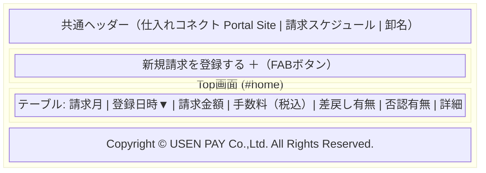
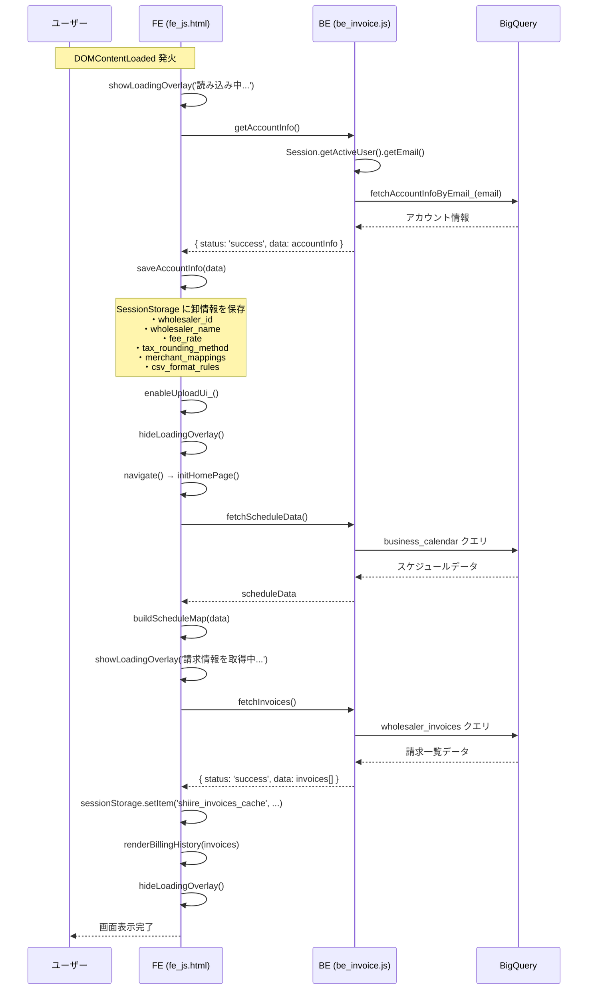
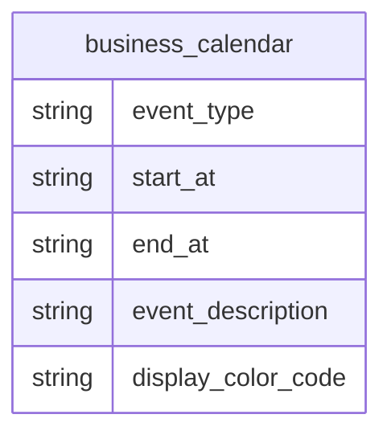
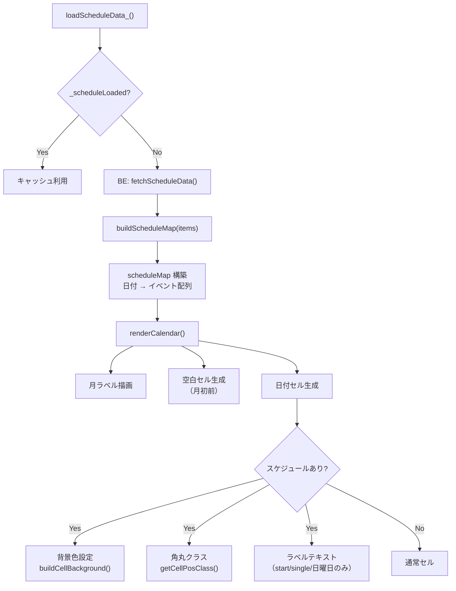
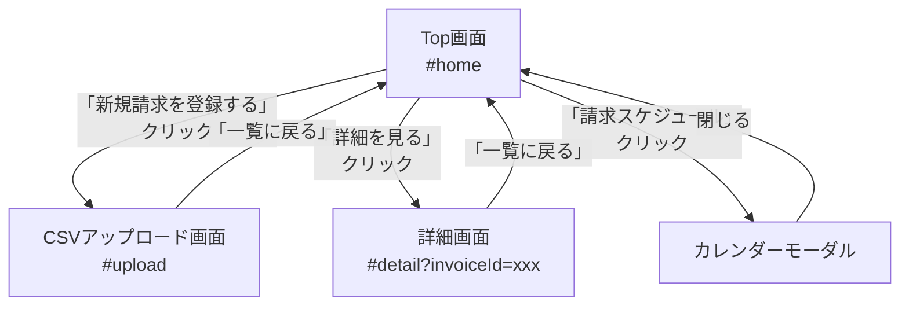

# Top画面（ホーム画面）仕様書

## 1. 概要

Top画面は、卸事業者がログイン後最初に表示されるメイン画面です。  
新規請求の登録へのナビゲーションと、過去の請求履歴一覧の確認を提供します。

### 画面URL

```
#home（デフォルトルート）
```

### 対応ファイル

| ファイル | 役割 |
|---------|------|
| `fe_page_home.html` | HTML テンプレート |
| `fe_js.html` | 描画ロジック（`initHomePage()`, `renderBillingHistory()` 等） |
| `fe_css.html` | スタイル定義 |
| `be_invoice.js` | バックエンド API（`fetchInvoices()`, `fetchScheduleData()`） |
| `db_bq_query.js` | BigQuery クエリ関数 |

---

## 2. 画面構成



---

## 3. 画面要素の詳細

### 3.1 請求の登録セクション

| 要素 | 仕様 |
|------|------|
| セクションタイトル | 「請求の登録」（`h2.home-section-title`） |
| 新規登録ボタン | 「新規請求を登録する ＋」（`a.btn.btn-fab`） |
| 遷移先 | `#upload`（CSVアップロード画面） |

### 3.2 請求履歴一覧セクション

| 要素 | 仕様 |
|------|------|
| セクションタイトル | 「請求履歴一覧」（`h2.home-section-title`） |
| テーブルID | `billingHistoryTable` |
| テーブルbodyID | `billingHistoryBody`（JSで動的生成） |
| 空の場合 | 「請求履歴がありません。」と表示 |

#### テーブルカラム定義

| # | カラム名 | データソース | 表示形式 | 備考 |
|---|---------|-------------|---------|------|
| 1 | 請求月 | `wholesaler_invoice_date` | `YYYY年M月` | 先頭ゼロなし |
| 2 | 登録日時 | `created_at` | `YYYY/MM/DD HH:MM` | ソート可能（▼アイコン） |
| 3 | 請求金額 | `wholesaler_total_amount` | `999,999円` | ロケール書式 |
| 4 | 手数料（税込） | `invoice_fee_amount` | `999,999円` | |
| 5 | 差戻し有無 | `has_resubmit` | バッジ表示 | `1` → 差戻し有（赤系）, `0` → 差戻し無 |
| 6 | 否認有無 | `has_denial` | バッジ表示 | `1` → 否認有（赤系）, `0` → 否認無 |
| 7 | 操作 | - | 「詳細を見る >」ボタン | `#detail?invoiceId=xxx` へ遷移 |

#### ステータスバッジ

| 値 | 表示 | CSSクラス |
|----|------|----------|
| `has_resubmit = 1` | `↺ 差戻し有` | `badge--resubmit` |
| `has_resubmit = 0` | `差戻し無` | `badge--none` |
| `has_denial = 1` | `⊖ 否認有` | `badge--denial` |
| `has_denial = 0` | `否認無` | `badge--none` |

---

## 4. 初期化シーケンス



---

## 5. データフロー

```mermaid
flowchart LR
    subgraph Backend ["バックエンド (GAS)"]
        FI["fetchInvoices()"]
        FS["fetchScheduleData()"]
    end

    subgraph BQ ["BigQuery"]
        WI["wholesaler_invoices"]
        BC["business_calendar"]
    end

    subgraph Frontend ["フロントエンド"]
        IHP["initHomePage()"]
        RBH["renderBillingHistory()"]
        RC["renderCalendar()"]
        SS["sessionStorage<br/>shiire_invoices_cache"]
    end

    IHP -->|google.script.run| FI
    IHP -->|google.script.run| FS
    FI --> WI
    FS --> BC
    WI -->|invoices[]| RBH
    BC -->|scheduleData[]| RC
    RBH --> SS
```

---

## 6. カレンダーモーダル

### 6.1 概要

ヘッダーの「📅 請求スケジュール」ボタンから開くモーダルダイアログ。  
Top画面と詳細画面のみで表示される。

### 6.2 機能

| 機能 | 仕様 |
|------|------|
| 月ナビゲーション | `<` `>` ボタンで前月・翌月に移動 |
| 月選択パネル | カレンダーアイコンクリックで年月選択パネルを表示（4×3グリッド） |
| 年ナビゲーション | 月選択パネル内で `<` `>` で年を移動 |
| 日付セル | スケジュールがある日は背景色を表示 |
| 複数スケジュール | 同一日に複数イベントがある場合、均等分割の `linear-gradient` で表示 |
| イベントラベル | イベント開始日 or 週の先頭（日曜日）にラベルテキストを表示 |
| 今日の強調 | `cal-cell--today` クラスで当日をハイライト |
| 閉じる | ×ボタン、オーバーレイクリック、Escキー |
| フォーカストラップ | Tab / Shift+Tab をモーダル内に閉じ込め |
| アクセシビリティ | `role="dialog"` `aria-modal="true"` |

### 6.3 スケジュールデータ構造



### 6.4 カレンダー描画フロー



---

## 7. 画面遷移



---

## 8. 状態管理

| 変数名 | 型 | 用途 |
|--------|------|------|
| `homeInitialized` | `boolean` | 初期化済みフラグ（再描画防止） |
| `calYear` | `number` | カレンダー表示中の年 |
| `calMonth` | `number` | カレンダー表示中の月（0始まり） |
| `scheduleMap` | `Object` | スケジュールデータのキャッシュ（`日付文字列 → イベント配列`） |
| `_scheduleLoaded` | `boolean` | スケジュールデータ取得済みフラグ |
| `_rawScheduleItems` | `Array` | 取得したスケジュール生データ |

### SessionStorage キー

| キー | 内容 | 用途 |
|------|------|------|
| `shiire_invoices_cache` | 請求一覧データ（JSON） | アップロード画面での当月重複チェック |

---

## 9. BE API 仕様

### 9.1 `fetchInvoices()`

| 項目 | 内容 |
|------|------|
| 引数 | なし（ログインユーザーから `wholesaler_id` を自動確定） |
| 戻り値 | `{ status: 'success', data: invoices[] }` |
| IDOR保護 | `wholesaler_id` によるフィルタリング |

#### レスポンス構造

```javascript
{
  data: [
    {
      wholesaler_invoice_id: "uuid",
      root_id: "uuid",                          // 元の請求ID（再送信時に使用）
      wholesaler_invoice_date: "2026-03-01",     // 請求月
      created_at: "2026/03/15 10:30:00",         // 登録日時
      wholesaler_total_amount: 170000,           // 請求金額
      invoice_fee_amount: 5000,                  // 手数料（税込）
      has_resubmit: 1,                           // 差戻し有無（0 or 1）
      has_denial: 0,                             // 否認有無（0 or 1）
    }
  ]
}
```

### 9.2 `fetchScheduleData()`

| 項目 | 内容 |
|------|------|
| 引数 | なし |
| 戻り値 | `{ status: 'success', data: scheduleItems[] }` |
| データソース | `business_calendar` テーブル |

---

## 10. エラーハンドリング

| エラーケース | 挙動 |
|-------------|------|
| `getAccountInfo()` 失敗（UNAUTHORIZED） | `#error` 画面に遷移（アカウント未登録メッセージ） |
| `getAccountInfo()` 失敗（システムエラー） | `#error` 画面に遷移（再読み込みメッセージ） |
| `fetchInvoices()` 失敗 | 空の請求履歴を表示（UIが空白にならないよう `renderBillingHistory([])` を呼ぶ） |
| `fetchScheduleData()` 失敗 | `_scheduleLoaded = false` にして再取得可能にする |
| GAS環境外での実行 | `#error` 画面に遷移（環境エラーメッセージ） |
