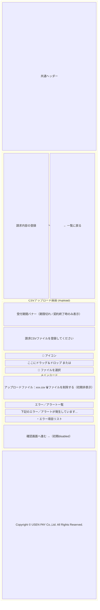
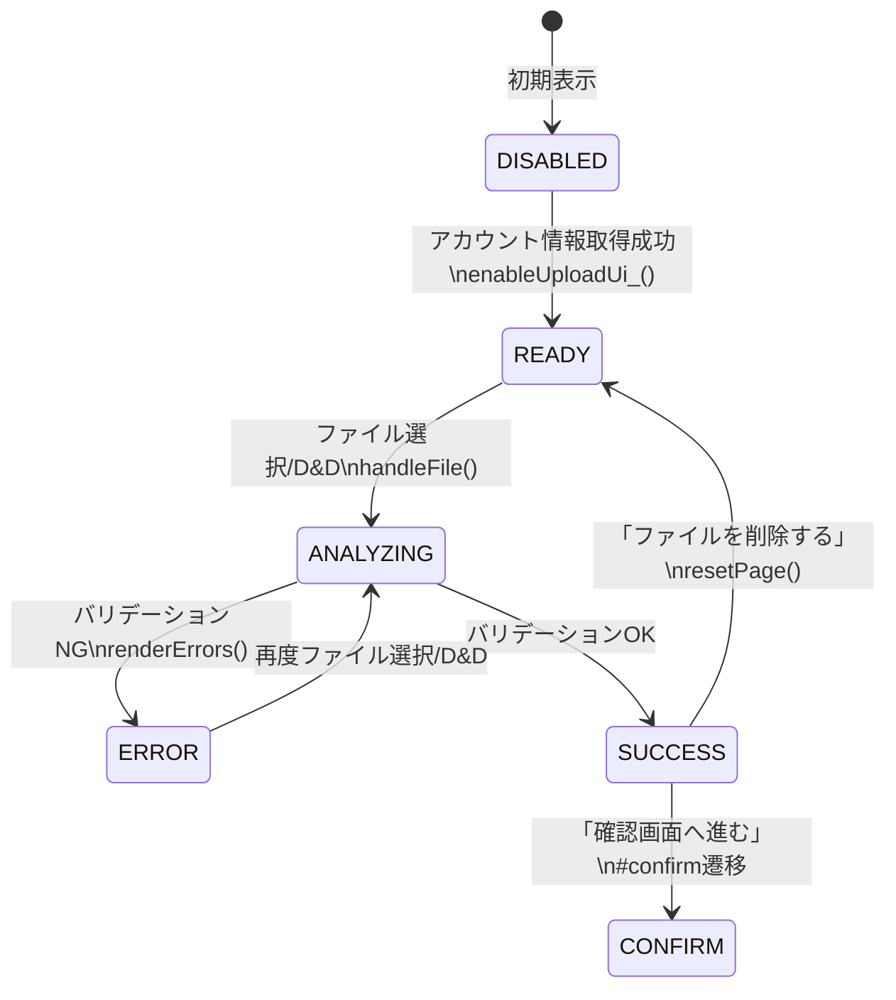
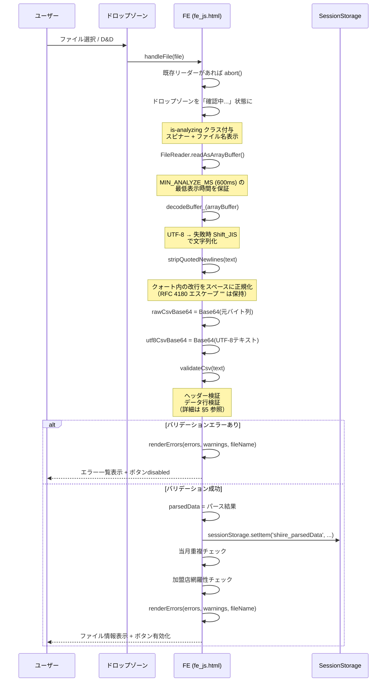
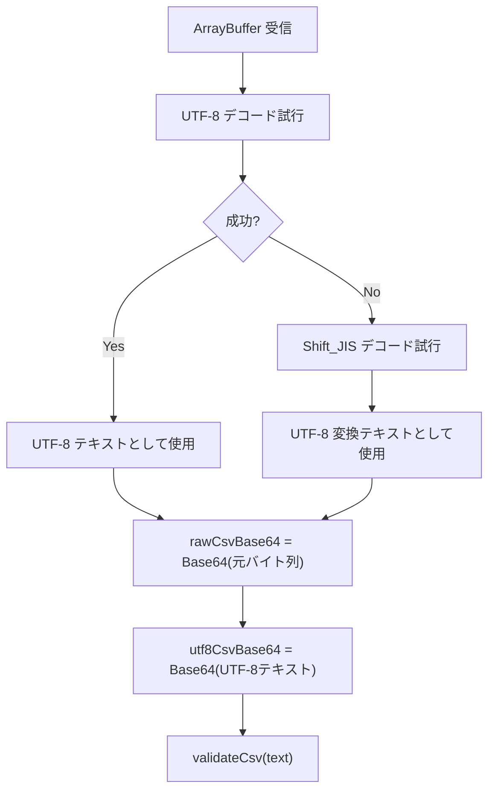
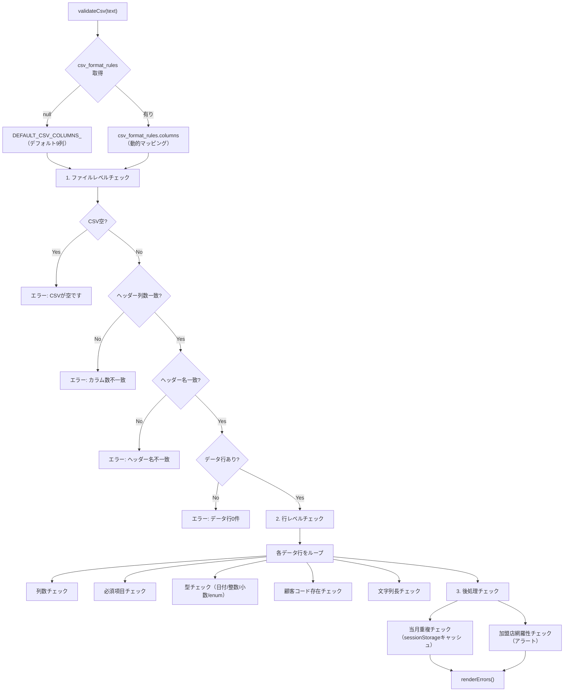
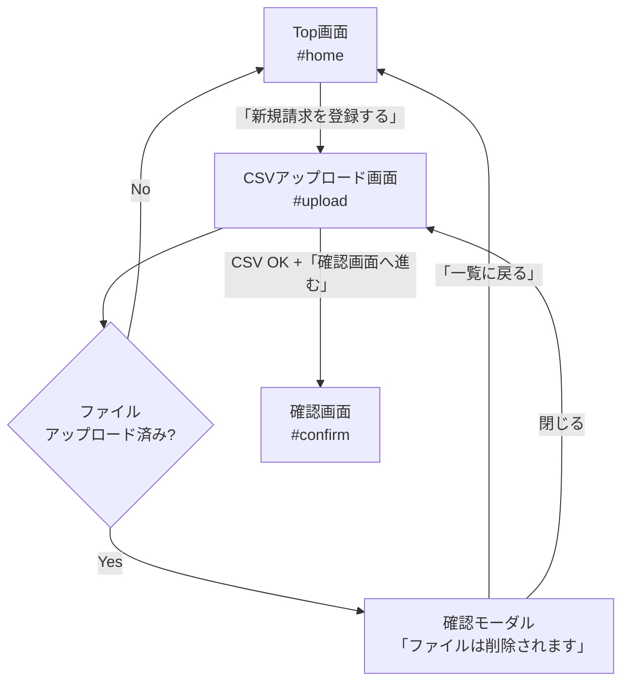
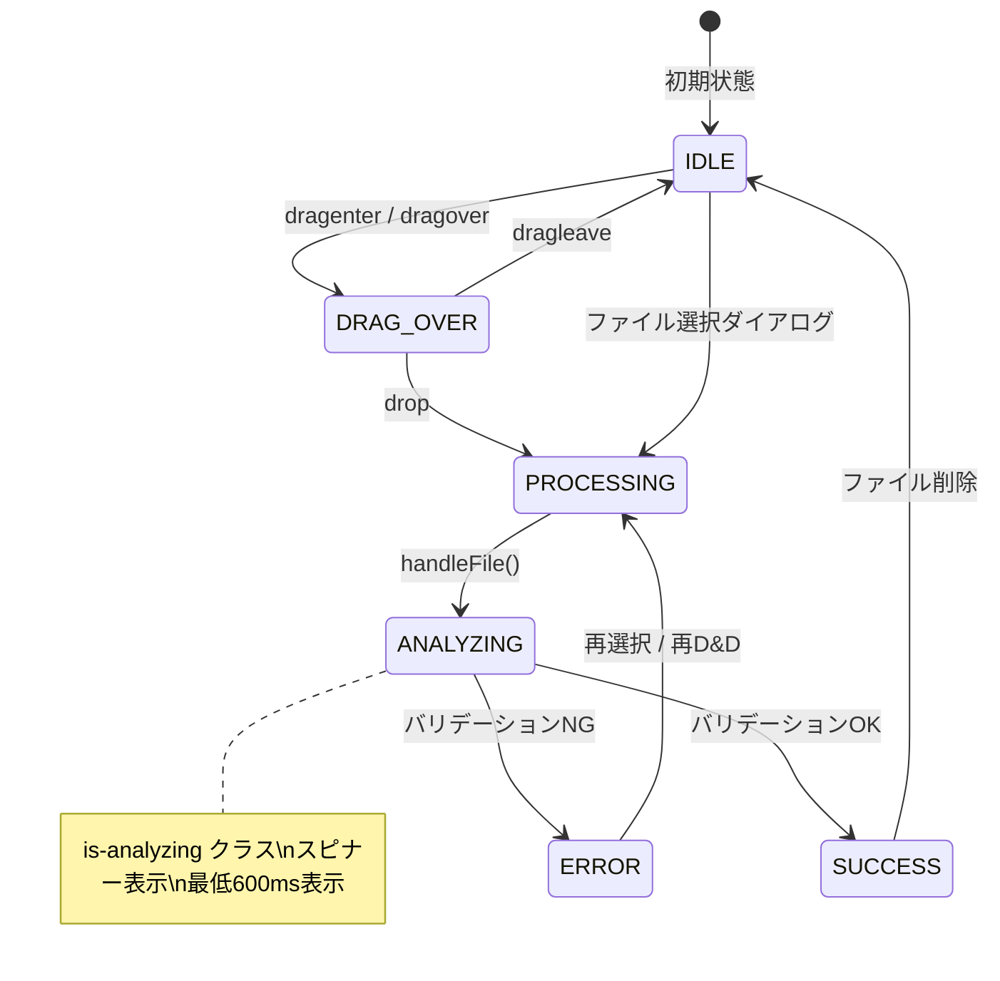

# CSVアップロード画面仕様書

## 1. 概要

CSVアップロード画面は、卸事業者が新規請求データをCSVファイルでアップロードするための画面です。  
ファイルのドラッグ＆ドロップまたはファイル選択ダイアログからCSVを読み込み、フロントエンドでバリデーションを実行した後、確認画面へ遷移します。

### 画面URL

```
#upload
```

### 対応ファイル

| ファイル | 役割 |
|---------|------|
| `fe_page_csv_upload.html` | HTML テンプレート |
| `fe_js.html` | アップロードロジック（`handleFile()`, `validateCsv()`, `renderErrors()` 等） |
| `fe_css.html` | スタイル定義 |

---

## 2. 画面構成



---

## 3. 画面要素の詳細

### 3.1 ページヘッダー

| 要素 | 仕様 |
|------|------|
| タイトル | 「請求内容の登録」（`h1.page-title`） |
| 戻るボタン | 「← 一覧に戻る」（`#btnUploadBack`） |
| 戻る時の挙動 | ファイルアップロード済みの場合は確認モーダルを表示 |

### 3.2 ドロップゾーン
| 要素 | ID | 仕様 |
|------|-----|------|
| ドロップゾーン | `dropZone` | D&D対応エリア。初期状態は `is-disabled`（アカウント取得完了後に有効化） |
| ファイル選択ボタン | `btnSelectFile` | クリックで隠し `<input type="file">` を起動 |
| ファイルインプット | `fileInput` | `accept=".csv"`, 初期 `hidden` `disabled` |

#### ドロップゾーンの状態遷移



### 3.3 ファイル情報エリア

| 要素 | ID | 仕様 |
|------|-----|------|
| コンテナ | `fileInfo` | 初期 `hidden`。CSV読み込み成功時に表示 |
| ラベル | - | 「アップロードファイル：」 |
| ファイル名 | `fileInfoName` | ファイル名を表示 |
| 削除ボタン | `btnFileDelete` | 「🗑 ファイルを削除する」→ `resetPage()` 実行 |

### 3.4 エラー／アラート一覧

| 要素 | ID | 仕様 |
|------|-----|------|
| コンテナ | `errorCard` | 初期 `hidden`。エラー/アラート発生時に表示 |
| タイトル | - | 「エラー／アラート一覧」 |
| 説明文 | - | 「下記のエラー／アラートが発生しています。確認の上、CSVファイルを修正し、再度アップロードしてください。」 |
| リスト | `alertList` | エラー/アラート項目を `<li>` で動的生成 |

#### エラーとアラートの区別

| 種別 | CSSクラス | アイコン | ボタンへの影響 |
|------|----------|--------|--------------|
| エラー | `alert-item--error` | 🔴 `fa-circle` | `disabled` にする（送信不可） |
| アラート | `alert-item--warn` | ⚠️ `fa-triangle-exclamation` | 影響なし（送信可能） |

表示順: **エラー → アラート** の順にリスト表示。

### 3.5 受付期間バナー（期限切れ・契約終了）

アップロード画面表示時に `checkUploadDeadline_()` が実行され、以下のいずれかに該当する場合は赤いバナーを表示し、アップロードUI（ドロップゾーン・ファイル選択・確認画面ボタン）を無効化する。

| 要素 | ID | 仕様 |
|------|-----|------|
| バナー | `uploadDeadlineBanner` | 初期 `hidden`。`role="alert"` |
| メッセージ | `uploadDeadlineMessage` | 状況に応じたテキストをJSで設定 |

#### ブロック条件

| # | 条件 | メッセージ |
|---|------|-----------|
| 1 | 契約終了卸（`shiire_wholesaler_status === 'end'`） | 仕入れコネクトの契約が終了しているため、新規請求ができません。 |
| 2 | 請求書受付期間超過（`WHOLESALER_INVOICE_STORAGE` イベントの `end_at` < 本日） | 請求書受付期間（YYYY-MM-DD まで）を過ぎているため、アップロードできません。 |

- 受付期間は SessionStorage のスケジュールキャッシュ（`shiire_schedule_cache_{wholesalerId}_{YYYY-MM}`）を参照し、`event_type === 'WHOLESALER_INVOICE_STORAGE'` の `end_at` と JST 基準の本日を比較する。
- スケジュールキャッシュが後から更新された場合も `checkUploadDeadline_()` を再実行して期限判定をやり直す。

### 3.6 アクションボタン
| 要素 | ID | 仕様 |
|------|-----|------|
| 確認画面ボタン | `btnToConfirm` | 「確認画面へ進む →」。初期 `disabled`。バリデーションOK時に有効化 |

### 3.7 一覧に戻る確認モーダル

| 要素 | ID | 仕様 |
|------|-----|------|
| オーバーレイ | `uploadBackModal` | `role="dialog"` `aria-modal="true"` |
| タイトル | `uploadBackModalTitle` | 「⚠ 一覧に戻ると登録作業中のファイルは削除されますがよろしいですか？」 |
| 説明文 | `uploadBackModalDesc` | 「アップロードされたファイルは、まだ登録が完了していません…」 |
| 確定ボタン | `uploadBackModalOk` | 「← 一覧に戻る」→ `#home` へ遷移 |
| 閉じるボタン | `uploadBackModalClose` | モーダルを閉じる |

---

## 4. CSVファイル処理フロー

### 4.1 ファイル読み込みシーケンス



### 4.2 エンコーディング処理



---

## 5. バリデーション

### 5.1 バリデーションフロー



### 5.2 ファイルレベルチェック

| # | チェック内容 | エラーメッセージ |
|---|------------|----------------|
| 1 | CSVが空（行が0件） | `CSVが空です。ヘッダー行とデータ行を含むCSVをアップロードしてください` |
| 2 | ヘッダー行の列数不一致 | `ヘッダー行のカラム数が正しくありません（N列 / 期待値: M列）` |
| 3 | ヘッダー名の不一致（列ごと） | `ヘッダー行 N列目: "期待値" が期待されますが "実際値" になっています` |
| 4 | データ行が0件（ヘッダーのみ） | `CSVにデータ行が1件もありません` |

### 5.3 行レベルチェック

| # | チェック内容 | 対象列 | エラーメッセージ |
|---|------------|-------|----------------|
| 5 | 列数不一致 | 行全体 | `N行目: カラム数が正しくありません（N列 / 期待値: M列）` |
| 6 | 必須項目が空 | `required: true` 全列 | `N行目: "列名" は必須項目です` |
| 7 | 日付形式不正 | `type: 'date'` | `N行目: "列名" はYYYY-MM-DD形式（例: 2026-03-01）で入力してください`（format に応じてヒント文を切替） |
| 8 | 存在しない日付 | `type: 'date'` | `N行目: "列名" に存在しない日付が含まれています（X）`（例: 2月30日・13月を検出） |
| 9 | 未対応日付フォーマット | `type: 'date'` | `N行目: "列名" の日付フォーマット "X" は未対応です…` |
| 10 | 整数型に非整数値 | `type: 'integer'` | `N行目: "列名" は整数で入力してください` |
| 11 | 小数型に非数値 | `type: 'decimal'` | `N行目: "列名" は数値（小数第3位まで）で入力してください` |
| 12 | enum制約違反 | `enum` 定義列 | `N行目: "列名" は 8 または 10 を入力してください` |
| 13 | 文字列長超過 | `max_length` 定義列 | `N行目: "列名" はN文字以内で入力してください` |
| 14 | 顧客コード空 | `customer_code` | `N行目: "ヘッダー名" は必須です` |
| 15 | 顧客コード無効 | `customer_code` | `N行目: "ヘッダー名" の値 "X" は請求可能なヘッダー名ではありません` |

> 📌 `customer_code` のメンバーシップ判定は `shiire_merchant_mappings`（`store_status=end` の加盟店は除外済み）と照合する。契約終了（`store_status=end`）の加盟店コードは新規請求では「請求可能な加盟店コードではありません」エラーになる（再請求は詳細画面から可能）。
> 📌 詳細画面の再請求モーダルからの呼び出しは `validateCsv(text, { skipCustomerCodeCheck: true })` でメンバーシップ判定をスキップする（必須チェックは維持）。

### 5.4 後処理チェック

| # | チェック内容 | 種別 | エラーメッセージ |
|---|------------|------|----------------|
| 14 | 当月重複アップロード | エラー（ブロッキング） | `今月は既に新規の請求書が登録されています。差し戻しや否認の修正版のアップロードは詳細画面からアップロードしてください。` |
| 15 | 加盟店網羅性不足 | アラート（非ブロッキング） | `〇〇店の請求明細がありません。` |

### 5.5 日付フォーマット対応表

| format値 | 正規表現 | 例 |
|----------|---------|-----|
| `YYYY-MM-DD`（デフォルト） | `/^\d{4}-\d{2}-\d{2}$/` | 2026-03-01 |
| `YYYYMMDD` | `/^\d{8}$/` | 20260301 |
| `YYYY/MM/DD` | `/^\d{4}\/\d{2}\/\d{2}$/` | 2026/03/01 |

### 5.6 デフォルトCSVカラム定義

`csv_format_rules` が未設定の卸に使用される固定9列フォーマット（`DEFAULT_CSV_COLUMNS_`）。

| 列番号 | ヘッダー名 | system_column | 型 | 必須 | 追加制約 |
|--------|-----------|--------------|-----|------|---------|
| 0 | 顧客コード | `customer_code` | string | ✅ | `merchant_mappings` との照合 |
| 1 | 日付 | `transaction_date` | date | ✅ | YYYY-MM-DD 形式 |
| 2 | 品目 | `item_name` | string | ✅ | |
| 3 | 数量 | `quantity` | decimal | ✅ | 小数可 |
| 4 | 単価 | `unit_price` | decimal | ✅ | |
| 5 | 税率区分(%) | `tax_rate` | integer | ✅ | `enum: [8, 10]` |
| 6 | 請求金額（税抜） | `amount_ex_tax` | integer | ✅ | |
| 7 | 消費税 | `tax_amount` | integer | ✅ | |
| 8 | 備考 | `invoice_detail_remark` | string | ❌ | |

---

## 6. 状態管理

### メモリ内変数

| 変数名 | 型 | 用途 |
|--------|------|------|
| `rawCsvBase64` | `string\|null` | 生CSV（Shift-JIS等）の Base64。BE送信用 |
| `utf8CsvBase64` | `string\|null` | UTF-8変換CSVの Base64。BQ Load Job用 |
| `parsedData` | `Array\|null` | CSVパース結果の行配列 |
| `_analyzeTimer` | `number\|null` | 最低分析表示時間タイマーID |
| `_currentReader` | `FileReader\|null` | 実行中のFileReaderインスタンス |

### SessionStorage

| キー | 内容 |
|------|------|
| `shiire_parsedData` | パース結果（確認画面での表示用） |
| `shiire_invoices_cache` | 請求一覧キャッシュ（当月重複チェック用） |
| `shiire_merchant_mappings` | 加盟店マッピング（顧客コード検証用、`store_status=end` 除外済み） |
| `shiire_csv_format_rules` | CSVフォーマットルール |
| `shiire_tax_rounding_method` | 消費税丸め方式（`floor` / `ceil` / `round`） |
| `shiire_wholesaler_status` | 卸ステータス（`active` / `end`）。`end` は受付期間バナーで新規請求をブロック |
| `shiire_schedule_cache_{wholesalerId}_{YYYY-MM}` | 当月スケジュールキャッシュ（受付期間チェック用） |

---

## 7. 画面遷移



---

## 8. D&D インタラクション


