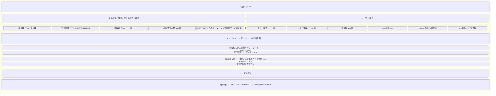
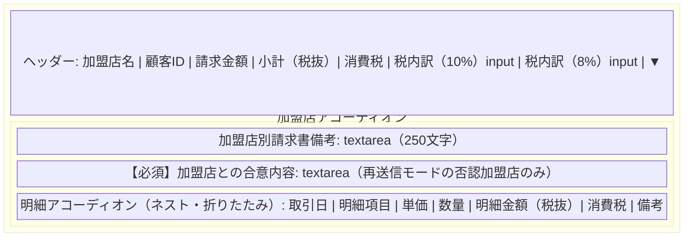
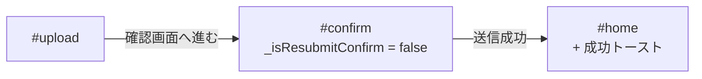
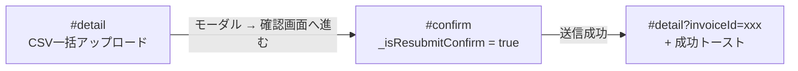
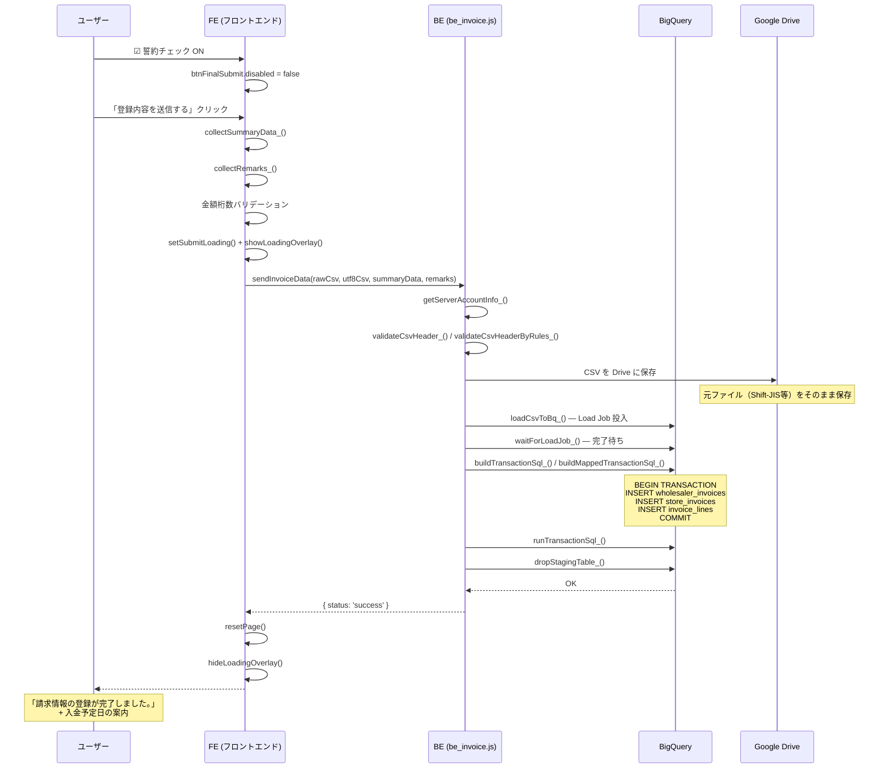
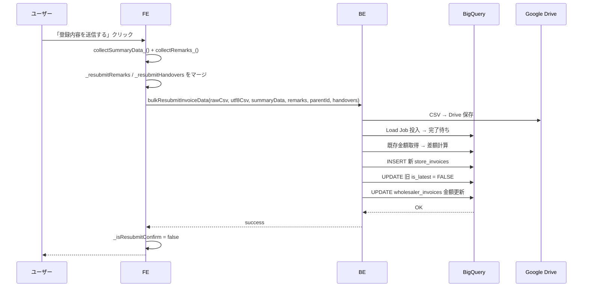

# 確認画面（アップロード後）仕様書

## 1. 概要

確認画面は、CSVアップロード後にパースされた請求データの内容を確認し、最終的にバックエンドへ送信するための画面です。  
請求基本情報のサマリー表示、加盟店別の明細確認、消費税の手動編集、誓約チェックを経て送信します。  
新規登録と一括再送信（差戻し・否認対応）の2モードで動作します。

### 画面URL

```
#confirm
```

### 対応ファイル

| ファイル | 役割 |
|---------|------|
| `fe_page_confirm.html` | HTML テンプレート |
| `fe_js_confirm.html` | 描画ロジック（`renderConfirmPage()`, `collectSummaryData_()` 等） |
| `fe_css.html` | スタイル定義 |
| `be_invoice.js` | バックエンド API（`sendInvoiceData()`, `bulkResubmitInvoiceData()`） |
| `be_csv_mapper.js` | CSVマッピング・BQ SQL生成 |
| `db_bq_connection.js` | BigQuery 接続・Load Job |

---

## 2. 画面構成



---

## 3. 画面要素の詳細

### 3.1 ページヘッダー

| 要素 | 仕様 |
|------|------|
| タイトル | 新規: 「請求内容の確認」 / 再送信: 「再請求内容の確認」 |
| 一覧に戻るボタン | 「← 一覧に戻る」（`#btnConfirmBack`, `#btnConfirmBackBottom`）→ キャンセル確認モーダル（`cancelModal`）を表示 |
| キャンセルボタン | サマリーカード内の「キャンセル」（`#btnConfirmCancel`）→ アップロード/詳細画面へ戻るモーダル（`confirmCancelToUploadModal`）を表示 |

### 3.2 請求基本情報カード

#### 左側: 基本情報

| 項目 | ID | データソース |
|------|-----|-------------|
| 請求月 | `summaryBillingMonth` | 現在日時から `YYYY年M月` を生成 |
| 登録日時 | `summaryRegisteredAt` | 現在日時から `YYYY/MM/DD HH:MM` を生成 |
| 手数料率 | `summaryFeeRate` | SessionStorage `shiire_invoice_fee_rate` |
| 手数料額 | `summaryFee` | `Math.floor(合計税込 × 手数料率 / 100)` |
| 振込予定金額 | `summaryTransfer` | `合計税込 − 手数料額` |
| USEN PAY社コメント | `confirmHandoverText` | 再送信モード時のみ表示（readonly textarea） |

#### 右側: 請求金額

| 項目 | ID | 計算方法 |
|------|-----|---------|
| 合計（税込） | `summaryAmountInTax` | `小計（税抜）+ 消費税` |
| 小計（税抜） | `summaryAmountExTax` | 全行の `amount_ex_tax` 合計 |
| 消費税 | `summaryTax` | 全行の `roundTax(amount_ex_tax × tax_rate / 100)` 合計 |
| 10%対象小計（税抜） | `summaryExTax10` | `tax_rate = 10` の行の `amount_ex_tax` 合計 |
| 10%対象消費税 | `summaryTax10` | `tax_rate = 10` の行の消費税合計 |
| 8%対象小計（税抜） | `summaryExTax8` | `tax_rate = 8` の行の `amount_ex_tax` 合計 |
| 8%対象消費税 | `summaryTax8` | `tax_rate = 8` の行の消費税合計 |

#### 手数料ツールチップ

| 要素 | 仕様 |
|------|------|
| アイコン | `fa-circle-question`（ターコイズ `#00A7B8`） |
| 表示内容 | 手数料の説明テキスト + 問い合わせ先 |
| 位置制御 | マウスホバーで上/下に動的表示。画面端はみ出し補正あり |

### 3.3 加盟店別詳細

| 要素 | 仕様 |
|------|------|
| 説明文 | 「消費税内訳」は自動計算。誤りがある場合は金額を変更可能 |
| コンテナ | `confirmStoreList`（JSで動的生成） |

#### 加盟店アコーディオンの構成



### 3.4 消費税の手動編集（税内訳 10% / 8%）

消費税の編集は**加盟店単位の「税内訳（10%）」「税内訳（8%）」の2つの入力欄**で行う。明細行ごとの消費税は読み取り専用の表示。

| 仕様 | 詳細 |
|------|------|
| 編集対象 | 加盟店ヘッダー行の「税内訳（10%）」「税内訳（8%）」（`data-field="tax10"` / `tax8"` の `<input type="number">`） |
| 初期値 | 各税率の `roundTax(amount_ex_tax × tax_rate / 100)` 合計（`data-orig` に保持） |
| 編集時の動作 | 加盟店の消費税・請求金額（税込）を再計算 → 卸全体のサマリー（合計・小計・消費税・手数料・振込予定額）も再計算 |
| 丸め方式 | SessionStorage `shiire_tax_rounding_method`（`floor` / `ceil` / `round`） |
| 桁数上限 | NUMERIC(11) = 11桁（`99999999999`）。超過入力は自動でクランプ |
| **±1円バリデーション** | 計算値（`data-orig`）からの差が ±1円を超えると入力欄にエラー（`※±1円まで`）を表示し、送信不可。送信時にも `加盟店 XXX: 税内訳（10%）の調整は±1円までです（現在: X円 / 計算値: Y円）` で再チェック |

### 3.5 送信エリア

| 要素 | ID | 仕様 |
|------|-----|------|
| 誓約チェックボックス | `checkConfirm` | 未チェック時は送信ボタン `disabled` |
| 送信ボタン | `btnFinalSubmit` | 初期 `disabled`。チェック ON で有効化 |

---

## 4. 動作モード

### 4.1 新規登録モード



- ページタイトル: 「請求内容の確認」
- USEN PAY社コメント欄: 非表示
- 送信先API: `sendInvoiceData(rawCsv, utf8Csv, summaryData, remarks)`

### 4.2 一括再送信モード



- ページタイトル: 「再請求内容の確認」
- USEN PAY社コメント欄: 表示（`handover_matter` の内容）
- 送信先API: `bulkResubmitInvoiceData(rawCsv, utf8Csv, summaryData, remarks, parentId, handovers)`
- キャンセル時の遷移先: `#detail?invoiceId={parentInvoiceId}`（アップロード画面ではなく詳細画面へ戻る）

---

## 5. 送信シーケンス

### 5.1 新規登録



### 5.2 一括再送信



---

## 6. バリデーション（送信前チェック）

### 6.1 データ存在チェック

| チェック | 条件 | 挙動 |
|---------|------|------|
| parsedData なし | `!parsedData \|\| parsedData.length === 0` | アップロード画面へリダイレクト |
| CSVバイナリなし | `!rawCsvBase64 \|\| !utf8CsvBase64` | トースト表示「CSVを再度アップロードしてください」 |

### 6.2 備考文字数チェック

| チェック | 上限 | エラーメッセージ |
|---------|------|----------------|
| 加盟店別請求書備考 | 250文字 | 「加盟店別請求書備考は250文字以内で入力してください。」 |

### 6.3 税内訳 ±1円チェック

加盟店ごとの「税内訳（10%）」「税内訳（8%）」 input の値が、自動計算値（`data-orig`）から ±1円を超えて調整されていないかを送信時に検証する。

| 対象 | 上限 | エラーメッセージ |
|------|------|----------------|
| 税内訳（10%）/（8%） | 計算値±1円 | `加盟店 XXX: 税内訳（10%）の調整は±1円までです（現在: X円 / 計算値: Y円）` |

### 6.4 再送信モード: 合意内容（handover）必須チェック

一括再送信モードでは、否認加盟店（`_resubmitDisputedCodes`）の「【必須】加盟店との合意内容」（`confirm-handover-input`）が未入力の場合は送信をブロックする。

| チェック | 挙動 |
|---------|------|
| 合意内容未入力 | 未入力の textarea に `※ 加盟店との合意内容を記入してください` を表示。該当アコーディオンを自動展開し、最初のエラー箇所へスクロール + フォーカス |

### 6.5 金額桁数チェック

| 対象 | テーブル | 上限桁数 |
|------|---------|---------|
| 加盟店 total_amount | `store_invoices` | 12桁 |
| 加盟店 subtotal_amount | `store_invoices` | 12桁 |
| 加盟店 tax_amount | `store_invoices` | 11桁 |
| 加盟店 standard_tax_amount | `store_invoices` | 11桁 |
| 加盟店 reduced_tax_amount | `store_invoices` | 11桁 |
| 卸全体 total/fee/payment | `wholesaler_invoices` | 25桁 |

---

## 7. キャンセル確認モーダル

確認画面には「一覧に戻る」と「キャンセル」の2つの離脱動線があり、それぞれ別のモーダルを表示する。

### 7.1 一覧に戻る確認モーダル（`cancelModal`）

「← 一覧に戻る」（`btnConfirmBack` / `btnConfirmBackBottom`）から起動。確定すると `#home`（再送信モードは `#detail?invoiceId=xxx`）へ遷移する。

| 要素 | ID | 仕様 |
|------|-----|------|
| オーバーレイ | `cancelModal` | `role="dialog"` `aria-modal="true"` |
| タイトル | `cancelModalTitle` | 「⚠ 一覧に戻ると登録作業中のファイルは削除されますがよろしいですか？」 |
| 説明文 | `cancelModalDesc` | 「…一覧画面に戻ると、編集中のデータは削除されます。」 |
| 確定ボタン | `cancelModalOk` | 「← 一覧に戻る」→ データリセット + 遷移 |
| 閉じるボタン | `cancelModalClose` | モーダルを閉じるのみ |

### 7.2 アップロード/詳細画面へ戻るモーダル（`confirmCancelToUploadModal`）

サマリーカード内の「キャンセル」（`btnConfirmCancel`）から起動。モードに応じて文言と遷移先を切り替える。

| モード | タイトル | 確定ボタン | 遷移先 |
|------|--------|----------|--------|
| 新規登録 | 登録をキャンセルしてアップロード画面に戻りますか？ | アップロード画面に戻る | `#upload` |
| 再送信 | 登録をキャンセルして詳細画面に戻りますか？ | 詳細画面に戻る | `#detail?invoiceId=xxx` |

| 要素 | ID |
|------|-----|
| オーバーレイ | `confirmCancelToUploadModal` |
| タイトル | `confirmCancelToUploadTitle` |
| 説明文 | `confirmCancelToUploadDesc` |
| 確定ボタン | `confirmCancelToUploadOk` |
| 閉じるボタン | `confirmCancelToUploadClose` |

両モーダルとも オーバーレイクリック / Escキー / フォーカストラップ（Tab / Shift+Tab）に対応。

---

## 8. 状態管理

### グローバル変数

| 変数名 | 型 | 用途 |
|--------|------|------|
| `_isResubmitConfirm` | `boolean` | 一括再送信モードフラグ |
| `_resubmitParentInvoiceId` | `string\|null` | 再送信時の親請求ID |
| `_resubmitRemarks` | `Object` | 再送信時の備考 `{ customerCode: value }` |
| `_resubmitHandovers` | `Object` | 再送信時の合意事項 `{ customerCode: value }` |
| `_resubmitDisputedCodes` | `string[]` | 再送信時に合意内容を必須とする否認加盟店の顧客コード |

---

## 9. 成功時のトースト表示

### 新規登録成功時

| 項目 | 内容 |
|------|------|
| タイトル | 「請求情報の登録が完了しました。」 |
| 本文 | 「請求のご登録ありがとうございます。本請求は、本サービスの運営チームによる内容確認ののち、加盟店側での内容確認が行われます。運営からの差戻、もしくは加盟店からの否認が発生した場合は再度対応をお願いします。」 |
| 自動非表示 | 8秒 |

### 一括再送信成功時

| 項目 | 内容 |
|------|------|
| タイトル | 「再請求の登録が完了しました。」 |
| 自動非表示 | 8秒 |

---

## 10. BE API 仕様

### 10.1 `sendInvoiceData(rawCsvBase64, utf8CsvBase64, summaryData, remarks)`

| 項目 | 内容 |
|------|------|
| 引数 | 生CSVのBase64, UTF-8 CSVのBase64, 金額サマリー, 備考マップ |
| 処理 | CSV保存 → BQ Load → トランザクション → Staging削除 |
| トランザクション | `wholesaler_invoices` INSERT + `store_invoices` INSERT + `invoice_lines` INSERT |
| IDOR保護 | サーバー側で `wholesaler_id` を確定（引数から渡さない） |

### 10.2 `bulkResubmitInvoiceData(rawCsv, utf8Csv, summaryData, remarks, parentId, handovers)`

| 項目 | 内容 |
|------|------|
| 追加引数 | `parentInvoiceId`, `handovers`（合意事項マップ） |
| 処理 | 新 `store_invoices` INSERT + 旧 `is_latest = FALSE` + `wholesaler_invoices` 金額差額更新 |
