# 詳細画面（登録済み請求内容）仕様書

## 1. 概要

詳細画面は、卸事業者が登録済みの請求内容を確認・管理するための画面です。  
親請求（`wholesaler_invoices`）の基本情報と、配下の加盟店別請求（`store_invoices`）の一覧をアコーディオン形式で表示します。  
差し戻し・否認された請求に対しては、CSV再アップロード・変更なし再請求・請求取り下げの操作が可能です。

### 画面URL

```
#detail?invoiceId={wholesaler_invoice_id}
```

### 対応ファイル

| ファイル | 役割 |
|---------|------|
| `fe_page_detail.html` | HTML テンプレート |
| `fe_js.html` | 描画ロジック・イベントハンドラ |
| `fe_css.html` | スタイル定義 |
| `be_invoice.js` | バックエンド API |
| `db_bq_query.js` | BigQuery クエリ関数 |

---

## 2. 画面構成

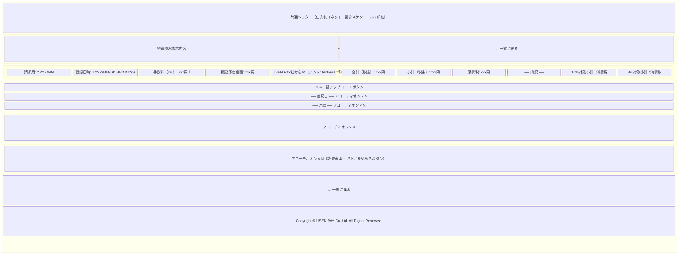
```mermaid
block-beta
  columns 1
  block:page["詳細画面 (#detail?invoiceId=xxx)"]
    columns 1
    header["共通ヘッダー（仕入れコネクト | 請求スケジュール | 卸名）"]
    block:pageHeader["ページヘッダー"]
      columns 2
      title["登録済み請求内容"]
      back["← 一覧に戻る"]
    end
    block:summary["請求基本情報カード"]
      columns 2
      block:left["基本情報"]
        l1["請求月: YYYY/MM"]
        l2["登録日時: YYYY/MM/DD HH:MM:SS"]
        l3["手数料（x%）: xxx円 ℹ️"]
        l4["振込予定金額: xxx円"]
        l5["USEN PAY社からのコメント: textarea"]
      end
      block:right["請求金額"]
        r1["合計（税込）: xxx円"]
        r2["小計（税抜）: xxx円"]
        r3["消費税: xxx円"]
        r4["── 内訳 ──"]
        r5["10%対象小計 / 消費税"]
        r6["8%対象小計 / 消費税"]
      end
    end
    block:action["⚠ 要対応の請求一覧（差戻し/否認がある場合のみ表示）"]
      columns 1
      csvBtn["CSV一括アップロード ボタン"]
      a1["── 差戻し ── アコーディオン × N"]
      a2["── 否認 ── アコーディオン × N"]
    end
    block:normal["確認中・承認済みの請求一覧"]
      n1["アコーディオン × N"]
    end
    block:withdrawn["取下げ済みの請求一覧（取下げがある場合のみ表示）"]
      w1["アコーディオン × N（読取専用 + 取下げをやめるボタン）"]
    end
    bottomBack["← 一覧に戻る"]
    footer["Copyright © USEN PAY Co.,Ltd. All Rights Reserved."]
  end
```

---

## 3. ステータス体系

### 3.1 ステータスバッジ一覧

| `backoffice_review_status` | `invoice_status` | バッジ表示 | CSSクラス | セクション |
|---------------------------|-----------------|-----------|----------|-----------|
| - | `WITHDRAWN` | ✓ 取下げ済 | `badge--withdrawn` | 取下げ済み |
| `MERCHANT_CONFIRMATION_REQUESTED` | `DISPUTED` | ⊖ 否認差戻 | `badge--disputed` | 否認 |
| `RETURNED` | `DISPUTED` | ⊖ 否認差戻 | `badge--disputed` | 否認 |
| `PENDING_REVIEW` | `DISPUTED` | 未検収 | `badge--pending` | 否認（「再請求済み」バッジ表示） |
| `RETURNED` | その他（非DISPUTED） | ↺ 差戻し | `badge--returned` | 差戻し |
| `MERCHANT_CONFIRMATION_REQUESTED` | `APPROVED` | ✓ 承認 | `badge--approved` | 確認中・承認済み |
| `MERCHANT_CONFIRMATION_REQUESTED` | `PENDING_CONFIRMATION` | 確認中 | `badge--requested` | 確認中・承認済み |
| その他 | その他 | 未検収 | `badge--pending` | 確認中・承認済み |

### 3.2 セクション振り分けロジック

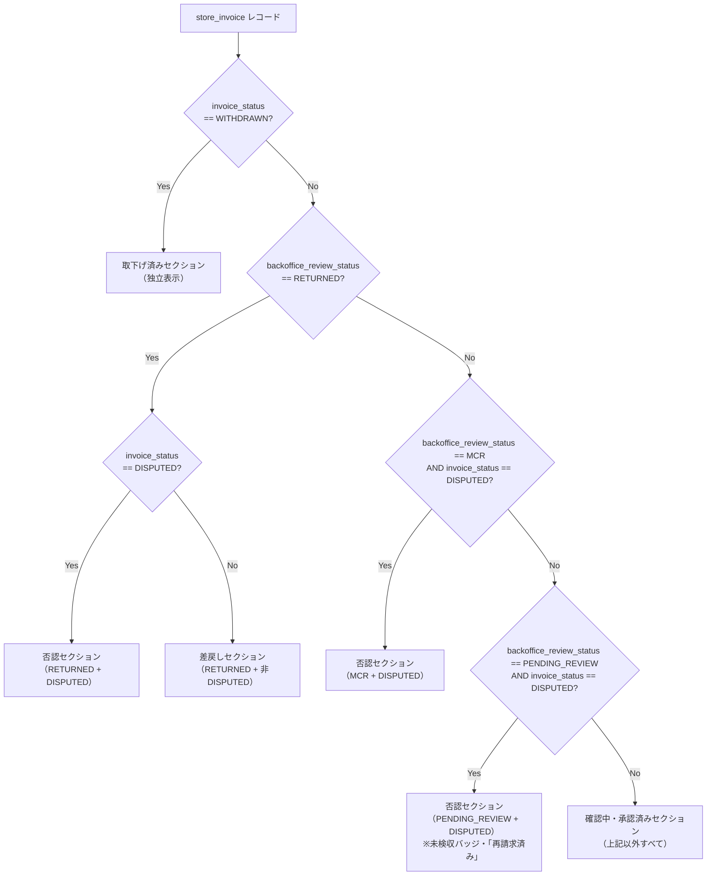
```mermaid
flowchart TD
    A["store_invoice レコード"] --> B{"invoice_status\n== WITHDRAWN?"}
    B -- Yes --> W["取下げ済みセクション\n（独立表示）"]
    B -- No --> C{"backoffice_review_status\n== RETURNED?"}
    C -- Yes --> D{"invoice_status\n== DISPUTED?"}
    D -- Yes --> E["否認セクション\n（RETURNED + DISPUTED）"]
    D -- No --> F["差戻しセクション\n（RETURNED + 非DISPUTED）"]
    C -- No --> G{"backoffice_review_status == MCR\nAND invoice_status == DISPUTED?"}
    G -- Yes --> H["否認セクション\n（MCR + DISPUTED）"]
    G -- No --> I{"backoffice_review_status == PENDING_REVIEW\nAND invoice_status == DISPUTED?"}
    I -- Yes --> J["否認セクション\n（PENDING_REVIEW + DISPUTED）\n※未検収バッジ・「再請求済み」"]
    I -- No --> K["確認中・承認済みセクション\n（上記以外すべて）"]
```

---

## 4. 加盟店アコーディオンの構成

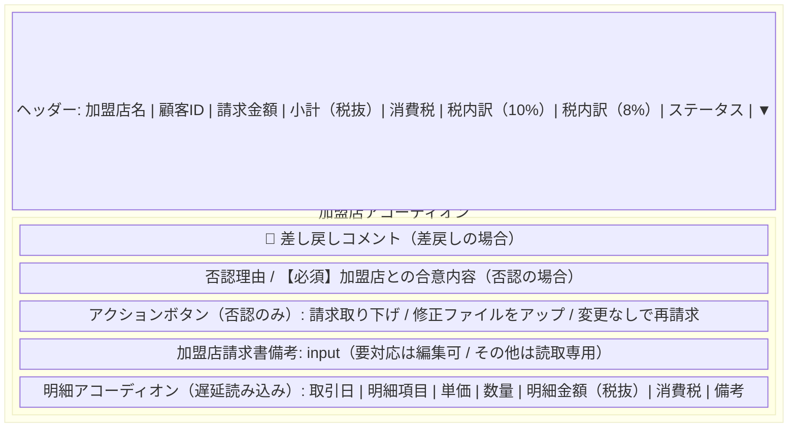
```mermaid
block-beta
  columns 1
  block:accordion["加盟店アコーディオン"]
    columns 1
    accHeader["ヘッダー: 加盟店名 | 顧客ID | 請求金額 | 小計（税抜）| 消費税 | 税内訳（10%）| 税内訳（8%）| ステータス | ▼"]
    block:body["ボディ（展開時）"]
      columns 1
      b1["💬 差し戻しコメント（差戻しの場合）"]
      b2["否認理由 / 【必須】加盟店との合意内容（否認の場合）"]
      b3["アクションボタン（否認のみ）: 請求取り下げ / 修正ファイルをアップ / 変更なしで再請求"]
      b4["加盟店請求書備考: input（要対応は編集可 / その他は読取専用）"]
      b5["明細アコーディオン（遅延読み込み）: 取引日 | 明細項目 | 単価 | 数量 | 明細金額（税抜）| 消費税 | 備考"]
    end
  end
```

### アコーディオンの動作

| ステータス | 初期状態 | 追加表示要素 | CSSクラス |
|-----------|---------|------------|----------|
| RETURNED（差戻し、非DISPUTED） | 折りたたみ | 差し戻しコメントバナー + 備考（編集可）。**個別のアクションボタンはなく、CSV一括アップロードで対応** | `store-accordion--returned` |
| DISPUTED（否認） | 折りたたみ | 否認理由 + 【必須】合意内容入力 + アクションボタン群（取り下げ/修正アップ/変更なし再請求） | `store-accordion--returned` |
| DISPUTED かつ PENDING_REVIEW（再請求済み） | 折りたたみ | 合意内容入力欄 + 「✓ 再請求済み」バッジ（アクションボタンは出さない） | `store-accordion--returned` |
| WITHDRAWN（取下げ済み） | 折りたたみ | 合意内容（読取専用）+ 「取下げをやめる」ボタン。備考欄も読取専用 | - |
| その他（確認中・承認・未検収等） | 折りたたみ | 備考は読取専用 | - |

> 📌 個別のアクションボタン（請求取り下げ / 修正ファイルをアップ / 変更なしで再請求）は**否認（DISPUTED）の加盟店のみ**に表示される。差戻し（RETURNED のみ）の加盟店はセクションの「CSV一括アップロード」で対応する。

### 明細データの遅延読み込み

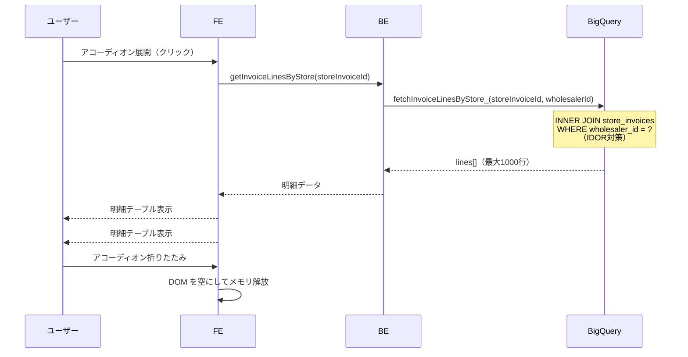
```mermaid
sequenceDiagram
    participant U as ユーザー
    participant FE as FE
    participant BE as BE
    participant BQ as BigQuery

    U->>FE: アコーディオン展開（クリック）
    FE->>BE: getInvoiceLinesByStore(storeInvoiceId)
    BE->>BQ: fetchInvoiceLinesByStore_(storeInvoiceId, wholesalerId)
    Note over BQ: INNER JOIN store_invoices<br/>WHERE wholesaler_id = ?<br/>（IDOR対策）
    BQ-->>BE: lines[]（最大1000行）
    BE-->>FE: 明細データ
    FE-->>U: 明細テーブル表示
    FE-->>U: 明細テーブル表示

    U->>FE: アコーディオン折りたたみ
    FE->>FE: DOM を空にしてメモリ解放
```

---

## 5. ページ読み込みシーケンス

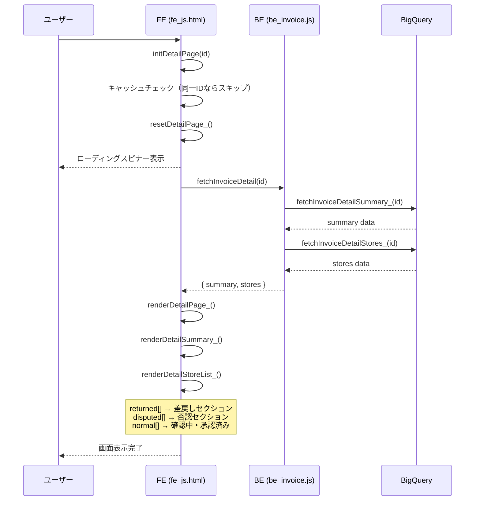
```mermaid
sequenceDiagram
    participant U as ユーザー
    participant FE as FE (fe_js.html)
    participant BE as BE (be_invoice.js)
    participant BQ as BigQuery

    U->>FE: #detail?invoiceId=xxx アクセス
    FE->>FE: initDetailPage(id)
    FE->>FE: キャッシュチェック（同一IDならスキップ）
    FE->>FE: resetDetailPage_()
    FE-->>U: ローディングスピナー表示

    FE->>BE: fetchInvoiceDetail(id)
    BE->>BQ: fetchInvoiceDetailSummary_(id)
    BQ-->>BE: summary data
    BE->>BQ: fetchInvoiceDetailStores_(id)
    BQ-->>BE: stores data
    BE-->>FE: { summary, stores }

    FE->>FE: renderDetailPage_()
    FE->>FE: renderDetailSummary_()
    FE->>FE: renderDetailStoreList_()
    Note over FE: returned[] → 差戻しセクション<br/>disputed[] → 否認セクション<br/>normal[] → 確認中・承認済み
    FE-->>U: 画面表示完了
```

---

## 6. 操作フロー

### 6.1 修正ファイルをアップ（個別リアップロード — モーダル内完結）

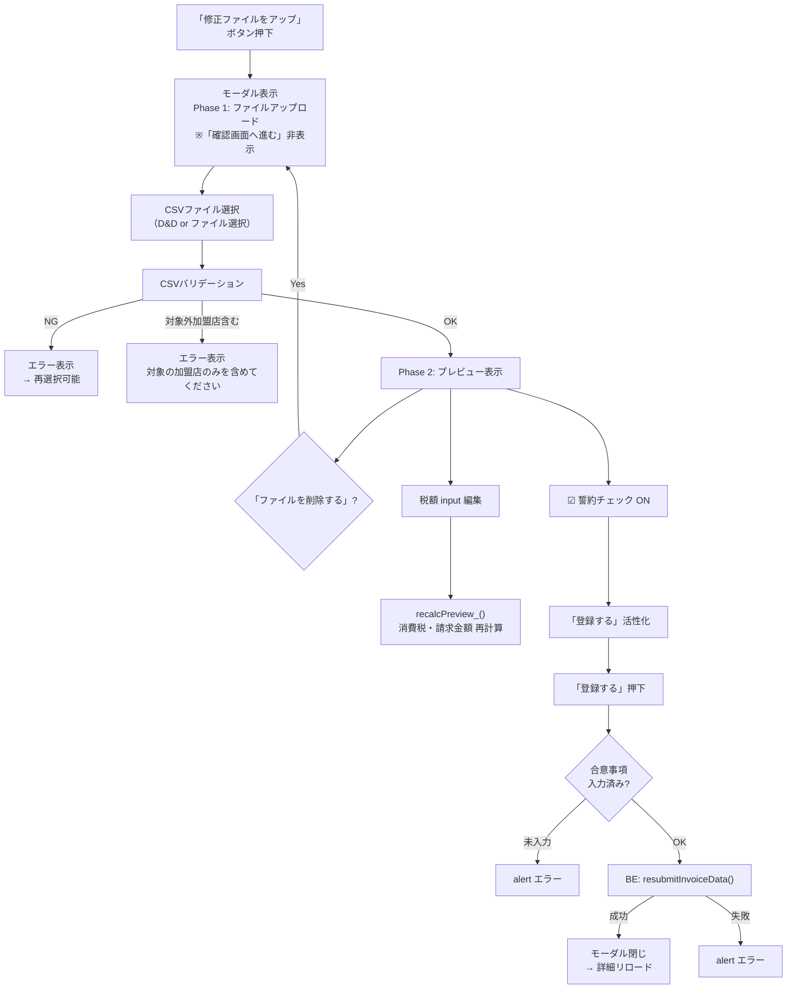
```mermaid
flowchart TD
    START["「修正ファイルをアップ」\nボタン押下"] --> MODAL["モーダル表示\nPhase 1: ファイルアップロード\n※「確認画面へ進む」非表示"]
    MODAL --> CSV["CSVファイル選択\n（D&D or ファイル選択）"]
    CSV --> VALIDATE["CSVバリデーション"]
    VALIDATE -->|NG| ERROR1["エラー表示\n→ 再選択可能"]
    VALIDATE -->|対象外加盟店含む| ERROR2["エラー表示\n対象の加盟店のみを含めてください"]
    VALIDATE -->|OK| PREVIEW["Phase 2: プレビュー表示"]

    PREVIEW --> DELETE{"「ファイルを削除する」?"}
    DELETE -->|Yes| MODAL
    PREVIEW --> TAX_EDIT["税額 input 編集"]
    TAX_EDIT --> RECALC["recalcPreview_()\n消費税・請求金額 再計算"]
    PREVIEW --> OATH["☑ 誓約チェック ON"]
    OATH --> ENABLED["「登録する」活性化"]
    ENABLED --> SUBMIT["「登録する」押下"]
    SUBMIT --> CHECK_HANDOVER{"合意事項\n入力済み?"}
    CHECK_HANDOVER -->|未入力| ALERT_ERR["alert エラー"]
    CHECK_HANDOVER -->|OK| BE_CALL["BE: resubmitInvoiceData()"]
    BE_CALL -->|成功| CLOSE["モーダル閉じ\n→ 詳細リロード"]
    BE_CALL -->|失敗| ALERT_FAIL["alert エラー"]
```

#### 個別リアップロード シーケンス図

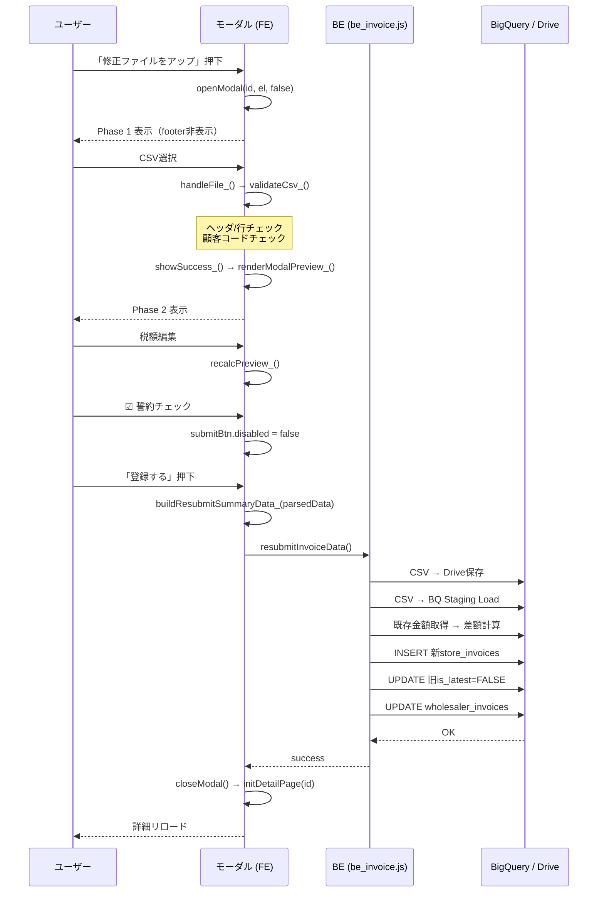
```mermaid
sequenceDiagram
    participant U as ユーザー
    participant M as モーダル (FE)
    participant BE as BE (be_invoice.js)
    participant BQ as BigQuery / Drive

    U->>M: 「修正ファイルをアップ」押下
    M->>M: openModal(id, el, false)
    M-->>U: Phase 1 表示（footer非表示）

    U->>M: CSV選択
    M->>M: handleFile_() → validateCsv_()
    Note over M: ヘッダ/行チェック<br/>顧客コードチェック
    M->>M: showSuccess_() → renderModalPreview_()
    M-->>U: Phase 2 表示

    U->>M: 税額編集
    M->>M: recalcPreview_()

    U->>M: ☑ 誓約チェック
    M->>M: submitBtn.disabled = false

    U->>M: 「登録する」押下
    M->>M: buildResubmitSummaryData_(parsedData)
    M->>BE: resubmitInvoiceData()
    BE->>BQ: CSV → Drive保存
    BE->>BQ: CSV → BQ Staging Load
    BE->>BQ: 既存金額取得 → 差額計算
    BE->>BQ: INSERT 新store_invoices
    BE->>BQ: UPDATE 旧is_latest=FALSE
    BE->>BQ: UPDATE wholesaler_invoices
    BQ-->>BE: OK
    BE-->>M: success
    M->>M: closeModal() → initDetailPage(id)
    M-->>U: 詳細リロード
```

### 6.2 CSV一括アップロード（確認画面経由）

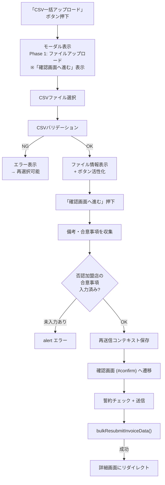
```mermaid
flowchart TD
    START["「CSV一括アップロード」\nボタン押下"] --> MODAL["モーダル表示\nPhase 1: ファイルアップロード\n※「確認画面へ進む」表示"]
    MODAL --> CSV["CSVファイル選択"]
    CSV --> VALIDATE["CSVバリデーション"]
    VALIDATE -->|NG| ERROR["エラー表示\n→ 再選択可能"]
    VALIDATE -->|OK| SELECTED["ファイル情報表示\n+ ボタン活性化"]
    SELECTED --> BTN_CONFIRM["「確認画面へ進む」押下"]
    BTN_CONFIRM --> COLLECT["備考・合意事項を収集"]
    COLLECT --> CHECK{"否認加盟店の\n合意事項\n入力済み?"}
    CHECK -->|未入力あり| ALERT["alert エラー"]
    CHECK -->|OK| SAVE_CTX["再送信コンテキスト保存"]
    SAVE_CTX --> CONFIRM["確認画面 (#confirm) へ遷移"]
    CONFIRM --> REGISTER["誓約チェック + 送信"]
    REGISTER --> BULK_BE["bulkResubmitInvoiceData()"]
    BULK_BE -->|成功| DETAIL["詳細画面にリダイレクト"]
```

### 6.3 変更なしで再請求

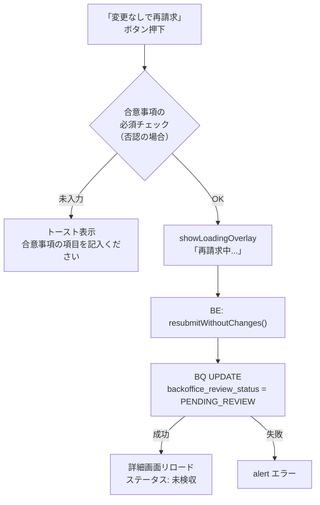
```mermaid
flowchart TD
    START["「変更なしで再請求」\nボタン押下"] --> CHECK{"合意事項の\n必須チェック\n（否認の場合）"}
    CHECK -->|未入力| TOAST["トースト表示\n合意事項の項目を記入ください"]
    CHECK -->|OK| LOADING["showLoadingOverlay\n「再請求中...」"]
    LOADING --> BE["BE: resubmitWithoutChanges()"]
    BE --> BQ_UPDATE["BQ UPDATE\nbackoffice_review_status = PENDING_REVIEW"]
    BQ_UPDATE -->|成功| RELOAD["詳細画面リロード\nステータス: 未検収"]
    BQ_UPDATE -->|失敗| ALERT["alert エラー"]
```

#### 変更なし再請求 シーケンス図

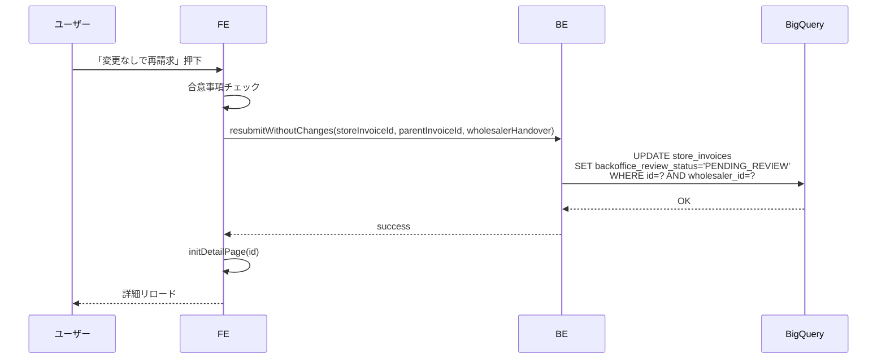
```mermaid
sequenceDiagram
    participant U as ユーザー
    participant FE as FE
    participant BE as BE
    participant BQ as BigQuery

    U->>FE: 「変更なしで再請求」押下
    FE->>FE: 合意事項チェック
    FE->>BE: resubmitWithoutChanges(storeInvoiceId, parentInvoiceId, wholesalerHandover)
    BE->>BQ: UPDATE store_invoices<br/>SET backoffice_review_status='PENDING_REVIEW'<br/>WHERE id=? AND wholesaler_id=?
    BQ-->>BE: OK
    BE-->>FE: success
    FE->>FE: initDetailPage(id)
    FE-->>U: 詳細リロード
```

### 6.4 請求取り下げ

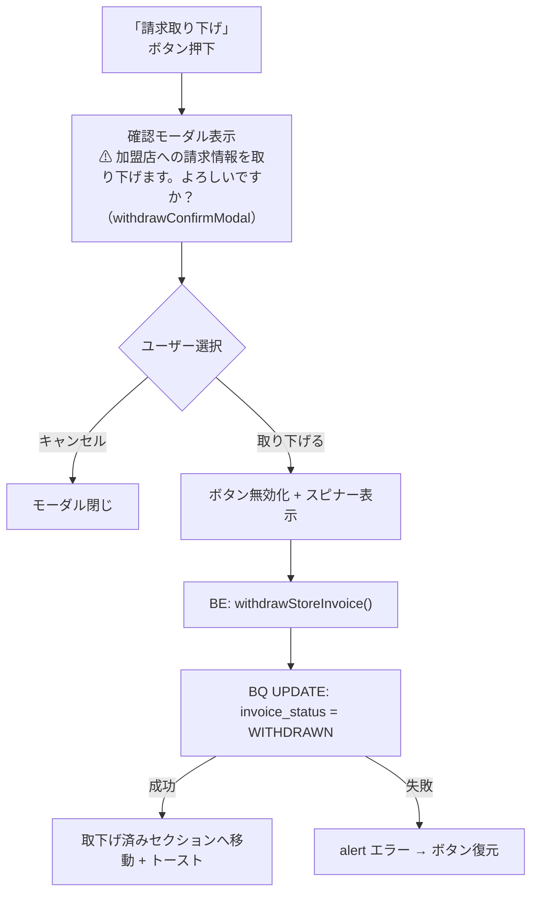
```mermaid
flowchart TD
    START["「請求取り下げ」\nボタン押下"] --> DIALOG["確認モーダル表示\n⚠ 加盟店への請求情報を取り下げます。よろしいですか？\n（withdrawConfirmModal）"]
    DIALOG --> CANCEL{"ユーザー選択"}
    CANCEL -->|キャンセル| CLOSE["モーダル閉じ"]
    CANCEL -->|取り下げる| DISABLE["ボタン無効化 + スピナー表示"]
    DISABLE --> BE["BE: withdrawStoreInvoice()"]
    BE --> BQ["BQ UPDATE: invoice_status = WITHDRAWN"]
    BQ -->|成功| SUCCESS["取下げ済みセクションへ移動 + トースト"]
    BQ -->|失敗| FAIL["alert エラー → ボタン復元"]
```

> 取り下げ確認モーダル（`withdrawConfirmModal`）のボタンは「取り下げる」（`withdrawConfirmOk`・`btn-danger`）/「キャンセル」（`withdrawConfirmCancel`・`btn-outline`）。

#### 取り下げ シーケンス図

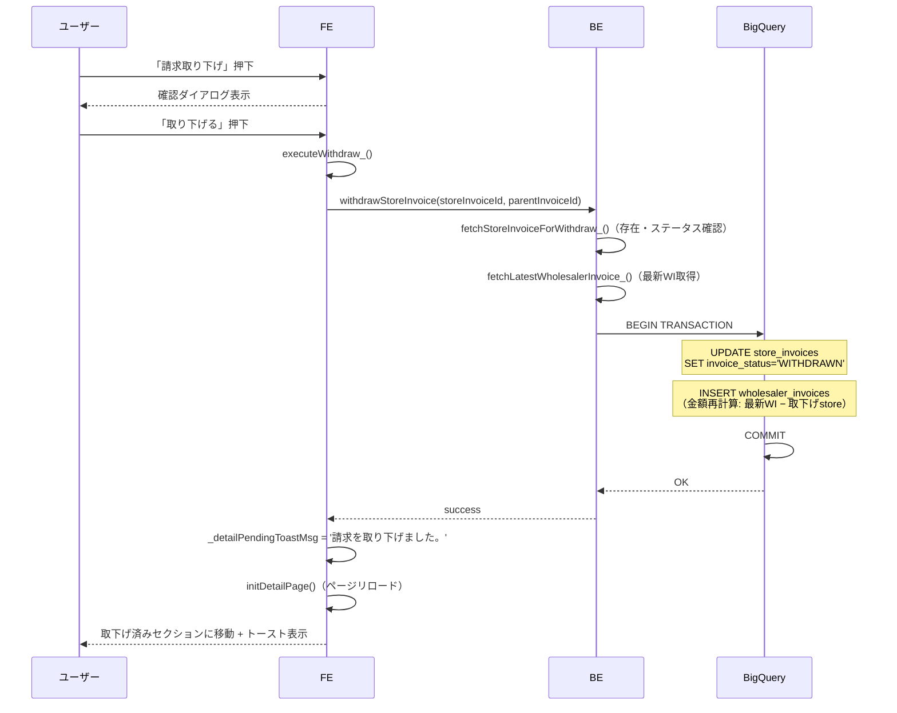
```mermaid
sequenceDiagram
    participant U as ユーザー
    participant FE as FE
    participant BE as BE
    participant BQ as BigQuery

    U->>FE: 「請求取り下げ」押下
    FE-->>U: 確認ダイアログ表示

    U->>FE: 「取り下げる」押下
    FE->>FE: executeWithdraw_()
    FE->>BE: withdrawStoreInvoice(storeInvoiceId, parentInvoiceId)
    BE->>BE: fetchStoreInvoiceForWithdraw_()（存在・ステータス確認）
    BE->>BE: fetchLatestWholesalerInvoice_()（最新WI取得）
    BE->>BQ: BEGIN TRANSACTION
    Note over BQ: UPDATE store_invoices<br/>SET invoice_status='WITHDRAWN'
    Note over BQ: INSERT wholesaler_invoices<br/>（金額再計算: 最新WI − 取下げstore）
    BQ->>BQ: COMMIT
    BQ-->>BE: OK
    BE-->>FE: success
    FE->>FE: _detailPendingToastMsg = '請求を取り下げました。'
    FE->>FE: initDetailPage()（ページリロード）
    FE-->>U: 取下げ済みセクションに移動 + トースト表示
```

### 6.5 取下げの取り消し（WITHDRAWN → DISPUTED に復元）

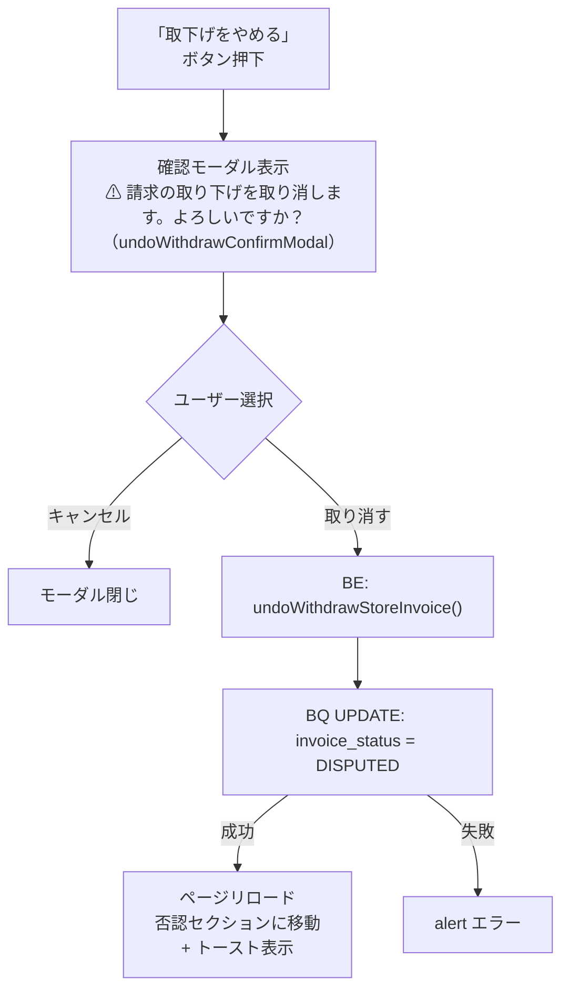
```mermaid
flowchart TD
    START["「取下げをやめる」\nボタン押下"] --> DIALOG["確認モーダル表示\n⚠ 請求の取り下げを取り消します。よろしいですか？\n（undoWithdrawConfirmModal）"]
    DIALOG --> CANCEL{"ユーザー選択"}
    CANCEL -->|キャンセル| CLOSE["モーダル閉じ"]
    CANCEL -->|取り消す| BE["BE: undoWithdrawStoreInvoice()"]
    BE --> BQ["BQ UPDATE: invoice_status = DISPUTED"]
    BQ -->|成功| RELOAD["ページリロード\n否認セクションに移動\n+ トースト表示"]
    BQ -->|失敗| FAIL["alert エラー"]
```

> 取下げ取り消し確認モーダル（`undoWithdrawConfirmModal`）のボタンは「取り消す」（`undoWithdrawConfirmOk`・`btn-danger`）/「キャンセル」（`undoWithdrawConfirmCancel`・`btn-outline`）。アコーディオン内の起動ボタンは「取下げをやめる」。

#### 取下げ取り消し シーケンス図

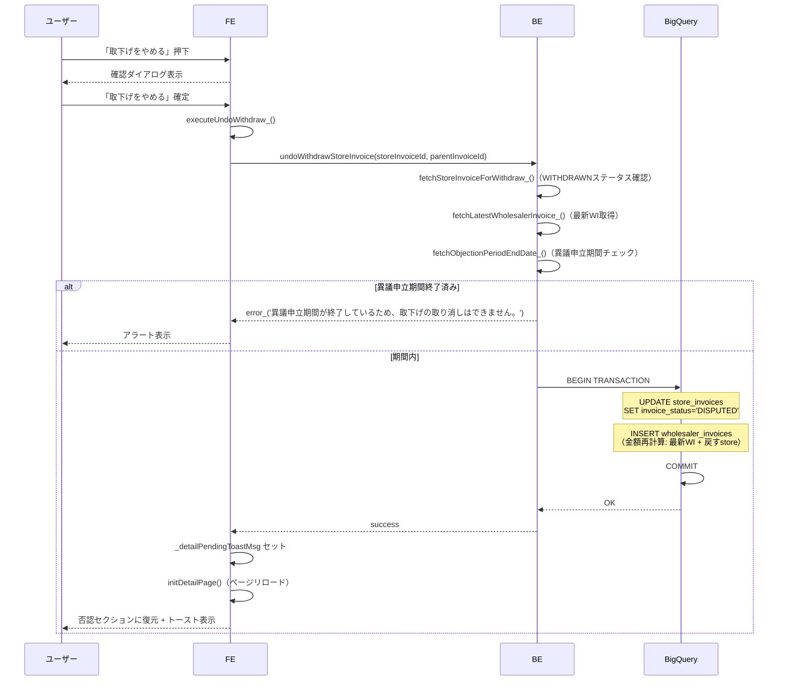
```mermaid
sequenceDiagram
    participant U as ユーザー
    participant FE as FE
    participant BE as BE
    participant BQ as BigQuery

    U->>FE: 「取下げをやめる」押下
    FE-->>U: 確認ダイアログ表示

    U->>FE: 「取下げをやめる」確定
    FE->>FE: executeUndoWithdraw_()
    FE->>BE: undoWithdrawStoreInvoice(storeInvoiceId, parentInvoiceId)
    BE->>BE: fetchStoreInvoiceForWithdraw_()（WITHDRAWNステータス確認）
    BE->>BE: fetchLatestWholesalerInvoice_()（最新WI取得）
    BE->>BE: fetchObjectionPeriodEndDate_()（異議申立期間チェック）
    alt 異議申立期間終了済み
        BE-->>FE: error_('異議申立期間が終了しているため、取下げの取り消しはできません。')
        FE-->>U: アラート表示
    else 期間内
        BE->>BQ: BEGIN TRANSACTION
        Note over BQ: UPDATE store_invoices<br/>SET invoice_status='DISPUTED'
        Note over BQ: INSERT wholesaler_invoices<br/>（金額再計算: 最新WI + 戻すstore）
        BQ->>BQ: COMMIT
        BQ-->>BE: OK
        BE-->>FE: success
        FE->>FE: _detailPendingToastMsg セット
        FE->>FE: initDetailPage()（ページリロード）
        FE-->>U: 否認セクションに復元 + トースト表示
    end
```

### 6.6 異議申立期間による操作ブロック（`checkReuploadDeadline_`）

詳細画面の描画完了時に `checkReuploadDeadline_()` が実行され、サマリーの `objection_end_at`（`OBJECTION_PERIOD` イベントの `end_at`）が本日（JST基準）より前の場合、**要対応・取下げ済みの全アクションボタンを無効化**する。

| 対象ボタン | data-action | 無効化時の挙動 |
|-----------|-------------|--------------|
| 修正ファイルをアップ | `reupload` | `disabled` + 半透明 + title「異議申立期間（YYYY-MM-DD まで）を過ぎているため、操作できません。」 |
| 変更なしで再請求 | `resubmit` | 同上 |
| 請求取り下げ | `withdraw` | 同上 |
| CSV一括アップロード | （`detailBtnUploadCsv`） | 同上 |
| 取下げをやめる | `undo-withdraw` | 取下げ済みアコーディオン描画時に `disabled` 化 |

加えて、各アクション領域（`.backoffice-remark__actions`）の下に「異議申立期間が終了しています」というメッセージを表示する。

---

## 7. モーダル状態遷移

### 7.1 個別リアップロードモーダル

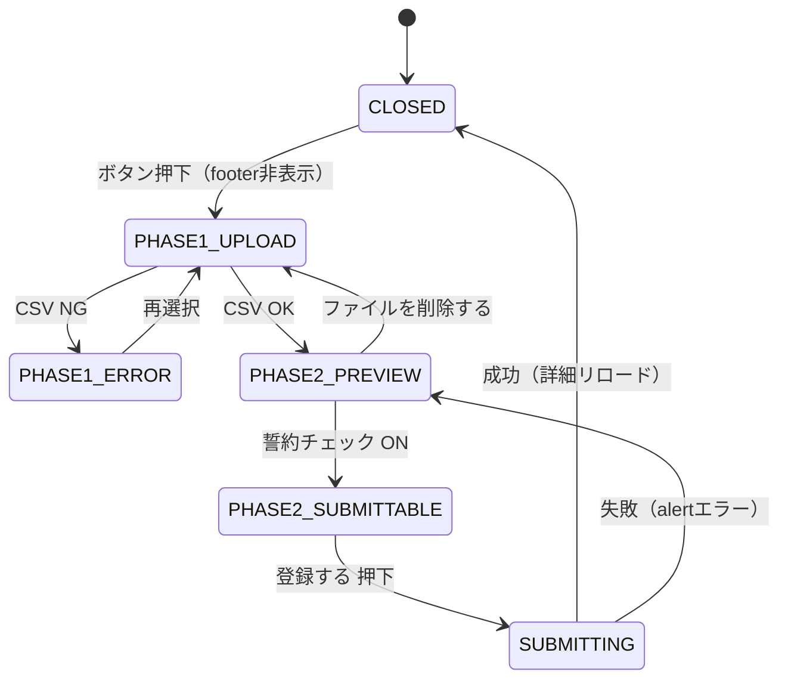
```mermaid
stateDiagram-v2
    [*] --> CLOSED

    CLOSED --> PHASE1_UPLOAD: ボタン押下（footer非表示）

    PHASE1_UPLOAD --> PHASE1_ERROR: CSV NG
    PHASE1_UPLOAD --> PHASE2_PREVIEW: CSV OK

    PHASE1_ERROR --> PHASE1_UPLOAD: 再選択

    PHASE2_PREVIEW --> PHASE1_UPLOAD: ファイルを削除する
    PHASE2_PREVIEW --> PHASE2_SUBMITTABLE: 誓約チェック ON

    PHASE2_SUBMITTABLE --> SUBMITTING: 登録する 押下
    SUBMITTING --> CLOSED: 成功（詳細リロード）
    SUBMITTING --> PHASE2_PREVIEW: 失敗（alertエラー）
```

### 7.2 一括アップロードモーダル

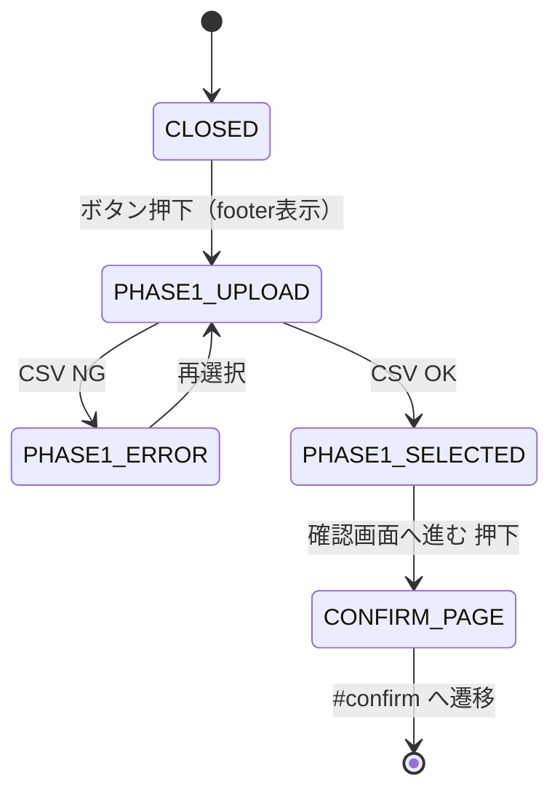
```mermaid
stateDiagram-v2
    [*] --> CLOSED

    CLOSED --> PHASE1_UPLOAD: ボタン押下（footer表示）

    PHASE1_UPLOAD --> PHASE1_ERROR: CSV NG
    PHASE1_UPLOAD --> PHASE1_SELECTED: CSV OK

    PHASE1_ERROR --> PHASE1_UPLOAD: 再選択

    PHASE1_SELECTED --> CONFIRM_PAGE: 確認画面へ進む 押下
    CONFIRM_PAGE --> [*]: #confirm へ遷移
```

### 7.3 取り下げ確認ダイアログ

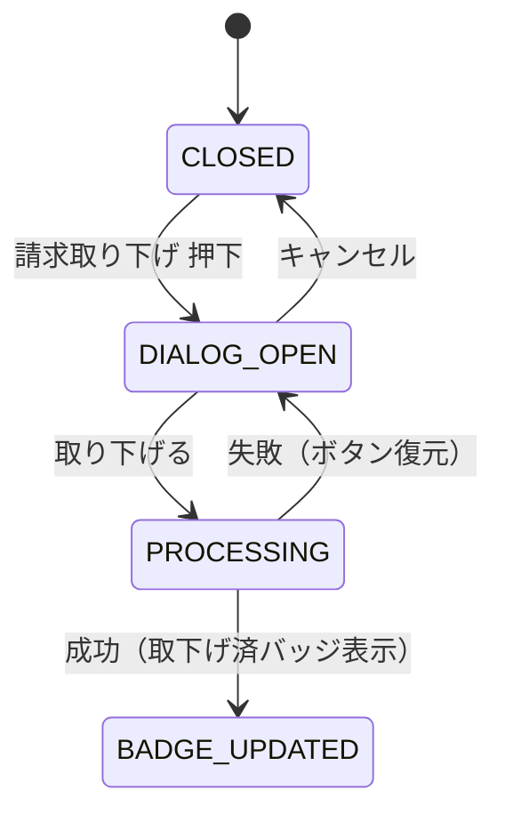
```mermaid
stateDiagram-v2
    [*] --> CLOSED

    CLOSED --> DIALOG_OPEN: 請求取り下げ 押下
    DIALOG_OPEN --> CLOSED: キャンセル
    DIALOG_OPEN --> PROCESSING: 取り下げる
    PROCESSING --> BADGE_UPDATED: 成功（取下げ済バッジ表示）
    PROCESSING --> DIALOG_OPEN: 失敗（ボタン復元）
```

---

## 8. データ構造

### 8.1 API レスポンス: `fetchInvoiceDetail`

```javascript
{
  data: {
    summary: {
      wholesaler_invoice_id: "uuid",
      wholesaler_invoice_date: "2026-03-01",            // 請求月 (表示は YYYY/MM)
      created_at: "2026/03/15 10:30:00",                 // 登録日時
      wholesaler_fee_rate: 3.0,                           // 手数料率
      invoice_fee_amount: 5000,                           // 手数料額
      payment_amount: 165000,                             // 振込予定金額
      handover_matter: "...",                              // USEN PAY社コメント
      wholesaler_total_amount: 170000,                    // 合計（税込）
      wholesaler_subtotal_amount: 155000,                 // 小計（税抜）
      wholesaler_tax_amount: 15000,                       // 消費税
      wholesaler_standard_tax_target_amount: 100000,      // 10%対象小計
      wholesaler_standard_tax_amount: 10000,              // 10%消費税
      wholesaler_reduced_tax_target_amount: 55000,        // 8%対象小計
      wholesaler_reduced_tax_amount: 5000,                // 8%消費税
      objection_end_at: "2026-03-31",                     // 異議申立期間の終了日（OBJECTION_PERIOD）
    },
    stores: [
      {
        store_invoice_id: "uuid",
        mall_code: "M001",
        store_name: "テスト加盟店1",
        customer_code: "C001",                            // 顧客コード（mall_code→customer_code 変換用）
        total_amount: 50000,
        subtotal_amount: 45000,
        tax_amount: 5000,
        standard_tax_amount: 3000,                        // 税内訳（10%）
        reduced_tax_amount: 2000,                         // 税内訳（8%）
        backoffice_review_status: "RETURNED",
        invoice_status: "DISPUTED",
        backoffice_handover: "差し戻しコメント",
        store_disputed_reason: "金額間違い",
        wholesaler_handover: "合意事項テキスト",
        wholesaler_remark: "備考テキスト",
      }
    ]
  }
}
```

#### 8.2 API レスポンス: `getInvoiceLinesByStore`（明細・遅延読み込み）

```javascript
{
  data: [
    {
      transaction_date: "2026-03-01",          // 取引日
      item_name: "商品A",                       // 明細項目
      unit_price: 1000,                         // 単価
      quantity: 5,                              // 数量
      quantity_unit: "個",                      // 数量単位（任意）
      line_amount_excluding_tax: 5000,         // 明細金額（税抜）
      line_tax_amount: 500,                    // 消費税
      tax_category: 10,                         // 税率（%）
      line_note: "備考",                        // 備考
    }
  ]
}
```

---

## 9. バリデーション

### 9.1 共通CSVバリデーション

| チェック項目 | エラー/警告 | 内容 |
|-------------|-----------|------|
| ファイル拡張子 | エラー | `.csv` のみ許可 |
| ヘッダー行 | エラー | 必須カラムの存在確認 |
| データ行 | エラー | 数値・日付フォーマット等 |
| 要対応加盟店の網羅性 | エラー/警告 | CSVに要対応の `mall_code` が含まれているか |

### 9.2 個別リアップロード時の追加チェック

| チェック項目 | タイミング | 内容 |
|-------------|-----------|------|
| 対象外加盟店チェック | プレビュー描画時 | CSVに対象加盟店以外が含まれている場合エラー |
| 合意事項 必須 | 「登録する」押下時 | 否認の場合、合意事項が空なら alert |

### 9.3 一括アップロード時の追加チェック

| チェック項目 | タイミング | 内容 |
|-------------|-----------|------|
| 否認加盟店の合意事項 | 「確認画面へ進む」押下時 | 全否認加盟店の入力チェック |
| RETURNED+null 加盟店 | バリデーション時 | 警告のみ（エラーにしない） |
| RETURNED+DISPUTED 加盟店 | バリデーション時 | エラー |

---

## 10. 状態管理

### グローバル変数

| 変数名 | 型 | 用途 |
|--------|------|------|
| `_detailCurrentInvoiceId` | `string\|null` | 表示中の `wholesaler_invoice_id`（再描画スキップ判定） |
| `_detailActionRequiredMallCodes` | `string[]` | 要対応の `mall_code` 一覧（バリデーション用） |
| `_detailReturnedOnlyMallCodes` | `string[]` | RETURNED のみの `mall_code`（CSV未含有時は警告のみ） |
| `_detailMallToCustomerMap` | `Object` | 詳細画面専用の `mall_code` → `customer_code` マップ（`end` 店舗も含む） |
| `_isResubmitConfirm` | `boolean` | 一括再送信モードで確認画面を表示するフラグ |
| `_resubmitParentInvoiceId` | `string\|null` | 一括再送信時の親請求ID |
| `_resubmitRemarks` | `Object` | 一括再送信時の備考 |
| `_resubmitHandovers` | `Object` | 一括再送信時の合意事項 |
| `_resubmitDisputedCodes` | `string[]` | 一括再送信時に合意内容を必須とする否認加盟店の顧客コード |
| `_detailPendingToastMsg` | `string\|null` | 取下げ/取消成功後にページリロード完了後に表示するトーストメッセージ |
| `_objectionEndAt` | `string\|null` | 異議申立期間の終了日（`summary.objection_end_at` から取得） |

---

## 11. BE API 仕様

### 11.1 `fetchInvoiceDetail(invoiceId)`

| 項目 | 内容 |
|------|------|
| 引数 | `invoiceId`: `wholesaler_invoice_id` |
| 処理 | `fetchInvoiceDetailSummary_` + `fetchStoreInvoicesByParent_` |
| 戻り値 | `{ data: { summary, stores } }`（該当なしは `{ data: null }`） |
| IDOR保護 | `wholesaler_id` フィルタリング |

### 11.2 `getInvoiceLinesByStore(storeInvoiceId)`

| 項目 | 内容 |
|------|------|
| 引数 | `storeInvoiceId`: `store_invoices.id` |
| 処理 | `fetchInvoiceLinesByStore_(storeInvoiceId, wholesalerId)`。アコーディオン展開時にオンデマンドで呼ばれる |
| 戻り値 | `{ data: lines[] }`（最大1000件） |
| IDOR保護 | `store_invoices` JOIN で `wholesaler_id` を検証 |

### 11.2 `resubmitInvoiceData(rawCsv, utf8Csv, summaryData, remarks, parentId, storeId, handover)`

| 項目 | 内容 |
|------|------|
| 処理 | CSV → Drive保存 → BQ Load → 差額計算 → トランザクション |
| トランザクション | 新 `store_invoices` INSERT + 旧 `is_latest=FALSE` + `wholesaler_invoices` 金額更新 |

### 11.3 `resubmitWithoutChanges(storeInvoiceId, parentInvoiceId, wholesalerHandover)`

| 項目 | 内容 |
|------|------|
| 処理 | `backoffice_review_status` → `PENDING_REVIEW` に更新 |
| 条件 | RETURNED または (MCR + DISPUTED) のレコードのみ |

### 11.4 `withdrawStoreInvoice(storeInvoiceId, parentInvoiceId)`

| 項目 | 内容 |
|------|------|
| 処理 | `invoice_status` → `WITHDRAWN` に更新 + `wholesaler_invoices` 金額再計算（新版INSERT） |
| 事前検証 | `fetchStoreInvoiceForWithdraw_()` で存在・ステータス確認 |
| 金額再計算 | `新WI金額 = 最新WI − 取下げstore`、手数料・振込予定額も再計算 |
| 実行方法 | トランザクション（UPDATE + INSERT-SELECT） |
| 影響行数0 | `error_()` で業務エラーを返却（`throw` しない） |
| IDOR保護 | `wholesaler_id` + `wholesaler_invoice_id` フィルタリング |

### 11.5 `undoWithdrawStoreInvoice(storeInvoiceId, parentInvoiceId)`

| 項目 | 内容 |
|------|------|
| 処理 | `invoice_status` を `WITHDRAWN` → `DISPUTED` に復元 + `wholesaler_invoices` 金額再計算（新版INSERT） |
| 条件 | `is_latest = TRUE` かつ `invoice_status = 'WITHDRAWN'` のレコードのみ |
| 事前検証 | `fetchStoreInvoiceForWithdraw_()` + `fetchObjectionPeriodEndDate_()` |
| 異議申立期間 | `business_calendar` の `OBJECTION_PERIOD` イベントの `end_at` を参照。期間終了後は `error_()` で拒否 |
| 金額再計算 | `新WI金額 = 最新WI + 戻すstore`、手数料・振込予定額も再計算 |
| 実行方法 | トランザクション（UPDATE + INSERT-SELECT） |
| 影響行数0 | `error_()` で業務エラーを返却（`throw` しない） |
| IDOR保護 | `wholesaler_id` + `wholesaler_invoice_id` フィルタリング |

---

## 12. BQテーブル参照

| テーブル | 用途 |
|---------|------|
| `wholesaler_invoices` | 親請求情報（金額サマリ、手数料、振込予定額） |
| `store_invoices` | 加盟店別請求（ステータス、金額、備考、合意事項） |
| `invoice_lines` | 明細行（品名、単価、数量、税率） |
| `merchant_mappings` | `mall_code` ↔ `customer_code` 変換 |
| `store` | 加盟店名の取得 |
| `business_calendar` | スケジュール・異議申立期間（`OBJECTION_PERIOD`） |

### 主要クエリ

| 関数 | 対象テーブル | 概要 |
|------|------------|------|
| `fetchInvoiceDetailSummary_` | `wholesaler_invoices` LEFT JOIN `business_calendar` | 親請求 + `objection_end_at` を取得 |
| `fetchStoreInvoicesByParent_` | `store_invoices` JOIN `store` + `customer_code` スカラーサブクエリ | 加盟店別請求一覧（`is_latest=TRUE`） |
| `fetchInvoiceLinesByStore_` | `invoice_lines` JOIN `store_invoices` | 明細行（最大1000行） |
| `fetchStoreInvoiceForWithdraw_` | `store_invoices` | 取下げ/取消しの事前バリデーション |
| `fetchObjectionPeriodEndDate_` | `business_calendar` | 異議申立期間の `end_at` 取得 |
| `fetchLatestWholesalerInvoice_` | `wholesaler_invoices` | 最新WI取得（`wholesaler_invoice_date` 含む） |

---

## 13. UIデザイン仕様

### 13.1 ステータスバッジ

| バッジ | 文字色 | 背景色 | アイコン |
|--------|--------|--------|---------|
| 取下げ済 | `#159E85` | `#CDF6EF` | `fa-check` |
| 否認差戻 | disputed色 | disputed背景 | `fa-minus-circle` |
| 差戻し | returned色 | returned背景 | `fa-rotate-left` |
| 承認 | approved色 | approved背景 | `fa-circle-check` |
| 確認中 | requested色 | requested背景 | なし |
| 未検収 | pending色 | pending背景 | なし |

### 13.2 アクションボタン

| ボタン | アイコン色 | テキストスタイル | 表示セクション |
|--------|----------|----------------|---------------|
| 請求取り下げ | `#DF4C4C` | 14px / 400 / `#3C3C3C` | 否認 |
| 修正ファイルをアップ | `#00A7B8` | 14px / 400 | 否認 |
| 変更なしで再請求 | `#00A7B8` | 14px / 400 | 否認 |
| 取下げをやめる | `#FF7846` | 14px / 400 | 取下げ済み |

### 13.3 取り下げ確認モーダル（`withdrawConfirmModal`）

| 項目 | 値 |
|------|-----|
| クラス | `modal modal--warn`（警告色スタイル） |
| タイトル | 「⚠ 加盟店への請求情報を取り下げます。よろしいですか？」 |
| 説明 | 「加盟店単位の請求情報を取り下げます。取り下げ後、再度請求したい場合は取下げ済みの請求一覧から「取下げをやめる」で要対応に戻してから再送信してください。」 |
| 「取り下げる」ボタン | `withdrawConfirmOk`・`btn-danger` |
| 「キャンセル」ボタン | `withdrawConfirmCancel`・`btn-outline` |

### 13.4 取下げ取り消し確認モーダル（`undoWithdrawConfirmModal`）

| 項目 | 値 |
|------|-----|
| クラス | `modal modal--warn`（警告色スタイル） |
| タイトル | 「⚠ 請求の取り下げを取り消します。よろしいですか？」 |
| 説明 | 「取り下げを取り消すと、対象の請求は「要対応の請求一覧」に戻ります。」 |
| 「取り消す」ボタン | `undoWithdrawConfirmOk`・`btn-danger` |
| 「キャンセル」ボタン | `undoWithdrawConfirmCancel`・`btn-outline` |
| アクセシビリティ | `aria-labelledby` / `aria-describedby` |
