# 共通仕様書（ヘッダー・フッター・バリデーション・エラー・ルーティング等）

## 1. 概要

本ドキュメントは、仕入れコネクトの全画面で共通して使用される要素・ロジック・デザインルールをまとめたものです。

### 対応ファイル

| ファイル | 役割 |
|---------|------|
| `fe_index.html` | エントリーポイント HTML（全画面を include） |
| `fe_part_header.html` | 共通ヘッダー HTML |
| `fe_css.html` | 全画面共通 CSS（3000行超） |
| `fe_js_common.html` | ルーター・共通ユーティリティ・トースト・ヘッダー/ログアウト・アカウント初期化 |
| `fe_js_csv_common.html` | CSV 共通処理（`sanitizeCsvQuotedNewlines_` / `validateCsv` / `parseCsvLine` / `getCsvFormatRules` / `nl2space_` / `removeEmptyLines_`） |
| `fe_js_calendar.html` | 請求スケジュールカレンダー（ホーム・詳細で共有） |
| `fe_js_home.html` | ホーム画面ロジック |
| `fe_js_upload.html` | CSVアップロード画面ロジック |
| `fe_js_confirm.html` | 確認画面ロジック |
| `fe_js_detail.html` | 詳細画面ロジック（再アップロードモーダル含む） |
| `fe_page_error.html` | エラー画面 HTML |
| `be_main.js` | GAS エントリーポイント（`doGet`, `include`） |
| `be_server.js` | アカウント認証（`getAccountInfo`）・ログアウト先URL取得（`getLogoutUrl`）・ログインページURL取得（`getLoginUrl`） |
| `be_config.js` | 環境設定（Script Properties） |
| `be_utils.js` | 共通ユーティリティ |

---

## 2. アーキテクチャ

### 2.1 全体構成図

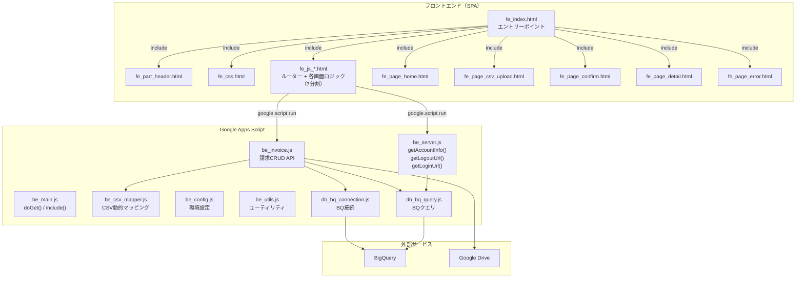

### 2.2 SPA 構成

全画面が1つのHTML内に `<div>` として存在し、ハッシュルーターで表示/非表示を切り替えるSPA構成です。

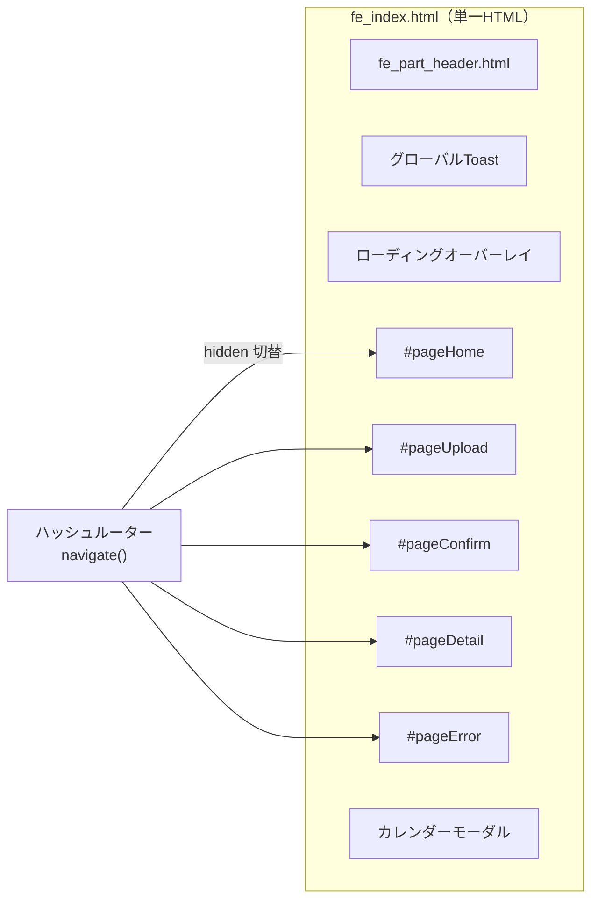

---

## 3. ルーティング

### 3.1 ルート定義

| ハッシュ | ページ要素ID | 画面名 |
|---------|------------|--------|
| `#home` | `pageHome` | Top画面（デフォルト） |
| `#upload` | `pageUpload` | CSVアップロード画面 |
| `#confirm` | `pageConfirm` | 確認画面 |
| `#detail` | `pageDetail` | 詳細画面 |
| `#error` | `pageError` | エラー画面 |

### 3.2 ルーティングフロー

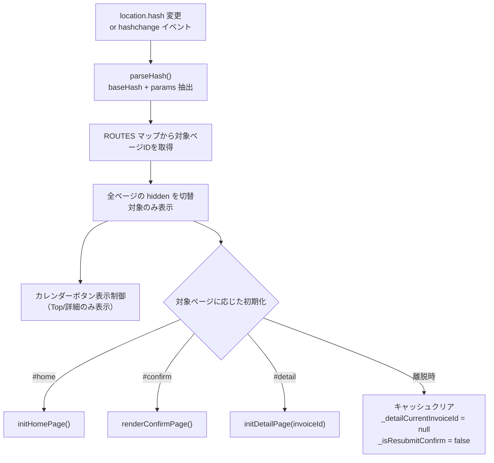

### 3.3 パラメータ付きルーティング

```
#detail?invoiceId=xxxx-xxxx-xxxx
```

`parseHash()` が `?` で分割し、`URLSearchParams` としてパラメータを取得。

---

## 4. 共通ヘッダー

### 4.1 構成

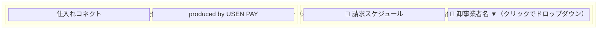

### 4.2 要素詳細

| 要素 | ID | 仕様 |
|------|-----|------|
| ロゴ（アプリ名リンク） | `headerLogoLink` / `headerServiceName` | 「仕入れコネクト」→ `#home` へのリンク。**エラー画面（`#error`）でのみ押下不可**（`navigate()` が `is-disabled` + `aria-disabled="true"` + `tabindex="-1"` を付与）。開発環境（`window.__APP_IS_DEV__ === true`）ではサービス名末尾に `(Dev)` を付与（`applyDevServiceNameLabel_`） |
| produced by | - | 「produced by USEN PAY」（`#B9BEC3`） |
| 請求スケジュール | `btnCalendarOpen` | カレンダーモーダルを開くボタン。Top画面・詳細画面でのみ表示 |
| 卸事業者名トリガー | `headerStoreTrigger` | ビルSVGアイコン + `headerWholesalerName` + ▼アイコン。クリックでログアウトドロップダウンを開閉（`aria-haspopup` / `aria-expanded`） |
| 卸事業者名 | `headerWholesalerName` | ログイン時に `saveAccountInfo()` で設定。初期値は `―` |
| ログアウトドロップダウン | `headerStoreDropdown` | 初期 `hidden`。「🚪 ログアウト」ボタン（`btnLogout`）を含む |

### 4.3 ログアウトドロップダウン

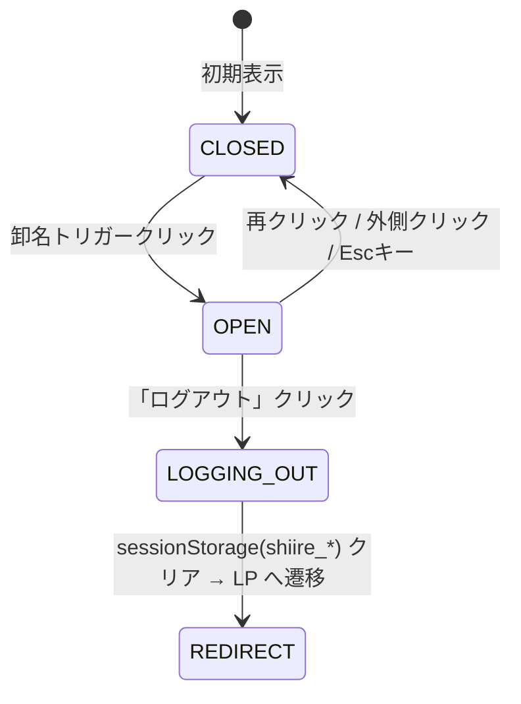

| 挙動 | 内容 |
|------|------|
| 開閉 | 卸名トリガーのクリックでトグル。外側クリック・Escキーで閉じる |
| フォーカス | 開いたら `btnLogout` へフォーカス。Escで閉じるとトリガーへ復帰 |
| ログアウト処理 | `shiire_` プレフィックスの SessionStorage キーのみ削除 → `getLogoutUrl()` で取得した URL へ `window.top.location` で遷移 |
| フォールバック | `getLogoutUrl()` 失敗時・GAS 環境外は `https://accounts.google.com/Logout` へ遷移 |

### 4.3 スタイル

| プロパティ | 値 |
|-----------|-----|
| 背景色 | `#1a2b4a` |
| 文字色 | `#FFFFFF` |
| 高さ | `80px` |
| 最小幅 | `1280px` |
| パディング | `12px 32px` |
| ロゴフォントサイズ | `32px` / Bold |
| produced by フォントサイズ | `18px` / Bold |

---

## 5. 共通フッター

```html
<footer class="site-footer">
  <p>Copyright © USEN PAY Co.,Ltd. All Rights Reserved.</p>
</footer>
```

各画面に個別に配置されています。

---

## 6. 認証・アカウント管理

### 6.1 認証フロー

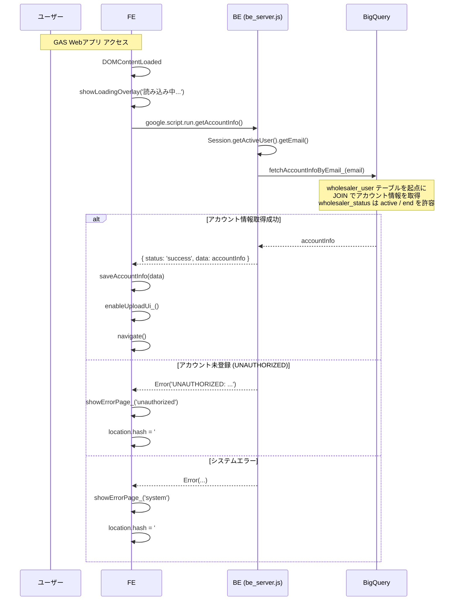

### 6.2 SessionStorage に保存される情報

| キー | 内容 | 用途 |
|------|------|------|
| `shiire_wholesaler_id` | 卸事業者ID | IDOR保護用（BE側で確定） |
| `shiire_wholesaler_user_id` | ユーザーID | ログ・監査用 |
| `shiire_wholesaler_name` | 卸事業者名 | ヘッダー表示 |
| `shiire_wholesaler_status` | 卸ステータス（`active` / `end`） | 契約終了卸（`end`）の新規請求ブロック |
| `shiire_invoice_fee_rate` | 手数料率 | 確認画面での手数料計算 |
| `shiire_tax_rounding_method` | 消費税丸め方式 | `floor` / `ceil` / `round` |
| `shiire_merchant_mappings` | 加盟店マッピング（JSON） | CSVバリデーション。`store_status=end` の加盟店は除外済み |
| `shiire_csv_format_rules` | CSVフォーマットルール（JSON） | 動的CSV定義 |
| `shiire_parsedData` | パース済みCSVデータ（JSON） | 確認画面表示用 |
| `shiire_invoices_cache` | 請求一覧キャッシュ（JSON） | 当月重複チェック |
| `shiire_schedule_cache_{wholesalerId}_{YYYY-MM}` | 当月のスケジュール（JSON） | カレンダー初期表示高速化・受付期限チェック |
| `shiire_resubmit_handover_matter` | USEN PAY社コメント | 一括再送信時の確認画面表示用 |

> ⚠️ `rawCsvBase64` / `utf8CsvBase64`（送信用のBase64）はメモリのみに保持し、SessionStorage には保存しない（容量超過防止）。ページリロード後は再アップロードが必要。

### 6.3 ログアウト

ヘッダー右上の卸名トリガーをクリックして開くドロップダウンからログアウトできる（全画面共通）。

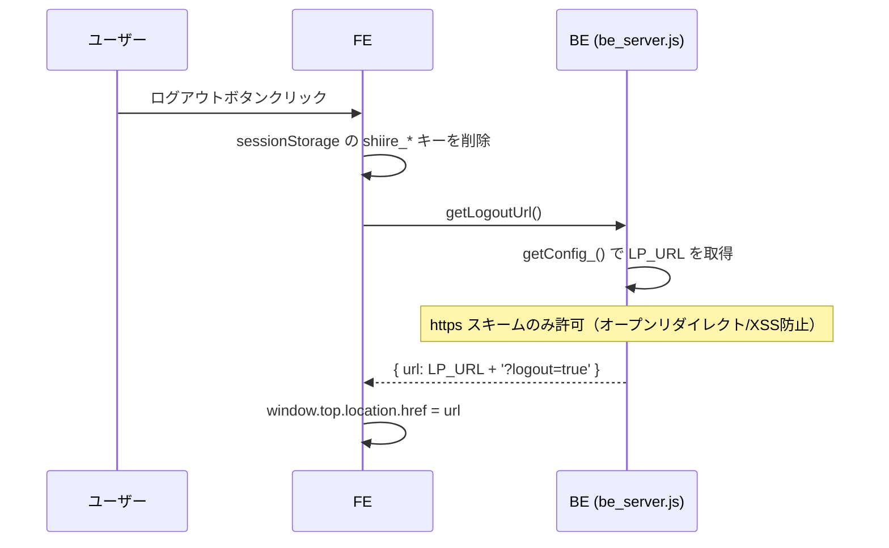

| 項目 | 内容 |
|------|------|
| FE処理 | `shiire_` プレフィックスの SessionStorage キーのみ削除（他アプリへの副作用防止） |
| BE API | `getLogoutUrl()` → `{ status: 'success', data: { url } }` |
| URL生成 | `LP_URL` に `?logout=true`（既に `?` があれば `&`）を付与 |
| セキュリティ | `LP_URL` が `https://` で始まらない場合はエラー |
| フォールバック | API失敗・GAS環境外は `https://accounts.google.com/Logout` へ遷移 |

---

## 7. グローバル Toast

### 7.1 構成

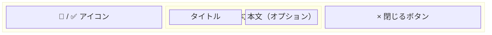

### 7.2 種別

| 種別 | CSSクラス | アイコン | 自動非表示 |
|------|----------|--------|-----------|
| エラー | `toast--error` | `fa-circle-exclamation` | なし（手動閉じのみ） |
| 成功 | `toast--success` | `fa-circle-check` | 8秒 |

### 7.3 API

```javascript
showToast(message, type, autoHideMs, body)
hideToast()
```

| 引数 | 型 | 説明 |
|------|-----|------|
| `message` | `string` | タイトルテキスト |
| `type` | `'error' \| 'success'` | 表示種別 |
| `autoHideMs` | `number` | 自動非表示時間（ms）。省略時: success=8000, error=0 |
| `body` | `string` | 本文HTML（オプション） |

---

## 8. ローディングオーバーレイ

### 8.1 構成

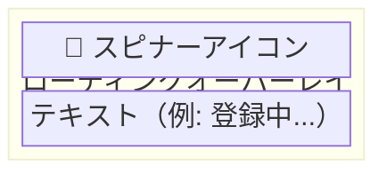

### 8.2 API

```javascript
showLoadingOverlay(text)  // 表示（text: '読み込み中...', '登録中...' 等）
hideLoadingOverlay()      // 非表示
```

### 8.3 使用箇所

| 画面 | テキスト | タイミング |
|------|---------|-----------|
| 認証時 | 「読み込み中...」 | `DOMContentLoaded` |
| Top画面 | 「請求情報を取得中...」 | `fetchInvoices()` 呼び出し時 |
| 確認画面 | 「登録中...」 | 送信ボタン押下時 |
| 詳細画面 | 「再請求中...」 | 変更なし再請求時 |

---

## 9. エラー画面

### 9.1 構成

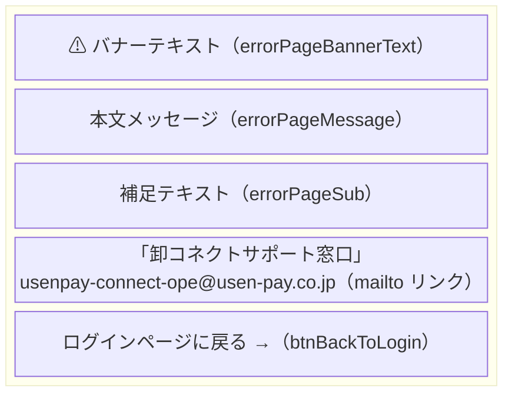

> 📌 エラー画面ではヘッダーのアプリ名（`headerLogoLink`）が押下不可になる（`navigate()` が `#error` のとき `is-disabled` を付与）。ログインできていない状態で `#home` に遷移させないための制御。

### 9.2 エラー種別

`showErrorPage_(type)`（`fe_js_common.html`）がバナー／本文／補足を切り替える。`unauthorized` は HTML の既定文言をそのまま使用し、`system` も**同じ「アカウント未登録」文言を表示する**（取得失敗の技術的詳細はコンソールログに出力し、画面では共通の案内に集約する）。

| 種別 | 発生条件 | バナー | メッセージ |
|------|---------|--------|-----------|
| `unauthorized` | `getAccountInfo()` が `UNAUTHORIZED:` で失敗 | 「ログインに使用されたアカウントの登録が見当たりません。」 | 「本サイトへのログインにご使用された、Googleアカウントがサービスデータベース上に見当たりません。ご登録時に設定いただいたアカウントで再度ログインしなおしてください。」 |
| `system` | `getAccountInfo()` が上記以外で失敗 | （`unauthorized` と同一の文言） | （`unauthorized` と同一の文言） |
| `env` | GAS 環境外（`google.script.run` 不在） | 「環境エラー」 | 「この画面はGAS Webアプリとして実行してください。」 |

### 9.3 「ログインページに戻る」ボタン（`btnBackToLogin`）

エラー画面フッターのボタン。押下すると `shiire_` プレフィックスの SessionStorage を削除し、`getLoginUrl()` で取得した LP（ログインページ）へ `window.top.location` で遷移する。

| 項目 | 内容 |
|------|------|
| FE処理 | `shiire_` プレフィックスの SessionStorage キーのみ削除 → `getLoginUrl()` 呼び出し |
| BE API | `getLoginUrl()` → `{ status: 'success', data: { url } }`。`LP_URL` を**そのまま**返す（`?logout=true` は付与しない） |
| ログアウトとの違い | エラー画面はログイン前提のため、LP 側で「ログアウトしました」トーストが出ないよう `getLogoutUrl()`（§6.3）とは別関数 `getLoginUrl()` を使用する |
| セキュリティ | `LP_URL` が `https://` で始まらない場合はエラー |
| フォールバック | API失敗・GAS環境外は `window.history.back()`（履歴がなければ `#home`） |

---

## 10. 消費税の丸め処理

### 10.1 `roundTax(value)` 関数

SessionStorage の `shiire_tax_rounding_method` に応じて消費税を丸めます。

| method | 関数 | 説明 |
|--------|------|------|
| `floor` | `Math.floor()` | 切り捨て（デフォルト） |
| `ceil` | `Math.ceil()` | 切り上げ |
| `round` | `Math.round()` | 四捨五入 |

### 10.2 計算フロー

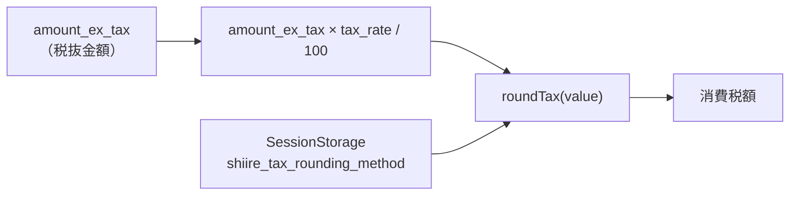

---

## 11. CSVフォーマットルール（`csv_format_rules`）

### 11.1 フォーマット判定フロー

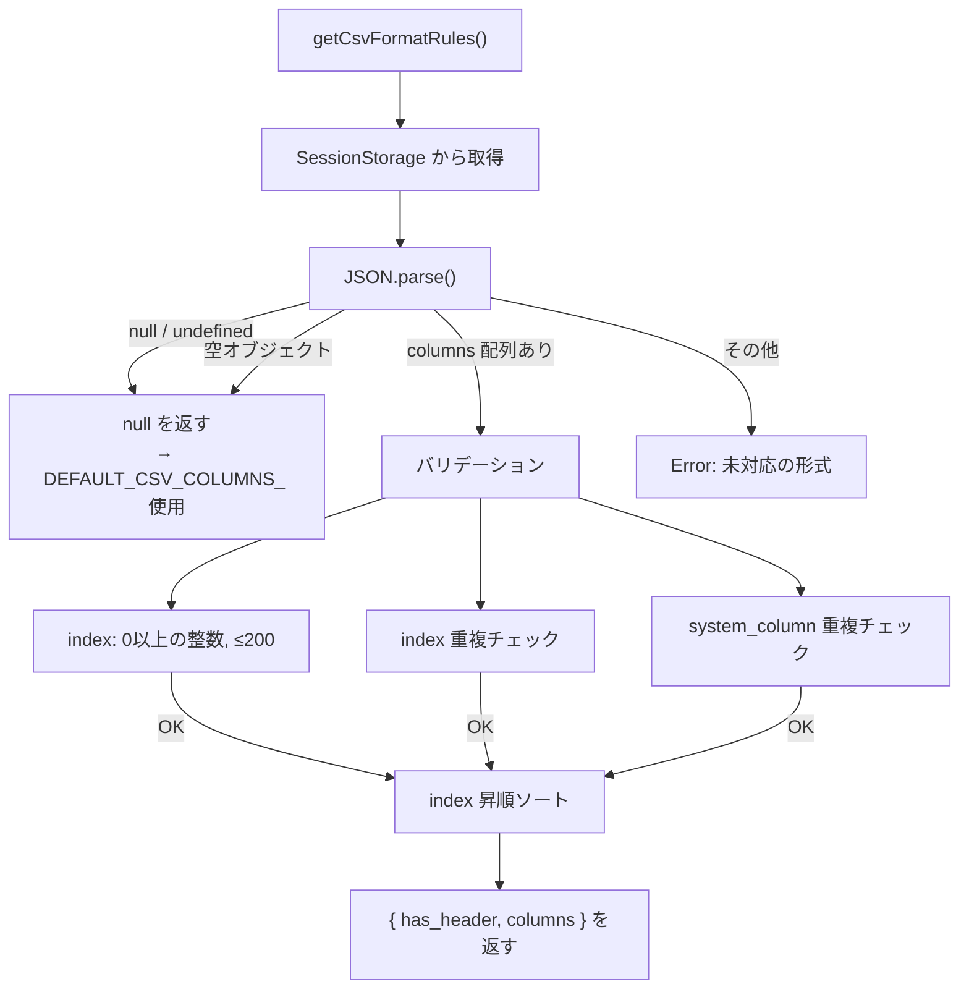

### 11.2 新形式の構造

```javascript
{
  "has_header": true,
  "columns": [
    {
      "index": 0,              // CSV上の列位置（0始まり）
      "csv_header": "伝票日付", // ヘッダー名
      "system_column": "transaction_date",  // BQカラム名
      "type": "date",          // 型（string/date/integer/decimal）
      "format": "YYYYMMDD",    // 日付フォーマット（typeがdateの場合）
      "required": true         // 必須フラグ
    },
    // ...
  ]
}
```

### 11.3 CSVクォート内改行・制御文字のサニタイズ（FE）

CSV 文字列は `validateCsv()` に渡す前に `sanitizeCsvQuotedNewlines_(text, columns)` で正規化する（アップロード画面・詳細再アップロードモーダルで共通）。

| 関数 | 役割 |
|------|------|
| `sanitizeCsvQuotedNewlines_(text, columns)` | 列認識パーサ。クォート内改行→スペース、備考列（`invoice_detail_remark`）以外の列の改行→ `newlineErrors` 収集、クォート外改行（CRLF/CR/LF/U+2028/U+2029/U+0085/VT/FF）→ `\n` 正規化、クォート未閉鎖→パースエラー。戻り値 `{ text, newlineErrors }` |
| `nl2space_(str)` | 手入力値（備考・合意内容）の改行・制御文字を半角スペースに変換 |
| `removeEmptyLines_(text)` | 空行・空白のみ行を物理除去（jagged row 対策）。BQ 投入用 `utf8CsvBase64` に適用 |

- 文字集合（CR/LF/U+2028/U+2029/U+0085/VT/FF）は FE サニタイズと BQ ロード時クリーニングで統一。**TAB は除外**。
- 行番号は元ファイル基準（Excel 行番号 = 空行も１行として数える）。
- 詳細は [02_csv_upload_page.md](02_csv_upload_page.md) §4.3 を参照。

### 11.4 CSV→BQ 登録時の SQL サニタイズ（BE）

BE では BigQuery の単一引用符リテラルに安全に埋め込むため、`escSql_()`（`be_csv_mapper.js`）/ 各 `esc()`（`be_invoice.js`）で**順序厳守**のエスケープを行う。

1. バックスラッシュ `\` → `\\`（BQ は単一引用符リテラル内で `\` をエスケープ文字として解釈するため）
2. シングルクォート `'` → `''`
3. 改行・制御文字（CR/LF/U+2028/U+2029/U+0085/VT/FF）→ 半角スペース（TAB は除外）

加えて、`buildInvoiceLinesSelectSql_()` の列マッピングで：

| 列 | 挙動 |
|----|------|
| 明細備考（`invoice_detail_remark` → `line_note`） | `REGEXP_REPLACE` で改行・制御文字を半角スペースに変換して登録 |
| 備考以外の文字列列（`item_name` 等） | 改行を含む行は `COUNTIF` + `RAISE` で登録拒否（`列「…」(index:N) に改行を含めることはできません。`） |

> 📌 BQ Load Job は `allowQuotedNewlines: true`（`loadCsvToBq_`）を指定し、フロントのパーサ取りこぼし・直接呼び出し時の最終防衛とする（クォート内改行を含む１行で Load Job 全体が失敗するのを防ぐ）。
> 📌 BE の `stripQuotedNewlines_`（`be_invoice.js`・税額再検証用）は CR/LF のみ＋トグル方式の別実装。FE 側で U+2028 等は既に `\n` へ正規化済みのため、再検証では CR/LF だけで足りる。

### 11.5 卸管理加盟店名（`wholesaler_managed_store_name`）

加盟店の表示名を登録時点でスナップショットし、`store_invoices.wholesaler_managed_store_name` に保存する。

| タイミング | 値の決定 |
|-----------|---------|
| 新規登録 | 確認画面の `displayName`（CSV `merchant_name` → `merchant_mappings.store_name` → `customer_code`）を `managedStoreName` として送信し保存 |
| 個別／一括再請求 | フロント送信値に依存せず、**既存 DB の `wholesaler_managed_store_name` を BE が継承**（`fetchStoreInvoicesByParent_` で取得） |
| 詳細画面表示 | `wholesaler_managed_store_name` → `store_name` → `mall_code` の優先順位で表示 |

詳細は [03_confirm_page.md](03_confirm_page.md) §3.3 / [04_detail_page.md](04_detail_page.md) §4 を参照。

---

## 12. XSSセキュリティ対策

### `escapeHtml(str)` 関数

動的に生成するHTML内で文字列を出力する際に使用します。

| 入力 | 出力 |
|------|------|
| `&` | `&amp;` |
| `<` | `&lt;` |
| `>` | `&gt;` |
| `"` | `&quot;` |
| `'` | `&#39;` |

---

## 13. IDOR（Insecure Direct Object Reference）対策

| 対策 | 実装箇所 |
|------|---------|
| `wholesaler_id` をサーバー側で確定 | `getServerAccountInfo_()` でログインユーザーのメールから取得 |
| 全API に `wholesaler_id` フィルタ | `fetchInvoices`, `fetchInvoiceDetail`, `resubmitInvoiceData` 等 |
| 明細取得に `store_invoices` JOIN | `fetchInvoiceDetailLines_` で `wholesaler_id` を検証 |
| フロントから `wholesaler_id` を送らない | 引数としてフロントから渡さない設計 |

---

## 14. デザインシステム

### 14.1 レイアウト

| プロパティ | 値 |
|-----------|-----|
| 作業用フレームサイズ | `1920px` |
| 標準画面サイズ | `1280px × 728px` |
| 最大コンテンツ幅 | `1248px` |
| 最小コンテンツ幅 | `1024px` |
| ベース背景色 | `#F8F8F9` |

### 14.2 タイポグラフィ

| 用途 | サイズ / Weight |
|------|---------------|
| 補足テキスト | 12px Regular |
| エラーテキスト | 12px Bold |
| サブテキスト | 14px Regular |
| 標準テキスト | 16px Regular |
| セクションタイトル | 18px Bold |
| コンテンツタイトル | 24px Regular |
| 画面タイトル | 28px Regular |
| 強調する金額 | 32px Regular |
| フォント | `Noto Sans JP`, `Hiragino Sans`, sans-serif |

### 14.3 カラーパレット

#### テキスト

| 名前 | カラーコード | 用途 |
|------|------------|------|
| black--main | `#3C3C3C` | メインテキスト |
| darkgray--sub | `#9C9C9C` | サブテキスト |
| gray--disabled | `#D4D4D4` | 非活性テキスト |
| gray--placeholder | `#C4C4C4` | プレースホルダー |
| turquoise--accent | `#00A7B8` | アクセント / リンク |
| red--negative | `#DF4C4C` | エラー / ネガティブ |

#### 背景

| 名前 | カラーコード | 用途 |
|------|------------|------|
| light-gray--base | `#F8F8F9` | ベース背景 |
| gray--note | `#F1F2F3` | ノート背景 |
| gray--contents | `#EAEBED` | コンテンツ背景 |
| dark-blue--main-button | `#003255` | メインボタン |
| turquoise--sub-button | `#00A7B8` | サブボタン |
| red--negative | `#DF4C4C` | ネガティブボタン |
| black--modal | `#000000` (opacity 50%) | モーダル背景 |

#### ステータス

| 名前 | カラーコード | 用途 |
|------|------------|------|
| green--done | `#159E85` | 完了 / OK |
| light-green | `#CDF6EF` | 完了の薄い背景 |
| red--error | `#DF4C4C` | エラー |
| orange | `#FF7846` | 警告タイトル |
| light-orange | `#FFF1EC` | 警告背景 |

### 14.4 ボタン

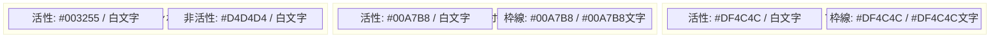

すべてのボタンは角丸（pill型）をベースとしています。

---

## 15. アクセシビリティ

| 対策 | 実装 |
|------|------|
| モーダル | `role="dialog"` `aria-modal="true"` |
| フォーカストラップ | Tab / Shift+Tab をモーダル内に閉じ込め |
| Escキー | モーダルを閉じる |
| フォーカス復帰 | モーダルを閉じた後、開いた要素にフォーカスを戻す |
| ローディング | `aria-hidden="true"` で非表示時にスクリーンリーダーから隠す |
| 閉じるボタン | `aria-label="閉じる"` |
| 隠しテキスト | `.visually-hidden` クラスで視覚的に非表示だがスクリーンリーダーに読み上げ |

---

## 16. 環境設定（Script Properties）

### 16.1 必須プロパティ

| プロパティ | 説明 | 例 |
|-----------|------|-----|
| `DRIVE_ROOT_FOLDER_ID` | CSV保存先 Drive フォルダID | `1rGvUwmPp...` |
| `GCP_PROJECT_ID` | BigQuery GCPプロジェクトID | `usenpay-connect-dev` |
| `BQ_DATASET_ID` | BigQueryデータセットID | `connect_db` |
| `BQ_LOCATION` | BigQueryリージョン（任意、未設定時は `US`） | `asia-northeast1` |
| `LP_URL` | ログアウト後のリダイレクト先 LP URL（https のみ許可） | `https://connect-dev.usen-pay.com/` |
| `ENV` | 環境識別子 | `development` / `production` |

### 16.2 環境ガード

- `ENV=production` の環境では `setupScriptProperties()` の実行を拒否
- 既存プロパティがある場合は上書きしない（`forceOverwrite=true` で回避可）

---

## 17. 外部依存ライブラリ

| ライブラリ | バージョン | 用途 |
|-----------|----------|------|
| Noto Sans JP | Google Fonts | 日本語フォント |
| Font Awesome | 6.5.0 | アイコン |
