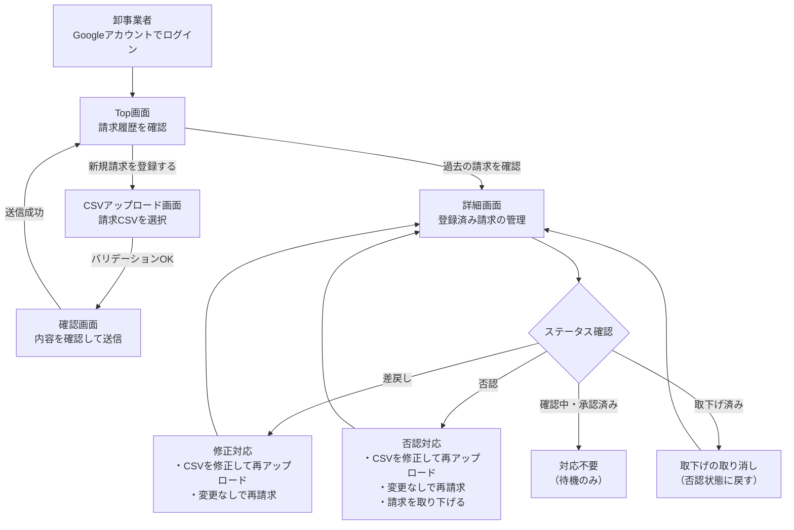
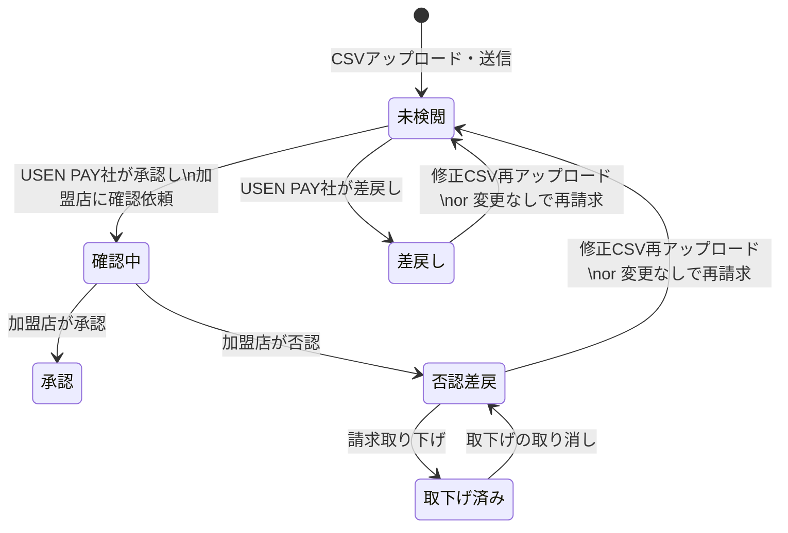

# 📘 ユーザーガイド（PM / ディレクター向け）

> **対象読者**: PM、ディレクター、ビジネスサイドのステークホルダー  
> **目的**: 仕入れコネクト Portal Site（卸側）の機能全体像・業務フロー・ステータスの流れを把握する

---

## 1. サービス概要

仕入れコネクト Portal Site は、**卸事業者**が加盟店への請求データをCSVでアップロードし、USEN PAY社による審査・加盟店確認を経て支払いを受けるための業務システムです。

| 項目 | 内容 |
|------|------|
| サービス名 | 仕入れコネクト Portal Site |
| 提供元 | USEN PAY |
| 利用者 | 卸事業者（ログインはGoogleアカウント認証） |
| 主要機能 | 請求CSV登録 → 審査・確認 → 差戻し・否認対応 → 支払い |

---

## 2. 画面一覧

| # | 画面名 | 概要 |
|---|--------|------|
| 1 | **Top画面** | 新規請求の登録ボタンと、過去の請求履歴一覧を表示 |
| 2 | **CSVアップロード画面** | 請求CSVファイルをアップロードし、バリデーションを実行 |
| 3 | **確認画面** | アップロード内容のサマリーと加盟店別明細を確認し、送信 |
| 4 | **詳細画面** | 登録済み請求の内容確認・差戻し対応・否認対応・取下げを管理 |
| 5 | **エラー画面** | 認証失敗やシステムエラー時に表示 |

---

## 3. 業務フロー（全体像）



---

## 4. 各画面の機能説明

### 4.1 Top画面（ホーム）

| 機能 | 説明 |
|------|------|
| 新規請求登録ボタン | CSVアップロード画面へ遷移 |
| 請求履歴一覧 | 過去に登録した請求の月・日時・金額・手数料を一覧表示 |
| 差戻し・否認バッジ | 対応が必要な請求を視覚的に表示 |
| 請求スケジュール | カレンダーモーダルで請求関連スケジュールを確認 |

### 4.2 CSVアップロード画面

| 機能 | 説明 |
|------|------|
| ファイルアップロード | ドラッグ＆ドロップ、またはファイル選択ダイアログ |
| 自動バリデーション | ヘッダー構成・データ形式・顧客コードの妥当性を即座にチェック |
| 当月重複チェック | 同月内に既に新規請求が登録済みの場合はエラー表示 |
| 加盟店網羅性チェック | 一部の加盟店が含まれていない場合にアラート表示（送信は可能） |

### 4.3 確認画面

| 機能 | 説明 |
|------|------|
| 請求サマリー | 合計金額・小計・消費税・手数料・振込予定金額を表示 |
| 加盟店別明細 | アコーディオン形式で各加盟店の取引明細を確認 |
| 消費税の修正 | 自動計算された消費税を手動で編集可能 |
| 誓約チェック | 「入力データが正確であること」への誓約チェックボックス |
| 送信 | チェック完了後に登録内容を最終送信 |

### 4.4 詳細画面

| 機能 | 説明 |
|------|------|
| 請求基本情報 | 請求月・登録日時・手数料・振込予定金額を表示 |
| 要対応の請求一覧 | 差戻し・否認された加盟店を専用セクションで表示 |
| 確認中・承認済み一覧 | 対応不要の加盟店を表示 |
| 取下げ済みの請求一覧 | 取り下げた加盟店を独立セクションで表示 |
| CSV一括アップロード | 差戻し・否認対象をまとめて修正CSVで対応 |
| 個別修正アップロード | 特定の加盟店のみCSVで修正（モーダル内で完結） |
| 変更なしで再請求 | 修正せずにそのまま再請求 |
| 請求取り下げ | 加盟店への請求を取り下げ（取下げ済みセクションに移動） |
| 取下げの取り消し | 誤って取り下げた場合に否認状態に復元 |

---

## 5. ステータスライフサイクル

### 5.1 加盟店請求のステータス遷移



### 5.2 ステータスと画面表示の対応

| ステータス | 画面上の表示 | 表示セクション | ユーザーに必要な対応 |
|-----------|------------|--------------|-------------------|
| 未検閲 | 「未検閲」バッジ | 確認中・承認済み | 不要（USEN PAY社の審査待ち） |
| 確認中 | 「確認中」バッジ | 確認中・承認済み | 不要（加盟店の確認待ち） |
| 承認 | 「✓ 承認」バッジ | 確認中・承認済み | 不要（支払い処理へ進行） |
| 差戻し | 「↺ 差戻し」バッジ | ⚠ 要対応 > 差戻し | **修正CSVの再アップロード** or **変更なしで再請求** |
| 否認差戻 | 「⊖ 否認差戻」バッジ | ⚠ 要対応 > 否認 | **修正CSV再アップ** or **変更なしで再請求** or **取り下げ** |
| 取下げ済 | 「✓ 取下げ済」バッジ | 取下げ済みの請求一覧 | 不要（必要なら取下げ取り消しで復元可） |

---

## 6. 主要な業務ルール

### 6.1 請求登録ルール

| ルール | 説明 |
|--------|------|
| 当月1回制限 | 同月内に新規請求は1回のみ登録可能（差戻し対応の再アップは制限外） |
| CSVフォーマット | 卸ごとに定義されたフォーマットに従う（デフォルト9列） |
| 文字コード | UTF-8 または Shift_JIS に対応（自動判定） |

### 6.2 金額計算ルール

| 項目 | 計算方法 |
|------|---------|
| 消費税 | `税抜金額 × 税率 ÷ 100`（丸め方式は卸ごとに設定: 切り捨て/切り上げ/四捨五入） |
| 手数料 | `合計金額（税込）× 手数料率 ÷ 100`（切り捨て） |
| 振込予定金額 | `合計金額（税込）− 手数料` |

### 6.3 取り下げルール

| ルール | 説明 |
|--------|------|
| 取り下げ対象 | 否認差戻し状態の加盟店請求のみ |
| 取り消し可能 | 取り下げ後も「取下げをやめる」で否認状態に復元可能 |
| 異議申立期間制限 | 異議申立期間（OBJECTION_PERIOD）終了後は取り消し不可。ボタンが無効化され「異議申立期間が終了しています」と表示 |
| 金額再計算 | 取下げ・取消し時に親請求の合計金額・手数料・振込予定額が自動で再計算される |
| 再請求方法 | 取り消し後、要対応セクションから修正CSV等で対応 |

### 6.4 再送信時の請求月ルール

| ルール | 説明 |
|--------|------|
| 請求月の引き継ぎ | 差戻し・否認対応で再送信した場合、請求月は初回登録時の月を引き継ぐ（再送信日の月にはならない） |

---

## 7. 用語集

| 用語 | 説明 |
|------|------|
| **卸事業者（卸）** | サービス利用者。加盟店に商品・サービスを提供し、請求データを登録する事業者 |
| **加盟店** | 卸事業者から商品・サービスの提供を受け、請求内容を確認する店舗 |
| **USEN PAY社** | サービス運営者。請求内容の審査と支払い処理を担当 |
| **差戻し** | USEN PAY社が請求内容に問題を見つけ、卸事業者に修正を依頼すること |
| **否認（否認差戻）** | 加盟店が請求内容を承認せず、差し戻すこと |
| **取り下げ** | 卸事業者が否認された請求を自ら取り消すこと |
| **再請求** | 差戻し・否認された請求を修正（または変更なしで）再度送信すること |
| **CSV一括アップロード** | 複数の加盟店分をまとめてCSVで修正・再送する操作 |
| **個別修正アップロード** | 特定の1加盟店のみCSVで修正する操作（モーダル内完結） |
| **顧客コード** | 卸事業者が各加盟店を識別するためのコード（CSVに記載） |
| **mall_code** | システム内部で加盟店を識別するコード |
| **手数料** | 卸コネクトサービスの利用料。請求金額に手数料率を掛けて算出 |
| **請求スケジュール** | 請求の締め日・支払い日等のスケジュール情報 |
| **異議申立期間** | 加盟店が否認した請求について、卸事業者が取り下げの取消を行える期間。この期間を過ぎると取下げの取消ができなくなる |

---

## 8. セクション配置（詳細画面）

```
┌─────────────────────────────┐
│ 請求基本情報カード           │  ← 金額サマリー・手数料・振込予定額
├─────────────────────────────┤
│ ⚠ 要対応の請求一覧          │  ← 差戻し / 否認（対応が必要）
│   ├ 差戻し                  │
│   └ 否認                    │
├─────────────────────────────┤
│ 確認中・承認済みの請求一覧   │  ← 対応不要（審査中 or 完了）
├─────────────────────────────┤
│ 取下げ済みの請求一覧         │  ← 取り下げた請求（取消可能）
└─────────────────────────────┘
```
