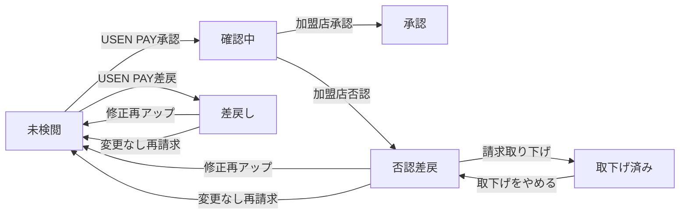

# 🧪 テストシナリオ集（QA / テスター向け）

> **対象読者**: QA担当者、テスター  
> **目的**: 画面ごとの操作手順・期待結果を網羅し、テスト実行時のガイドとして使用する  
> **補足**: 技術的な実装詳細は [01_top_page.md](01_top_page.md) 〜 [05_common.md](05_common.md) を参照

---

## 目次

1. [Top画面](#1-top画面)
2. [CSVアップロード画面](#2-csvアップロード画面)
3. [確認画面](#3-確認画面)
4. [詳細画面](#4-詳細画面)
5. [共通要素](#5-共通要素)
6. [ステータス遷移テストマトリクス](#6-ステータス遷移テストマトリクス)
7. [バリデーション一覧（入力→期待メッセージ）](#7-バリデーション一覧入力期待メッセージ)

---

## 1. Top画面

### 1.1 基本表示

| # | シナリオ | 操作手順 | 期待結果 |
|---|---------|---------|---------|
| T-1 | 正常ログイン | 登録済みGoogleアカウントでアクセス | ローディング後、Top画面が表示される。ヘッダーに卸事業者名が表示される |
| T-2 | 未登録アカウント | 未登録のGoogleアカウントでアクセス | エラー画面「ログインに使用されたアカウントの登録が見当たりません。」が表示される |
| T-3 | 請求履歴なし | 新規卸で請求未登録 | 「請求履歴がありません。」と表示される |
| T-4 | 請求履歴あり | 過去に請求登録済み | 請求月・登録日時・請求金額・手数料が正しく表示される |
| T-5 | 差戻しバッジ | 差戻しがある請求 | 「↺ 差戻し有」バッジが赤系で表示される |
| T-6 | 否認バッジ | 否認がある請求 | 「⊖ 否認有」バッジが赤系で表示される |

### 1.2 画面遷移

| # | シナリオ | 操作手順 | 期待結果 |
|---|---------|---------|---------|
| T-7 | 新規登録へ | 「新規請求を登録する ＋」をクリック | CSVアップロード画面に遷移 |
| T-8 | 詳細画面へ | 請求行の「詳細を見る >」をクリック | 該当の詳細画面に遷移 |
| T-9 | カレンダー表示 | 「📅 請求スケジュール」をクリック | カレンダーモーダルが表示される |
| T-10 | カレンダー閉じ | モーダルの×ボタン / Escキー / 外側クリック | モーダルが閉じる |
| T-11 | 月切り替え | カレンダーの < > ボタン | 前月・翌月に切り替わる |

---

## 2. CSVアップロード画面

### 2.1 ファイルアップロード

| # | シナリオ | 操作手順 | 期待結果 |
|---|---------|---------|---------|
| U-1 | D&Dでアップロード | CSVファイルをドロップゾーンにドラッグ＆ドロップ | 「確認中...」表示後、バリデーション結果が表示される |
| U-2 | ダイアログでアップロード | 「ファイルを選択」ボタンからCSVを選択 | 同上 |
| U-3 | 非CSVファイル | .xlsx や .txt をアップロード | ファイルが受け付けられない（`accept=".csv"`） |
| U-4 | 正常CSV | 全項目正しいCSV | ファイル名が表示され「確認画面へ進む」ボタンが有効化 |
| U-5 | ファイル削除 | アップロード後に「🗑 ファイルを削除する」をクリック | ドロップゾーンが初期状態に戻り、ボタンが無効化 |

### 2.2 バリデーションエラー

| # | シナリオ | CSVの状態 | 期待結果 |
|---|---------|----------|---------|
| U-6 | 空CSV | ヘッダーもデータもなし | エラー「CSVが空です」 + ボタン無効 |
| U-7 | ヘッダーのみ | データ行なし | エラー「CSVにデータ行が1件もありません」 |
| U-8 | 列数不一致 | 8列のCSV（9列期待） | エラー「ヘッダー行のカラム数が正しくありません」 |
| U-9 | ヘッダー名不一致 | 「顧客コード」→「顧客CD」 | エラー「ヘッダー行 1列目: "顧客コード" が期待されますが "顧客CD" になっています」 |
| U-10 | 必須項目空 | 品目列が空 | エラー「N行目: "品目" は必須項目です」 |
| U-11 | 日付形式不正 | 「2026/3/1」（ゼロパディングなし） | エラー「N行目: "日付" はYYYY-MM-DD形式で入力してください」 |
| U-12 | 税率不正値 | 税率に「5」を入力 | エラー「N行目: "税率区分(%)" は 8 または 10 を入力してください」 |
| U-13 | 整数に小数 | 請求金額に「1000.5」 | エラー「N行目: "請求金額（税抜）" は整数で入力してください」 |
| U-14 | 数量に小数 | 数量に「4.5」 | バリデーション通過（小数許容） |
| U-15 | 数量に文字列 | 数量に「abc」 | エラー「N行目: "数量" は数値で入力してください」 |
| U-16 | 顧客コード不正 | 存在しないコード | エラー「N行目: "XXX" は請求可能な加盟店コードではありません」 |

### 2.3 後処理チェック

| # | シナリオ | 状態 | 期待結果 |
|---|---------|------|---------|
| U-17 | 当月重複 | 同月に既に新規請求登録済み | エラー「今月は既に新規の請求書が登録されています…」+ ボタン無効 |
| U-18 | 加盟店不足 | 一部加盟店がCSVに含まれていない | アラート「〇〇店の請求明細がありません。」+ **ボタンは有効のまま** |
| U-19 | エラー+アラート同時 | バリデーションエラー + 加盟店不足 | 両方表示。エラーが先、アラートが後。ボタン無効 |

### 2.4 戻る操作

| # | シナリオ | 操作手順 | 期待結果 |
|---|---------|---------|---------|
| U-20 | 未アップロードで戻る | 何もせず「← 一覧に戻る」 | そのままTop画面に遷移 |
| U-21 | アップロード後に戻る | CSV読込後に「← 一覧に戻る」 | 確認モーダル「ファイルは削除されますがよろしいですか？」が表示 |
| U-22 | モーダルで戻る確定 | モーダルの「← 一覧に戻る」をクリック | データがリセットされTop画面に遷移 |
| U-23 | モーダルで閉じる | モーダルの×ボタン | モーダルが閉じ、アップロード画面のまま |

---

## 3. 確認画面

### 3.1 表示確認

| # | シナリオ | 操作手順 | 期待結果 |
|---|---------|---------|---------|
| C-1 | サマリー表示 | 確認画面に遷移 | 合計・小計・消費税・手数料・振込予定金額が正しく表示 |
| C-2 | 加盟店別表示 | アコーディオンを展開 | 取引日・品目・単価・数量・金額が正しく表示 |
| C-3 | 消費税編集 | 明細の消費税欄を変更 | 加盟店の小計と全体サマリーが再計算される |
| C-4 | 備考入力 | 加盟店の備考欄に入力 | 入力値が保持される |
| C-5 | 備考上限超過 | 備考に251文字以上入力して送信 | エラートースト「250文字以内で入力してください」 |

### 3.2 送信

| # | シナリオ | 操作手順 | 期待結果 |
|---|---------|---------|---------|
| C-6 | チェックなしで送信 | 誓約チェックをせず送信ボタンを見る | ボタンが非活性（disabled） |
| C-7 | 正常送信 | 誓約チェック後に「登録内容を送信する」 | ローディング表示 → 成功トースト「請求情報の登録が完了しました。」→ Top画面に遷移 |
| C-8 | 送信失敗 | バックエンドエラー時 | エラートースト表示。ボタンは再度押せる状態に復帰 |
| C-9 | 確認画面で戻る | 「← 一覧に戻る」をクリック | 確認モーダル表示 → 確定でアップロード画面に遷移 |
| C-10 | リロード後 | 確認画面でブラウザリロード | トースト「CSVを再度アップロードしてください。」→ アップロード画面に遷移 |

### 3.3 再送信モード

| # | シナリオ | 操作手順 | 期待結果 |
|---|---------|---------|---------|
| C-11 | 再請求タイトル | 詳細画面からCSV一括アップロード経由で確認画面へ | タイトルが「再請求内容の確認」に変わる |
| C-12 | コメント表示 | 差戻しコメントあり | 「USEN PAY社からのコメント」欄が表示される |
| C-13 | 再送信成功 | 送信成功 | 詳細画面に遷移 + 成功トースト |
| C-14 | 再送信で戻る | 「← 一覧に戻る」確定 | 詳細画面に遷移（アップロード画面ではない） |

---

## 4. 詳細画面

### 4.1 基本表示

| # | シナリオ | 操作手順 | 期待結果 |
|---|---------|---------|---------|
| D-1 | 正常表示 | Top画面から「詳細を見る」 | 請求基本情報・加盟店一覧が正しく表示 |
| D-2 | セクション分け | 差戻し+否認+確認中+取下げ済みが混在 | 各ステータスが正しいセクションに表示される |
| D-3 | 要対応セクション | 差戻しまたは否認が1件以上 | 「⚠ 要対応の請求一覧」セクションが表示される |
| D-4 | 要対応なし | 全て確認中/承認済み | 「⚠ 要対応の請求一覧」セクションが非表示 |
| D-5 | 取下げ済みセクション | 取下げが1件以上 | 「取下げ済みの請求一覧」セクションが表示される |
| D-6 | 明細の遅延読み込み | アコーディオンを展開 | 明細テーブルがサーバーから取得・表示される |
| D-7 | 明細のメモリ解放 | アコーディオンを閉じる | 明細テーブルのDOMが解放される |

### 4.2 差戻し対応

| # | シナリオ | 操作手順 | 期待結果 |
|---|---------|---------|---------|
| D-10 | 差戻しコメント表示 | 差戻しのアコーディオンを確認 | 差し戻しコメントがバナーで表示される |
| D-11 | 修正ファイルアップ | 「修正ファイルをアップ」→ CSV選択 → 登録 | モーダル内で完結し、詳細画面がリロード |
| D-12 | CSV一括アップロード | 「CSV一括アップロード」→ CSV選択 → 確認画面 | 確認画面に遷移（再送信モード） |
| D-13 | 変更なしで再請求 | 「変更なしで再請求」 | ローディング → リロード。ステータスが「未検閲」に更新 |

### 4.3 否認対応

| # | シナリオ | 操作手順 | 期待結果 |
|---|---------|---------|---------|
| D-20 | 否認理由表示 | 否認のアコーディオンを確認 | 否認理由が表示される |
| D-21 | 合意事項必須 | 合意事項を空のまま「登録する」 | アラート「合意事項の項目を記入ください」 |
| D-22 | 請求取り下げ | 「請求取り下げ」→ 確認ダイアログ →「取り下げる」 | 取下げ済みセクションに移動 + トースト「請求を取り下げました。」 |
| D-23 | 取り下げキャンセル | 確認ダイアログで「キャンセル」 | ダイアログが閉じるのみ |

### 4.4 取下げ済み

| # | シナリオ | 操作手順 | 期待結果 |
|---|---------|---------|---------|
| D-30 | 取下げ済み表示 | 取下げ済みセクションを確認 | 「✓ 取下げ済」バッジ。備考・合意内容は読取専用 |
| D-31 | 取下げ取り消し（期間内） | 異議申立期間内に「取下げをやめる」→ 確認ダイアログ → 確定 | 否認セクションに移動 + トースト表示 + 親請求の金額が再計算される |
| D-32 | 取消しキャンセル | 確認ダイアログで「キャンセル」 | ダイアログが閉じるのみ |
| D-33 | 取消し失敗 | BQエラー等で更新対象なし | アラート「対象の請求が見つかりません」 |
| D-34 | 異議申立期間終了後 | 期間終了後に取下げ済みセクションを確認 | 「取下げをやめる」ボタンが disabled + 「異議申立期間が終了しています」メッセージ表示 |
| D-35 | 期間終了後にBE直接呼び出し | APIを直接呼んで取消し試行 | エラー「異議申立期間が終了しているため、取下げの取り消しはできません。」 |
| D-36 | 取下げ時の金額再計算 | 請求取り下げを実行 | 親請求の合計金額・手数料・振込予定額が取下げ分を差し引いて再計算される |
| D-37 | 取消し時の金額再計算 | 取下げをやめるを実行 | 親請求の合計金額・手数料・振込予定額が復元分を加算して再計算される |

### 4.5 個別リアップロード（モーダル）

| # | シナリオ | 操作手順 | 期待結果 |
|---|---------|---------|---------|
| D-40 | モーダル表示 | 「修正ファイルをアップ」クリック | モーダル Phase1 表示（「確認画面へ進む」ボタンは非表示） |
| D-41 | 対象外加盟店 | 対象加盟店以外の顧客コードを含むCSV | エラー「対象の加盟店のみを含めてください」 |
| D-42 | プレビュー表示 | 正常CSVアップロード | Phase2: 金額プレビュー + 誓約チェック + 「登録する」ボタン |
| D-43 | 税額編集 | プレビュー内の消費税を変更 | 金額が再計算される |
| D-44 | ファイル削除 | プレビューで「ファイルを削除する」 | Phase1 に戻る |
| D-45 | 登録成功 | 誓約チェック →「登録する」 | モーダル閉じ → 詳細画面リロード |

---

## 5. 共通要素

### 5.1 ヘッダー

| # | シナリオ | 操作手順 | 期待結果 |
|---|---------|---------|---------|
| H-1 | ロゴクリック | ヘッダーのロゴをクリック | Top画面に遷移 |
| H-2 | 卸名表示 | ログイン後 | ヘッダー右側に卸事業者名が表示 |
| H-3 | スケジュールボタン | Top画面・詳細画面 | 「📅 請求スケジュール」ボタンが表示される |
| H-4 | スケジュール非表示 | アップロード画面・確認画面 | ボタンが非表示 |

### 5.2 トースト通知

| # | シナリオ | 操作手順 | 期待結果 |
|---|---------|---------|---------|
| G-1 | 成功トースト | 送信成功時 | 緑のトースト。8秒後に自動消去 |
| G-2 | エラートースト | エラー発生時 | 赤のトースト。手動で×ボタンを押すまで表示継続 |
| G-3 | トースト閉じ | ×ボタンクリック | トーストが消える |

### 5.3 ローディング

| # | シナリオ | 操作手順 | 期待結果 |
|---|---------|---------|---------|
| G-4 | 初回ローディング | ページアクセス直後 | 全画面スピナー「読み込み中...」 |
| G-5 | 送信中ローディング | 確認画面で送信ボタン押下 | 全画面スピナー「登録中...」 |

### 5.4 エラー画面

| # | シナリオ | 操作手順 | 期待結果 |
|---|---------|---------|---------|
| G-6 | 未登録アカウント | 未登録Googleアカウント | エラー画面 + サポート窓口の電話番号が表示 |
| G-7 | システムエラー | API通信失敗時 | 「ページを再読み込みしてください」メッセージ |

---

## 6. ステータス遷移テストマトリクス

### 6.1 遷移パターン

### 6.2 テストマトリクス

| # | 操作 | 開始ステータス | 終了ステータス | 表示セクション移動 |
|---|------|--------------|--------------|-----------------|
| S-1 | 修正CSV再アップロード | 差戻し | 未検閲 | 要対応 → 確認中・承認済み |
| S-2 | 変更なしで再請求 | 差戻し | 未検閲 | 要対応 → 確認中・承認済み |
| S-3 | 修正CSV再アップロード | 否認差戻 | 未検閲 | 要対応 → 確認中・承認済み |
| S-4 | 変更なしで再請求 | 否認差戻 | 未検閲 | 要対応 → 確認中・承認済み |
| S-5 | 請求取り下げ | 否認差戻 | 取下げ済み | 要対応(否認) → 取下げ済み。親請求金額が取下げ分を差引きして再計算 |
| S-6 | 取下げをやめる（期間内） | 取下げ済み | 否認差戻 | 取下げ済み → 要対応(否認)。親請求金額が復元分を加算して再計算 |
| S-7 | 取下げをやめる（期間終了） | 取下げ済み | 取下げ済み（変化なし） | ボタンdisabled + 「異議申立期間が終了しています」表示。BE側でも拒否 |

---

## 7. バリデーション一覧（入力→期待メッセージ）

### 7.1 ファイルレベル

| 入力 | 期待されるエラーメッセージ | ブロッキング |
|------|------------------------|-------------|
| 空ファイル | CSVが空です。ヘッダー行とデータ行を含むCSVをアップロードしてください | ✅ |
| ヘッダーのみ | CSVにデータ行が1件もありません | ✅ |
| 列数不一致（8列） | ヘッダー行のカラム数が正しくありません（8列 / 期待値: 9列） | ✅ |
| ヘッダー名不一致 | ヘッダー行 N列目: "期待値" が期待されますが "実際値" になっています | ✅ |

### 7.2 行レベル

| 入力例 | 対象列 | 期待されるエラーメッセージ | ブロッキング |
|--------|-------|------------------------|-------------|
| 列数過不足 | 行全体 | N行目: カラム数が正しくありません | ✅ |
| 品目が空 | 品目 | N行目: "品目" は必須項目です | ✅ |
| 「2026/3/1」 | 日付 | N行目: "日付" はYYYY-MM-DD形式で入力してください | ✅ |
| 「5」 | 税率区分 | N行目: "税率区分(%)" は 8 または 10 を入力してください | ✅ |
| 「1000.5」 | 請求金額 | N行目: "請求金額（税抜）" は整数で入力してください | ✅ |
| 「4.5」 | 数量 | （エラーなし — 小数許容） | - |
| 「abc」 | 数量 | N行目: "数量" は数値で入力してください | ✅ |
| 存在しないコード | 顧客コード | N行目: "XXX" は請求可能な加盟店コードではありません | ✅ |

### 7.3 後処理

| 条件 | 期待されるメッセージ | ブロッキング |
|------|-------------------|-------------|
| 当月に新規請求登録済み | 今月は既に新規の請求書が登録されています。差し戻しや否認の修正版のアップロードは詳細画面からアップロードしてください。 | ✅ エラー |
| 一部加盟店がCSV未含有 | 〇〇店の請求明細がありません。 | ⚠ アラートのみ |

### 7.4 確認画面

| 条件 | 期待されるメッセージ | ブロッキング |
|------|-------------------|-------------|
| 備考 251文字以上 | 加盟店別請求書備考は250文字以内で入力してください。 | ✅ |
| 金額が12桁超過 | 加盟店 XXX: 請求金額合計が上限（12桁）を超えています | ✅ |
