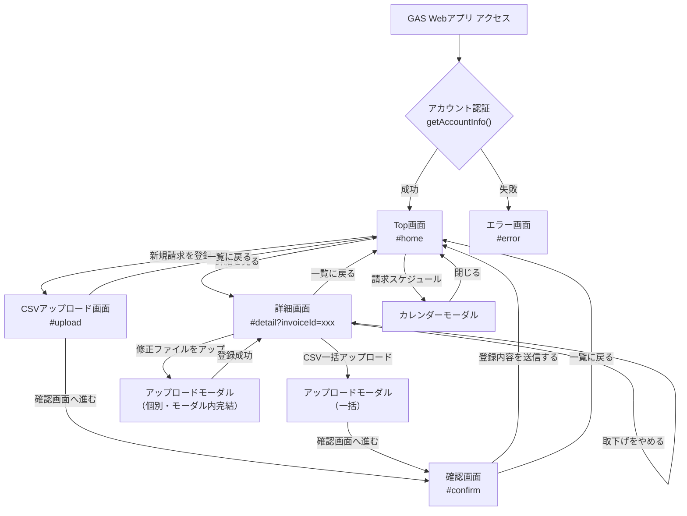

# 画面仕様書

仕入れコネクト Portal Site（卸側）の画面別仕様書です。

## ドキュメント構成

| ファイル | 内容 |
|---------|------|
| [01_top_page.md](01_top_page.md) | Top画面（ホーム画面）仕様書 |
| [02_csv_upload_page.md](02_csv_upload_page.md) | CSVアップロード画面仕様書 |
| [03_confirm_page.md](03_confirm_page.md) | アップロード後の確認画面仕様書 |
| [04_detail_page.md](04_detail_page.md) | 詳細画面（登録済み請求内容）仕様書 |
| [05_common.md](05_common.md) | 共通仕様（ヘッダー、フッター、バリデーション、エラー等）|
| [06_user_guide.md](06_user_guide.md) | 📘 ユーザーガイド（PM / ディレクター向け）|
| [07_test_scenarios.md](07_test_scenarios.md) | 🧪 テストシナリオ集（QA / テスター向け）|

## システム概要

- **アプリケーション名**: 仕入れコネクト Portal Site
- **基盤**: Google Apps Script（GAS）Webアプリ
- **フロントエンド**: HTML + Vanilla JS（SPA構成、ハッシュルーター）
- **バックエンド**: GAS サーバーサイド関数（`google.script.run` 経由）
- **データストア**: BigQuery
- **ファイルストレージ**: Google Drive

## 画面遷移図（全体）

## 関連ファイル

| ディレクトリ | ファイル | 役割 |
|-------------|---------|------|
| `src/` | `fe_index.html` | エントリーポイント HTML |
| `src/` | `fe_part_header.html` | 共通ヘッダー |
| `src/` | `fe_page_home.html` | Top画面 HTML |
| `src/` | `fe_page_csv_upload.html` | アップロード画面 HTML |
| `src/` | `fe_page_confirm.html` | 確認画面 HTML |
| `src/` | `fe_page_detail.html` | 詳細画面 HTML |
| `src/` | `fe_page_error.html` | エラー画面 HTML |
| `src/` | `fe_css.html` | 全画面共通 CSS |
| `src/` | `fe_js.html` | 全画面共通 JavaScript（ルーター・各画面ロジック） |
| `src/` | `be_main.js` | GAS エントリーポイント |
| `src/` | `be_server.js` | アカウント情報取得 |
| `src/` | `be_invoice.js` | 請求データ関連 API |
| `src/` | `be_csv_mapper.js` | CSV動的マッピング |
| `src/` | `be_config.js` | 環境設定 |
| `src/` | `be_utils.js` | 共通ユーティリティ |
| `src/` | `db_bq_connection.js` | BigQuery 接続 |
| `src/` | `db_bq_query.js` | BigQuery クエリ関数 |
